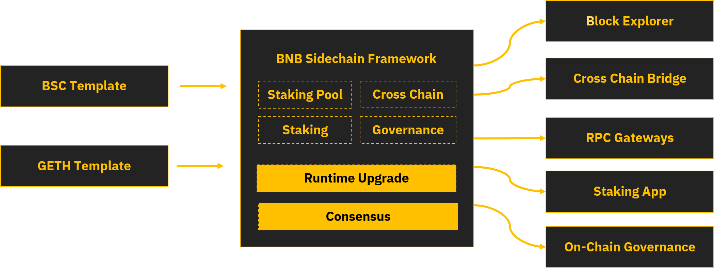

# BNB Sidechain Architecture

BNB Sidechain is a modular framework for creating BSC-compatible sidechains. It defines requirements for integration with the BSC ecosystem and brings development-ready EVM-compatible features like staking, RPC-API, and smart contracts. Since BSC doesn’t rely on the BNB Sidechain security model, there is no default embedded production-ready bridge solution between the BSC and BNB Sidechain networks. Instead, BNB Sidechain can provide protocols and standards for integrating third-party bridges like Multichain or Celer Network cBridge.

## BNB Sidechain Structure and Integration

BNB Sidechain specifies the primary structure and configuration of the blockchain, using special templates. A **template** is a ready-made blockchain solution that is **already integrated into the BSC infrastructure**. With this integration, developers automatically get access to products like a ready-made staking system, block explorer, API gateways, interfaces for governance, etc. 

After applying templates, BNB Sidechain can be customized using programmable and configurable **modules**.

## Modules

The main goal of BNB Sidechain is to build such a multi-modular blockchain architecture that it is flexible, convenient, and easy to use.

As the current implementation of BNB Sidechain is built on BSC, all existing modules are built into the system smart contracts and into the EVM machine. In the future, a system of modules will be created to allow you to develop a universal smart contract and a bus for interacting between modules and other parts. This all will make it possible to use such modules in any blockchain solution.

BNB Sidechain brings with it programmable and configurable modules that can be used or modified by developers to reach their business goals, for example:

- Cross Chain — BNB Sidechain is designed to provide cross chain functionality for the native assets. Since native assets are fully managed by BAS developers they can compromise token supply or mint/burn tokens.

- Staking & Staking Pool— BNB Sidechain supports on-chain staking system and uses the PoSA (proof-of-stake-of-authority) staking model. It allows users to delegate their tokens to the specific validator and share validator's rewards based on the total staked amount.

- Runtime Upgrade — Runtime upgrade system smart contract allows to modify the existing byte code for the system smart contracts. However, it doesn't allow to modify user's smart contracts. To apply any modification to the sources, the user must create a proposal, and changes can only be applied once a quorum is reached on the governance. This scheme is much simpler compared to hard forks, as it doesn't require all validators to upgrade their nodes.

- Blockchain & EVM — for block producing and EVM transaction execution, of course, each BNB Sidechain can define their own runtime execution environment based, for example, on WebAssembly in future.

- Web3 API — for BNB Sidechain compatibility with Web3 ecosystem including MetaMask and other applications.

- Transaction Pool — for managing internal BNB Sidechain policies for transaction filtering and for charging fees for the system operational.

- PoSA Consensus & Staking — for users to be able to stake to the authorized validators in the BNB Sidechain network and guarantee the safeness of actions applied on the chain.

- Governance — A decentralized voting system for managing and implementing changes to cryptocurrency blockchains.

- Storage & State — for persisting local data.

Internally, BNB Sidechain implements the following modules: Parlia consensus engine, staking pools, governance, dynamic runtime upgrades, reward management, manageable blockchain params, and EVM hooks.

## Repositories

Here is the list repositories provided by Ankr for development on BNB Sidechain:
* [BNB Sidechain-genesis-config](https://github.com/bnb-chain/bas-genesis-config) — genesis smart contracts and scripts for building the genesis config.
* [BNB Sidechain-template-bsc](https://github.com/bnb-chain/bas-template-bsc) — BNB Sidechain-compatible based template.
* [BNB Sidechain-devnet-setup](https://github.com/bnb-chain/bas-devnet-setup) — scripts for running BNB Sidechain devnet.
