# Using MetaMask Wallet with BNB Sidechain Test Network
!!! Tip You may encounter a network configuration issue in recent releases of MetaMask. If so, please make sure you have the recent version installed.

## What is MetaMask?
MetaMask was created out of the need for creating more secure and usable Ethereum-based websites. In particular, it handles account management and connecting users to the blockchain. It’s supported in Chrome, Brave, and Safari browsers.

## Install MetaMask
**Example**: Install MetaMask on Chrome browser. Nevertheless, the workflow is the same for all browsers.
Navigate to the Metamask extension in the Chrome Webstore's Extension Category: https://chrome.google.com/webstore/category/extensionsSearch 

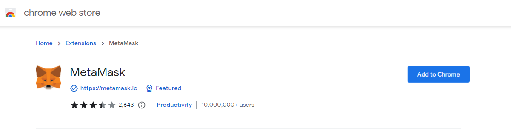

> Note: Make sure it’s offered by metamask.io
* Click on “Add to Chrome”. 

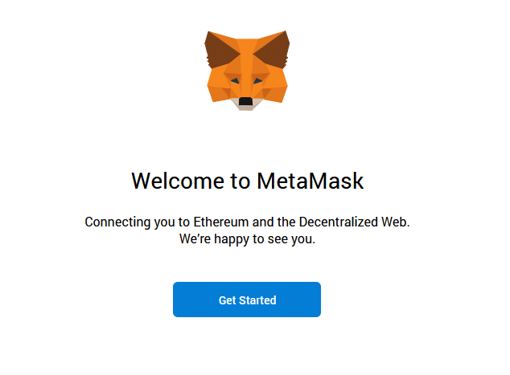

That’s it! You have successfully installed the MetaMask extension on Chrome! 

## Create an account in MetaMask for BNB Sidechain
1. Click on the “Create a wallet” button

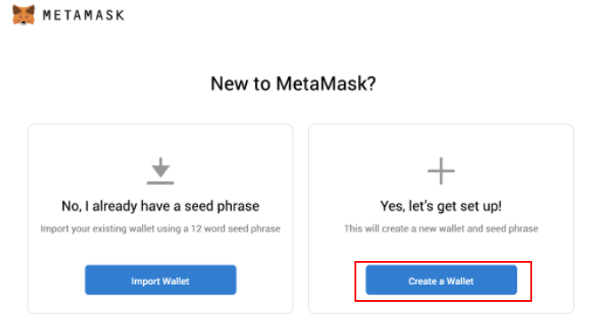

2. Create a Password of at least 8 characters
   

3. Click on “Create” and then write down your backup phrase.

4. Select each phrase to make sure it is correct then click “Confirm”.
   

_Congratulations_! You have created your MetaMask account!

## Connect Your MetaMask With BNB Sidechain

1. Go to the setting page

2. Add a new network
   
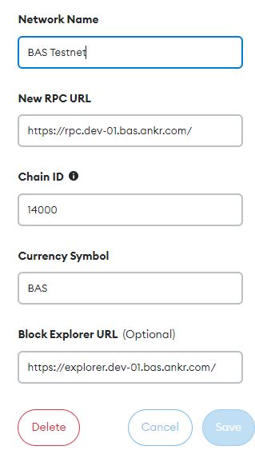

### MetaMask Network Configuration for BNB Sidechain Testnet

**RPC URL**:  https://rpc.dev-01.bas.ankr.com/
**ChainID**: 14000
**Symbol**: BAS

3. Claim some testnet BNB Sidechain tokens to your account then click on your address to copy
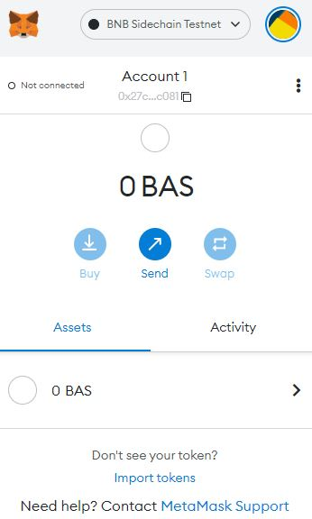

4. Go to the faucet page: <https://faucet.dev-01.bas.ankr.com/>, then paste your address in the box and click on “Give Me Native Token”

!!! Tip: Please note that you can only claim once every minute 

After the transfer transaction is sent, you will see an increase in your balance.

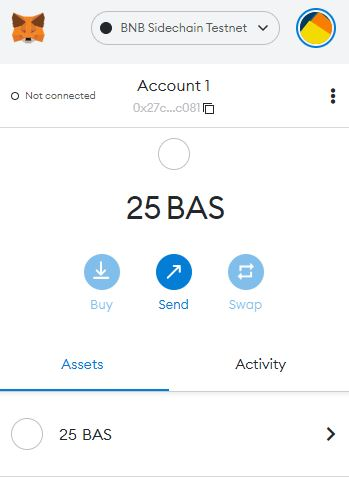

## Transfer BNB Sidechain Tokens to other address on BNB Sidechain Network

1. Log in to your MetaMask 
   

2. Click on the "Send" button

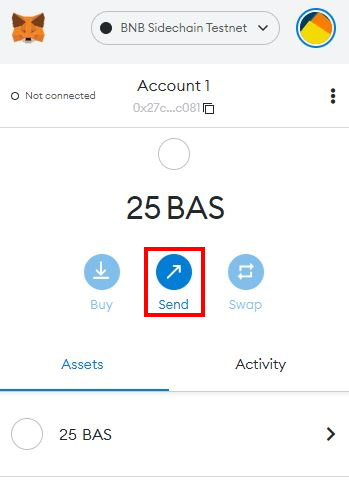

3. Copy the receiver’s address in the box

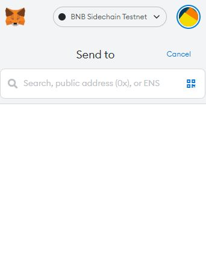

4. Input the amount

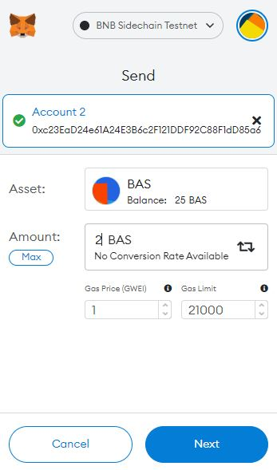

5. Confirm your transaction, then click Next
   
6. Click Confirm to send your transaction

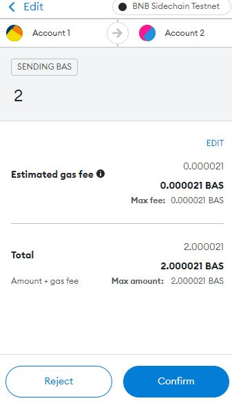

7. Wait for your transaction to be included in the new block

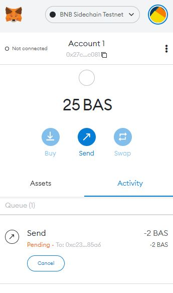

1. Once your transaction is confirmed, check it on block explorer by clicking Details

2. Click on your account to see "Details''

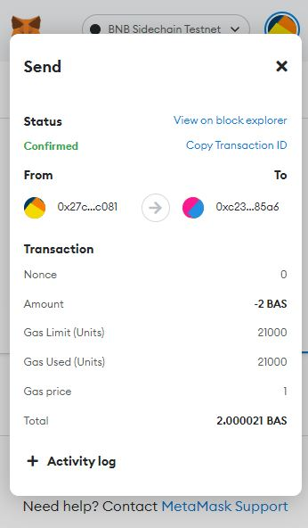

## Import BEP20 Tokens to MetaMask Wallet

1. In MetaMask, Click on “Import tokens”

2. Copy the token contract address in the box

3. Click on “Add Custom Token”

4. Click on "Import Tokens"
5. BEP20 token added
   
## Create Multiple Accounts
1. To create multiple accounts, click on the Profile icon on MetaMask and then click on Create Account

2. You can then add an account name and click on Create.
   

1. Then you can see a new account has been created!

