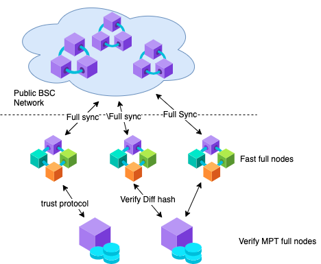

# How to Run Separate Node on BNB Smart Chain

## Introduction

Currently, a BSC node has two kinds of state world: MPT and snapshot. MPT(Merkle Patricia Tries) is a tree-structured state world. The key function of MPT is to generate the state root to ensure state consistency, while the query/commit on MPT is quite slow. Snapshot is a flattened key-value-based state world. Snapshot provides fast queries and commits. The storage size of the snapshot increases slowly even with a large transaction volume. Snapshot is usually used for block processing, while MPT is used for state verification.

In order to lower the hardware requirement and keep security, we introduce two types of nodes to make full use of different storage, one is named fast node, and the other is named verify node. The fast node will do block processing with snapshot, it will do all verification against blocks except state root. The verify node receives diffhash from the fast node and then responds MPT root to the fast node.

The fast node doesn’t need to store MPT, so the storage and computation requirement will be much lower.

## Roles

- **Fast Node**: It does full sync using only Snapshot and generates difflayer. It needs the confirm message from the verify node before freezing the blocks, it has to wait until it receives a confirm message from the verify node for the ancestor block before inserting new blocks.

- **Verify Node**: It is a normal BSC full node that does full sync using Snapshot and MPT, and generates difflayer. It receives diffhash from fast nodes, finds the corresponding difflayer whose diffhash is matched, then responds MPT root message to the fast node.

## Related Commands

#### Fast Node
Introduce a new **tries-verify-mode** setting, there are four modes:
- **local**: a normal full node with complete state world(both MPT and snapshot), merkle state root will be verified against the block header.
- **full**: a fast node with only snapshot state world. Merkle state root is verified by the trustworthy remote verify node by comparing the diffhash(an identify of difflayer generated by the block) and state root.
- **insecure**: same as full mode, except that it can tolerate without verifying the diffhash when verify node does not have it.
- **none**: no merkle state root verification at all, there is no need to setup or connect remote verify node at all, it is more light comparing to full and insecure mode, but get a very little chance that the state is not consistent with other peers.

If the fast node runs in not local mode, the node will disable diff protocol by default, If the fast node runs in full or light mode, the node will enable trust protocol by default.

` ./geth --config ./config.toml --datadir ./node --syncmode full --cache 5000 --tries-verify-mode none`

#### Verify node
When a full node has enabled the trust protocol, it can serve as a verify node, at the same time, we will recommend you to enable persist diff, disable snap protocol and diff protocol when running a verify node.

` ./geth --config ./config.toml --datadir ./node --syncmode full --cache 5000 --persistdiff --enabletrustprotocol --disablesnapprotocol --disablediffprotocol`

#### Prune tries node
Prune the tires node:  `./geth snapshot insecure-prune-all --datadir ./node  ./genesis.json`

## Run Verify Node
Please read [this guide](./BSC-verify-node.md)

## Run Fast Node
Please read [this guide](./BSC-fast-node.md)
