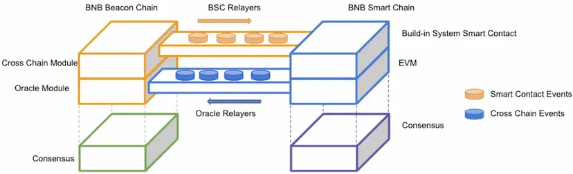
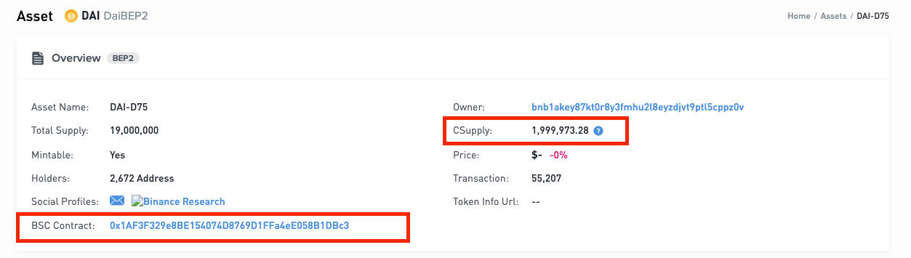
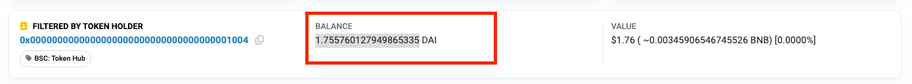

# Cross-Chain Liquidity Check and Repair
After token binding, tokens can be seamlessly transferred between BC and BSC. 
However, some improper operations may lead to eventual cross-chain transfer failures. 
For example, performing a mint operation on one chain but not on the other can result in different supplies on the two chains, 
making it impossible to transfer all assets from the chain with the larger total supply to the other chain. 
This doc will introduce the token circulation model of BNB Chain and how to repair cross-chain liquidity issues. 
We urge all token issuers to complete liquidity checks and repairs before BC Fusion, although this article remains valid after BC Fusion.

## Circulation Model

The architecture of cross-chain communication is as in the above diagram. The cross-chain transfer is the key communication between the two blockchains. 
Essentially the logic is:

1. The transfer-out blockchain will lock the amount from source owner addresses into a system controlled address/contracts
2. The transfer-in blockchain will unlock the amount from the system controlled address/contracts and send it to target addresses.

The system controlled vault on BNB Beacon Chain is [bnb1v8vkkymvhe2sf7gd2092ujc6hweta38xadu2pj](https://explorer.bnbchain.org/address/bnb1v8vkkymvhe2sf7gd2092ujc6hweta38xadu2pj) which is generated by code, 
and the vault on BNB Smart Chain is a system smart contract called [Token Hub](https://bscscan.com/address/0x0000000000000000000000000000000000001004). The funds on these two addresses are 
treated as locked which are not part of the circulating supply.

## Liquidity Check and Repair
One of the objectives of BC Fusion is to transfer all tokens from the Beacon Chain to BSC. 
Therefore, we must ensure that there is sufficient liquidity on BSC, meaning the total amount of tokens locked in BSC's 
Tokenhub is greater than the circulating supply on the Beacon Chain. 

Let's use take DAI token as an example:

1. Visit the basic information page of DAI on the Beacon Chain explorer to obtain the circulating supply on the Beacon Chain (Csupply) and the contract address on BSC.
   
2. Visit the BSC explorer to check the locked amount/liquidity of this token. The URL is https://bscscan.com/token/${BSC_contract_address}?a=0x0000000000000000000000000000000000001004. 
   Replace ${BSC contract address} with the BSC contract address obtained in step 1. And you will see the balance as below:
   

Therefore, Tokenhub on BSC still lacks 1,999,973.28 - 1.755760127949865335 = 1,999,971.5242398721 DAI. 
To avoid issues caused by precision loss, we recommend adding slightly more liquidity than the calculated value. 
In this case, it would be 1,999,972 DAI. If you find that the amount of locked tokens on BSC is greater than the circulating 
supply (Csupply) on the Beacon Chain, it means there is sufficient liquidity, and no further action is needed.

If there is a liquidity shortage, the issuer of the token should transfer the missing liquidity to Tokenhub, 
for example, 1,999,972 DAI for the DAI token mentioned above. The source of these tokens is up to the issuer to determine: 
they could be minted or collected from various accounts.

