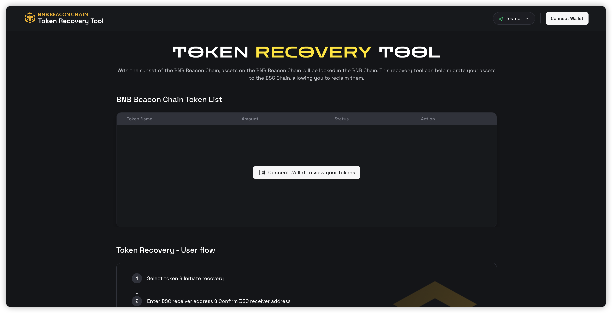
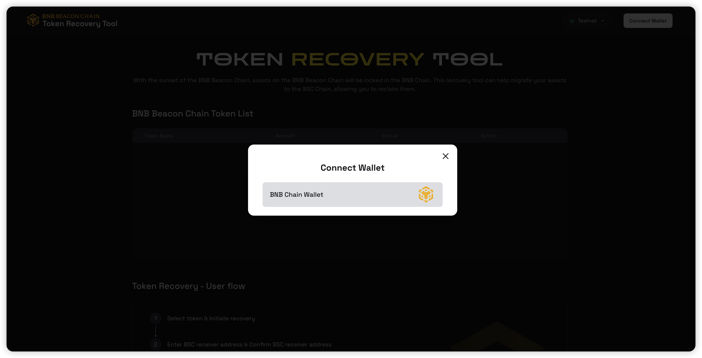
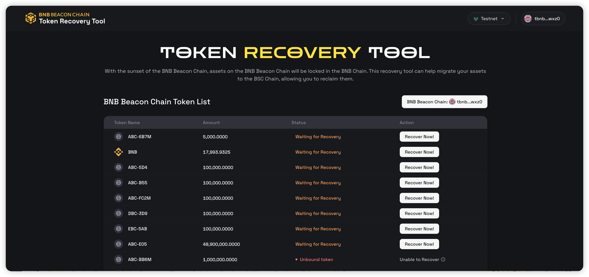
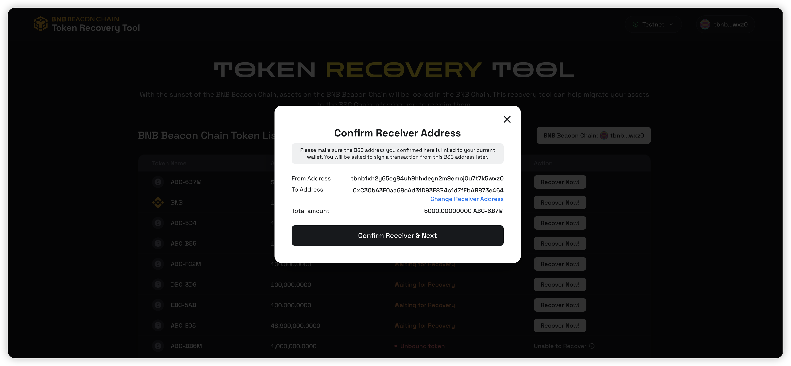
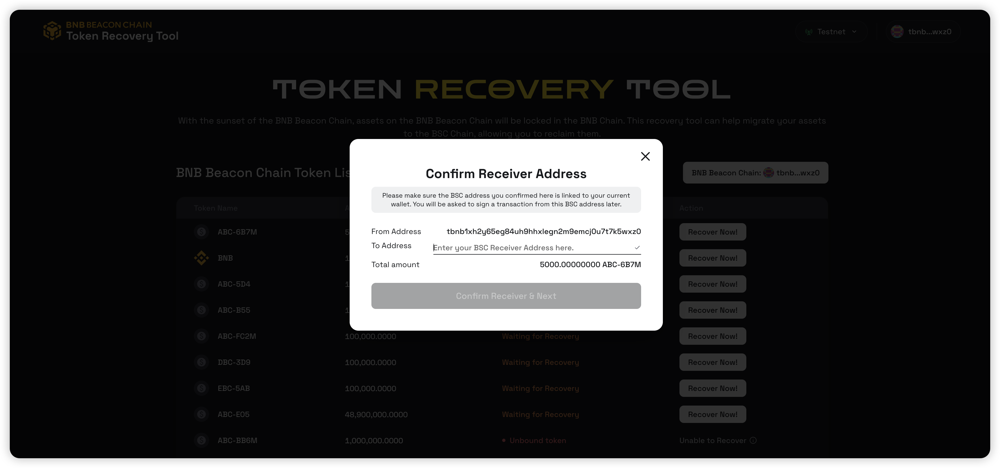
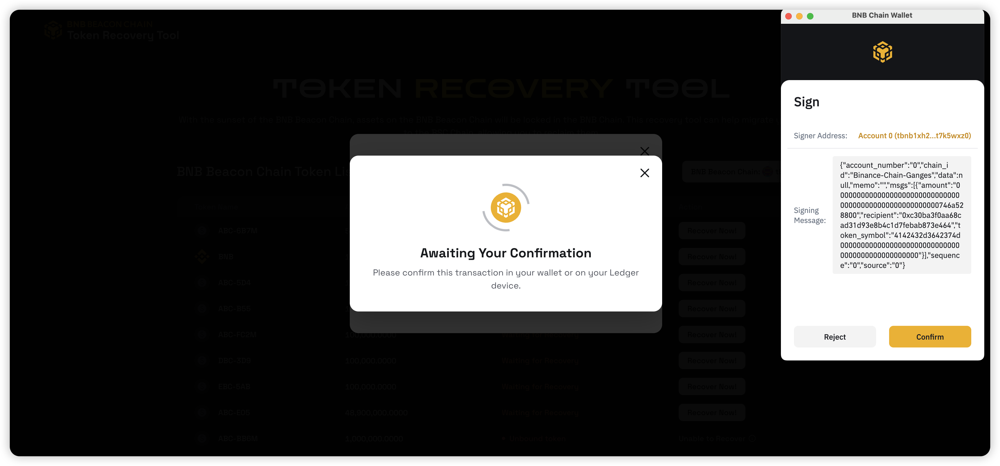
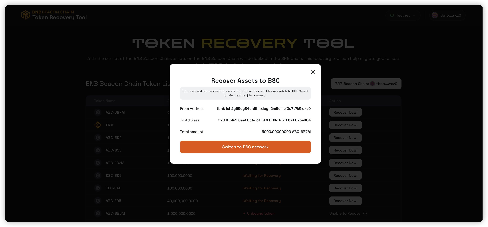
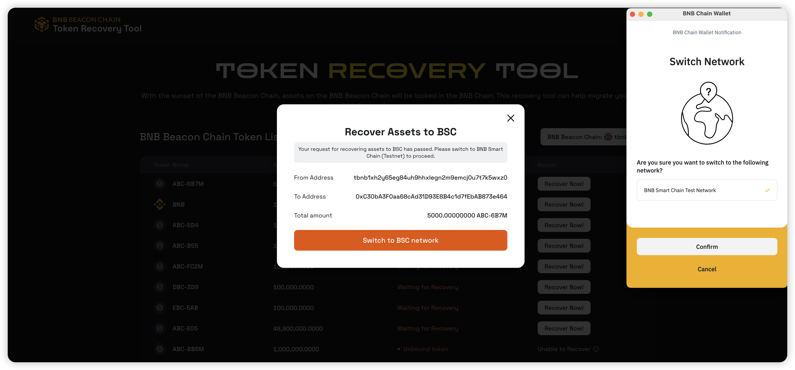
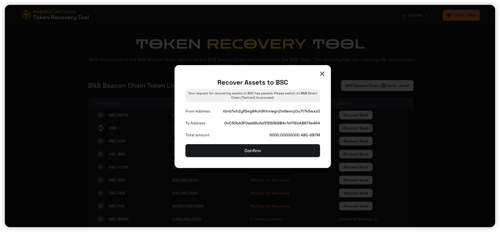
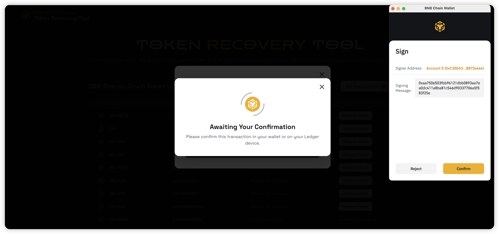

# Token Recovery dApp

To facilitate the token migration after the Beacon Chain shutdown,
the [BEP299](https://github.com/bnb-chain/BEPs/blob/master/BEPs/BEP-299.md) is proposed
to recover the BEP2/BEP8 assets on the Beacon Chain to the BSC chain. This document will guide you through the process
of token recovery.

Be noted:

* Only [the crosschain bound/mirrored assets](../users/assets.md) can be recovered.

URL:

- **Mainnet**: [https://www.bnbchain.org/en/token-recovery](https://www.bnbchain.org/en/token-recovery)

## Steps

### Step 1: Connect to your BC wallet.

{:style="width:800px"}

When opening the token recovery dApp, you will be prompted to connect to your wallet.

{:style="width:800px"}

[BNB Chain Wallet](https://chromewebstore.google.com/detail/bnb-chain-wallet/fhbohimaelbohpjbbldcngcnapndodjp)
and [Trust Wallet Extension](https://trustwallet.com/) are supported. For Trust users, you can refer to 
[this](https://trustwallet.com/blog/trust-wallet-to-deprecate-bnb-beacon-chain-bep2-bep8-support) for more information.

### Step 2: Select the BEP2/BEP8 assets to be recovered.

{:style="width:800px"}

Click the "Recover Now" button to start the recovery process.

### Step 3: Input the receiver address.

{:style="width:800px"}

The receiver address on BSC is the address where the BEP2/BEP8 assets will be recovered to.
The token recovery dApp will try to get the BSC address from your wallet automatically.

{:style="width:800px"}

If the address is not populated or you want to use a different address, you can also input the address you want to use.

Be noted:

* The address will receive the BEP2/BEP8 assets on BSC. Please input it correctly to avoid any fund loss.

* The account will be used in the later steps for sending a transaction to BSC. So it should have some BNB on BSC for
  the gas fee.

### Step 4: Confirm the receiver address and signing.

{:style="width:800px"}

By confirming the token recovery request, you will be promoted to sign a message via your wallet.

### Step 5: Send the token recovery transaction to BSC.

{:style="width:800px"}

{:style="width:800px"}

You will be asked to switch to the BSC network in your wallet.

{:style="width:800px"}

The connected address should be the receiver address inputted in the previous step. If it is not, the token recovery
dApp will detect it and ask you to switch to the correct account in your wallet.

{:style="width:800px"}

Then click the "Confirm" button to send the token recovery transaction to BSC.

{:style="width:800px"}

You will be prompted to sign and confirm the transaction, which will be sent to the BSC.

### Step 6: Wait for the recovery.

{:style="width:800px"}

After the transaction is sent, the token recovery dApp will populate a window to indicate that
the token recovery request is sent successfully.

Finally, you need to wait for 7 days for the BEP2/BEP8 assets to be recovered on BSC and received in your wallet.

