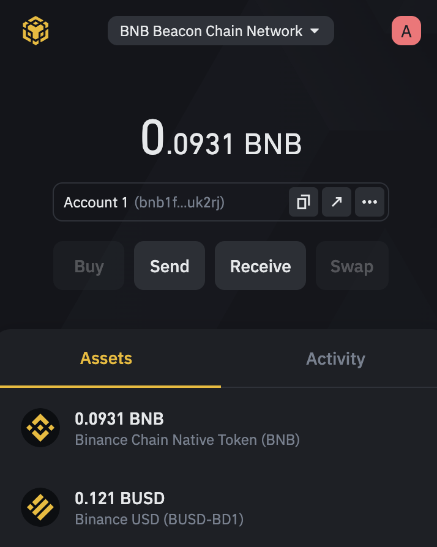
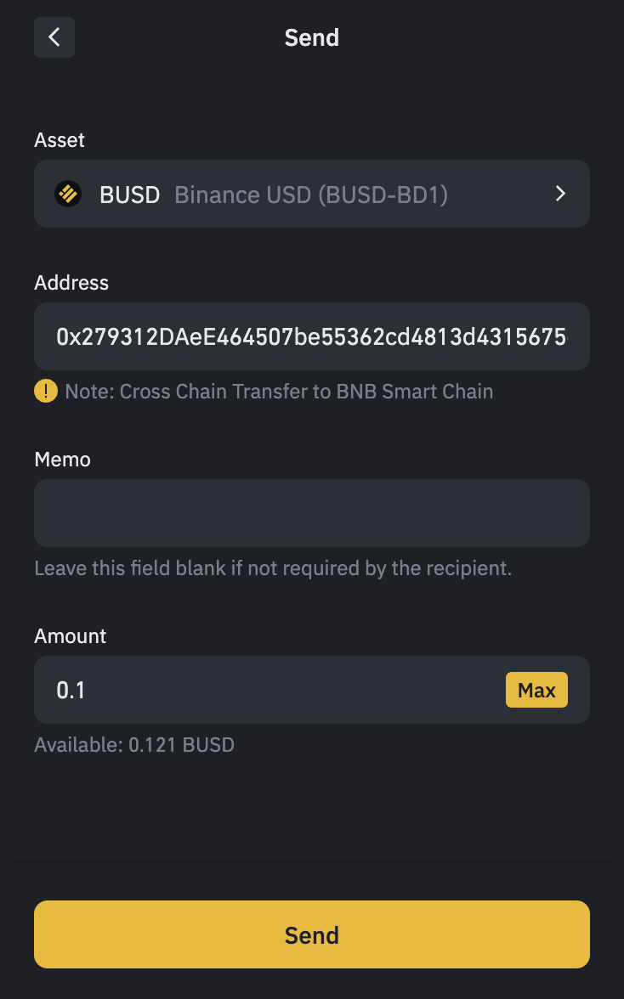
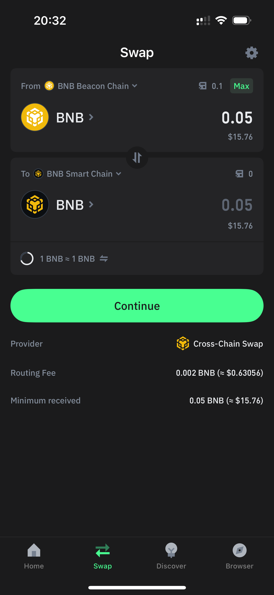

# Asset Management

The BNB Chain community recently introduced [BEP333: BNB Chain
Fusion](https://github.com/bnb-chain/BEPs/pull/333). This
BEP aims to retire the BNB Beacon Chain from the BNB Chain ecosystem.
The goal is to enhance the development efficiency, security, and asset
utilization efficiency of BSC. It also aims to reduce the maintenance
costs of legacy services. This tutorial aims to help digital asset
issuers and holders on the BNB Beacon Chain transfer the value of their
assets,
including [BEP2](https://github.com/bnb-chain/BEPs/blob/master/BEPs/BEP2.md)/[BEP8](https://github.com/bnb-chain/BEPs/blob/master/BEPs/BEP8.md)
tokens, before and after BC Fusion. By following this guide, users can
avoid any potential losses of their valuable digital assets.

***NOTE: The BC Fusion program is scheduled for implementation in April 2024. Please ensure careful planning for the
asset migration and keep the fund safe.***

## Before BC Fusion

Most valuable BEP2/BEP8 tokens such as BNB, BTC, and BUSD can freely
move between the Beacon Chain and BSC networks. Users are strongly
advised to transfer their assets to the BSC network to ensure a seamless
and lossless transition, maintaining a 1:1 ratio. Of course, there are
alternative channels available for asset transfers, such as utilizing
centralized exchanges or decentralized cross-chain exchanges like
Binance.com and [Thorswap](https://thorswap.finance/).
However, these options are beyond the scope of this tutorial.

**Step1: Confirm if the Assets Support Cross-chain Transfers**

Open the Beacon Chain blockchain explorer, go to the [BEP2
Asset](https://explorer.bnbchain.org/assets/bep2) page or
[BEP8 Asset](https://explorer.bnbchain.org/assets/bep8)
page, and search for the token name to query it. Using BTC as an
example, it is linked to a BSC Contract address, allowing for
cross-chain transfers.

In contrast to GTEX-71B, which lacks a BSC Contract address and thus
does not support cross-chain transfers.

If a user needs to transfer assets that don't support cross-chain
transfers, it's strongly recommended to contact the token owner/issuer
as soon as possible. **Ask the token issuer to refer to [the token bind tutorial](../owners/bind.md) for issuing BEP20
tokens on BSC and
enabling cross-chain transfers. If the token issuer does not enable
cross-chain transfer for the token before the sunset of BNB Beacon
Chain, the funds will be lost forever and can not be recovered.**

**Step2: Simply Transfer the Assets to the BSC Network**

[BNB Chain Wallet](https://chromewebstore.google.com/detail/bnb-chain-wallet/fhbohimaelbohpjbbldcngcnapndodjp)
and [Trust Wallet](https://trustwallet.com/) mobile are suggested for this case. Taking BNB Chain Wallet as an example,
once users import the accounts that have the tokens, they need to switch the
network to "BNB Beacon Chain Network":

{:style="width:400px"}

Then, select the asset to transfer, enter the BSC account and the token
amount.

{:style="width:400px"}

The BSC wallet will receive the token after approximately one minute.

For Trust Wallet mobile multi-chain wallet users, they can transfer their assets in the following way.

{:style="width:400px"}

Firstly, you need to open the `Swap` tab, choose From network as `BNB Beacon Chain` and To network as `BNB Smart Chain`,
then find the asset you want to transfer and input the transfer amount.
After you click the `Continue` button, it will redirect you to the approval page as below.

{:style="width:400px"}

Finally, the related asset will be transferred to BSC after you confirm the transaction.

## After BC Fusion

Following the retirement of Beacon Chain, it is believed that some users
have not yet transferred their assets to the BSC network. BNB Chain is
still providing relief measures for these users: [BEP299-Token
Migration after BC
Fusion](https://github.com/bnb-chain/BEPs/pull/299).

Although this solution has its limitations, it is important to note the
following key points:

1. It is only applicable to assets that have enabled cross-chain features. **The BEP2/BEP8 assets will be permanently
   lost** **if not the case.**

2. Users are still responsible for securely storing their private keys on the Beacon Chain and using them for signing as
   proof.

3. The process of recovering assets will take up to 7 days to complete.

4. This solution is operated through the command line and does not provide any UI.

Considering these limitations, it is highly recommended that users
complete the token transfer before BC fusion as much as possible.

The detailed guide for this solution will be published after the BC
Fusion.
Stay tuned for the update.