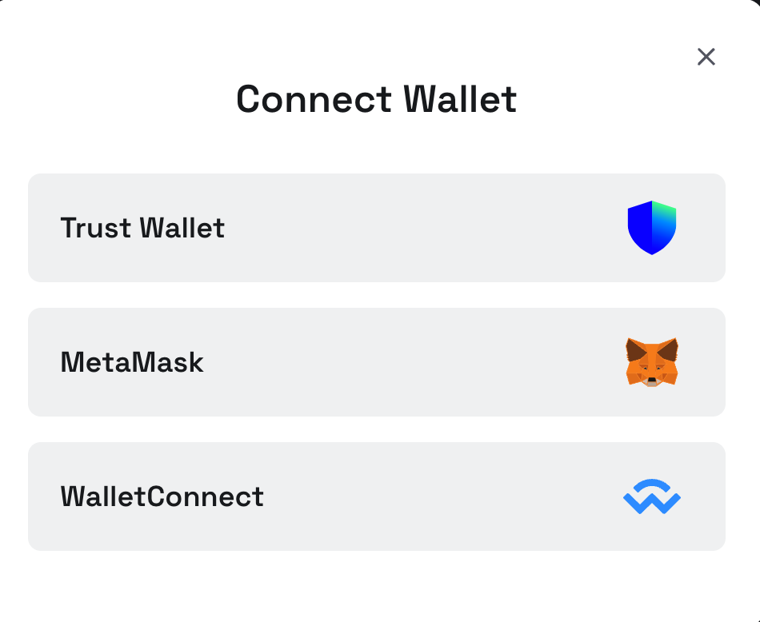
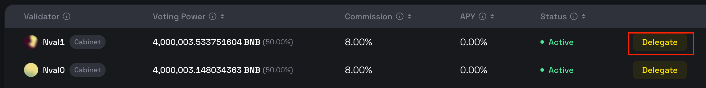
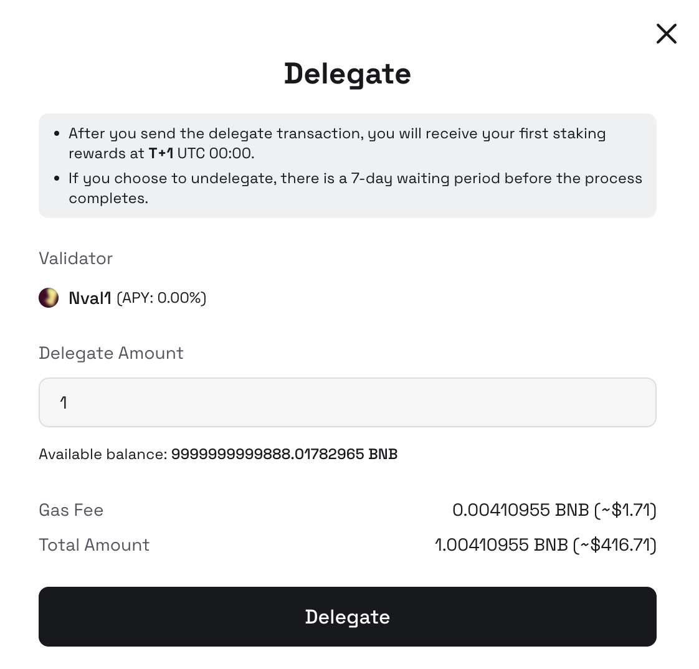
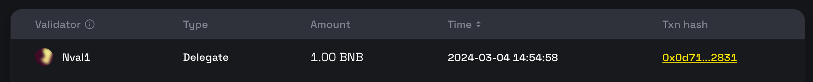
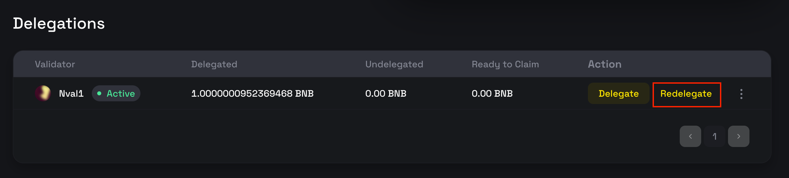
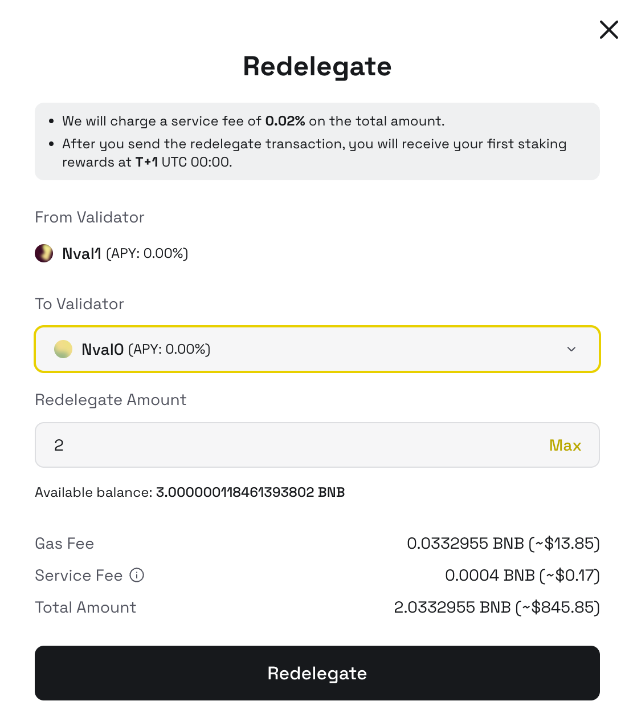
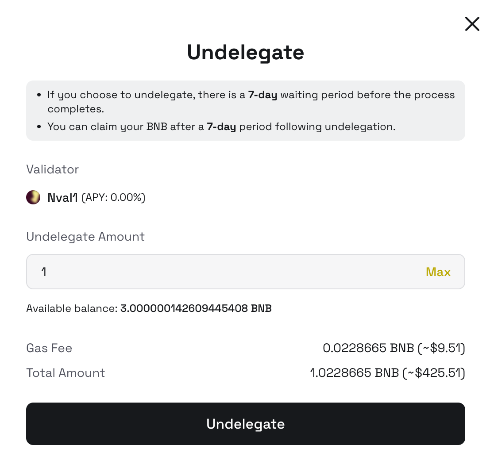
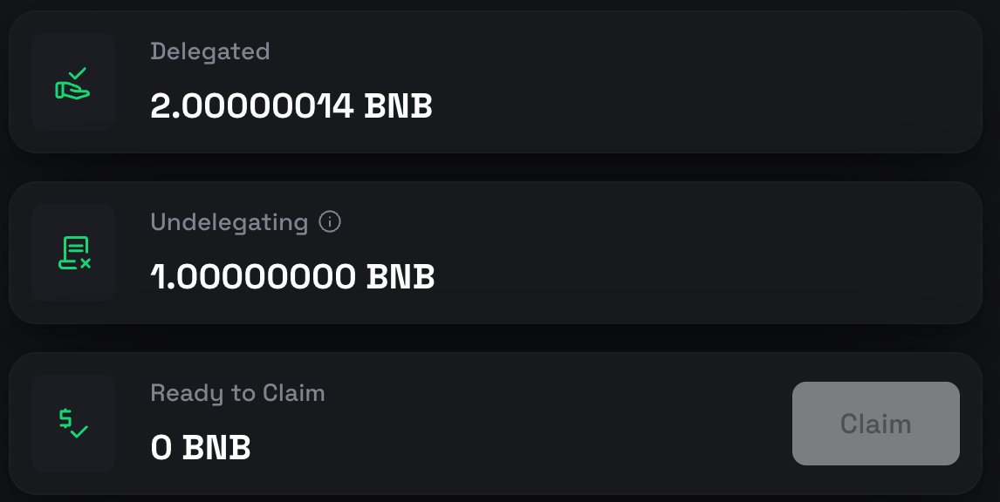
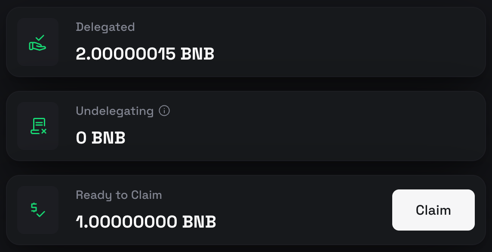

# Managing New Stakes with BNB Staking dApp

Leverage the BNB staking dApp for streamlined management of your stakes. This guide provides a step-by-step walkthrough for using the dApp on both testnet and mainnet.

- **Testnet**: [https://testnet-staking.bnbchain.org/en/bnb-staking](https://testnet-staking.bnbchain.org/en/bnb-staking)
- **Mainnet**: [https://www.bnbchain.org/en/bnb-staking](https://www.bnbchain.org/en/bnb-staking)

## Connecting Your Wallet

{:style="width:400px"}

To interact with the dApp, first connect your web3 wallet. Currently, `TrustWallet` (mainnet only) and `MetaMask` are supported, along with any wallets compatible with `WalletConnect`.

## Delegate Stakes

1. Select a validator to delegate your stakes to. Detailed information about each validator is available on their respective pages.
2. Click the `Delegate` button to initiate a new delegation.

    {:style="width:400px"}

3. Enter the amount of BNB you wish to delegate.

    {:style="width:400px"}

4. After confirming the delegation, your connected wallet will prompt you to sign the transaction.
   Successful transactions will be visible in the `My Staking` page, complete with transaction hash.
   
    {:style="width:400px"}

## Redelegate Stakes

On the `My Staking` page, you can manage your existing delegations.

>Note: A redelegation fee of 0.002% applies to discourage frequent switching between validators.

1. Click `Redelegate` to shift your stake to a different validator.

    {:style="width:400px"}

2. In the ensuing popup, select your new validator and specify the amount to redelegate. You can opt to move the entire amount or just a portion.

    {:style="width:400px"}

## Undelegate Stakes

To undelegate:

1. Click the `Undelegate` button next to the relevant delegation.

    {:style="width:400px"}

2. You can choose to undelegate the entire amount or a portion. Note that undelegated stakes are subject to a 7-day unbonding period before they are returned to your account.

    {:style="width:400px"}

## Claim Stakes

After the unbonding period, you can claim your stakes by clicking the `Claim` button.

{:style="width:400px"}

## FAQs

### Which wallet can be used to delegate to the new validators?

Currently, `MetaMask` and `TrustWallet` (mainnet only) and are supported, along with any wallets compatible
with `WalletConnect`.

### As a validator operator, should I keep both the original validator after I create a new validator on the BSC?

It is recommended to keep both validators for a period of time to allow for smooth migration.
It would be better to ask your delegators to [migrate their stakes](stake-migration.md) to the new validator.
After your new validator is elected as cabinet or candidate, you can safely retire the old validator.

### How should I migrate my delegations if my BNB was delegated through the BSC smart contract?

Please refer to the [stake migration guide](bep153-stake-migration.md) for BEP153 delegations.