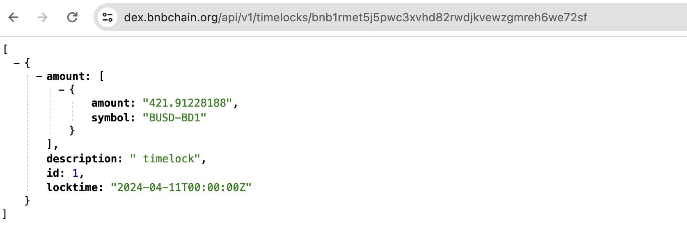

# TimeLock Management

A timelock is a feature that allows users to lock their assets for a certain period of time, which is introduced
in (https://github.com/bnb-chain/BEPs/blob/master/BEPs/BEP9.md).
For BC fusion, in [the second sunset
hardfork](https://github.com/bnb-chain/bEPs/pull/333), all timelocks will be refunded to users' accounts.
Users should proactively actionsj to transfer these assets to BSC after receiving the refunds.

## Query TimeLocks

The time lock api is provided to query existing timelocks. Usually, user can provide a
from address to query the related timelocks, for example:

[https://dex.bnbchain.org/api/v1/timelocks/bnb1rmet5j5pwc3xvhd82rwdjkvewzgmreh6we72sf](https://dex.bnbchain.org/api/v1/timelocks/bnb1rmet5j5pwc3xvhd82rwdjkvewzgmreh6we72sf)

The response will contain a lot of useful information, such as id of the
timelock, the asset of the timelock, and the unlock time.

## Handle TimeLocks

Once the timelock is created, the owners cannot access their assets until the unlock time has passed.
During [the second sunset hardfork](https://github.com/bnb-chain/bEPs/pull/333), all
existing timelocks will be automatically refunded to the creators'
accounts on Beacon Chain. The refund will proceed in many Beacon Chain
blocks, depending on how many timelocks still exist on the
blockchain. After refund, users should be able to find the assets in
their accounts. Then users can handle the assets as other BEP2/BEP8
tokens. For how to cross transfer them to BNB Smart Chain, please
refer to [this tutorial](./assets.md).

