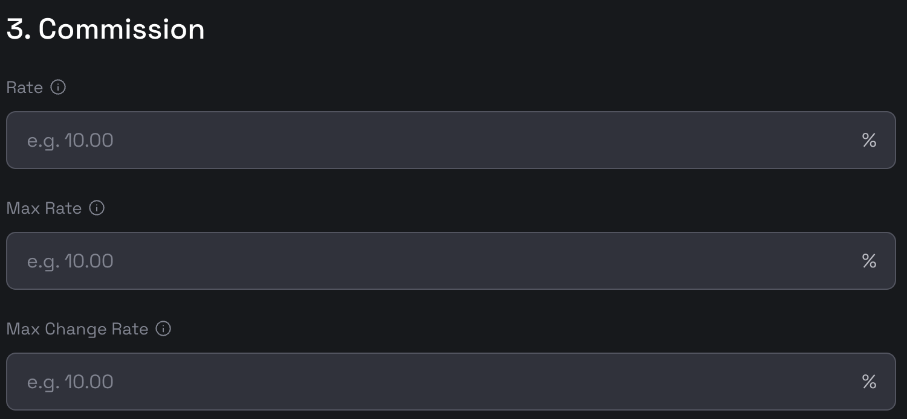

# Validator Creation Guide

This guide outlines the process for creating a new validator on the BNB Smart Chain (BSC).
The BNB staking dApp is the official tool for creating and managing validators on the BSC.

- **Testnet
  **: [https://testnet-staking.bnbchain.org/en/bnb-staking](https://testnet-staking.bnbchain.org/en/bnb-staking)
- **Mainnet**: [https://www.bnbchain.org/en/bnb-staking](https://www.bnbchain.org/en/bnb-staking)

## Terminology

- **Operator Address**: The address for creating and modifying validator information on the BSC. You should use this
  address when connecting to the staking dApp. The corresponding account should have more than 2001 BNB for creating
  validtors and paying transaction fees.
- **Consensus Address**: A unique address for your validator's node. It is used for consensus engine when mining new
  blocks. It should be different from the operator address. If you have an existing validator created on the Beacon
  Chain, the old consensus adddress cannot be reused and you should create a new one.
- **Vote Address**: An address used for fast finality voting. If you have an existing validator created on the Beacon
  Chain, the old vote adddress cannot be reused and you should create a new one.
- **BLS Proof**: A BLS signature verifying ownership of the vote address.
- **Identity**: For associating a new validator with an existing one from the Beacon Chain. It is useful when delegators
  [migrate their stakes](../users/stake-migration.md) - they can know there is a new validator running by the same
  validator operator. This is optional unless you're migrating an old validator.

## Steps

### 1. Connecting to the dApp

Please connect to the staking dApp using your **Operator Address**. `Trust Wallet`, `MetaMask`, and `WalletConnect`
options are available for the step. Make sure that the account has more than 2001 BNB before moving on to the next step.

{:style="width:400px"}

### 2. Filling out the form

Navigate to the dApp and select the `Become a Validator` button in the right middle of the page
to initiate the creation process.

The following information is required to create a validator.

#### Basic Information

{:style="width:600px"}

You'll need to provide the following details on the `Create Validator` page:

- **Validator Name**: Choose a name consisting of 3-9 alphanumeric characters, excluding special characters.
- **Website**: Provide a URL to a website with additional information about your validator.
- **Description**: A brief description of your validator.

To enhance your validator's visibility, consider uploading additional information to
the [BSC validator directory](https://github.com/bnb-chain/bsc-validator-directory). Your avatar, once uploaded, will be
displayed in the staking dApp.

#### Addresses

{:style="width:600px"}

The following addresses are required:

- **Consensus Address**: A unique address for your validator's node.
- **Vote Address**: An address used for fast finality voting.
- **BLS Proof**: A BLS signature verifying ownership of the vote address.
- **Identity**: For associating a new validator with an existing one from the Beacon Chain. This is optional unless
  you're migrating an old validator.

##### Generate Consensus Address

Download the BSC geth binary from [the official release page](https://github.com/bnb-chain/bsc/releases/).

Note: Make sure you are downloading the correct binary based on your machine's platform, e.g., if you are using MacOS,
you should download the `geth_mac` file. In the following, we will refer the binary as `geth` for simplicity.

To create a new account for mining, please use the following command and set a password for the account.

```shell
geth account new --datadir ${DATA_DIR}
```

- `DATA_DIR`: The directory where you want to store your key store files.

This command will return the public address (i.e. consensus address) and the path to your private key.
Please backup the key file!

An example consensus address is `0x4b3FFeDb3470D441448BF18310cAd868Cf0F44B5`.

If you already have an account for mining, you can use the seed phrase to recover the account.

```shell
geth account import --datadir ${DATA_DIR}
```

If you have created a validator on the Beacon Chain, please use a different one for the consensus address.

##### Generate Vote Address and BLS Proof

To create a new BLS account please use the following command.

```shell
 geth bls account new --datadir ${DATA_DIR}
```

- `DATA_DIR`: The directory where you want to store your key store files.

If you already have a voting key, create a bls wallet and use the keyfile to recover it, using the following command.

```shell
 geth bls account import ${KEY_FILE} --datadir ${DATA_DIR}
```

- `DATA_DIR`: The backup file for restoring the BLS account.

Then you can get your vote address by running the following command.

```shell
geth bls account list --datadir ${DATA_DIR}
```

An example address
is `b5fe571aa1b39e33c2735a184885f737a59ba689177f297cba67da94bea5c23dc71fd4deefe2c0d2d21851eb11081f69`.

Then you can get your bls proof by running the following command.

```shell
geth bls account generate-proof --chain-id ${BSC_CHAIN_ID} ${OPEATOR_ADDRESS} ${VOTE_ADDRESS}
```

- `BSC_CHAIN_ID`: `56` for BSC mainnet, and `97` for BSC testnet.
- `OPEATOR_ADDRESS`: The address of your account, which will be reconginzed as the operator of the new validator.
- `VOTE_ADDRESS`: The vote address created in the last step.

An example proof
is `0xaf762123d031984f5a7ae5d46b98208ca31293919570f51ae2f0a03069c5e8d6d47b775faba94d88dbbe591c51c537d718a743b9069e63b698ba1ae15d9f6bf7018684b0a860a46c812716117a59c364e841596c3f0a484ae40a1178130b76a5`.

##### Create indentity

Identity is used for assocaiting the new validator to the old validator created on the Beacon Chain, to facilitate
delegators moving their stakes to the same validator operator when [migrations](../users/stake-migration.md).
If you never create a validator in this [page](https://www.bnbchain.org/en/staking), you can leave it empty.

Please download BC client binary
from [the official release page](https://github.com/bnb-chain/node/releases/tag/v0.10.19).

Note: Make sure you are downloading the correct binary based on your machine's platform, e.g., if you are using MacOS,
you should download the `macos_binary.zip` file, and after unzip it your will find `bnbcli` (for mainet)
and `tbnbcli`(for testnet). In the following, we will refer the binary as `bnbcli` for simplicity.

###### Setup account

If you have mnemonic, you can import your account by running the following command:

```shell
$ ${workspace}/bin/bnbcli keys add <your-account-name> --recover --home ${HOME}/.bnbcli
Enter a passphrase for your key:
Repeat the passphrase:
> Enter your recovery seed phrase:
```

You will be asked to set a password for this account and input your mnemonic. After that, you will get your account info.

- `${workspace}/bin/bnbcli`: The path to the `bnbcli` binary executable. For testnnet, you should use `tbnbcli` instead.
- `${HOME}`: The folder where you store your account information.

Or if you have a ledger, you can import your account by running the following command:

```shell
${workspace}/bin/bnbcli keys add <your-account-name> --ledger --index ${index} --home ${HOME}/.bnbcli
```

- `${workspace}/bin/bnbcli`: The path to the `bnbcli` binary executable. For testnnet, you should use `tbnbcli` instead.
- `${HOME}`: The folder where you store your account information.
- `${index}`: The index of the ledger account you want to import.

###### Get identity

After the account is imported, you can get your identity by running the following command:

For local key:
```shell
${workspace}/bin/bnbcli \
  validator-ownership \
  sign-validator-ownership \
  --bsc-operator-address ${NEW_VALIDATOR_OPERATOR_ADDR_ON_BSC} \
  --from ${ACCOUNT_NAME} \
  --chain-id ${BC_CHAIN_ID} \
```

For ledger key:
```shell
${workspace}/bin/bnbcli \
  validator-ownership \
  sign-validator-ownership \
  --bsc-operator-address ${NEW_VALIDATOR_OPERATOR_ADDR_ON_BSC} \
  --from ${BSC_OPERATOR_NAME} \
  --chain-id ${CHAIN_ID} \
  --ledger
```

- `${workspace}/bin/bnbcli`: The path to the `bnbcli` binary executable. For testnnet, you should use `tbnbcli` instead.

- `--to ${NEW_VALIDATOR_OPERATOR_ADDR_ON_BSC}`: Specifies the BSC address to which the new validator operator address
  will be mapped.

- `--chain-id ${BC_CHAIN_ID}`: Specifies the chain ID for the BC(BNB beacon chain). By default, the mainnet chain ID
  is `Binance-Chain-Tigris`. And the testnet chain ID is `Binance-Chain-Ganges`.

- `--from ${ACCOUNT_NAME}`: Specifies the account name from which the sign will be performed. The account should
  be the operator of the validator created on the Beacon Chain.

And you will get the output like this:

```
TX JSON: {"type":"auth/StdTx","value":{"msg":[{"type":"migrate/ValidatorOwnerShip","value":{"bsc_operator_address":"RXN7r5XZlaljqzp8msZvx6Y6124="}}],"signatures":[{"pub_key":{"type":"tendermint/PubKeySecp256k1","value":"Ahr+LlBMLgiUFkP75kIuJW1YHrsTy39GeOdV+IaTREDN"},"signature":"AL5mj52s0+tcdoEb6c6PAmqBixuv3XEmrLW3Y1kvUeYgG3RqVvWU/dIVcfxiHHwLGXlcn0X1v00jFrpLIsxtqA==","account_number":"0","sequence":"0"}],"memo":"","source":"0","data":null}}
Sign Message:  {"account_number":"0","chain_id":"Binance-GGG-Ganges","data":null,"memo":"","msgs":[{"bsc_operator_address":"0x45737baf95d995a963ab3a7c9ac66fc7a63ad76e"}],"sequence":"0","source":"0"}
Sign Message Hash:  0x8f7179e7969e497b5f3c006535e55c2fa5bea5d118a8008eddce3fccd1675673
Signature: 0x00be668f9dacd3eb5c76811be9ce8f026a818b1bafdd7126acb5b763592f51e6201b746a56f594fdd21571fc621c7c0b19795c9f45f5bf4d2316ba4b22cc6da8
PubKey: 0x021afe2e504c2e08941643fbe6422e256d581ebb13cb7f4678e755f886934440cd
```

The `Signature` is your `identity` for associating to the old validator created on the Beacon Chain.

#### Commissions

{:style="width:600px"}

- **Rate**: The commission rate of the validator.
- **Max Rate**: The maximum commission rate that the validator can set.
- **Max Change Rate**: The maximum rate change the validator can set to every epoch (1 day).

#### Self-delegation

{:style="width:600px"}

- **Self Delegate Amount**: The amnout to delegate when creating the validator. The minimal number to input is `2001` -
  for the minimal self delegation amount is 2000 BNB and extra 1 BNB for locking to a dead address.

### 3. Submitting the form

Once you have filled out all the required information, click the `Submit` button to submit the transaction.

Note: Upon completing these steps, your node is not guaranteed to become an active validator. Selection is based on a ranking that reflects the total BNB staked, with only the top N nodes being chosen as active validators. The number N is determined by the "maxElectedValidators" parameter within the StakeHubContract (0x0000000000000000000000000000000000002002). As of November 4th, 2024, this number stands at 8 for the testnet and 45 for the mainnet.