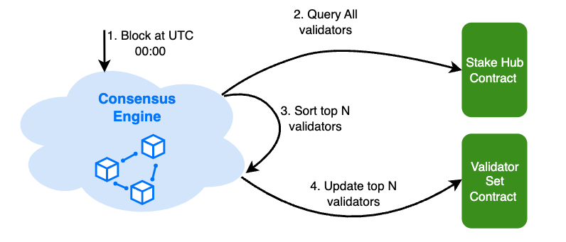

# Staking

BNB smart chain (BSC) is a Proof-of-Staked-Authority (PoSA) blockchain, which means that staking is one of the most
important parts of the system. [BEP-294](https://github.com/bnb-chain/BEPs/pull/294) introduces the new native staking
mechanism after BNB chain fusion, which has several differences:

- Users are able to participate in staking on the BSC directly, without moving BNB to Beacon chain.
- Staking credit, as the proof of BNB staked to a specified validator, cannot be transferred. Different validators issue
  different staking credits.
- Staking reward will not be distributed automatically.

In this section, we will explain the basic concepts and operations of staking on the BSC.

## Basic Concepts

### Consensus Engine

BSC uses a consensus mechanism which combines DPoS and PoA for consensus, so that:

* Blocks are produced by a limited set of validators.
* Validators take turns to produce blocks in a PoA manner.
* Validator set are elected in and out based on a staking based governance.

The staking mechanism is essential for determining the eligibility of validators to produce blocks.

### Validator Set

The validator set is the group of nodes that are responsible for validating transactions and producing blocks on the
BSC. The validator set is determined by the amount of staking each validator has, which reflects the amount of
BNB staked by the validator and its delegators. The top validators with the most staking are selected as the
active validator set, and they take turns to propose and vote on blocks. The rest of the validators are in the standby
validator set, and they can join the active validator set if their staking increases or if some active validators
drop out.

Any organization or individual can become part of the validator set by creating their validator on-chain and securing sufficient delegations.
Similarly, they can opt-out by simply withdrawing all their BNB delegations.

Validators can also be removed from the validator set by slashing, which is a penalty for misbehaving or being offline.

### Validator Election

There are different rols for validators:

* Cabinet: the top K (which is 21 currently) validators who get the most chance of producing blocks.
* Candidate: the top (K, K+NumOfCandidates] (which is (21,45] currently) validators who get a small chance of producing blocks.
* Inactive: the reset validators who get no chance of producing blocks.

To determinate the roles of all validators, the validator set is updated every 24 hours,
based on the latest staking information. At the first block after UTC 00:00, the consensus engine
will sort all the validators and update the BSC validator set contract to save the ranking information.
Be noted: during the BC fusion, the validators created on Beacon Chain and the validators created on BSC
will be sorted together to decide the top validators. However, the validators created on BSC will receive
triple voting power compared with the validators created on Beacon Chain for the same amount of BNB staked.

### Sytems Contracts

There are several built-in contracts (i.e., system contracts) to facilitate the BSC staking.

* Validator Set Contract. The contract periodically elects a validator set.
  The contract also serves as a vault for temporarily storing validator rewards.
  Periodically, these rewards are sent back to the BC or transferred to the BSC native staking module.

* System Reward Contract. This contract acts as a vault to collect part of transaction fees. The funds are used for
  various public purposes, like distributing fast finality rewards.

* Slash Contract. This contract is used to keep track of the number of times a validator becomes unavailable and
  triggers penalties once a certain threshold is reached. Additionally, this contract also handles other types of slash
  events, such as double signing and malicious voting in fast finality.

* Stake Hub Contract. This contract serves as the entrypoint for managing validators and delegations,
  while also implementing the logic for slashing specific validators. For delegation/undelegation/redelegation
  operations,
  it will call different validators' implementation contracts to manage a user's stake.

### Credit Contract

Each validator has its own validator contract that manages staking credit and facilitates the exchange
between credit and BNB. The token name of a staking credit is "stake {{validator moniker}} credit",
and the symbol is "st{{validator moniker}}". The contract will be created by the Stake Hub Contract when a validator
is created.

Whenever a user delegates BNB, an equivalent quantity of credit tokens are created. On the other hand,
when a user withdraws their delegation, a corresponding amount of credit tokens are destroyed, thereby releasing the BNB.

### Reward Distribution

The staking reward comes from transaction fee - when a block is produced, the majority of the block fee will be
collected as reward for the validator who proposed the block.
Every day, a portion of the rewards collected will be directly sent to the operator account of the validator as
commission, while the remaining portion will be sent to the corresponding validator credit contract. And when a user
undelegates and claims his/her stakes, the accumulated reward and the original stake will be sent back to him/her.

## Validator Operations

Validators are nodes running BNB Smart Chain software, participating in the consensus process.
They require a minimum BNB stake at their validator address and can receive delegations from other BNB holders.
Validators earn rewards from transaction fees and share most of these rewards with their delegators.

### Create Validator

To create a validator, a BNB holder needs to send a `CreateValidator` transaction to the `StakeHub` contract,
which is a system contract and the address is `0x0000000000000000000000000000000000002002`,
with minimum amount of BNB that the validator needs to stake to their own validator
address (2000 BNB), specifying the following information:

- **Operator address**: The address of the validator, which will receive the staking credit and the rewards.
- **Consensus address**: The consensus address of the validator's node.
- **Vote Address**: The address for participating fast finality voting.
- **BLS Proof**: A BLS signature to prove that the validator owns the vote address.
- **Commission**: The commission rate defines the percentage of the rewards that the validator will keep for themselves,
  and the rest will be distributed to the delegators. It also contains the max commison rate, the max change rate during
  a predefined timespan for validator to set.
- **Description**: The optional information about the validator, such as moniker, identiy, website, etc.

The `CreateValidator` transaction will deduct the minimum self-delegation amount from the validator address and issue
the corresponding staking credit to the validator. The validator will then join the standby validator set, and wait for
the next validator set update to see if they can enter the active validator set.

### Edit Validator

A validator can edit their validator information by sending  `EditConsensusAddress`, `EditCommissionRate`,
`EditDescription`, `EditVoteAddress` transactions to the `StakeHub` contract, specifying the following information
accordingly:

- **New consensus address**: The new consensus address of the validator's node.
- **New commission rate**: The new percentage of the rewards that the validator will keep for themselves, which can
  only be increased within a maximum change rate limit.
- **New description**: The new information about the validator, such as moniker, identiy, website, etc.
- **New vote address**: The new vote address for participating fast finality.

These transactions will update the validator information on the BNB smart chain, and the changes will take
effect immediately. However, the new commission rate will only apply to the rewards earned after the transaction, and
the previous rewards will be distributed according to the previous commission rate.

## Delegator Operations

Delegators are BNB holders who stake their BNB with a validator, sharing rewards.
They can select any active or standby validator, switch between them, undelegate their BNB, and claim rewards anytime.

### Delegate

To delegate BNB to a validator, a BNB holder needs to send a `Delegate` transaction to the `StakeHub` contract,
specifying
the following information:

- **Operator address**: The address of the validator, which will receive the BNB from the delegator.
- **Delegate Voting Power**: The flag to indicate whether the delegator would like to delegate his/her voting power
  to the validator for governance.

The `Delegate` transaction will deduct the amount of BNB from the delegator address and issue the corresponding staking
credit to the validator. The validator will then share the rewards with the delegator, according to the commission rate.

The credit tokens (or share) a delgator will get is calculated
as - `delegation amount` * `total supply of credit token` / `total pooled BNB`.
The `total pooled BNB` includes the delegation BNB and unclaimed reaward BNB of of the vlidator. It means that a
delegator will get credit tokens based on the ratio of his/her delegation BNB amount to the total staked and reward BNB.
When the validator gets block reward the `total pooled BNB` amount will increase, which means that when unbonding
the delegator will get his delegation, as well as reward BNB from the pool.

### Redelegate

To redelegate BNB from one validator to another, a delegator needs to send a `Redelegate` transaction to the `StakeHub`
contract, specifying the following information:

- **Source operator address**: The address of the source validator, which will send the BNB to the destination
  validator.
- **Destination operator address**: The address of the destination validator, which will receive the BNB from the
  source validator.
- **Amount**: The amount of BNB that the delegator wants to redelegate from the source validator to the destination
  validator.
- **Delegate Voting Power**: The flag to indicate whether the delegator would like to delegate his/her voting power
  to the destination validator for governance.

The `Redelegate` transaction will deduct the amount of source validator staking credit and issue the corresponding dest validator staking credit to the user.
The destination validator will then share the rewards with the delegator, according to the commission rate of the destination validator.

The `Redelegate` transaction does not incur the unbonding period, but it will incur the redelegation fee,
which is designed to prevent delegators from frequently switching between validators to chase
the highest rewards or avoid the highest risks. The current fee rate is 0.002%.

### Undelegate

To undelegate BNB from a validator, a delegator needs to send an `Undelegate` transaction to the `StakeHub` contract,
specifying the following information:

- **Operator address**: The address of the validator, which will send the BNB to the delegator.
- **Amount**: The amount of BNB that the delegator wants to unstake from the validator.

The `Undelegate` transaction will burn the amount of staking credit from the user and moves the BNB to a withdraw queue.
The BNB gets locked for an **unbonding period** before the delegator can claim it.
The unbonding period is currently set to 7 days, and it is designed to prevent delegators from quickly withdrawing their BNB in case of a validator misbehavior or a network attack.

### Claim

To claim the unbond BNB and the rewards, a delegator should send a `Claim` transaction to the `StakeHub` contract,
specifying the following information:

- **Delegator address**: The BEP20 address of the delegator, which will receive the rewards from the validator.
- **Queued unbond number**: The number of unbond requests to be claimed, and 0 means claim BNB and rewards from
  all the unbond requests.

The `Claim` transaction will return the delegated BNB and rewards to the delegator. Be noted, a delegator can only get
the rewards after unbond. Before undelegation, the reward will be furthur staked to boost a delegator's income.

