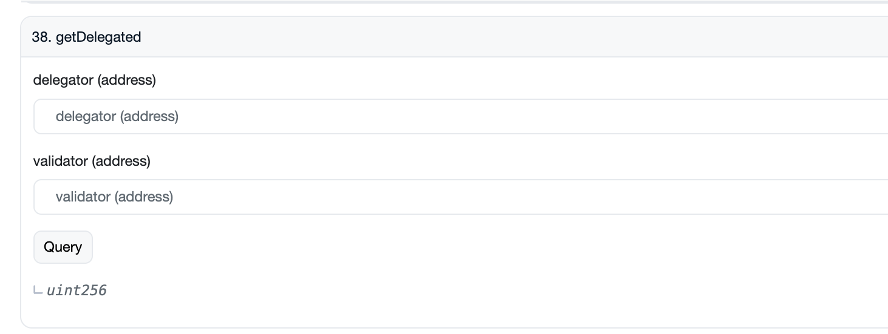
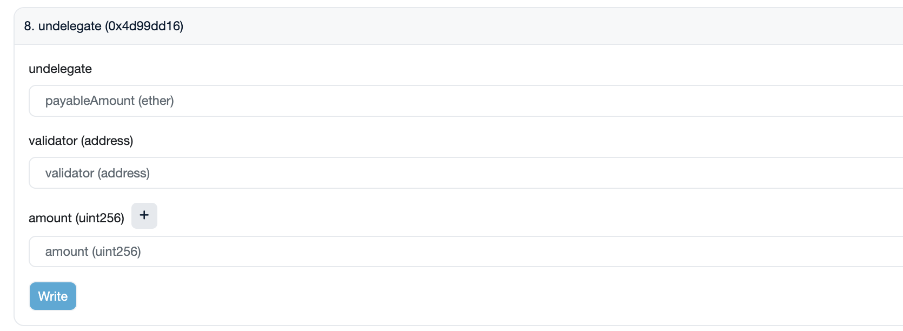
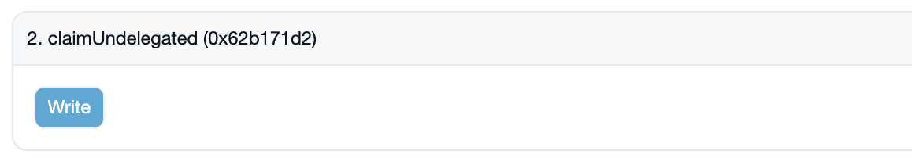

# Stake Migration For BEP153

The [BEP-153](https://github.com/bnb-chain/BEPs/blob/master/BEPs/BEP153.md) has been introduced as a native staking
protocol onto BNB Smart Chain before [BNB Chain fusion](https://www.bnbchain.org/en/bnb-chain-fusion).
With this BEP, individual or institution delegators can stake BNB to specified validators
and get staking rewards on the BSC side directly.

However, underlying the protocol users' BNB are crosschain transferred
to the Beacon Chain and then staked there. With the [BNB Chain fusion](https://www.bnbchain.org/en/bnb-chain-fusion),
the delegators of BEP-153 needs to migrate their stakes to the [new staking system](new-stake.md).

For BEP-153 stakes, the delegators need to undelegate, wait for the unbounding period (7 days), and then get their
BNB back to stake on the new staking system.

This document will guide you through the process of stake migration for BEP-153 delegators, including Liquid
Staking Derivatives (LSD) protocol's users.

## For Individual Delegators

1. Open the [Staking contract](https://bscscan.com/address/0x0000000000000000000000000000000000002001) on BSCScan

2. You can find your delegation information on the "Transactions" tab, or you can query the contract as the following:
    * Go to
      the [Staking contract tab](https://bscscan.com/address/0x0000000000000000000000000000000000002001#readContract)
    * Query the `getDelegated` function with your address as the parameter

3. Undelegate your delegations by calling
   the `undelegate` [function](https://bscscan.com/address/0x0000000000000000000000000000000000002001#writeContract)

4. Afther the unbounding period (7 days), call
   the `claimUndelegated` [function](https://bscscan.com/address/0x0000000000000000000000000000000000002001#writeContract)
   to get your BNB back

5. Then you can delegate your BNB to the new staking system by following the [new staking guide](new-stake.md)

## For LSD Protocal Delegators

1. Go to your LSD protocal dApps and undelegate your delegations

2. Wait for the unbounding period (7 days)

3. Then you can delegate your BNB to the new staking system by following the [new staking guide](new-stake.md)

## For LSD Protocal Projects

For LSD protocol projects, you **MUST** finish your undelegations before
the [Second Sunset Fork](https://www.bnbchain.org/en/bnb-chain-fusion) of Beacon Chain.
In the Second Sunset Fork, all the delegations will automatically be returned to the delegator addressess.
If your delegation address is not an EOA address, you will lose the control of your stakes and the fund will be lost.