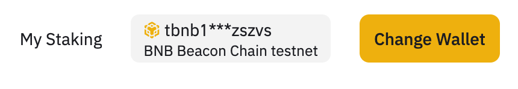
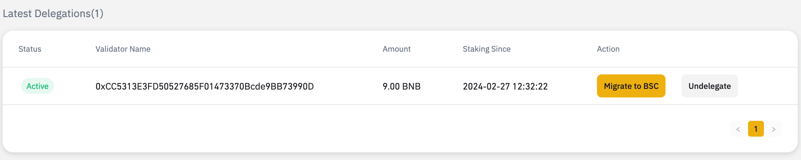
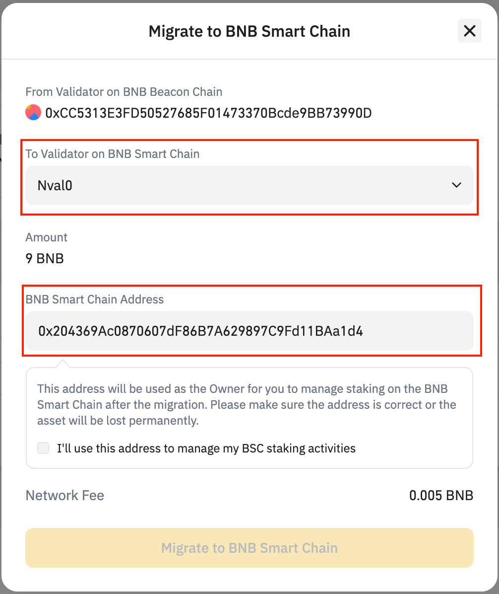
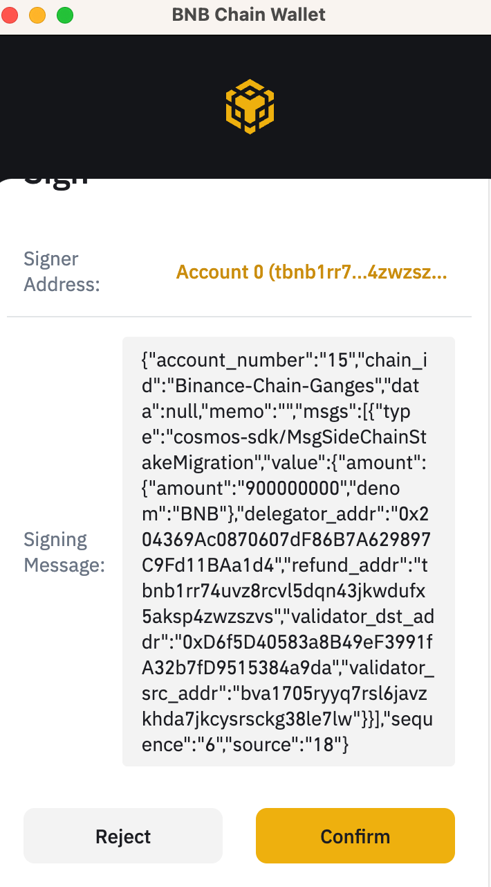
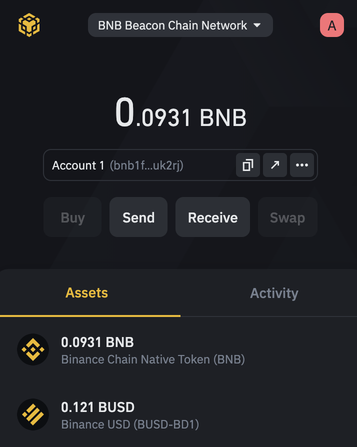
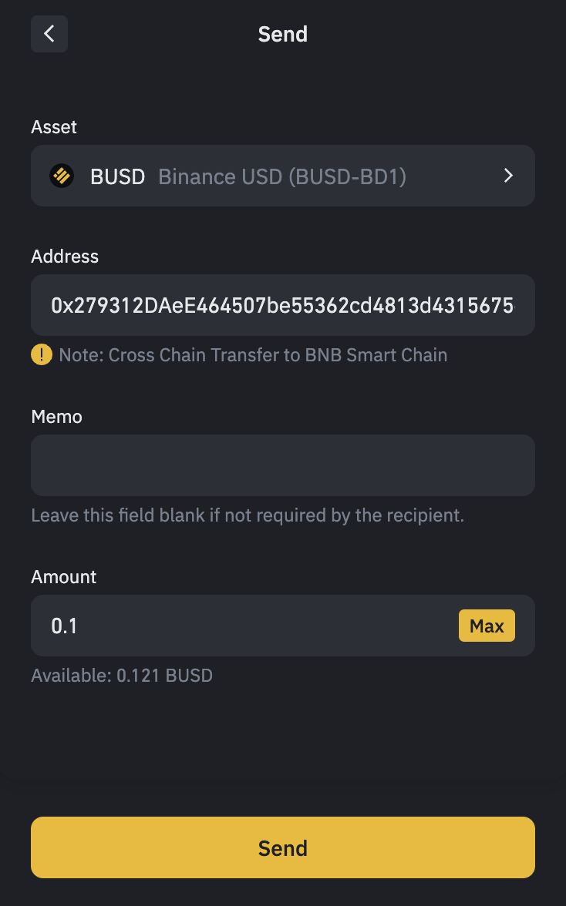
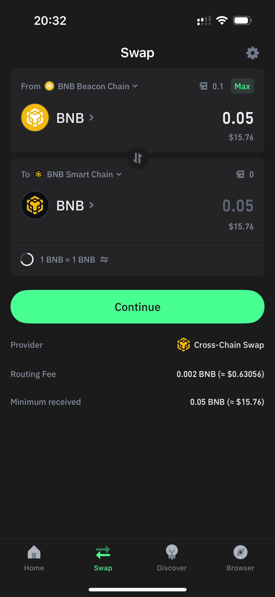
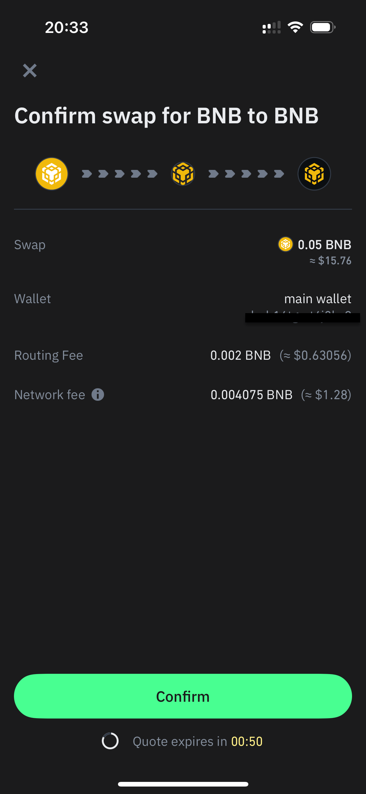

# Stake Migration

The BNB Chain community has introduced [BEP333: BNB Chain Fusion](https://github.com/bnb-chain/BEPs/pull/333), a
significant update that retires the BNB Beacon Chain from the ecosystem. This transition introduces native staking on
the BNB Smart Chain, following the Feynman Hardfork. Stakeholders now have the opportunity to migrate their existing
delegations to the new native staking system through two primary methods:

* Cross Chain Redelegation
* Undelegation, Cross Chain Transfer, New Delegation

Be noted, for delegations which are created in [BEP-153](https://github.com/bnb-chain/BEPs/blob/master/BEPs/BEP153.md) 
format, please refer to [this document](bep153-stake-migration.md) for the migration process.

## Cross Chain Redelegation

Cross chain redelegation allow users to migrate their delegations to BSC as delegations to native BSC validators,
facilitaling users for easier migration compared to the second option.
Therefore this is the recommended way for stake migration.

### Steps

#### Step 1: Find your delegations

Go to the staking website and connect to your web3 wallet.

Mainnet Staking Website: [https://www.bnbchain.org/en/staking](https://www.bnbchain.org/en/staking)

Testnet Staking
Website: [https://testnet-staking.bnbchain.org/en/staking](https://testnet-staking.bnbchain.org/en/staking)

For testnet, you
can [BNB Chain Wallet](https://chromewebstore.google.com/detail/bnb-chain-wallet/fhbohimaelbohpjbbldcngcnapndodjp) to
connect.

For mainnet, you can use BEW or [TrustWallet](https://trustwallet.com/browser-extension) to connect.

Open `My Staking` page, Then you can find you existing delegations as the following.

#### Step 2:  Choose the native BSC validators to migrate to.

Choose one delegation and click `Migrate to BSC` button. The following window will be poped up for choosing
which BSC valiadtor you want to migrate to.

The window mainly contains the following fields:

* The validator to migrate to: if the validator operator of the old delegation already creates a new validator on BSC,
  this field will be set to the new validator. You can also choose another validator you want to delegate to.
* The BSC delegator address: the address will be used as the owner for you to manage staking on the BSC. Please double
  confirm the address is correct to avoid funding lost.

#### Setp 3: Sign the migrate transaction.

Finally, you can sign the transaction and migration will be started.

If the migration fails, the fund will
be returned to your Beacon Chain, and you can check it in your web3 wallet.

If the migration goes well, you will find the delegation in the new staking dApp.
For how find your delegations, please refer to [this document](new-stake.md) for more information.

## Undelegation, Cross Chain Transfer, New Delegation

The second option needs the delegator to 1) do undelegation on the Beacon Chain, wait the unboinding period, 2) cross
chain transfer BNB to the BSC, and 3) stake in the new staking dApp. It needs more time and transaction fee, therefore
it is not recommended.

### Steps

#### Step 1: Find your delegations

You can find your delegations as the steps in the option 1.

#### Step 2: Undelegate

Then you can undelegate your delegations by click `Undelegate` button and send the transaction to the Beacon Chain.

After the unbonding period (7 days in mainnet), the stake be returned to your Beacon Chain account.

#### Step 3: Cross chain transfer

You can use BNB Chain Wallet (BEW) or TrustWallet to cross chain transfer your BNB from the Beacon Chain to the BSC.

For BEW, you need to switch the network to "BNB Beacon Chain Network"/"BNB Beacon Chain Testnet Network":

Then, select the asset to transfer, enter the BSC account and the token amount.

The BSC wallet will receive the token after approximately one minute.

For TrustWallet mobile multi-chain users, you need to open the `Swap` tab, and
choose From network as `BNB Beacon Chain` and To network as `BNB Smart Chain` for mainnet asset transfer.

Then find the asset you want to transfer and input the transfer amount.

After you click the `Continue` button, it will redirect you to the approval page as below.

Finally, the related asset will be transferred to BSC after you confirm the transaction.

#### Step 4: Delegate to new validators

Finnally, you can delegate to the new BSC valdiators using the new staking dApp.
You can refer to [this document](new-stake.md) for the detailed steps.
