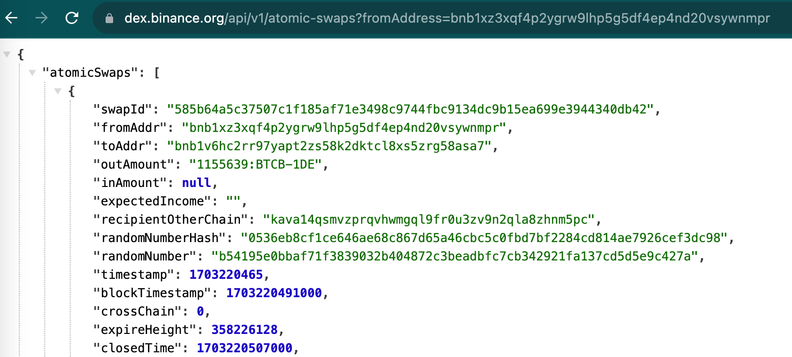

# Atomic Swap Management

HTLC based atomic swaps are introduced in
[BEP3](https://github.com/bnb-chain/BEPs/blob/master/BEPs/BEP3.md),
to facilitate payment and asset exchanges between different blockchains.
For BC fusion, in [the first sunset
hardfork](https://github.com/bnb-chain/bEPs/pull/333), the
creation and deposit of atomic swaps will be disabled, project owners
(e.g., cross-chain exchanges, bridges) and users should be aware of this
and take proactive steps.

## Query Atomic Swaps

The [atomic swap api](https://docs.bnbchain.org/docs/beaconchain/develop/api-reference/dex-api/paths#apiv1atomic-swaps)
is provided to query existing atomic swaps. Usually, user can provide a
from address to query the related atomic swaps, for example:

[https://dex.bnbchain.org/api/v1/atomic-swaps?fromAddress=bnb1xz3xqf4p2ygrw9lhp5g5df4ep4nd20vsywnmpr](https://dex.bnbchain.org/api/v1/atomic-swaps?fromAddress=bnb1xz3xqf4p2ygrw9lhp5g5df4ep4nd20vsywnmpr)



The response will contain a lot of useful information, such as id of the
swap, the asset of the swap, and other information.

## Handle Atomic Swaps

### Before BC Fusion

A user can proactively refund his/her atomic swaps by sending **HTLC Refund** transactions to Beacon Chain. The command
to send such
transaction is looks like this:

```shell
./bnbcli token refund --swap-id <swapID> --from <from-key> --chain-id Binance-Chain-Tigris --trust-node --node http://dataseed1.bnbchain.org:80
```

For more information about the command, please refer to
the [Refund HTLC section](https://docs.bnbchain.org/docs/beaconchain/atomic-swap#refund-htlt).

If no proactive refunds are submitted, in [the second sunset hardfork](https://github.com/bnb-chain/bEPs/pull/333), all
existing atomic swaps will be automatically refunded to the creators'
accounts on Beacon Chain. The refund will proceed in many Beacon Chain
blocks, depending on how many atomic swaps still exist on the
blockchain. After refund, users should be able to find the assets in
their accounts. Then users can handle the assets as other BEP2/BEP8
tokens. For how to cross transfer them to BNB Smart Chain, please
refer to [this tutorial](./assets.md).

### After BC Fusion

If the refunded assets are not transferred to BSC
before [the final sunset fork](https://github.com/bnb-chain/bEPs/pull/333),
users need to use the token-recover tool to get their binded BEP2/BEP8
assets. For more information, please refer to [this
tutorial](https://docs.google.com/document/d/1rMWwYGt-s6FXcRiUrBSN8dtOU96HDz0T3GaZyzbo7VQ/edit?pli=1#heading=h.df0svx3bznak).

## For Atomic Swap Project Owers

Because in [the first sunset hardfork](https://github.com/bnb-chain/bEPs/pull/333), the
creation and deposit of atomic swaps will be disabled, so project owners
need to disable related functions in their projects IN ADVANCE and
notify their uses to take proactive actions to refund their tokens.

## Other Useful References

- [Refund Atomic Swap](https://docs.bnbchain.org/docs/beaconchain/atomic-swap#refund-htlt)

- [Query Atomic Swap](https://docs.bnbchain.org/docs/beaconchain/develop/api-reference/dex-api/paths#apiv1atomic-swaps)
