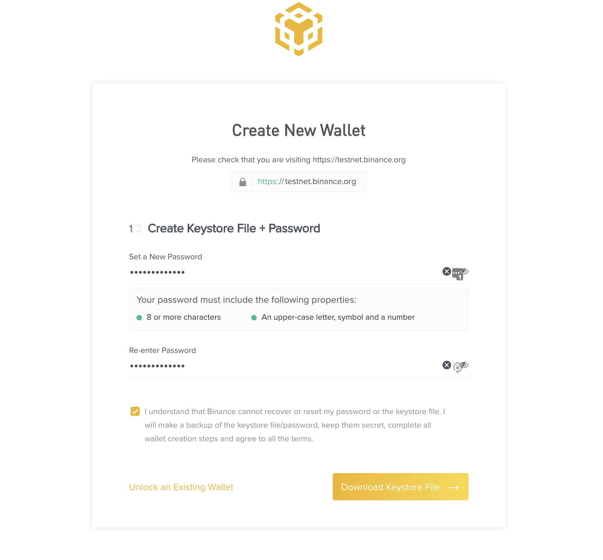
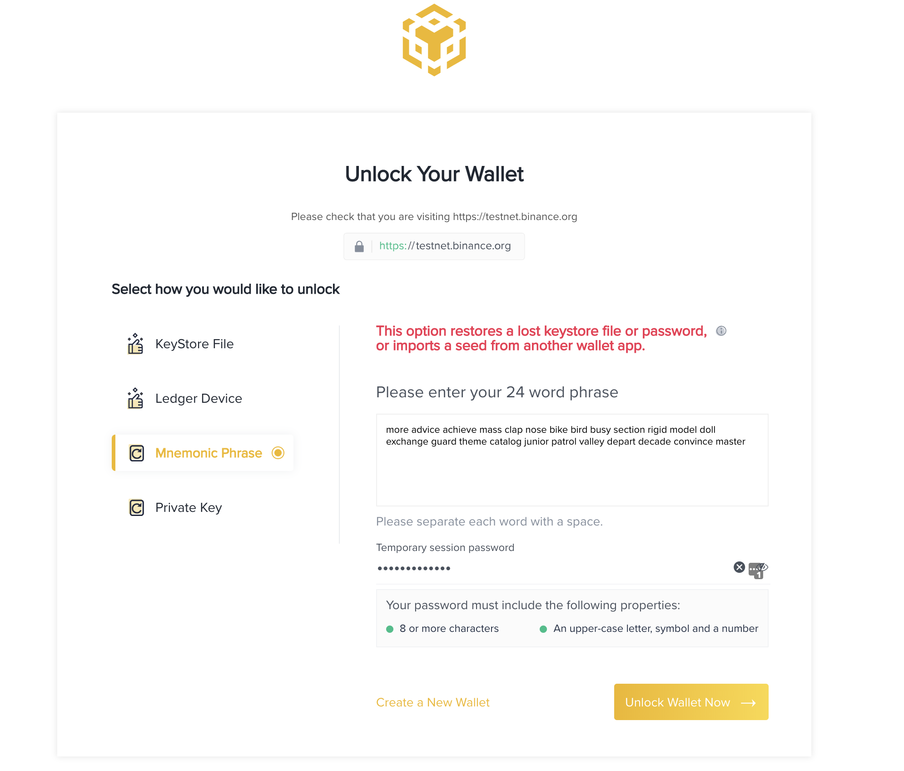
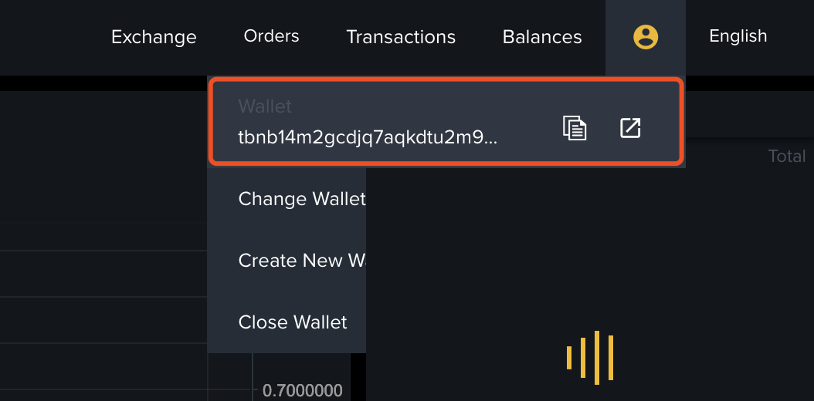

# Account and Balance

Each account contains cryptographic authentication info. It is created by a user of the blockchain. It also includes public key, address, and account number/sequence number for replay protection. Whenever a new address receives an asset, the corresponding transaction would create an `Account` for that address, which contains balances across all assets that are owned on this address.

The balance (the amount of tokens) of each asset is composed of 3 different parts:

- Available: the amount of tokens that can be transferred, and spent to swap (buy) other assets
- Locked: the amount of tokens that has been used in any outstanding orders. Once the order terminates (either filled, canceled or expired), the locked amount will decrease.
- Frozen: the amount of tokens that has been frozen via `Freeze` transactions.

You can query the account info with the following command on mainnet:

```shell
./bnbcli account <your-address> --chain-id Binance-Chain-Tigris --node https://dataseed5.defibit.io:443 --indent --trust-node
```

Example output:

Please note that the amount is boosted by **e^8** for the decimal part.

```json
{"type":"bnbchain/Account","value":{"base":{"address":"tbnb1sylyjw032eajr9cyllp26n04300qzzre38qyv5","coins":[{"denom":"000-0E1","amount":"10530"},{"denom":"BNB","amount":"247349863800"},{"denom":"BTC.B-918","amount":"113218800"},{"denom":"COSMOS-587","amount":"50000101983748977"},{"denom":"EDU-DD0","amount":"139885964"},{"denom":"MFH-9B5","amount":"1258976083286"},{"denom":"NASC-137","amount":"0"},{"denom":"PPC-00A","amount":"205150260"},{"denom":"TGT-9FC","amount":"33251102828"},{"denom":"UCX-CC8","amount":"1398859649"},{"denom":"USDT.B-B7C","amount":"140456966268"},{"denom":"YLC-D8B","amount":"210572645"},{"denom":"ZZZ-21E","amount":"13988596"}],"public_key":{"type":"tendermint/PubKeySecp256k1","value":"AhOb3ZXecsIqwqKw+HhTscyi6K35xYpKaJx10yYwE0Qa"},"account_number":"406226","sequence":"29"},"name":"","frozen":null,"locked":[{"denom":"KOGE48-35D","amount":"10000000000"}]}}
```

From the output you can see that this account `account_number` is 406226 and its `sequence` is 29.
This is the important information about this account.

## Create Account

There are two ways of creating an account on BNB Chain : creating a key in a web wallet and creating a key via `bnbcli`. Please make sure you backup your mnemonic.

### Web Wallet

+ You can create a key via [web wallet](https://testnet.binance.org/create)

Follow the instructions and set your password (password is used to unlock the keystore file that you will get here):



Then click `Download Keystore File` and you will get a keystore file and be directed to mnemonic page. Make sure to back up mnemonic here as it will be used to restore your key.


+ You can restore your key [here](https://testnet.binance.org/unlock)

Choose `Mnenomic Phrase`, paste the mnemonic you get above and set your session password:



Your wallet will be unlocked and you can get your address here (for this example it is `tbnb14m2gcdjq7aqkdtu2m9qrqrl8eevzpqfj9xc0uu`):




### Account Management With Bnbcli

You can get `bnbcli` by following instructions [here](./api-reference/cli.md).

You should get `mnemonic` if you follow the instructions above. You can restore you key via `bnbcli` or `tbnbcli`.

+ Restore your key

```bash
$ ./bnbcli keys add test --recover
Enter a passphrase for your key:
Repeat the passphrase:
> Enter your recovery seed phrase:
more advice achieve mass clap nose bike bird busy section rigid model doll exchange guard theme catalog junior patrol valley depart decade convince master
NAME:	TYPE:	ADDRESS:						PUBKEY:
test	local	tbnb14m2gcdjq7aqkdtu2m9qrqrl8eevzpqfj9xc0uu	bnbp1addwnpepqt7nf2dwgfxv6kmzgwhzlp556yhdfeakfdejc6lp8xcddsv83kq552m63s9
```

+ Create a new key

You can also create a new key and you will get a new mnemonic with `bnbcli` or `tbnbcli`.
```bash
$ ./bnbcli keys add new_key
Enter a passphrase for your key:
Repeat the passphrase:
NAME:	TYPE:	ADDRESS:						PUBKEY:
new_key	local	tbnb1c5dxrdn9xuw0njwcyevzyjrza550z5au8v0hyz	bnbp1addwnpepqwdsud63f5rq2wkgrezlvzdauf4x7wp3defzvhrzkwdzl7p0n6uk666ghpa
**Important** write this seed phrase in a safe place.
It is the only way to recover your account if you ever forget your password.

napkin degree boring custom differ smart bundle ball length lyrics auto forest jeans awake entry vocal there repeat rule churn picnic promote screen skull
```
### Query Account Balance

Please note that the amount is boosted by **e^8** for the decimal part.

Example on **mainnet**:

```bash
$  ./bnbcli account bnc1wwgakqy32m7vdnlf00pctf9hnaak37eh7wkmqa --trust-node --chain-id Binance-Chain-Tigris --node https://dataseed5.defibit.io:443
```
Example on **testnet**:

```bash
$  ./tbnbcli account bnc1wwgakqy32m7vdnlf00pctf9hnaak37eh7wkmqa --trust-node --chain-id=Binance-Chain-Ganges --node=data-seed-pre-2-s1.binance.org:80
{
   "type":"bnbchain/Account",
   "value":{
      "base":{
         "address":"bnc1wwgakqy32m7vdnlf00pctf9hnaak37eh7wkmqa",
         "coins":[
            {
               "denom":"AAA-254",
               "amount":"19500000000000000"
            }
         ],
         "public_key":{
            "type":"tendermint/PubKeySecp256k1",
            "value":"A1V88I61gCbF2V1RqdCxb0UN/8g95mNUlJGH5htNNC70"
         },
         "account_number":"0",
         "sequence":"337"
      },
      "name":"node0",
      "frozen":null,
      "locked":null
   }
}
```

## Get Testnet BNB

You can get test BNB by following [this guide](https://www.binance.vision/tutorials/binance-dex-funding-your-testnet-account).
