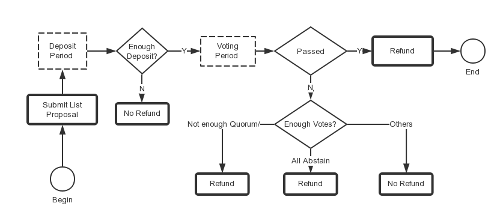

# Governance

## Primer on Governance

Beacon Chain  has its own built-in governance module that lets BNB holders submit proposals for adding trade pairs. In order for the proposal to be open for voting, it needs to come with a `deposit` that is greater than a parameter called `Deposit`. The `deposit` need not be provided in its entirety by the submitter. If the initial proposer's `deposit` is not sufficient, the proposal enters the `deposit_period` status. Then, any BNB holder can increase the deposit by sending a `depositTx`.
A purely-code-controlled escrow account will be used to hold deposits during voting period. It is a kind of account which is derived from a hard-coded string in Beacon Chain  protocol. This kind of account doesn't have its own private key and it's only controlled by code of the protocol. The code for calculating escrow account is the same that is used in [cosmos-sdk](https://github.com/cosmos/cosmos-sdk/blob/82a2c5d6d86ffd761f0162b93f0aaa57b7f66fe7/x/supply/internal/types/account.go#L40):
```
DepositedCoinsAccAddr = sdk.AccAddress(crypto.AddressHash([]byte("BinanceChainDepositedCoins")))
```
The account for mainnet is: **bnb1vu5max8wqn997ayhrrys0drpll2rlz4dh39s3h** and the account for testnet is: **tbnb1vu5max8wqn997ayhrrys0drpll2rlz4deyv53x**. Once the swap is claimed or refunded, the fund will be transferred from the purely-code-controlled escrow account to client accounts.

## Proposal Workflow


### Global Parameters
* `min-deposit`: The threshold for submitting a proposal on mainnet is **1000BNB**, and the threshold for submitting a proposal on testnet is **2000BNB**
* `deposit_period`: This is a global parameter and the value for mainnet is two days and testnet is two week. It means the time to deposit enough BNB tokens is two days in mainnet and two weeks in testnet.
* `fee`: Checkout the fee of governance-related transactions [here](trading-spec.md)

### Proposal Parameters
* `deposit` : your input must be larger than `min-deposit`.
* `voting-period`: This is the time for validators to vote, your input in seconds, if you omit this field, the default voting period is one week.
* `expire-time`: This is the time for you to send list transaction if your proposal passed. This time cannot be earlier than current time.

### Participate in Governance
#### Tools

Please use this [tool](<https://github.com/bnb-chain/node-binary/tree/master/tools>) for generating

You can also use [Web Wallet](https://community.binance.org/topic/2487/how-to-manage-your-bep2-token-on-binance-chain-in-web-wallet) for token management operations.

#### Submit a List Proposal
To add a new trading pairs, you can run the following command:<br/>
Please note:<br/>

+ `--init-price` is boosted by **1e8** for decimal part, such as 100000000, is 1 BNB
+ `--from`: put your key name for the address / key, you can only list with the owners address of your token.
+ `--expire-time`: expire time is the deadline after which you will no longer be able to list your token though your proposal is passed.
+ `--voting-period`: The voting period is for validators to vote. The unit is in seconds and the default voting period is one week. The max voting period is two weeks. The votes from validators will be tallied after the voting period ends.
+ `--title`: title of proposal
+ `--quote-asset-symbol`: the quote asset symbol. When you first list a BEP2 token on Binance DEX, it has to be put in BNB market first. Thus, you should set `quote-asset-symbol` to **BNB** in your first proposal, then your BEP2 asset can be list against [BUSD-BD1](https://explorer.binance.org/asset/BUSD-BD1) and other stablecoins.
+ `--base-asset-symbol`: the asset symbol you want to list

Please note that the deposit and init-price are boosted by **1e8** for decimal part.

Example on **mainnet**:

```shell
./bnbcli gov submit-list-proposal --from test --deposit 100000000000:BNB
--base-asset-symbol AAA-254 --quote-asset-symbol BNB --init-price 100000000 --title "list AAA-254/BNB"
--description "list AAA-254/BNB" --expire-time 1570665600 --chain-id Binance-Chain-Tigris --node https://dataseed5.defibit.io:443 --voting-period 604800 --json
```

Example on **testnet**:

```shell
./tbnbcli gov submit-list-proposal --from test --deposit 200000000000:BNB
--base-asset-symbol AAA-254 --quote-asset-symbol BNB --init-price 100000000 --title "list AAA-254/BNB"
--description "list AAA-254/BNB" --expire-time 1570665600 --chain-id=Binance-Chain-Ganges --node=data-seed-pre-2-s1.binance.org:80 --json --voting-period 604800
```
!!! Tip
        As discussed in [BEP-70](https://github.com/bnb-chain/BEPs/blob/master/BEP70.md), BUSD is one of the most influential stable coins worldwide and the most dominant stable coin on Beacon Chain . BEP2 token issuers can list their assets against [BUSD-BD1](https://explorer.binance.org/asset/BUSD-BD1) without the requirement of creating BNB pair first. Listing and trading BUSD pairs on Beacon Chain  will facilitate token owners and exchange traders, making the markets more liquid and healthier.  BEP70 is already implemented and has been activated after Testnet Nightingale Upgrade. Beacon Chain  Mainnet will be upgraded to support BEP-70 soon.

#### Submit a Delist Proposal
In testnet, only validators can make a delist proposal. To add a new delist pairs, a validator can run the following command:<br/>

Please note:

+ `--quote-asset-symbol`: the quote asset symbol
+ `--base-asset-symbol`: the asset symbol you want to delist
+ `--from`: put your key name for the address key, you can only list with the owners address of your token.
+ `--voting-period`: The voting period is for validators to vote. The unit is in seconds and the default voting period is one week. The max voting period is two weeks. The votes from validators will be tallied after the voting period ends.
+ `--justification`: reason for proposal
+ `--depodit`: this field will indicate how much tokens will be used as deposit for this proposal. Governance module will transfer deposit tokens to a purely-code-controlled escrow account and before the lock time expires. The account for mainnet is:*bnb1vu5max8wqn997ayhrrys0drpll2rlz4dh39s3h*  and the account for testnet is: *tbnb1vu5max8wqn997ayhrrys0drpll2rlz4deyv53x*

Example on **mainnet**:

```shell
bnbcli gov submit-delist-proposal --title "delist EDD-0AC" --voting-period 7200 --deposit "200000000000:BNB" --justification " justification " --base-asset-symbol EDD-0AC --quote-asset-symbol BNB --from <your-key-name> --chain-id Binance-Chain-Tigris --node https://dataseed5.defibit.io:443 --trust-node
```


Example on **testnet**:

```shell
tbnbcli gov submit-delist-proposal --title "delist EDD-0AC" --voting-period 7200 --deposit "200000000000:BNB" --justification " justification " --base-asset-symbol EDD-0AC --quote-asset-symbol BNB --from <your-key-name> --chain-id Binance-Chain-Ganges --trust-node --node https://seed-pre-s3.binance.org:443
```

#### Add deposit for a Proposal (Optional)
If the initial deposit for your proposal in `submit-list-proposal` is not enough, you can increase the deposit with `deposit` operation. In current Beacon Chain  Mainnet, the max deposit period is **two days**. After submitting a proposal, you have two days to increase your deposit, otherwise your proposal will not go into the voting period and gets rejected directly.

Please note the amount is boosted by **1e8** for decimal part.

Example on **mainnet**:

```shell
bnbcli gov deposit --from name --proposal-id <proposl-ID> --deposit <amount>:BNB --chain-id Binance-Chain-Tigris --node https://dataseed5.defibit.io:443
```

Example on **testnet**:

```shell
tbnbcli gov deposit --from name --proposal-id <proposl-ID> --deposit <amount>:BNB --chain-id=Binance-Chain-Ganges --node=data-seed-pre-2-s1.binance.org:80
```

#### Query Information of a Proposal
To see detailed information of specific proposal, you can run the following command:

Example on **mainnet**:

```shell
./bnbcli gov query-proposal --proposal-id <proposal-ID> --chain-id Binance-Chain-Tigris --node https://dataseed5.defibit.io:443
```

Example on **testnet**:

```shell
./tbnbcli gov query-proposal --proposal-id <proposal-ID> --chain-id=Binance-Chain-Ganges --node=data-seed-pre-2-s1.binance.org:80
```

Example output:
```json
{
  "type": "gov/TextProposal",
  "value": {
    "proposal_id": "100",
    "title": "list CZZ-696/BNB",
    "description": "{\"base_asset_symbol\":\"CZZ-696\",\"quote_asset_symbol\":\"BNB\",\"init_price\":100000000,\"description\":\"list CZZ-696/BNB\",\"expire_time\":\"2019-03-21T09:00:00+09:00\"}",
    "proposal_type": "ListTradingPair",
    "proposal_status": "Passed",
    "tally_result": {
      "yes": "1100000000000",
      "abstain": "0",
      "no": "0",
      "no_with_veto": "0"
    },
    "submit_time": "2019-03-07T20:49:03.504103408Z",
    "total_deposit": [
      {
        "denom": "BNB",
        "amount": "200000000000"
      }
    ],
    "voting_start_time": "2019-03-07T21:01:36.159585594Z"
  }
}
```
You can get the information about the proposal's status and its tally result this way.

#### Query votes of a Proposal
You can track the votes for your proposal with the following command:

Example on **mainnet**:

```shell
./bnbcli gov query-votes --proposal-id 272 --chain-id Binance-Chain-Tigris --node https://dataseed5.defibit.io:443
```

Example on **testnet**:

```shell
./tbnbcli gov query-votes --proposal-id 272 --chain-id=Binance-Chain-Ganges --node=data-seed-pre-2-s1.binance.org:80
```

Example output:
```json
[
  {
    "voter": "tbnb1q82g2h9q0kfe7sysnj5w7nlak92csfjztymp39",
    "proposal_id": "272",
    "option": "Yes"
  },
  {
    "voter": "tbnb1r6l0c0fxu458hlq6m7amkcltj8nufyl9mr2wm5",
    "proposal_id": "272",
    "option": "Yes"
  },
  {
    "voter": "tbnb193t8pkhm2sxw5uy5ypesygda8rzsk25ge3e9y7",
    "proposal_id": "272",
    "option": "Yes"
  },
  {
    "voter": "tbnb183nch8pn3f698vurrqypq3s254slcane2t66aj",
    "proposal_id": "272",
    "option": "Yes"
  },
  {
    "voter": "tbnb12hlquylu78cjylk5zshxpdj6hf3t0tahwjt3ex",
    "proposal_id": "272",
    "option": "Yes"
  },
  {
    "voter": "tbnb1vehecekrsks5sshcwvxyeyrd469j9wvcqm37yu",
    "proposal_id": "272",
    "option": "Yes"
  },
  {
    "voter": "tbnb108drn8exhv72tp40e6lq9z949nnjj54yzqrr2f",
    "proposal_id": "272",
    "option": "Yes"
  },
  {
    "voter": "tbnb135mqtf9gef879nmjlpwz6u2fzqcw4qlzrqwgvw",
    "proposal_id": "272",
    "option": "Yes"
  },
  {
    "voter": "tbnb1hexqyu3m8uuudqdnnpnsnlwe6xg0n3078lx68l",
    "proposal_id": "272",
    "option": "Yes"
  },
  {
    "voter": "tbnb1earfwcjre04hp7phqnkw8ts04tkumdn0cyzun0",
    "proposal_id": "272",
    "option": "Yes"
  },
  {
    "voter": "tbnb167yp9jkv6uaqnyq62gfkx82xmfny0cl9xe04zj",
    "proposal_id": "272",
    "option": "Yes"
  }
]
```

## Key Notions

#### Vote options
There are four vote options:
- `Yes`
- `No`
- `NoWithVeto`
- `Abstain`

`No` represents the validator is against this proposal and `NoWithVeto` suggests the validator is strongly against
this proposal.<br/>
`Abstain` option allows voters to signal that they do not intend to vote in favor or against
the proposal but accept the result of the vote.

#### Quorum

Quorum is defined as the minimum percentage of voting power that needs to be casted on a proposal for the result to
be valid, which is 0.5(50%) now.

If voting power does not reach quorum at the end of the voting period, the proposal will be rejected and all deposits
will be returned to depositors' addresses.

**Note**: There is a special case when all votes are `Abstain` and voting power is superior to 50%, the proposal will be rejected and all deposits will be refunded.

#### Veto

Veto is defined as the minimum proportion of `NoWithVeto` votes for the proposal to be rejected, which is 0.334(1/3) now. If more than 1/3 voters veto, the proposal will be rejected and all deposits will be distributed to validator.

#### Threshold

Threshold is defined as the minimum proportion of `Yes` votes (excluding `Abstain` votes) for the proposal to be accepted, which is 0.5(50%) now.

If the proportion of `NoWithVeto` votes is inferior to 1/3 and the proportion of `Yes` votes (excluding `Abstain` votes) is superior to 50%, the proposal will be accepted and all deposits will be returned. Otherwise, the proposal will be rejected and all deposits will be distributed to validator.

#### Tally Result Example

You can query a proposal via `bnbcli`.

```bash
$ ./bnbcli gov query-proposal --chain-id Binance-Chain-Ganges --node=tcp://data-seed-pre-1-s3.binance.org:80 --proposal-id 370
{
  "type": "gov/TextProposal",
  "value": {
    "proposal_id": "370",
    "title": "list JCC-CB1/BNB",
    "description": "{\"base_asset_symbol\":\"JCC-CB1\",\"quote_asset_symbol\":\"BNB\",\"init_price\":100000000,\"description\":\"list JCC-CB1/BNB\",\"expire_time\":\"2019-04-24T14:46:35+08:00\"}",
    "proposal_type": "ListTradingPair",
    "voting_period": "604800000000000",
    "proposal_status": "Passed",
    "tally_result": {
      "yes": "1100000000000",
      "abstain": "0",
      "no": "0",
      "no_with_veto": "0",
      "total": "1100000000000"
    },
    "submit_time": "2019-04-10T06:49:11.568747217Z",
    "total_deposit": [
      {
        "denom": "BNB",
        "amount": "200000000000"
      }
    ],
    "voting_start_time": "2019-04-10T06:52:00.064744275Z"
  }
}
```

You can get `tally result` and `proposal_status`.<br/>

For options in `tally result`:

- `yes` denotes voting power votes `Yes`
- `abstain` denotes voting power votes `Abstain`
- `no` denotes voting power votes `No`
- `no_with_veto` denotes voting power votes `NoWithVeto`
- `total` denotes total voting power when voting period ends

We can calculate proportion of each vote option easily.<br/>
In this case, total voting power is 1100000000000 and voting power of `Yes` is 1100000000000,
so the proportion of `Yes` is 100% and the proposal should be passed and and your deposit will be returned.

**Note:** Trying to query proposal that didn't enter the voting period will result in `error`.

```bash
$ ./bnbcli gov query-proposal --chain-id Binance-Chain-Tigris --node https://dataseed5.defibit.io:443 --proposal-id 25
{
  "codespace": 5,
  "code": 1,
  "abci_code": 327681,
  "message": "Unknown proposal with id 25"
}
```
