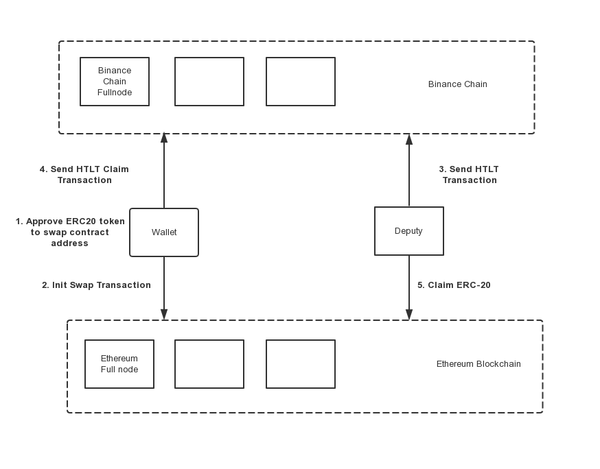
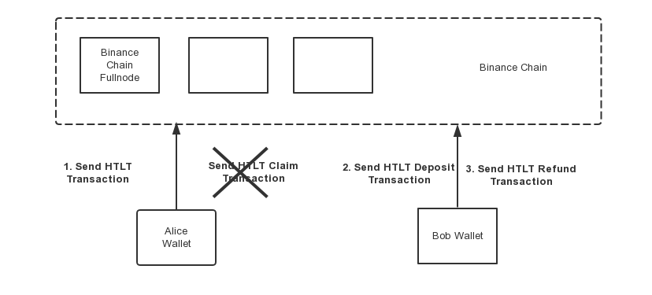

# Cross-chain Atomic Swaps

## Atomic Swap

The problem of an atomic swap is one where (at least) two parties, Alice and Bob, own coins, and want to exchange them without having to trust a third party (centralized exchange).

A non-atomic trivial solution would have Alice send her coins to Bob, and then have Bob send other coins to Alice - but Bob has the option of going back on his end of the bargain and simply not following through with the protocol, ending up with both sets of coins.

Atomic swaps can be used for trading between BEP2 tokens, or for trading crosss different blockchains.

## Hash Timer Locked Contract

[HTLC](https://en.bitcoin.it/wiki/Hash_Time_Locked_Contracts) has been used for Atomic Swap and cross payment channel for a few years on Bitcoin and its variant blockchains, and also Ethereum. This BEP defines native transactions to support HTLC on Beacon Chain , and also proposes the standard infrastructure and procedure to use HTLC for inter-chain atomic swap to easily create and use pegged token, which is called `Atomic Peg`.

## HTLC on Beacon Chain 


As explained in [BEP3](https://github.com/bnb-chain/BEPs/blob/master/BEP3.md), Hash Timer Locked Contract(HTLC) has been used for Atomic Swap and cross payment channels between different blockchains. BEP3 defines native transactions to support HTLC on Beacon Chain  and also proposes the standard infrastructure and procedure to use HTLC for inter-chain atomic swap to easily create and use pegged token.
During the swap process, the related fund will be locked to a purely-code-controlled escrow account.
A purely-code-controlled escrow account is a kind of account which is derived from a hard-coded string in Beacon Chain  protocol. This kind of account has no its own private key and it's only controled by code in protocol. The code for calculating escrow account is the same as how it's done in [cosmos-sdk](https://github.com/cosmos/cosmos-sdk/blob/82a2c5d6d86ffd761f0162b93f0aaa57b7f66fe7/x/supply/internal/types/account.go#L40):
```
AtomicSwapCoinsAccAddr = sdk.AccAddress(crypto.AddressHash([]byte("BinanceChainAtomicSwapCoins")))
```
The account for mainnet is: **bnb1wxeplyw7x8aahy93w96yhwm7xcq3ke4f8ge93u** and the account for testnet is: **tbnb1wxeplyw7x8aahy93w96yhwm7xcq3ke4ffasp3d**. Once the swap is claimed or refunded, the fund will be transfered from the purely-code-controlled escrow account to client accounts.


### Hash Timer Locked Transfer

Hash Timer Locked Transfer (HTLT) is a new transaction type on Beacon Chain , to serve as HTLC in the first step of Atomic Swap,


#### Parameters
| Name | Type | Description | Optional |
| -----| ---- | ----------- | -------- |
| From | Address | Sender address, where the asset is from | No |
| recipient-addr | Address | Receiver address, where the asset is to, if the proper condition meets. | No |
| recipient-other-chain | bytes | a byte array, maximum 32 bytes, in any proper encoding. leave it empty for single chain swap | Yes |
| sender-other-chain | bytes | a byte array, maximum 32 bytes, in any proper encoding. leave it empty for single chain swap | Yes |
| RandomNumberHash | 32 bytes | hash of a random number and timestamp, based on SHA256. If left out, a random value will be generated | True |
| Timestamp | int64 | Supposed to be the time of sending transaction, counted by second. It should be identical to the one in swap contract. If left out, current timestamp will be used. | No |
| OutAmount | Coins | similar to the Coins in the original Transfer defined in BEP2, assets to swap out | No |
| ExpectedIncome | string | Expected income from swap counter party, example: "100:BNB" or "100:BNB,10000:BTCB-1DE" The amount needs to be bumped by e^8 | No |
| HeightSpan | int64   | number of blocks to wait before the asset may be returned to From if not claimed via Random. The number must be larger than or equal to 360 (>2 minutes), and smaller than 518400 (< 48 hours) | No  |
| CrossChain | bool   | Specify if the HTLT is for cross chain atomic swap | True, the default value is False |

#### Outputs
| Name | Type | Description |
| -----| ---- | ----------- |
|Random number|32 bytes||
|Timestamp|int64||
|Random number hash|32 bytes||
|Swap ID|32 bytes||

#### Examples

1. Swap between BEP2 tokens

* On *testnet*:

Command line
```shell
./tbnbcli token HTLT --recipient-addr <recipient-addr> --amount 100:BNB --expected-income <expectedIncome> --height-span <heightSpan> --from <from-addr> --chain-id Binance-Chain-Ganges --trust-node --node http://data-seed-pre-0-s3.binance.org:80
```

Javascript
```javascript
  const client = new BncClient("https://testnet-dex.binance.org")
  const privateKey = crypto.getPrivateKeyFromMnemonic(mnemonic)
  client.setPrivateKey(privateKey)
  const from = "tbnb1hgm0p7khfk85zpz5v0j8wnej3a90w709zzlffd"// sender address
  const recipient = "tbnb1prrujx8kkukrcrppklggadhuvegfnx8pemsq77"// recipient address
  const randomNumber = "e8eae926261ab77d018202434791a335249b470246a7b02e28c3b2fb6ffad8f3"// 32 bytes random number
  const timestamp = Math.floor(Date.now()/1000)// take the current timestamp
  const randomNumberHash = calculateRandomNumberHash(randomNumber, timestamp)
  const amount = [{
    denom: "BNB",
    amount: 100
  }]
  const expectedIncome = "100:BNB"// expected income
  const heightSpan = 400// height span
  const res = client.swap.HTLT(from, recipient, "", "", randomNumberHash, timestamp, amount, expectedIncome, heightSpan, false)
```

**Example output:**

Please take a note of returned `swapID`:

```
Random number: 927c1ac33100bdbb001de19c626a05a7c3c11304fc825f5eabb22e741507711b
Timestamp: 1568792486
Random number hash: 5768702259ee55983378d7b8207890c666648264524b9dada551386f832ba6b1
Password to sign with 'guest':
Committed at block 39984169 (
tx hash: B5A3DD92A40E98745BBE9F608944FE5511B81071B34E9947A754A04A5F378A85,
response: {
	Code:0
	Data:[77 137 139 200 85 141 170 77 129 116 134 215 169 59 119 178 200 47 206 194 18 58 191 74 30 183 210 82 18 55 236 205]
	Log:Msg 0: swapID: 4d898bc8558daa4d817486d7a93b77b2c82fcec2123abf4a1eb7d2521237eccd
	Info: GasWanted:0 GasUsed:0
	...
)
```

Besides, the `Data` field in the committed result is the byte array of `swapID`:

```
Data:[77 137 139 200 85 141 170 77 129 116 134 215 169 59 119 178 200 47 206 194 18 58 191 74 30 183 210 82 18 55 236 205]

swapID: 4d898bc8558daa4d817486d7a93b77b2c82fcec2123abf4a1eb7d2521237eccd
```

2. Swap from Beacon Chain  to Ethereum

* Clients send HTLT on Beacon Chain  on *testnet*:

Command line:
```shell
./tbnbcli token HTLT --from <from-addr> --chain-id Binance-Chain-Ganges  --height-span <heightSpan> --amount <amount> --expected-income <expectedIncome> --recipient-addr <deputy-bep2-addr>  --recipient-other-chain <client ethereum address>  --cross-chain --trust-node --node http://data-seed-pre-0-s3.binance.org:80
```

Javascript:
```javascript
  const client = new BncClient("https://testnet-dex.binance.org")
  const privateKey = crypto.getPrivateKeyFromMnemonic(mnemonic)
  client.setPrivateKey(privateKey)
  const from = "tbnb1hgm0p7khfk85zpz5v0j8wnej3a90w709zzlffd"// sender address
  const recipient = "tbnb1prrujx8kkukrcrppklggadhuvegfnx8pemsq77"// recipient address
  const recipientOtherChain="0x37B8516a0F88E65D677229b402ec6C1e0E333004"//client ethereum address
  const randomNumber = "e8eae926261ab77d018202434791a335249b470246a7b02e28c3b2fb6ffad8f3"// 32 bytes random number
  const timestamp = Math.floor(Date.now()/1000)// take the current timestamp
  const randomNumberHash = calculateRandomNumberHash(randomNumber, timestamp)
  const amount = [{
    denom: "BNB",
    amount: 100
  }] // swap out token amount
  const expectedIncome = "100:BNB"// expected income
  const heightSpan = 400 // height span
  const res = client.swap.HTLT(from, recipient, recipientOtherChain, "", randomNumberHash, timestamp, amount, expectedIncome, heightSpan, true)
```

3. Swap from Ethereum to Beacon Chain 

> Note: Once cross-chain is true, --recipient-other-chain must not be empty

* Deputy send HTLT on Beacon Chain  on *testnet*:

Command line:
```shell
./tbnbcli token HTLT --from  <from-addr> --chain-id Binance-Chain-Ganges --height-span  <heightSpan>  --amount <amount> --expected-income <expectedIncome> --recipient-other-chain <deputy ethereum address> --sender-other-chain <client ethereum address> --recipient-addr <client bep2 address> --cross-chain --trust-node --node http://data-seed-pre-0-s3.binance.org:80
```

Javascript:
```javascript
  const client = new BncClient("https://testnet-dex.binance.org")
  const privateKey = crypto.getPrivateKeyFromMnemonic(mnemonic)
  client.setPrivateKey(privateKey)
  const from = "tbnb1hgm0p7khfk85zpz5v0j8wnej3a90w709zzlffd"// sender address
  const recipient = "tbnb1prrujx8kkukrcrppklggadhuvegfnx8pemsq77"// recipient address
  const recipientOtherChain="0xfA5E36a04EeF3152092099F352DDbe88953bB540"//client ethereum address
  const senderOtherChain="0x37B8516a0F88E65D677229b402ec6C1e0E333004" //client ethereum address
  const randomNumberHash = "6632eda86c4f19190c8a986e188526eee865e1ce2758ba59c8bf45e20ffa3bb5" //deputy get this value from the event log of swap contract
  const timestamp = 1571383800 //deputy get this value from the event log of swap contract
  const amount = [{
    denom: "BNB",
    amount: 100
  }] // swap out token amount
  const expectedIncome = "100:BNB"// expected income
  const heightSpan = 400 // height span
  const res = client.swap.HTLT(from, recipient, recipientOtherChain, senderOtherChain, randomNumberHash, timestamp, amount, expectedIncome, heightSpan, true)
```

### Deposit HTLT

Deposit Hash Timer Locked Transfer is to lock new BEP2 asset to an existed HTLT which is for single chain atomic swap.

#### Parameters

| Name | Type | Description | Optional |
| -----| ---- | ----------- | -------- |
| From | Address | Sender address, where the assets are from | No |
| SwapID | 32 bytes | ID of previously created swap, hex encoding | No |
| Amount | Coins | The swapped out amount BEP2 tokens, example: "100:BNB" or "100:BNB,10000:BTCB-1DE" | No |

#### Examples

* On testnet:

Command line:
```shell
./tbnbcli token deposit --swap-id <swapID>  --amount 10000:TEST-599 --from <from-key> --chain-id Binance-Chain-Ganges --trust-node --node http://data-seed-pre-0-s3.binance.org:80
```

Javascript:
```javascript
  const client = new BncClient("https://testnet-dex.binance.org")
  const privateKey = crypto.getPrivateKeyFromMnemonic(mnemonic)
  client.setPrivateKey(privateKey)
  const from = "tbnb1hgm0p7khfk85zpz5v0j8wnej3a90w709zzlffd"// sender address
  const swapID = "61daf59e977c5f718f5aaedeaf69ccbea1c376db5274a84bca88848696164ffe" // the ID of an existing swap
  const amount = [{
    denom: "TEST-599",
    amount: 10000
  }]
  const res = client.swap.depositHTLT(from, swapID, amount)
```

Example output

```
Committed at block 39984686 (tx hash: AA118F7CFCB3FFF86EF5EED8D2B9ADEAC5D9F242497910DAA232BDE5F6A84C1E, response: {Code:0 Data:[] Log:Msg 0:  Info: GasWanted:0 GasUsed:0 Tags:[{Key:[115 101 110 100 101 114] Value:[116 98 110 98 49 110 107 120 57 57 52 113 118 113 109 113 103 107 53 55 118 103 117 113 104 54 122 106 108 97 99 113 122 120 100 107 117 101 53 122 106 121 120] XXX_NoUnkeyedLiteral:{} XXX_unrecognized:[] XXX_sizecache:0} {Key:[114 101 99 105 112 105 101 110 116] Value:[116 98 110 98 49 119 120 101 112 108 121 119 55 120 56 97 97 104 121 57 51 119 57 54 121 104 119 109 55 120 99 113 51 107 101 52 102 102 97 115 112 51 100] XXX_NoUnkeyedLiteral:{} XXX_unrecognized:[] XXX_sizecache:0} {Key:[97 99 116 105 111 110] Value:[100 101 112 111 115 105 116 72 84 76 84] XXX_NoUnkeyedLiteral:{} XXX_unrecognized:[] XXX_sizecache:0}] Codespace: XXX_NoUnkeyedLiteral:{} XXX_unrecognized:[] XXX_sizecache:0})
```

After the deposit, you may observe that the balance of sender is decreased. The amount in deposit transaction must be positive. Besides, you can query the swap by `swapID` and the `in_amount` must equal to the amount that you balance decreased.

### Claim HTLT

Claim Hash Timer Locked Transfer is to claim the locked asset by showing the random number value that matches the hash. Each HTLT locked asset is guaranteed to be release once.

#### Parameters

| Name | Type | Description | Optional |
| -----| ---- | ----------- | -------- |
| From | Address | Sender address | No |
| SwapID | 32 bytes |  ID of previously created swap, hex encoding | No |
| RandomNumber | 32 bytes | The random number to unlock the locked hash, 32 bytes, hex encoding | No |

#### Examples

* On testnet:

Command line:
```shell
./tbnbcli token claim --swap-id  <swapID> --random-number <random-number> --from <from-key> --chain-id Binance-Chain-Ganges --trust-node --node http://data-seed-pre-0-s3.binance.org:80
```

Javascript:
```javascript
  const client = new BncClient("https://testnet-dex.binance.org")
  const privateKey = crypto.getPrivateKeyFromMnemonic(mnemonic)
  client.setPrivateKey(privateKey)
  const swapID = "61daf59e977c5f718f5aaedeaf69ccbea1c376db5274a84bca88848696164ffe" // the ID of an existing swap
  const randomNumber = "e8eae926261ab77d018202434791a335249b470246a7b02e28c3b2fb6ffad8f3" // the random number generated in htlt
  const res = client.swap.claimHTLT(from, swapID, randomNumber)
```

Example output:

```
Committed at block 39984971 (tx hash: 15B8625E0247DE54700D3C5C110BE0CE279D33CC13A73845F3E0305758A40902, response: {Code:0 Data:[] Log:Msg 0:  Info: GasWanted:0 GasUsed:0 Tags:[{Key:[115 101 110 100 101 114] Value:[116 98 110 98 49 119 120 101 112 108 121 119 55 120 56 97 97 104 121 57 51 119 57 54 121 104 119 109 55 120 99 113 51 107 101 52 102 102 97 115 112 51 100] XXX_NoUnkeyedLiteral:{} XXX_unrecognized:[] XXX_sizecache:0} {Key:[114 101 99 105 112 105 101 110 116] Value:[116 98 110 98 49 110 107 120 57 57 52 113 118 113 109 113 103 107 53 55 118 103 117 113 104 54 122 106 108 97 99 113 122 120 100 107 117 101 53 122 106 121 120] XXX_NoUnkeyedLiteral:{} XXX_unrecognized:[] XXX_sizecache:0} {Key:[115 101 110 100 101 114] Value:[116 98 110 98 49 119 120 101 112 108 121 119 55 120 56 97 97 104 121 57 51 119 57 54 121 104 119 109 55 120 99 113 51 107 101 52 102 102 97 115 112 51 100] XXX_NoUnkeyedLiteral:{} XXX_unrecognized:[] XXX_sizecache:0} {Key:[114 101 99 105 112 105 101 110 116] Value:[116 98 110 98 49 103 57 114 122 99 48 101 50 106 102 56 101 102 51 113 112 57 97 120 56 104 48 112 109 112 109 118 106 122 119 109 116 113 52 106 120 102 114] XXX_NoUnkeyedLiteral:{} XXX_unrecognized:[] XXX_sizecache:0} {Key:[97 99 116 105 111 110] Value:[99 108 97 105 109 72 84 76 84] XXX_NoUnkeyedLiteral:{} XXX_unrecognized:[] XXX_sizecache:0}] Codespace: XXX_NoUnkeyedLiteral:{} XXX_unrecognized:[] XXX_sizecache:0})
```

### Refund HTLT

Refund Hash Timer Locked Transfer is to refund the locked asset after timelock is expired.

#### Parameters

| Name | Type | Description | Optional |
| -----| ---- | ----------- | -------- |
| From | Address | Sender address | No |
| SwapID | 32 bytes | ID of previously created swap, hex encoding | No |

#### Examples

* On testnet:

Command line:
```shell
./tbnbcli token refund --swap-id <swapID> --from <from-key>  --chain-id Binance-Chain-Ganges --trust-node --node http://data-seed-pre-0-s3.binance.org:80
```

Javascript:
```javascript
  const client = new BncClient("https://testnet-dex.binance.org")
  const privateKey = crypto.getPrivateKeyFromMnemonic(mnemonic)
  client.setPrivateKey(privateKey)
  const swapID = "61daf59e977c5f718f5aaedeaf69ccbea1c376db5274a84bca88848696164ffe" // the ID of an existing swap
  const res = client.swap.refundHTLT(from, swapID, randomNumber)
```

Common error:

* Already complete
```shell
ERROR: {"codespace":8,"code":12,"abci_code":524300,"message":"Expected swap status is Open, actually it is Completed"}
```
* Not expired
```json
ERROR: {"codespace":8,"code":8,"abci_code":524296,"message":"Current block height is 40003412, the expire height (40013236) is still not reached"}
```

### Query Atomic Swap

Query atomic swap allows you to search swap information by `swapID`

#### Parameters

| Name | Type | Description | Optional |
| -----| ---- | ----------- | -------- |
| SwapID | 32 bytes | ID of previously created swap, hex encoding | No |

#### Examples

* On testnet:
```
./tbnbcli token query-swap --swap-id <swapID> --chain-id Binance-Chain-Ganges --trust-node --node http://data-seed-pre-0-s3.binance.org:80
```
Expected output
```json
{
  "from": "tbnb1g9rzc0e2jf8ef3qp9ax8h0pmpmvjzwmtq4jxfr",
  "to": "tbnb1nkx994qvqmqgk57vguqh6zjlacqzxdkue5zjyx",
  "out_amount": [
    {
      "denom": "BNB",
      "amount": "100"
    }
  ],
  "in_amount": [
    {
      "denom": "TEST-599",
      "amount": "10000"
    }
  ],
  "expected_income": "10000:TEST-599",
  "recipient_other_chain": "",
  "random_number_hash": "5768702259ee55983378d7b8207890c666648264524b9dada551386f832ba6b1",
  "random_number": "927c1ac33100bdbb001de19c626a05a7c3c11304fc825f5eabb22e741507711b",
  "timestamp": "1568792486",
  "cross_chain": false,
  "expire_height": "39994169",
  "index": "53",
  "closed_time": "1568792927",
  "status": "Completed"
}
```
### Query Atomic Swap ID By Recipient

Query atomic swap ID allows you to search swap history of an recipient. As this is a heavy query interface, some public nodes might close this query interface.

#### Parameters

| Name | Type | Description | Optional |
| -----| ---- | ----------- | -------- |
| recipient-addr | Address | Swap recipient address | No |

#### Examples

* On testnet:
```
./tbnbcli token query-swapIDs-by-recipient  --recipient-addr <address> --chain-id Binance-Chain-Ganges --trust-node --node http://data-seed-pre-0-s3.binance.org:80
```

Example output:
```
[
  "4d898bc8558daa4d817486d7a93b77b2c82fcec2123abf4a1eb7d2521237eccd",
  "e7cc2e2eb025cc4617ff0bb84fcffc973d7ba34f15dbc51383fe3543ff143e9c"
]
```

### Query Atomic Swap ID By Creator

Query atomic swap ID allows you to search swap history of an initiator. As this is a heavy query interface, some public nodes might close this query interface.

#### Parameters

| Name | Type | Description | Optional |
| -----| ---- | ----------- | -------- |
| creator-addr | Address | Swap creator address | No |

#### Examples

* On testnet:
```
./tbnbcli token query-swapIDs-by-creator  --creator-addr <address> --chain-id Binance-Chain-Ganges --trust-node --node http://data-seed-pre-0-s3.binance.org:80
```

Example output:
```
[
  "7341d4ea0519af90d98f60fee45fdc7e385621875ea982bc8caf1fd7a49af8c3",
  "290664c1e8123966d8f9050fdc9d93e94b0e51b36e2e2a6978e492d3796423f1",
  "b260dad3cf63e558fe102a050afbe52d5dd2e30c7db76da33d02ce5f85d07fcf",
  "2b532bf9171c4d33d80fc4a8d6603581a86345b41552337482224d8476fcf5f7",
  "20d22bbfa579520f0ba79cd176fb2b06aa8dbe5b0a6ba8c9b761129f6a42a94c"
]
```


## Fees

Transaction Type | Pay in Non-BNB Asset | Pay in BNB | Exchange (DEX) Related
-- | -- | -- | --
HTLT | N/A |  0.000375 BNB | Y
depositHTLT | N/A |  0.000375 BNB | Y
claimHTLT | N/A |  0.000375 BNB | Y
refundHTLT | N/A |  0.000375 BNB | Y


## Workflows

### Preparations

1. Deploy smart-contract which supports Atomic Peg Swap (APS), there is  already [one example](https://github.com/bnb-chain/bep3-smartcontracts) for Ethereum
2. Deploy `deputy` process for handling swap activities by token owners, there is an existing open-source solution here: <https://github.com/bnb-chain/bep3-deputy>
3. Issue and transfer enough tokens

### Testnet Deployment

* ERC20 contract has been deployed here: <https://ropsten.etherscan.io/address/0xd93395b2771914e1679155f3ea58c41d89d96098>
* Token Symbol: **PPC**
* SmartContract has been deployed here:  <https://ropsten.etherscan.io/address/0x12dcbf79be178479870a473a99d91f535ed960ad>
* Its corresponding address on testnet is: `tbnb1pk45lc2k7lmf0pnfa59l0uhwrvpk8shsema7gr`on Beacon Chain  and `0xD93395B2771914E1679155F3EA58C41d89D96098` on Ethereum testnet

### Swap Tokens from Ethereum to Beacon Chain 

#### 1.  Approve Swap Transaction

Go to [this page](https://ropsten.etherscan.io/address/0xd93395b2771914e1679155f3ea58c41d89d96098#writeContract) and approve some amount of tokens.

 * Function: *Approve*
 * Prameters:
     * _spender: address of smartcontract, which is `0x12DCBf79BE178479870A473A99d91f535ed960AD`
     * _value: approved amount, should be bumped by e^10

> Note: Please approve more than 1token.  In the following example, 100 PPC token was approved:

Example of approve 100 PPC on [ropsten testnet](https://ropsten.etherscan.io/tx/0xfa640b382d3842cf508ac347090d2550e35e2193804d2a9318fbbdcdd54c846b)
#### 2. Call `HTLT` function From Ethereum

Go to [smartcontract](https://ropsten.etherscan.io/address/0xd93395b2771914e1679155f3ea58c41d89d96098#writeContract) and call `HTLT` function

 * Function: *htlt*
 * Prameters:
      * _randomNumberHash: SHA256(randomNumber||timestamp), randomNumber is 32-length random byte array
      * _timestamp: it should be about 10 mins span around current timestamp
      * _heightSpan: it's a customized filed for deputy operator. it should be more than 200 for this deputy.
      * _recipientAddr: deputy address on Ethereum, it's `0x1C002969Fe201975eD8F054916b071672326858e` for this one
      * _bep2SenderAddr: omit this field with `0x0`
      * _bep2RecipientAddr: Decode your testnet address from bech32 encoded to hex, for example: 0xc41f2a85e1d3629637de1222017dce46c6c8e4b9
      * _outAmount:  approved amount, should be bumped by e^10
      * _bep2Amount: _outAmount * exchange rate, the default rate is 1

Example of `htlt` [transaction](https://ropsten.etherscan.io/tx/0xa2444cc1e52e09027ec68bf8955e7084235255f9f18d9b837a12fd63e6f0145c)

#### 3. Deputy Call HTLT on Beacon Chain 
Then, Deputy will send `HTLT` transaction [here](https://testnet-explorer.binance.org/tx/99CBC2896F0CF14DDAB0684BDA0A3E9FF2271056E68EC3559AB7FB24E0EE97DE)

#### 4. Claim HTLT on Beacon Chain 

* Get the `swapID` on Beacon Chain 

```
./tbnbcli token query-swapIDs-by-recipient  --recipient-addr tbnb1cs0j4p0p6d3fvd77zg3qzlwwgmrv3e9e63423w --chain-id Binance-Chain-Ganges --trust-node --node http://data-seed-pre-0-s3.binance.org:80
[
  "12aacc3bdc2cef97e8e45cc9b409796df57904a4e9c76863ad8420ff75f13128"
]
```

You can also get swapID by [calculateSwapID in javascript-sdk](https://github.com/bnb-chain/javascript-sdk/blob/91b4d39e96e6433c16a3a1288931f84923075543/src/utils/index.js#L266). It requires three parameters:

| Name | Type | Description | Example |
|-- | -- | -- | -- |
|randomNumberHash | string  | randomNumberHash in client HTLT transaction on Ethereum | 5a3728a8f4ecb8b4cb0b983a9441b7d69f95229c4aa531e6e3827d7c19beac82 |
|sender | string  | deputy bep2 address | tbnb1pk45lc2k7lmf0pnfa59l0uhwrvpk8shsema7gr |
|senderOtherChain | string  | client ethereum address  | 0x133d144f52705ceb3f5801b63b9ebccf4102f5ed |

* Query the swap by `swapID`

```
{
  "from": "tbnb1pk45lc2k7lmf0pnfa59l0uhwrvpk8shsema7gr",
  "to": "tbnb1cs0j4p0p6d3fvd77zg3qzlwwgmrv3e9e63423w",
  "out_amount": [
    {
      "denom": "PPC-00A",
      "amount": "9999999000"
    }
  ],
  "in_amount": null,
  "expected_income": "",
  "recipient_other_chain": "0x1C002969Fe201975eD8F054916b071672326858e",
  "random_number_hash": "5a3728a8f4ecb8b4cb0b983a9441b7d69f95229c4aa531e6e3827d7c19beac82",
  "random_number": "",
  "timestamp": "1569497984",
  "cross_chain": true,
  "expire_height": "41380567",
  "index": "1947",
  "closed_time": "",
  "status": "Open"
}
```

* Verify parameters in the swap:

	- `random_number_hash` must equal to the randomNumberHash in client HTLT transaction on ethereum
	- `to` must equals to client wallet address
	- `timestamp` must equal to the timestamp in client HTLT transaction on ethereum
	- `out_amount` should be reasonable. Please note that the decimals of bep2 tokens is 8, the out_amount should be something around 10000000000:PPC, deputy will deduct some fees.
	- `expire_height` must not be passed and should be enough for send claim transaction

* Send claim transaction on Beacon Chain 

```
./tbnbcli token claim --swap-id  12aacc3bdc2cef97e8e45cc9b409796df57904a4e9c76863ad8420ff75f13128  --random-number <random-number> --from <from-key>  --chain-id Binance-Chain-Ganges --trust-node --node http://data-seed-pre-0-s3.binance.org:80
```

Example of `claim` tx on [testnet](https://testnet-dex.binance.org/api/v1/tx/6BA714E6D107F1D9634DDC159F560A1FB61393B8E15723EFD70B9EA8B0B1AA9A?format=json)

#### 5. Deputy Claim ERC20 Token

Deputy will claim ERC20 tokens afterwards with [claim transaction](https://ropsten.etherscan.io/tx/0x3a422bdb273d4eb4d112ae8e51e8acd3ad706b2af67af20a5f15a18e4acc70fc)

#### 6. Demo for Client APP: swap erc20 to bep2

This is a javascript implementation for client app to swap [PPC](https://ropsten.etherscan.io/address/0xd93395b2771914e1679155f3ea58c41d89d96098) to [PPC-00A](https://testnet-explorer.binance.org/asset/PPC-00A) with deputy.

```javascript
  const erc20ContractAddr = "0xd93395b2771914e1679155f3ea58c41d89d96098"
  const swapContractAddr = "0x12DCBf79BE178479870A473A99d91f535ed960AD"

  const deputyEthWalletAddr = "0x1C002969Fe201975eD8F054916b071672326858e"
  const deputyBNBWalletAddr = "tbnb1pk45lc2k7lmf0pnfa59l0uhwrvpk8shsema7gr"

  const clientEthWalletAddr = "0xfA5E36a04EeF3152092099F352DDbe88953bB540"
  const clientEthWalletKey = new Buffer("89A0F0E0732ACAA7AD37C9E6D7A9798ECCE6940C63FF0290A58B1C1C1697486A", "hex")

  const clientBnbWalletAddr = "tbnb17vwyu8npjj5pywh3keq2lm7d4v76n434pwd8av"
  const clientBnbWalletMnemonic = "lawsuit margin siege phrase fabric matrix like picnic day thrive correct velvet stool type broom upon flee fee ten senior install wrestle soap sick"

  const web3 = new Web3(new Web3.providers.HttpProvider("https://ropsten.infura.io/v3/1c5b38a27f92410cb5feb13b6efb2e14"))
  const bnbClient = new BncClient("https://testnet-dex.binance.org")
  await bnbClient.initChain()
  bnbClient.setPrivateKey(crypto.getPrivateKeyFromMnemonic(clientBnbWalletMnemonic))
  bnbClient.useDefaultSigningDelegate()
  bnbClient.useDefaultBroadcastDelegate()
  const bnbRPC = new rpcClient("https://seed-pre-s3.binance.org", "testnet")

  const erc20Contract = new web3.eth.Contract([{"constant":true,"inputs":[],"name":"name","outputs":[{"name":"","type":"string"}],"payable":false,"stateMutability":"view","type":"function"},{"constant":false,"inputs":[{"name":"_spender","type":"address"},{"name":"_value","type":"uint256"}],"name":"approve","outputs":[{"name":"success","type":"bool"}],"payable":false,"stateMutability":"nonpayable","type":"function"},{"constant":false,"inputs":[{"name":"_evilUser","type":"address"}],"name":"addBlackList","outputs":[],"payable":false,"stateMutability":"nonpayable","type":"function"},{"constant":true,"inputs":[],"name":"totalSupply","outputs":[{"name":"","type":"uint256"}],"payable":false,"stateMutability":"view","type":"function"},{"constant":false,"inputs":[{"name":"_from","type":"address"},{"name":"_to","type":"address"},{"name":"_value","type":"uint256"}],"name":"transferFrom","outputs":[{"name":"success","type":"bool"}],"payable":false,"stateMutability":"nonpayable","type":"function"},{"constant":true,"inputs":[],"name":"decimals","outputs":[{"name":"","type":"uint8"}],"payable":false,"stateMutability":"view","type":"function"},{"constant":false,"inputs":[{"name":"_spender","type":"address"},{"name":"_addedValue","type":"uint256"}],"name":"increaseAllowance","outputs":[{"name":"success","type":"bool"}],"payable":false,"stateMutability":"nonpayable","type":"function"},{"constant":false,"inputs":[],"name":"unpause","outputs":[],"payable":false,"stateMutability":"nonpayable","type":"function"},{"constant":true,"inputs":[{"name":"account","type":"address"}],"name":"isPauser","outputs":[{"name":"","type":"bool"}],"payable":false,"stateMutability":"view","type":"function"},{"constant":true,"inputs":[{"name":"_maker","type":"address"}],"name":"getBlackListStatus","outputs":[{"name":"","type":"bool"}],"payable":false,"stateMutability":"view","type":"function"},{"constant":true,"inputs":[],"name":"paused","outputs":[{"name":"","type":"bool"}],"payable":false,"stateMutability":"view","type":"function"},{"constant":false,"inputs":[],"name":"renouncePauser","outputs":[],"payable":false,"stateMutability":"nonpayable","type":"function"},{"constant":true,"inputs":[{"name":"who","type":"address"}],"name":"balanceOf","outputs":[{"name":"","type":"uint256"}],"payable":false,"stateMutability":"view","type":"function"},{"constant":false,"inputs":[],"name":"renounceOwnership","outputs":[],"payable":false,"stateMutability":"nonpayable","type":"function"},{"constant":false,"inputs":[{"name":"account","type":"address"}],"name":"addPauser","outputs":[],"payable":false,"stateMutability":"nonpayable","type":"function"},{"constant":false,"inputs":[],"name":"pause","outputs":[],"payable":false,"stateMutability":"nonpayable","type":"function"},{"constant":true,"inputs":[],"name":"owner","outputs":[{"name":"","type":"address"}],"payable":false,"stateMutability":"view","type":"function"},{"constant":true,"inputs":[],"name":"isOwner","outputs":[{"name":"","type":"bool"}],"payable":false,"stateMutability":"view","type":"function"},{"constant":true,"inputs":[],"name":"symbol","outputs":[{"name":"","type":"string"}],"payable":false,"stateMutability":"view","type":"function"},{"constant":false,"inputs":[{"name":"_spender","type":"address"},{"name":"_subtractedValue","type":"uint256"}],"name":"decreaseAllowance","outputs":[{"name":"success","type":"bool"}],"payable":false,"stateMutability":"nonpayable","type":"function"},{"constant":false,"inputs":[{"name":"_to","type":"address"},{"name":"_value","type":"uint256"}],"name":"transfer","outputs":[{"name":"success","type":"bool"}],"payable":false,"stateMutability":"nonpayable","type":"function"},{"constant":false,"inputs":[{"name":"amount","type":"uint256"}],"name":"issue","outputs":[],"payable":false,"stateMutability":"nonpayable","type":"function"},{"constant":false,"inputs":[{"name":"amount","type":"uint256"}],"name":"redeem","outputs":[],"payable":false,"stateMutability":"nonpayable","type":"function"},{"constant":true,"inputs":[{"name":"_owner","type":"address"},{"name":"_spender","type":"address"}],"name":"allowance","outputs":[{"name":"remaining","type":"uint256"}],"payable":false,"stateMutability":"view","type":"function"},{"constant":true,"inputs":[{"name":"","type":"address"}],"name":"isBlackListed","outputs":[{"name":"","type":"bool"}],"payable":false,"stateMutability":"view","type":"function"},{"constant":false,"inputs":[{"name":"_clearedUser","type":"address"}],"name":"removeBlackList","outputs":[],"payable":false,"stateMutability":"nonpayable","type":"function"},{"constant":false,"inputs":[{"name":"newOwner","type":"address"}],"name":"transferOwnership","outputs":[],"payable":false,"stateMutability":"nonpayable","type":"function"},{"constant":false,"inputs":[{"name":"_blackListedUser","type":"address"}],"name":"destroyBlackFunds","outputs":[],"payable":false,"stateMutability":"nonpayable","type":"function"},{"inputs":[{"name":"_initialSupply","type":"uint256"},{"name":"_name","type":"string"},{"name":"_symbol","type":"string"},{"name":"_decimals","type":"uint8"}],"payable":false,"stateMutability":"nonpayable","type":"constructor"},{"anonymous":false,"inputs":[{"indexed":false,"name":"amount","type":"uint256"}],"name":"Issue","type":"event"},{"anonymous":false,"inputs":[{"indexed":false,"name":"amount","type":"uint256"}],"name":"Redeem","type":"event"},{"anonymous":false,"inputs":[{"indexed":true,"name":"_blackListedUser","type":"address"},{"indexed":false,"name":"_balance","type":"uint256"}],"name":"DestroyedBlackFunds","type":"event"},{"anonymous":false,"inputs":[{"indexed":true,"name":"_user","type":"address"}],"name":"AddedBlackList","type":"event"},{"anonymous":false,"inputs":[{"indexed":true,"name":"_user","type":"address"}],"name":"RemovedBlackList","type":"event"},{"anonymous":false,"inputs":[{"indexed":false,"name":"account","type":"address"}],"name":"Paused","type":"event"},{"anonymous":false,"inputs":[{"indexed":false,"name":"account","type":"address"}],"name":"Unpaused","type":"event"},{"anonymous":false,"inputs":[{"indexed":true,"name":"from","type":"address"},{"indexed":true,"name":"to","type":"address"},{"indexed":false,"name":"value","type":"uint256"}],"name":"Transfer","type":"event"},{"anonymous":false,"inputs":[{"indexed":true,"name":"owner","type":"address"},{"indexed":true,"name":"spender","type":"address"},{"indexed":false,"name":"value","type":"uint256"}],"name":"Approval","type":"event"},{"anonymous":false,"inputs":[{"indexed":true,"name":"previousOwner","type":"address"},{"indexed":true,"name":"newOwner","type":"address"}],"name":"OwnershipTransferred","type":"event"},{"anonymous":false,"inputs":[{"indexed":true,"name":"account","type":"address"}],"name":"PauserAdded","type":"event"},{"anonymous":false,"inputs":[{"indexed":true,"name":"account","type":"address"}],"name":"PauserRemoved","type":"event"}],erc20ContractAddr)
  const swapContract = new web3.eth.Contract([{"constant":true,"inputs":[],"name":"ERC20ContractAddr","outputs":[{"name":"","type":"address"}],"payable":false,"stateMutability":"view","type":"function"},{"constant":true,"inputs":[{"name":"_swapID","type":"bytes32"}],"name":"isSwapExist","outputs":[{"name":"","type":"bool"}],"payable":false,"stateMutability":"view","type":"function"},{"constant":false,"inputs":[{"name":"_swapID","type":"bytes32"}],"name":"refund","outputs":[{"name":"","type":"bool"}],"payable":false,"stateMutability":"nonpayable","type":"function"},{"constant":true,"inputs":[{"name":"_randomNumberHash","type":"bytes32"},{"name":"_swapSender","type":"address"},{"name":"_bep2SenderAddr","type":"bytes20"}],"name":"calSwapID","outputs":[{"name":"","type":"bytes32"}],"payable":false,"stateMutability":"pure","type":"function"},{"constant":false,"inputs":[{"name":"_swapID","type":"bytes32"},{"name":"_randomNumber","type":"bytes32"}],"name":"claim","outputs":[{"name":"","type":"bool"}],"payable":false,"stateMutability":"nonpayable","type":"function"},{"constant":false,"inputs":[{"name":"_randomNumberHash","type":"bytes32"},{"name":"_timestamp","type":"uint64"},{"name":"_heightSpan","type":"uint256"},{"name":"_recipientAddr","type":"address"},{"name":"_bep2SenderAddr","type":"bytes20"},{"name":"_bep2RecipientAddr","type":"bytes20"},{"name":"_outAmount","type":"uint256"},{"name":"_bep2Amount","type":"uint256"}],"name":"htlt","outputs":[{"name":"","type":"bool"}],"payable":false,"stateMutability":"nonpayable","type":"function"},{"constant":true,"inputs":[{"name":"_swapID","type":"bytes32"}],"name":"claimable","outputs":[{"name":"","type":"bool"}],"payable":false,"stateMutability":"view","type":"function"},{"constant":true,"inputs":[{"name":"_swapID","type":"bytes32"}],"name":"refundable","outputs":[{"name":"","type":"bool"}],"payable":false,"stateMutability":"view","type":"function"},{"constant":true,"inputs":[{"name":"_swapID","type":"bytes32"}],"name":"queryOpenSwap","outputs":[{"name":"_randomNumberHash","type":"bytes32"},{"name":"_timestamp","type":"uint64"},{"name":"_expireHeight","type":"uint256"},{"name":"_outAmount","type":"uint256"},{"name":"_sender","type":"address"},{"name":"_recipient","type":"address"}],"payable":false,"stateMutability":"view","type":"function"},{"inputs":[{"name":"_erc20Contract","type":"address"}],"payable":false,"stateMutability":"nonpayable","type":"constructor"},{"anonymous":false,"inputs":[{"indexed":true,"name":"_msgSender","type":"address"},{"indexed":true,"name":"_recipientAddr","type":"address"},{"indexed":true,"name":"_swapID","type":"bytes32"},{"indexed":false,"name":"_randomNumberHash","type":"bytes32"},{"indexed":false,"name":"_timestamp","type":"uint64"},{"indexed":false,"name":"_bep2Addr","type":"bytes20"},{"indexed":false,"name":"_expireHeight","type":"uint256"},{"indexed":false,"name":"_outAmount","type":"uint256"},{"indexed":false,"name":"_bep2Amount","type":"uint256"}],"name":"HTLT","type":"event"},{"anonymous":false,"inputs":[{"indexed":true,"name":"_msgSender","type":"address"},{"indexed":true,"name":"_recipientAddr","type":"address"},{"indexed":true,"name":"_swapID","type":"bytes32"},{"indexed":false,"name":"_randomNumberHash","type":"bytes32"}],"name":"Refunded","type":"event"},{"anonymous":false,"inputs":[{"indexed":true,"name":"_msgSender","type":"address"},{"indexed":true,"name":"_recipientAddr","type":"address"},{"indexed":true,"name":"_swapID","type":"bytes32"},{"indexed":false,"name":"_randomNumberHash","type":"bytes32"},{"indexed":false,"name":"_randomNumber","type":"bytes32"}],"name":"Claimed","type":"event"}], swapContractAddr)

  //--------------------------------------------
  //Step1 approve erc20 to swap contract address
  //--------------------------------------------
  const approveData = erc20Contract.methods.increaseAllowance(swapContractAddr, 10000000000).encodeABI()
  let nonce = await web3.eth.getTransactionCount(clientEthWalletAddr, 'pending')
  let gasPrice = await web3.eth.getGasPrice()
  let gasLimit = 3000000
  let rawTx = {
    nonce: web3.utils.toHex(nonce),
    gasPrice: web3.utils.toHex(gasPrice),
    gasLimit: web3.utils.toHex(gasLimit),
    to: erc20ContractAddr,
    value: '0x00',
    data: approveData
  }
  var ethereumjs = require('ethereumjs-tx')
  var signTx = new ethereumjs(rawTx)
  signTx.sign(clientEthWalletKey)
  var serializedTx = signTx.serialize();
  web3.eth.sendSignedTransaction('0x' + serializedTx.toString('hex')).on('receipt', console.log)
  await wait(20000)
  //----------------------------------------------------------------------------
  //Step2 call swap contract to send htlt transaction on Ethereum
  //----------------------------------------------------------------------------
  const randomNumber = "e8eae926261ab77d018202434791a335249b470246a7b02e28c3b2fb6ffad8f3"
  const timestamp = Math.floor(Date.now()/1000)
  const randomNumberHash = calculateRandomNumberHash(randomNumber, timestamp).toString("hex")
  const heightSpan = 1000
  const hexEncodingClientBNBaddr = '0x'+crypto.decodeAddress(clientBnbWalletAddr).toString("hex")
  const amount = 10000000000 // 10000000000:PPC， decimal is 10
  const expectedIncome = 99999000 //"99999000:PPC-00A", decimal is 8, deputy will deduct swap fee, the swap fee is 1000:PPC-00A

  const htltData = swapContract.methods.htlt("0x"+randomNumberHash, timestamp, heightSpan, deputyEthWalletAddr, "0x0", hexEncodingClientBNBaddr, amount, expectedIncome).encodeABI()
  nonce = await web3.eth.getTransactionCount(clientEthWalletAddr, 'pending')
  gasPrice = await web3.eth.getGasPrice()
  gasLimit = 3000000
  rawTx = {
    nonce: web3.utils.toHex(nonce),
    gasPrice: web3.utils.toHex(gasPrice),
    gasLimit: web3.utils.toHex(gasLimit),
    to: swapContractAddr,
    value: '0x00',
    data: htltData
  }
  ethereumjs = require('ethereumjs-tx')
  signTx = new ethereumjs(rawTx)
  signTx.sign(clientEthWalletKey)
  serializedTx = signTx.serialize();
  web3.eth.sendSignedTransaction('0x' + serializedTx.toString('hex')).on('receipt', console.log)
  await wait(20000)

  //----------------------------------------------------------------------------
  //Step3 query swap created by deputy on Beacon Chain  and verify swap parameters
  //----------------------------------------------------------------------------
  const swapID = calculateSwapID(randomNumberHash.replace("0x", ""), deputyBNBWalletAddr, clientEthWalletAddr).toString()
  console.log(swapID)
  let atomicSwapList = await bnbClient.getSwapByRecipient(clientBnbWalletAddr,1000, 0)
  while (atomicSwapList.result.atomicSwaps[0].swapId != swapID) {
    console.log("Waiting for the atomic swap created by deputy")
    await wait(5000)
    atomicSwapList = await bnbClient.getSwapByRecipient(clientBnbWalletAddr,1000, 0)
  }
  const atomicSwap = await bnbClient.getSwapByID(swapID)
  console.log(atomicSwap)
  const status = await bnbRPC.status()
  expect(atomicSwap.result.toAddr).toBe(clientBnbWalletAddr)
  expect(atomicSwap.result.randomNumberHash).toBe(randomNumberHash.replace("0x", ""))
  expect(atomicSwap.result.timestamp).toBe(timestamp)
  expect(atomicSwap.result.outAmount).toBe("99999000:PPC-00A")
  expect(Number(atomicSwap.result.expireHeight)).toBeGreaterThan(Number(status.sync_info.latest_block_height)+100)

  //----------------------------------------------------------------------------
  //Step4 claim on Beacon Chain 
  //----------------------------------------------------------------------------
  const res = await bnbClient.swap.claimHTLT(clientBnbWalletAddr, swapID, randomNumber)
  console.log(res)

  //----------------------------------------------------------------------------
  //If step3 or step4 are failed and the expire height on Ethereum is passed, try to call refund method on Ethereum
  //----------------------------------------------------------------------------
```

### Swap Tokens from Beacon Chain  to Ethereum


#### 1. Send `HTLT` Transaction from Beacon Chain 

Please read this [section](#hash-timer-locked-transfer) to generate a valid `HTLT` transaction. Please write down the `randomNumber` and `randomNumberHash`.

```
./tbnbcli token HTLT --from atomic --recipient-addr tbnb1pk45lc2k7lmf0pnfa59l0uhwrvpk8shsema7gr  --chain-id Binance-Chain-Ganges  --height-span 10000 --amount  9900000000:PPC-00A  --expected-income 9900000000:PPC  --recipient-other-chain 0x133D144F52705cEb3f5801B63b9EBcCF4102f5Ed  --cross-chain --trust-node --node http://data-seed-pre-0-s3.binance.org:80
Random number: 4811959406ea3e69721d944d308880ec41323b7f89e51a78df3693348779315e
Timestamp: 1569578936
Random number hash: b03f256c9efdb97b9815faa1417e1da4cca7672e0bb26e4e7d9bfc82d0f1f15e
Committed at block 634510 (
	tx hash: 9DEF124E12DE123BA1CC75AA6E68F20CC48EBBE9D7693CE4D0416267C6C0F159,
	response: {
		Code:0 Data:[229 50 241 60 76 91 112 146 93 68 100 222 83 84 180 133 181 151 241 174 93 125 132 82 245 198 5 66 0 123 32 113]
		Log:Msg 0: swapID: f85dd907df0a5897927b949c0f9e2563d453ba698ff9941fed1ce91f8057afc2
		...
)
```
> Note: the swap amount must be positive.

Please write down the `random number`, `random number hash`, `swapID` and `timestamp` for next steps.

Example is [here](https://testnet-explorer.binance.org/tx/9ECECE9E0F08EE78583CFA37FD4C3F03521289F0F229A612886B8B21B9C62D7F)

Then, you can query the the swap by `SwapID`:

```
./tbnbcli token query-swap --swap-id f85dd907df0a5897927b949c0f9e2563d453ba698ff9941fed1ce91f8057afc2 --chain-id Binance-Chain-Ganges --trust-node --node http://data-seed-pre-0-s3.binance.org:80
```

You can use this `swapID` for refund if the deputy doesn't send htlt transaction on ethereum with proper parameters.

#### 2.  Deputy Approve Tokens

You should see that **Deputy** has approve enough amount of tokens for atomic swap.

#### 3. Deputy Send HTLT on Ethereum

You should see that **Deputy** has sent the `htlt` [transaction](https://ropsten.etherscan.io/tx/0x142fb8db7eb66feb241ca710a028678e36595fc8aea03858672288fcac8e4494) afterwards

To get the `swapID` on Ethereum, you can check this [page](https://ropsten.etherscan.io/tx/0x142fb8db7eb66feb241ca710a028678e36595fc8aea03858672288fcac8e4494#eventlog)
**0xd3bacf63906af5459ead39f27cae189e2f3e76fda34523714a4c61d76c79ee4e** is the `swapID` on Ethereum.

#### 4. Claim ERC20 Tokens on Ethereum

You should see that **Deputy** has already approved enough tokens and

In its [event log](https://ropsten.etherscan.io/tx/0x142fb8db7eb66feb241ca710a028678e36595fc8aea03858672288fcac8e4494#eventlog), you should see the `swapID`. Before calling `claim` function on ethereum, clients should verify the parameters in the `HTLT` event.

- `_randomNumberHash` must equal to the randomNumberHash in client HTLT transaction on Beacon Chain 
- `_recipientAddr` must equal to client ethereum wallet address
- `_timestamp` must equal to the timestamp in client HTLT transaction on Beacon Chain 
- `_outAmount` should be reasonable. Please note that the decimals erc20 contract and deputy will deduct some fees.
- `_expireHeight` must not be passed and should be enough for send claim transaction

Then, you can call the `claim` function:

 * Function: *claim*
 * Prameters:
    * _swapID: this is get from event, you can also calculate it from `calSwapID` function in the contract. calSwapID(randomNumberHash, {deputy ethereum address}, {hex encoding client binance address})
    * _randomNumber: reveal your randomNumber

Example is [here](https://ropsten.etherscan.io/tx/0x9cf7cc7891b86987c4eef59e3b4950324d656e6937a38b91786894f52c76f41b)

#### 5. Deputy Claim on Beacon Chain 

`Claim HTLT` transaction from **Deputy** is [sent](https://testnet-explorer.binance.org/tx/8C616DEFD2EAA41E13D2DC4844B218DFF8CFE24B4C7A693AAD700381B5FF7B48) afterwards:

#### 6. Demo for Client APP: swap bep2 to erc20

This is a javascript implementation for client app to swap  [PPC-00A](https://testnet-explorer.binance.org/asset/PPC-00A) to [PPC](https://ropsten.etherscan.io/address/0xd93395b2771914e1679155f3ea58c41d89d96098) with deputy.

```javascript
  const erc20ContractAddr = "0xd93395b2771914e1679155f3ea58c41d89d96098"
  const swapContractAddr = "0x12DCBf79BE178479870A473A99d91f535ed960AD"

  const deputyEthWalletAddr = "0x1C002969Fe201975eD8F054916b071672326858e"
  const deputyBNBWalletAddr = "tbnb1pk45lc2k7lmf0pnfa59l0uhwrvpk8shsema7gr"

  const clientEthWalletAddr = "0xfA5E36a04EeF3152092099F352DDbe88953bB540"
  const clientEthWalletKey = new Buffer("89A0F0E0732ACAA7AD37C9E6D7A9798ECCE6940C63FF0290A58B1C1C1697486A", "hex")

  const clientBnbWalletAddr = "tbnb17vwyu8npjj5pywh3keq2lm7d4v76n434pwd8av"
  const clientBnbWalletMnemonic = "lawsuit margin siege phrase fabric matrix like picnic day thrive correct velvet stool type broom upon flee fee ten senior install wrestle soap sick"

  const web3 = new Web3(new Web3.providers.HttpProvider("https://ropsten.infura.io/v3/1c5b38a27f92410cb5feb13b6efb2e14"))
  const bnbClient = new BncClient("https://testnet-dex.binance.org")
  await bnbClient.initChain()
  bnbClient.setPrivateKey(crypto.getPrivateKeyFromMnemonic(clientBnbWalletMnemonic))
  bnbClient.useDefaultSigningDelegate()
  bnbClient.useDefaultBroadcastDelegate()
  const bnbRPC = new rpcClient("https://seed-pre-s3.binance.org", "testnet")

  const erc20Contract = new web3.eth.Contract([{"constant":true,"inputs":[],"name":"name","outputs":[{"name":"","type":"string"}],"payable":false,"stateMutability":"view","type":"function"},{"constant":false,"inputs":[{"name":"_spender","type":"address"},{"name":"_value","type":"uint256"}],"name":"approve","outputs":[{"name":"success","type":"bool"}],"payable":false,"stateMutability":"nonpayable","type":"function"},{"constant":false,"inputs":[{"name":"_evilUser","type":"address"}],"name":"addBlackList","outputs":[],"payable":false,"stateMutability":"nonpayable","type":"function"},{"constant":true,"inputs":[],"name":"totalSupply","outputs":[{"name":"","type":"uint256"}],"payable":false,"stateMutability":"view","type":"function"},{"constant":false,"inputs":[{"name":"_from","type":"address"},{"name":"_to","type":"address"},{"name":"_value","type":"uint256"}],"name":"transferFrom","outputs":[{"name":"success","type":"bool"}],"payable":false,"stateMutability":"nonpayable","type":"function"},{"constant":true,"inputs":[],"name":"decimals","outputs":[{"name":"","type":"uint8"}],"payable":false,"stateMutability":"view","type":"function"},{"constant":false,"inputs":[{"name":"_spender","type":"address"},{"name":"_addedValue","type":"uint256"}],"name":"increaseAllowance","outputs":[{"name":"success","type":"bool"}],"payable":false,"stateMutability":"nonpayable","type":"function"},{"constant":false,"inputs":[],"name":"unpause","outputs":[],"payable":false,"stateMutability":"nonpayable","type":"function"},{"constant":true,"inputs":[{"name":"account","type":"address"}],"name":"isPauser","outputs":[{"name":"","type":"bool"}],"payable":false,"stateMutability":"view","type":"function"},{"constant":true,"inputs":[{"name":"_maker","type":"address"}],"name":"getBlackListStatus","outputs":[{"name":"","type":"bool"}],"payable":false,"stateMutability":"view","type":"function"},{"constant":true,"inputs":[],"name":"paused","outputs":[{"name":"","type":"bool"}],"payable":false,"stateMutability":"view","type":"function"},{"constant":false,"inputs":[],"name":"renouncePauser","outputs":[],"payable":false,"stateMutability":"nonpayable","type":"function"},{"constant":true,"inputs":[{"name":"who","type":"address"}],"name":"balanceOf","outputs":[{"name":"","type":"uint256"}],"payable":false,"stateMutability":"view","type":"function"},{"constant":false,"inputs":[],"name":"renounceOwnership","outputs":[],"payable":false,"stateMutability":"nonpayable","type":"function"},{"constant":false,"inputs":[{"name":"account","type":"address"}],"name":"addPauser","outputs":[],"payable":false,"stateMutability":"nonpayable","type":"function"},{"constant":false,"inputs":[],"name":"pause","outputs":[],"payable":false,"stateMutability":"nonpayable","type":"function"},{"constant":true,"inputs":[],"name":"owner","outputs":[{"name":"","type":"address"}],"payable":false,"stateMutability":"view","type":"function"},{"constant":true,"inputs":[],"name":"isOwner","outputs":[{"name":"","type":"bool"}],"payable":false,"stateMutability":"view","type":"function"},{"constant":true,"inputs":[],"name":"symbol","outputs":[{"name":"","type":"string"}],"payable":false,"stateMutability":"view","type":"function"},{"constant":false,"inputs":[{"name":"_spender","type":"address"},{"name":"_subtractedValue","type":"uint256"}],"name":"decreaseAllowance","outputs":[{"name":"success","type":"bool"}],"payable":false,"stateMutability":"nonpayable","type":"function"},{"constant":false,"inputs":[{"name":"_to","type":"address"},{"name":"_value","type":"uint256"}],"name":"transfer","outputs":[{"name":"success","type":"bool"}],"payable":false,"stateMutability":"nonpayable","type":"function"},{"constant":false,"inputs":[{"name":"amount","type":"uint256"}],"name":"issue","outputs":[],"payable":false,"stateMutability":"nonpayable","type":"function"},{"constant":false,"inputs":[{"name":"amount","type":"uint256"}],"name":"redeem","outputs":[],"payable":false,"stateMutability":"nonpayable","type":"function"},{"constant":true,"inputs":[{"name":"_owner","type":"address"},{"name":"_spender","type":"address"}],"name":"allowance","outputs":[{"name":"remaining","type":"uint256"}],"payable":false,"stateMutability":"view","type":"function"},{"constant":true,"inputs":[{"name":"","type":"address"}],"name":"isBlackListed","outputs":[{"name":"","type":"bool"}],"payable":false,"stateMutability":"view","type":"function"},{"constant":false,"inputs":[{"name":"_clearedUser","type":"address"}],"name":"removeBlackList","outputs":[],"payable":false,"stateMutability":"nonpayable","type":"function"},{"constant":false,"inputs":[{"name":"newOwner","type":"address"}],"name":"transferOwnership","outputs":[],"payable":false,"stateMutability":"nonpayable","type":"function"},{"constant":false,"inputs":[{"name":"_blackListedUser","type":"address"}],"name":"destroyBlackFunds","outputs":[],"payable":false,"stateMutability":"nonpayable","type":"function"},{"inputs":[{"name":"_initialSupply","type":"uint256"},{"name":"_name","type":"string"},{"name":"_symbol","type":"string"},{"name":"_decimals","type":"uint8"}],"payable":false,"stateMutability":"nonpayable","type":"constructor"},{"anonymous":false,"inputs":[{"indexed":false,"name":"amount","type":"uint256"}],"name":"Issue","type":"event"},{"anonymous":false,"inputs":[{"indexed":false,"name":"amount","type":"uint256"}],"name":"Redeem","type":"event"},{"anonymous":false,"inputs":[{"indexed":true,"name":"_blackListedUser","type":"address"},{"indexed":false,"name":"_balance","type":"uint256"}],"name":"DestroyedBlackFunds","type":"event"},{"anonymous":false,"inputs":[{"indexed":true,"name":"_user","type":"address"}],"name":"AddedBlackList","type":"event"},{"anonymous":false,"inputs":[{"indexed":true,"name":"_user","type":"address"}],"name":"RemovedBlackList","type":"event"},{"anonymous":false,"inputs":[{"indexed":false,"name":"account","type":"address"}],"name":"Paused","type":"event"},{"anonymous":false,"inputs":[{"indexed":false,"name":"account","type":"address"}],"name":"Unpaused","type":"event"},{"anonymous":false,"inputs":[{"indexed":true,"name":"from","type":"address"},{"indexed":true,"name":"to","type":"address"},{"indexed":false,"name":"value","type":"uint256"}],"name":"Transfer","type":"event"},{"anonymous":false,"inputs":[{"indexed":true,"name":"owner","type":"address"},{"indexed":true,"name":"spender","type":"address"},{"indexed":false,"name":"value","type":"uint256"}],"name":"Approval","type":"event"},{"anonymous":false,"inputs":[{"indexed":true,"name":"previousOwner","type":"address"},{"indexed":true,"name":"newOwner","type":"address"}],"name":"OwnershipTransferred","type":"event"},{"anonymous":false,"inputs":[{"indexed":true,"name":"account","type":"address"}],"name":"PauserAdded","type":"event"},{"anonymous":false,"inputs":[{"indexed":true,"name":"account","type":"address"}],"name":"PauserRemoved","type":"event"}],erc20ContractAddr)
  const swapContract = new web3.eth.Contract([{"constant":true,"inputs":[],"name":"ERC20ContractAddr","outputs":[{"name":"","type":"address"}],"payable":false,"stateMutability":"view","type":"function"},{"constant":true,"inputs":[{"name":"_swapID","type":"bytes32"}],"name":"isSwapExist","outputs":[{"name":"","type":"bool"}],"payable":false,"stateMutability":"view","type":"function"},{"constant":false,"inputs":[{"name":"_swapID","type":"bytes32"}],"name":"refund","outputs":[{"name":"","type":"bool"}],"payable":false,"stateMutability":"nonpayable","type":"function"},{"constant":true,"inputs":[{"name":"_randomNumberHash","type":"bytes32"},{"name":"_swapSender","type":"address"},{"name":"_bep2SenderAddr","type":"bytes20"}],"name":"calSwapID","outputs":[{"name":"","type":"bytes32"}],"payable":false,"stateMutability":"pure","type":"function"},{"constant":false,"inputs":[{"name":"_swapID","type":"bytes32"},{"name":"_randomNumber","type":"bytes32"}],"name":"claim","outputs":[{"name":"","type":"bool"}],"payable":false,"stateMutability":"nonpayable","type":"function"},{"constant":false,"inputs":[{"name":"_randomNumberHash","type":"bytes32"},{"name":"_timestamp","type":"uint64"},{"name":"_heightSpan","type":"uint256"},{"name":"_recipientAddr","type":"address"},{"name":"_bep2SenderAddr","type":"bytes20"},{"name":"_bep2RecipientAddr","type":"bytes20"},{"name":"_outAmount","type":"uint256"},{"name":"_bep2Amount","type":"uint256"}],"name":"htlt","outputs":[{"name":"","type":"bool"}],"payable":false,"stateMutability":"nonpayable","type":"function"},{"constant":true,"inputs":[{"name":"_swapID","type":"bytes32"}],"name":"claimable","outputs":[{"name":"","type":"bool"}],"payable":false,"stateMutability":"view","type":"function"},{"constant":true,"inputs":[{"name":"_swapID","type":"bytes32"}],"name":"refundable","outputs":[{"name":"","type":"bool"}],"payable":false,"stateMutability":"view","type":"function"},{"constant":true,"inputs":[{"name":"_swapID","type":"bytes32"}],"name":"queryOpenSwap","outputs":[{"name":"_randomNumberHash","type":"bytes32"},{"name":"_timestamp","type":"uint64"},{"name":"_expireHeight","type":"uint256"},{"name":"_outAmount","type":"uint256"},{"name":"_sender","type":"address"},{"name":"_recipient","type":"address"}],"payable":false,"stateMutability":"view","type":"function"},{"inputs":[{"name":"_erc20Contract","type":"address"}],"payable":false,"stateMutability":"nonpayable","type":"constructor"},{"anonymous":false,"inputs":[{"indexed":true,"name":"_msgSender","type":"address"},{"indexed":true,"name":"_recipientAddr","type":"address"},{"indexed":true,"name":"_swapID","type":"bytes32"},{"indexed":false,"name":"_randomNumberHash","type":"bytes32"},{"indexed":false,"name":"_timestamp","type":"uint64"},{"indexed":false,"name":"_bep2Addr","type":"bytes20"},{"indexed":false,"name":"_expireHeight","type":"uint256"},{"indexed":false,"name":"_outAmount","type":"uint256"},{"indexed":false,"name":"_bep2Amount","type":"uint256"}],"name":"HTLT","type":"event"},{"anonymous":false,"inputs":[{"indexed":true,"name":"_msgSender","type":"address"},{"indexed":true,"name":"_recipientAddr","type":"address"},{"indexed":true,"name":"_swapID","type":"bytes32"},{"indexed":false,"name":"_randomNumberHash","type":"bytes32"}],"name":"Refunded","type":"event"},{"anonymous":false,"inputs":[{"indexed":true,"name":"_msgSender","type":"address"},{"indexed":true,"name":"_recipientAddr","type":"address"},{"indexed":true,"name":"_swapID","type":"bytes32"},{"indexed":false,"name":"_randomNumberHash","type":"bytes32"},{"indexed":false,"name":"_randomNumber","type":"bytes32"}],"name":"Claimed","type":"event"}], swapContractAddr)

  //--------------------------------------------
  //Step1 send htlt on Beacon Chain 
  //--------------------------------------------
  const randomNumber = "e8eae926261ab77d018202434791a335249b470246a7b02e28c3b2fb6ffad8f3"
  const timestamp = Math.floor(Date.now()/1000)
  const randomNumberHash = calculateRandomNumberHash(randomNumber, timestamp).toString("hex")
  const heightSpan = 10000
  const amount = [{
    denom: "PPC-00A",
    amount: 100000000
  }]
  const expectedIncome = "9999990000:PPC" //"9999990000:PPC", decimal is 10, deputy will deduct swap fee, the swap fee is 10000:PPC

  bnbClient.swap.HTLT(clientBnbWalletAddr, deputyBNBWalletAddr, clientEthWalletAddr, "", randomNumberHash, timestamp, amount, expectedIncome, heightSpan, true)
  await wait(1000)

  //----------------------------------------------------------------------------
  //Step2 query swap created by deputy on Ethereum and verify swap parameters
  //----------------------------------------------------------------------------
  const hexEncodingClientBNBaddr = '0x'+crypto.decodeAddress(clientBnbWalletAddr).toString("hex")
  const swapID = await swapContract.methods.calSwapID("0x"+randomNumberHash, deputyEthWalletAddr, hexEncodingClientBNBaddr).call()
  console.log(swapID)

  let openSwap = await swapContract.methods.queryOpenSwap(swapID).call()
  while (openSwap._randomNumberHash == '0x0000000000000000000000000000000000000000000000000000000000000000') {
    console.log("Waiting for the atomic swap created by deputy")
    await wait(5000)
    openSwap = await swapContract.methods.queryOpenSwap(swapID).call()
  }
  let ethBlock = await web3.eth.getBlock('latest')
  let ethLatestHeight = ethBlock.number
  expect(openSwap._randomNumberHash).toBe("0x"+randomNumberHash)
  expect(Number(openSwap._timestamp)).toBe(timestamp)
  expect(Number(openSwap._outAmount)).toBe(9999990000)
  expect(openSwap._recipient).toBe(clientEthWalletAddr)
  expect(Number(openSwap._expireHeight)).toBeGreaterThan(Number(ethLatestHeight)+20)

  //----------------------------------------------------------------------------
  //Step3 claim on Ethereum
  //----------------------------------------------------------------------------
  const claimData = swapContract.methods.claim(swapID, "0x"+randomNumber).encodeABI()
  let nonce = await web3.eth.getTransactionCount(clientEthWalletAddr, 'pending')
  let gasPrice = await web3.eth.getGasPrice()
  let gasLimit = 3000000
  let rawTx = {
    nonce: web3.utils.toHex(nonce),
    gasPrice: web3.utils.toHex(gasPrice),
    gasLimit: web3.utils.toHex(gasLimit),
    to: swapContractAddr,
    value: '0x00',
    data: claimData
  }
  var ethereumjs = require('ethereumjs-tx')
  var signTx = new ethereumjs(rawTx)
  signTx.sign(clientEthWalletKey)
  var serializedTx = signTx.serialize();
  web3.eth.sendSignedTransaction('0x' + serializedTx.toString('hex')).on('receipt', console.log)
  await wait(20000)

  //----------------------------------------------------------------------------
  //If step2 or step3 are failed and the expire height on Beacon Chain  is passed, try to send refundHTLT transaction on Beacon Chain 
  //----------------------------------------------------------------------------
```

### Swap between Several BEP2 tokens


### Swap between Several BEP2 tokens fails

