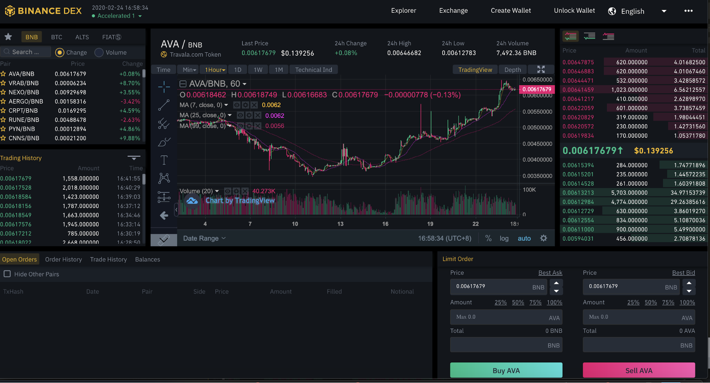
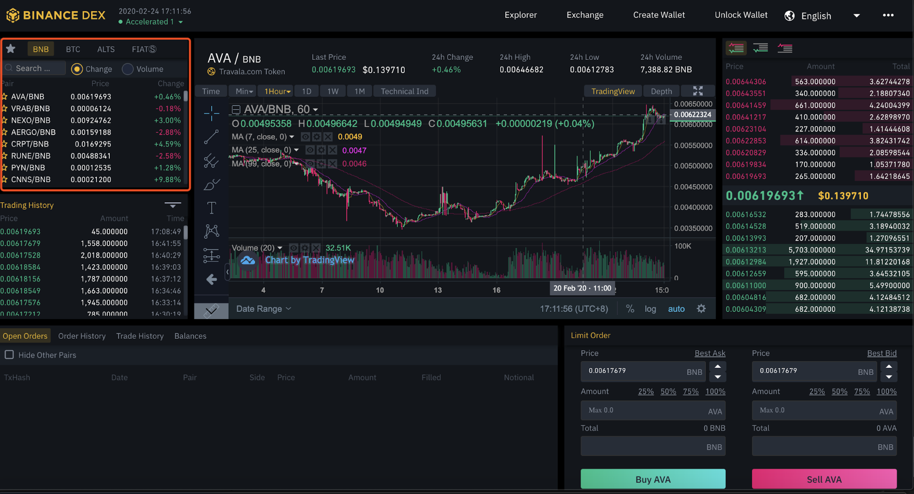
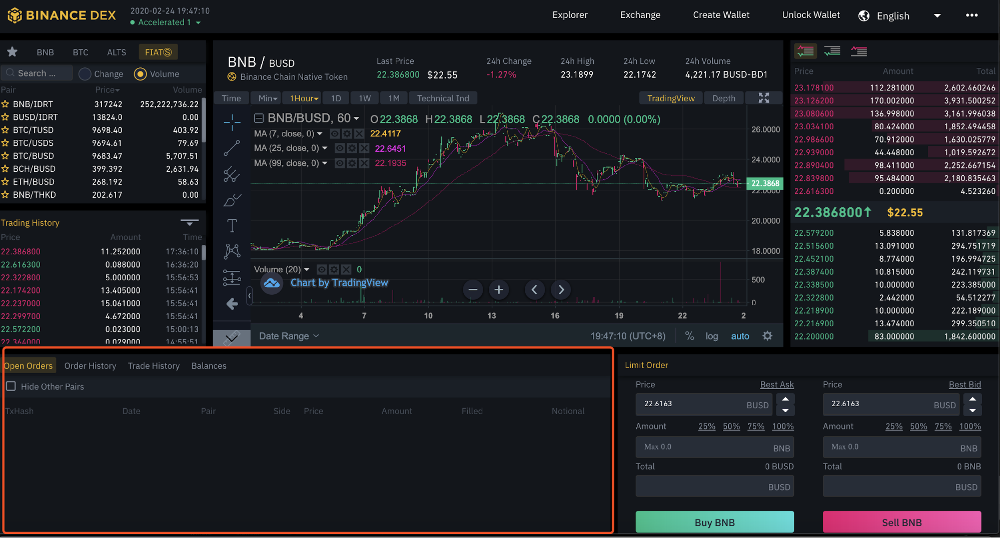
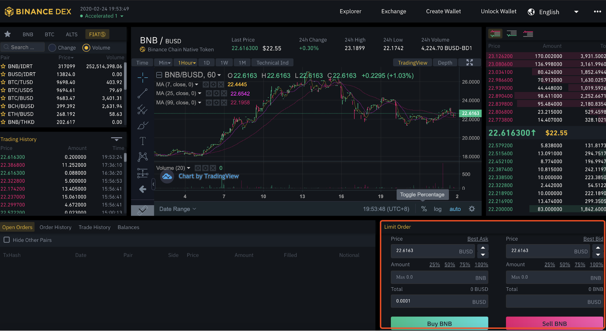

#  Binance DEX Trading Interface

Binance DEX trading page is designed to provide a user-friendly trading interface to everyone. To get started, go to the trading page first at https://www.binance.org/trade. The trading page is composed of the following part:

* Tradig Pairs info
* TradingView Chart
* Trade history and orderbook
* Your Trading Activities
* Order Form

[Trading Video on Youtube](https://www.youtube.com/watch?v=cZmEOpMQ_k0)

### Trading Pairs Info

At the left-right part of the trading page, there is the section of “Trading Pairs”. The trading pairs are categorized into four markets:
- BNB
- BTC
- ALT
- FIATS

Click on tabs to switch between markets.
Start Icon will show your favorite trading pairs.  You can click at the star icon to add this trading pair to your list.

Trading pairs can be ordered by two “Volume” or “Price Change”. The list is in descending order by default. You can also change to ascending by clicking the header.

### Trading View and Market Depth

At the center of the trading page, there is the TradingView chart. The TradingView displays information about your selected trading pair. The chart allows you to display indicators such as the RSI, moving average, Bollinger Bands and many more. The chart also allows you to draw on the chart using the tools within the TradingView charts. More information on how to use TradingView charts can be found on the TradingView Wiki.
Click on Depth button to switch to Depth View.
Market depth is the market's ability to sustain relatively large market orders without impacting the price of the security. Market depth considers the overall level and breadth of open orders and usually refers to trading within individual trading pairs. The number of levels can be zoomed in and out.
The key indicator of market depth is the spread. The spread is the gap between the bid and the ask prices. If the bid price for a stock is $19 and the ask price for the same stock is $20, then the spread for the stock in question is $1 divided by the lowest ask price) to yield a bid-ask spread of 5% ($1 / $20 x 100). Market with thinner spread is much liquid than others.

### Trade history and Orderbook
The order book shows a list of open orders on the exchange. The top half is the asking side of the order book, where you will see sell orders. The bottom half is the bidding side of the order book where you can see the buy orders for that trading pair. You can switch to different display mode: buy order only or sell order only to see more levels.

You can see the trading history from all users that have occurred on the trading pair that you currently have selected. The color of trades indicates taker/maker information.
* Green: buyer is taker
* Red: Seller is taker

### Your Trading Activities

In the bottom left-hand side of the interface, you can locate Open Orders, Order History, Trade History, and Balances.
- Open Orders: This section shows which orders are not filled in their entirety and are still currently open. You can view all of the orders on the blockchain by looking at their TxHash.
- Order History: This section shows the orders you have placed, filled, unfilled or canceled. You can view all of the orders on the blockchain by looking at their TxHash.
- Trade History: This section shows your executed trades on the exchange.
- Balances: This section displays the current balance of your Binance Chain Wallet.

### Order Form
Binance DEX currently only supports Limit orders. The Limit order section allows you to define the bid/ask price and the quantity you wish to trade. Please note that all order’s parameters’ constrains:
* Price:  Order price must be changed by multiple of tick size. Tick size stands for the smallest unit on price change
* Quantity: Order quantity must be multiple of lot size.  Lot size stands for the smallest quantity change
* Timeinforce: It is Good Till Expire (GTE). The order would stay effective until expire time. The order may expire in the UTC midnight after more than 259, 200 blocks, which is 72 hours in terms of blocking time.

