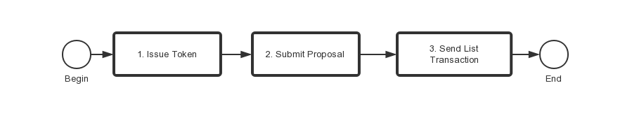

# 상장 Instructions

거래 쌍 상장은 DEX에서 제공하는 고급 기능입니다. 토큰을 상장하기 위한 과정은 아래 문서를 순차적으로 읽어주세요.

토큰을 상장하기 위한 과정은 다음과 같습니다:

## 1. 비컨 체인에서 토큰 발행 
[토큰 발행 doc](tokens.md)을 참고하여 비컨 체인 상에서 자신만의 자산을 발행하는 과정에 대해 배울 수 있습니다.

## 2. 제안 제출

*온체인 제안 요청*

[거버넌스 doc](governance.md)을 참고하여 거래 쌍을 상장하는 제안을 생성하는 방법을 배울 수 있습니다.

> 공식적으로 메인넷에서 실행하기 전 테스트넷에서 **모든 것을** 여러 번 실험해 보세요.

*커뮤니티 스레드 제안 (권장)*

토큰 발행인은 비컨 체인 커뮤니티 포럼(https://community.binance.org/) "Token Issuance & Listings” 카테고리 아래 스레드를 생성하는 것을 추천 드립니다. 작성 가이드라인은 [다음](https://community.binance.org/topic/18/guidelines-on-how-to-list-your-token-on-binance-dex)과 같습니다.

## 3. 상장 트랜잭션 전송

[상장 문서](list.md)를 참고하여 리스트 트랜잭션을 보내는 법과 비컨 체인에서 상장 완료하는 과정에 대해 배울 수 있습니다.

> `list` 트랜잭션을 `expire-time`전에 전송해야 상장이 완료됩니다.

## 상장 토큰에 관한 FAQ

###  어떤 거래 쌍이 상장될 수 있나요?

두 자산 간의 거래를 허용하는 것은 쉬워 보이지만, 네트워크와 장기적으로 사용자들에게 비용이 많이 듭니다(유동성 비용이 매우 커집니다). 네트워크를 효율적으로 사용하려면, 비컨 체인은 자산 쌍을 BNB와 자주 사용되는 견적 자산(quote asset)과의 거래 쌍만 상장을 허용합니다.

### 거래 쌍이 바이낸스 DEX에 어떻게 생성되나요?

바이낸스 DEX의 디자인 철학은 거래와 가격 발견시 가장 효율적이고 비용이 덜 드는 방법이 하나의 오더 북을 통해 관리한다는 아이디어를 따릅니다. 이는 하나의 오더 북이 동일하고 결정론적인 일치 로직을 통해 풀 노드들 간에 복제하고 관리하게 합니다.