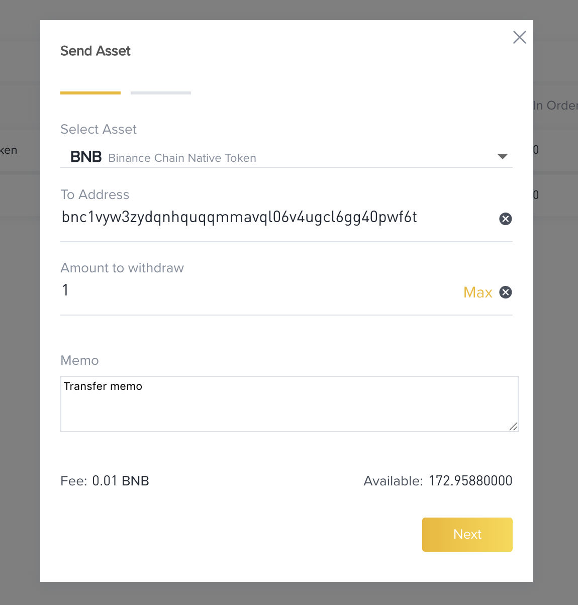

# Asset Transfer

`Transfer` is the most basic transaction Beacon Chain  supports, it moves assets among different addresses.

Please note the fees must be paid first in BNB before the transaction can be executed.


If you want to read more about the idea of account and balance, please refer to this [doc](account.md).

## Simple Transfer and Memo

Before transferring tokens to someone else, please make sure that you have an account with enough balance
and have unlocked your wallet on browser or restored your key via CLI.

You can always input a "memo" sentence as extra information to be recorded on the blockchain, though it has a limit on the length.

### Web wallet

You can easily send tokens to another address on web wallet.



First, you need to choose what asset you want to send.

Then you input the address you want to send tokens to and amount of token.

And you can also input memo here and size of memo is restricted to 128 bytes.

Fee charged and balance will be showed in below.

### CLI

If you want to send token to an address, make sure you have restored your key. You can list all of your keys:
```bash
 ./bnbcli keys list --home ~/.bnbcli
NAME:	TYPE:	ADDRESS:						PUBKEY:
test	local	bnb17kwznuljsy4n89wcjd6esx2j5t0w326c03xhyr	bncp1addwnpepq2gudmfe0dqqax3f57j9azy5rujlwcra4w8ueehsl5whzhlvczxuuakuldy
```

Query your addresses on testnet

```bash
$  ./tbnbcli keys list	PUBKEY:
test	local	tbnb1sylyjw032eajr9cyllp26n04300qzzre38qyv5	bnbp1addwnpepqgfehhv4meevy2kz52c0s7znk8x2969dl8zc5jngn36axf3szdzp5efearf
```

You can query your balance on mainnet before send tokens.

```bash
 ./bnbcli account bnb1XXXXXXXXXXXXXXXXXXX --chain-id Binance-Chain-Tigris --node  https://dataseed5.defibit.io:443 --indent
{
  "type": "bnbchain/Account",
  "value": {
    "base": {
      "address": "bnb14h5yfk0n54msscs3hjfupscx2s9efw62sg3phh",
      "coins": [
        {
          "denom": "BNB",
          "amount": "100000000"
        }
      ],
      "public_key": null,
      "account_number": "56",
      "sequence": "0"
    },
    "name": "",
    "frozen": null,
    "locked": null
  }
}
```

You can query your balance on testnet before send tokens.

```bash
./tbnbcli account tbnb1sylyjw032eajr9cyllp26n04300qzzre38qyv5 --chain-id Binance-Chain-Ganges --node=data-seed-pre-2-s1.binance.org:80 --indent

{
  "type": "bnbchain/Account",
  "value": {
    "base": {
      "address": "tbnb1sylyjw032eajr9cyllp26n04300qzzre38qyv5",
      "coins": [
        {
          "denom": "BNB",
          "amount": "100000000"
        }
      ],
      "public_key": null,
      "account_number": "56",
      "sequence": "0"
    },
    "name": "",
    "frozen": null,
    "locked": null
  }
}
```

Then you can send token.

Please note that you need to boosted the amount you want to send by **e^8** .

Example on **mainnet**:

```bash
./bnbcli send --from from-key-name --to to-address --amount 200000000:BNB --chain-id Binance-Chain-Tigris --node  https://dataseed5.defibit.io:443 --json --memo "Test transfer"
Password to sign with 'test':
{
   "Height":"272155",
   "TxHash":"A8F78BF8736A35B9433CA9CD1CDD03A8FB3D5D82",
   "Response":{
      "log":"Msg 0: ",
      "tags":[
         {
            "key":"c2VuZGVy",
            "value":"Ym5jMTdrd3pudWxqc3k0bjg5d2NqZDZlc3gyajV0MHczMjZjMDN4aHly"
         },
         {
            "key":"cmVjaXBpZW50",
            "value":"Ym5jMWw3a3IzNWRnajNqZXpqdnc2bnQ2enlxY215dDJqaDdyczJ2NG45"
         },
         {
            "key":"YWN0aW9u",
            "value":"c2VuZA=="
         }
      ]
   }
}
```

Example on **testnet**:
```bash
./tbnbcli send --from from-key-name --to to-address --amount 200000000:BNB --chain-id=Binance-Chain-Ganges --node=data-seed-pre-2-s1.binance.org:80 --json --memo "Test transfer"

Password to sign with 'test':
{
   "Height":"272155",
   "TxHash":"A8F78BF8736A35B9433CA9CD1CDD03A8FB3D5D82",
   "Response":{
      "log":"Msg 0: ",
      "tags":[
         {
            "key":"c2VuZGVy",
            "value":"Ym5jMTdrd3pudWxqc3k0bjg5d2NqZDZlc3gyajV0MHczMjZjMDN4aHly"
         },
         {
            "key":"cmVjaXBpZW50",
            "value":"Ym5jMWw3a3IzNWRnajNqZXpqdnc2bnQ2enlxY215dDJqaDdyczJ2NG45"
         },
         {
            "key":"YWN0aW9u",
            "value":"c2VuZA=="
         }
      ]
   }
}
```

If you are not familiar with CLI, you can use `-h` to get helps:
```bash
 ./bnbcli send -h
Create and sign a send tx

Usage:
  bnbcli send [flags]

Flags:
      --account-number int   AccountNumber number to sign the tx
      --amount string        Amount of coins to send
      --async                broadcast transactions asynchronously
      --chain-id string      Chain ID of Beacon Chain  node
      --dry-run              ignore the perform a simulation of a transaction, but don't broadcast it
      --from string          Name or address of private key with which to sign
      --generate-only        build an unsigned transaction and write it to STDOUT
  -h, --help                 help for send
      --indent               Add indent to JSON response
      --json                 return output in json format
      --ledger               Use a connected Ledger device
      --memo string          Memo to send along with transaction
      --node string          <host>:<port> to tendermint rpc interface for this chain (default "tcp://localhost:26657")
      --print-response       return tx response (only works with async = false) (default true)
      --sequence int         Sequence number to sign the tx
      --source int           Source of tx
      --to string            Address to send coins
      --trust-node           Trust connected full node (don't verify proofs for responses) (default true)

Global Flags:
  -e, --encoding string   Binary encoding (hex|b64|btc) (default "hex")
      --home string       directory for config and data (default "/root/.bnbcli")
  -o, --output string     Output format (text|json) (default "text")
      --trace             print out full stack trace on errors
```

### Multi-send

Sometimes, you may want to transfer tokens to multiple people. So `bnbcli` also provides you a `multi-send` command.

You can use `-h` to get helps:
```bash
 ./bnbcli token multi-send -h
Create and sign a multi send tx

Usage:
  bnbcli token multi-send [flags]

Flags:
      --account-number int      AccountNumber number to sign the tx
      --async                   broadcast transactions asynchronously
      --chain-id string         Chain ID of tendermint node
      --dry-run                 ignore the perform a simulation of a transaction, but don't broadcast it
      --from string             Name or address of private key with which to sign
      --generate-only           build an unsigned transaction and write it to STDOUT
  -h, --help                    help for multi-send
      --indent                  Add indent to JSON response
      --json                    return output in json format
      --ledger                  Use a connected Ledger device
      --memo string             Memo to send along with transaction
      --node string             <host>:<port> to tendermint rpc interface for this chain (default "tcp://localhost:26657")
      --print-response          return tx response (only works with async = false) (default true)
      --sequence int            Sequence number to sign the tx
      --source int              Source of tx
      --transfers string        Transfers details, format: [{"to": "addr", "amount": "1:BNB,2:BTC"}, ...]
      --transfers-file string   File of transfers details, if transfers-file is not empty, --transfers will be ignored
      --trust-node              Trust connected full node (don't verify proofs for responses) (default true)

Global Flags:
  -e, --encoding string   Binary encoding (hex|b64|btc) (default "hex")
      --home string       directory for config and data (default "/Users/wuzhenxing/.bnbcli")
  -o, --output string     Output format (text|json) (default "text")
      --trace             print out full stack trace on errors
```

The difference here is you have to construct the transfer detail by yourself. You have to specify `--transfers` flag and
format is showed above. In the same time, you can write the transaction detail in a file and specify `--transfers-file`
flag and read from the file contains transaction.

Example, you can specify `--transfers` and send it to **mainnet**:

```bash
 ./bnbcli token multi-send --home ./testnodecli --from test --chain-id Binance-Chain-Tigris --node  https://dataseed5.defibit.io:443  --transfers "[{\"to\":\"bnb1g5p04snezgpky203fq6da9qyjsy2k9kzr5yuhl\",\"amount\":\"100000000000000:BNB\"},{\"to\":\"bnb1l86xty0m55ryct9pnypz6chvtsmpyewmhrqwxw\",\"amount\":\"100000000000000:BNB\"}]" --json
Password to sign with 'test':
{
   "Height":"1412",
   "TxHash":"A238C3C33625B5398FE648BD3FE9822CB7A07A2DB7778376546916F81C634138",
   "Response":{
      "log":"Msg 0: ",
      "tags":[
         {
            "key":"c2VuZGVy",
            "value":"Ym5iMXFnOTRzMnYzM3NyNTVrNDAybnN2M3NmY3ozMmVtdGF3NmRjeTk2"
         },
         {
            "key":"cmVjaXBpZW50",
            "value":"Ym5iMWc1cDA0c25lemdwa3kyMDNmcTZkYTlxeWpzeTJrOWt6cjV5dWhs"
         },
         {
            "key":"cmVjaXBpZW50",
            "value":"Ym5iMWw4Nnh0eTBtNTVyeWN0OXBueXB6NmNodnRzbXB5ZXdtaHJxd3h3"
         },
         {
            "key":"YWN0aW9u",
            "value":"c2VuZA=="
         }
      ]
   }
}
```

Example on **testnet**:

```bash

./tbnbcli token multi-send --home ./testnodecli --from test --chain-id=Binance-Chain-Ganges --node=data-seed-pre-2-s1.binance.org:80  --transfers "[{\"to\":\"tbnb1sylyjw032eajr9cyllp26n04300qzzre38qyv5\",\"amount\":\"100000000000000:BNB\"},{\"to\":\"tbnb1e244vmvym7g6cn9lk4hmhf9p2f9jaf0x9hxmwc\",\"amount\":\"100000000000000:BNB\"}]" --json

Password to sign with 'test':
{
   "Height":"1412",
   "TxHash":"A238C3C33625B5398FE648BD3FE9822CB7A07A2DB7778376546916F81C634138",
   "Response":{
      "log":"Msg 0: ",
      "tags":[
         {
            "key":"c2VuZGVy",
            "value":"Ym5iMXFnOTRzMnYzM3NyNTVrNDAybnN2M3NmY3ozMmVtdGF3NmRjeTk2"
         },
         {
            "key":"cmVjaXBpZW50",
            "value":"Ym5iMWc1cDA0c25lemdwa3kyMDNmcTZkYTlxeWpzeTJrOWt6cjV5dWhs"
         },
         {
            "key":"cmVjaXBpZW50",
            "value":"Ym5iMWw4Nnh0eTBtNTVyeWN0OXBueXB6NmNodnRzbXB5ZXdtaHJxd3h3"
         },
         {
            "key":"YWN0aW9u",
            "value":"c2VuZA=="
         }
      ]
   }
}
```

And you can also try `--transfers-file`.

Assume that you have a file named `transaction.json` in your current path and content is :
```json
[
   {
      "to":"bnb1g5p04snezgpky203fq6da9qyjsy2k9kzr5yuhl",
      "amount":"100000000000000:BNB"
   },
   {
      "to":"bnb1l86xty0m55ryct9pnypz6chvtsmpyewmhrqwxw",
      "amount":"100000000000000:BNB"
   }
]
```

Then you can specify `--transfers-file` and send it to **mainnet**:
```bash
 ./bnbcli token multi-send --home ./testnodecli --from test --chain-id Binance-Chain-Tigris --node  https://dataseed5.defibit.io:443  --transfers-file ./transaction.json --json
Password to sign with 'test':
{
   "Height":"1412",
   "TxHash":"A238C3C33625B5398FE648BD3FE9822CB7A07A2DB7778376546916F81C634138",
   "Response":{
      "log":"Msg 0: ",
      "tags":[
         {
            "key":"c2VuZGVy",
            "value":"Ym5iMXFnOTRzMnYzM3NyNTVrNDAybnN2M3NmY3ozMmVtdGF3NmRjeTk2"
         },
         {
            "key":"cmVjaXBpZW50",
            "value":"Ym5iMWc1cDA0c25lemdwa3kyMDNmcTZkYTlxeWpzeTJrOWt6cjV5dWhs"
         },
         {
            "key":"cmVjaXBpZW50",
            "value":"Ym5iMWw4Nnh0eTBtNTVyeWN0OXBueXB6NmNodnRzbXB5ZXdtaHJxd3h3"
         },
         {
            "key":"YWN0aW9u",
            "value":"c2VuZA=="
         }
      ]
   }
}
```

Example on **testnet**:
```bash
 ./tbnbcli token multi-send --home ./testnodecli --from test--chain-id=Binance-Chain-Ganges --node=data-seed-pre-2-s1.binance.org:80  --transfers-file ./transaction.json --json

Password to sign with 'test':
{
   "Height":"1412",
   "TxHash":"A238C3C33625B5398FE648BD3FE9822CB7A07A2DB7778376546916F81C634138",
   "Response":{
      "log":"Msg 0: ",
      "tags":[
         {
            "key":"c2VuZGVy",
            "value":"Ym5iMXFnOTRzMnYzM3NyNTVrNDAybnN2M3NmY3ozMmVtdGF3NmRjeTk2"
         },
         {
            "key":"cmVjaXBpZW50",
            "value":"Ym5iMWc1cDA0c25lemdwa3kyMDNmcTZkYTlxeWpzeTJrOWt6cjV5dWhs"
         },
         {
            "key":"cmVjaXBpZW50",
            "value":"Ym5iMWw4Nnh0eTBtNTVyeWN0OXBueXB6NmNodnRzbXB5ZXdtaHJxd3h3"
         },
         {
            "key":"YWN0aW9u",
            "value":"c2VuZA=="
         }
      ]
   }
}
```

## Verify Transfer Transaction
To confirm that your transaction went through, you can use the following queries:
```json
{"hash":"E79DE52B7D8F6BA93787C5B0389AF26C0C29C03BC84DAE42317965797E38076E","height":"1412766","tx":{"type":"auth/StdTx","value":{"msg":[{"type":"cosmos-sdk/Send","value":{"inputs":[{"address":"tbnb1sylyjw032eajr9cyllp26n04300qzzre38qyv5","coins":[{"denom":"BNB","amount":"20"}]}],"outputs":[{"address":"tbnb1qq559fkes779t3q9p9aegnjplvtc53yg9vusah","coins":[{"denom":"BNB","amount":"20"}]}]}}],"signatures":[{"pub_key":{"type":"tendermint/PubKeySecp256k1","value":"AhOb3ZXecsIqwqKw+HhTscyi6K35xYpKaJx10yYwE0Qa"},"signature":"AlpHUBlC/V0cR7YNm5G46aAjmeRIxjkX9Vg8EtTKkfgPso+snT3/r2nRNjsphtjTonub3VYfE4lwOnjpY+Jwcg==","account_number":"406226","sequence":"27"}],"memo":"Test transfer","source":"0","data":null}},"result":{"log":"Msg 0: ","tags":[{"key":"c2VuZGVy","value":"dGJuYjFzeWx5ancwMzJlYWpyOWN5bGxwMjZuMDQzMDBxenpyZTM4cXl2NQ=="},{"key":"cmVjaXBpZW50","value":"dGJuYjFxcTU1OWZrZXM3Nzl0M3E5cDlhZWduanBsdnRjNTN5Zzl2dXNhaA=="},{"key":"YWN0aW9u","value":"c2VuZA=="}]}}
```
As you can see from the example output, this transaction is executed at block height 1412766 and you could read about the details.
Double check with blockchain explorer if you interact with the network through a  full-node.

