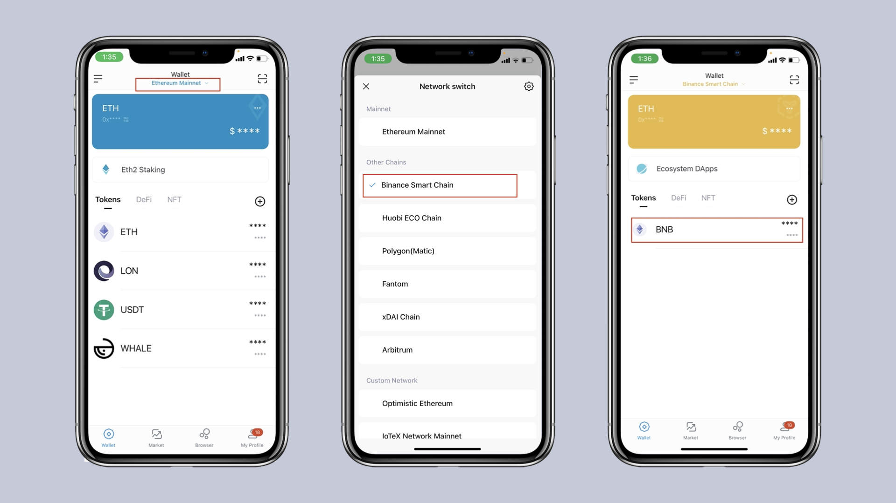
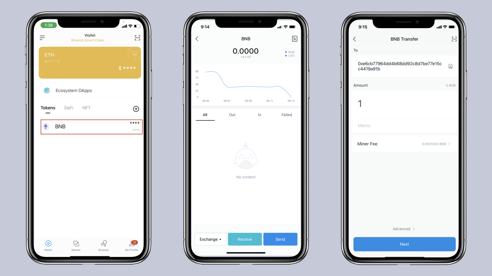
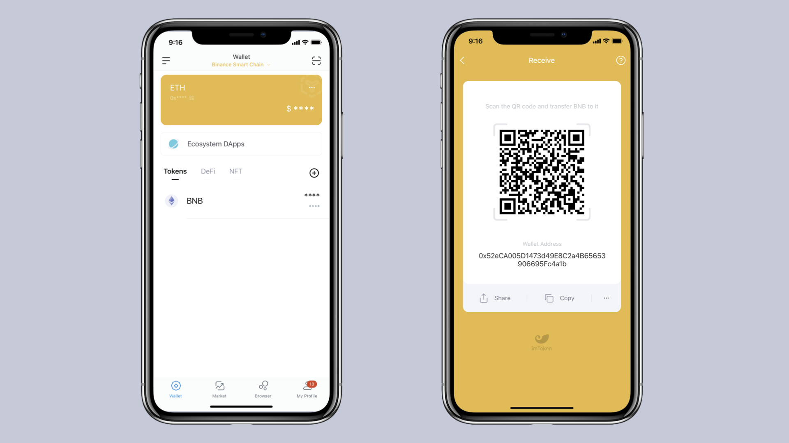
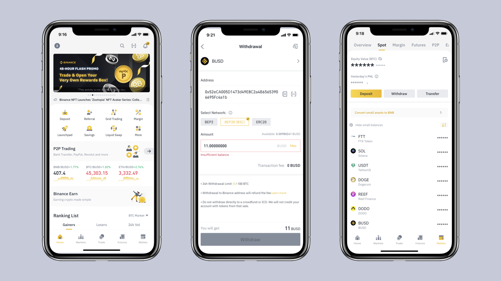
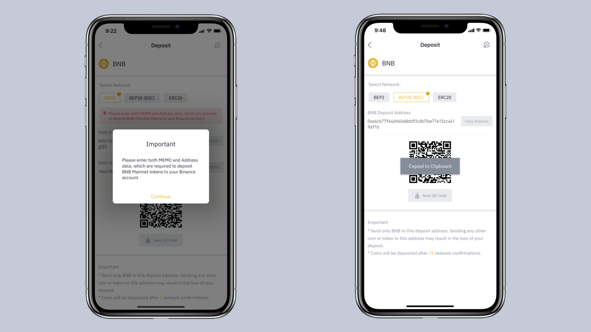

# How to use BNB Smart Chain  (BSC) on imToken? 
An introduction on how to start with using BSC on the imToken wallet

## How to download the imToken wallet?
1.To get started, download imToken wallet via our official website [token.im](https://token.im/), the Apple App Store or Google Play.

2.Android phone users best download via Google Play or the official website.

3.Make sure to download the official, genuine App, since there are scammers out there providing fake apps.

4.Apple users can use the App Store. Here as well, please double check the app developer being IMTOKEN PTE.LTD. Be aware of scam apps.

## How to create an imToken identity wallet?
1. Open imToken, click "Create Identity" and click to agree to the terms of service.

2. Fill in your identity name and wallet password. Next, click "Create", copy the backup mnemonic phrase with pen and paper and keep it in a safe place. Confirm the mnemonic words in order again and click "Next" to successfully create a wallet.

## What is BSC?
BSC is the abbreviation of BNB Smart Chain . The chain adopts PoSA (Proof of Staked Authority), which means holders of BNB (BSC's native token) vote to select 21 validators that are responsible for on-chain transaction verification and block production.
 
Since BSC is EMV-compatible, developers can easily deploy smart contracts and build DApps on the chain. Compared with Ethereum, BSC has lower gas fees and faster transaction settlement with lower security guarantees.
 
With imToken wallet we do not only support BSC DApps and watching token balances but also the DeFi Portfolio feature, providing a holistic BSC experience.

## How to start using BSC in imToken?
### Switch to BSC
Open imToken's ETH wallet and click "Ethereum Mainnet" under "Wallet" to enter the network switching page, and select "BNB Smart Chain ".

After the switch is successful, you can transfer and collect funds on the BSC chain in imToken, and experience its ecosystem DApps.

 
### Receiving a payment via BSC on imToken
Click "Receipt", copy the address or payment code and send it to the other party.

### Transferring via BSC on imToken
Click "Transfer", enter the payment address and amount, and then click "Next" to make the payment.

### Ecosystem applications
Click on "Ecosystem Applications" on the asset homepage to view and experience recent popular DApps on the BSC chain.

###How to send funds from Binance to your imToken Wallet

To withdraw BSC assets from Binance to imToken, you can follow the steps below. We use the BNB token as an example.

Click on the wallet address, enter the payment page, and click "Copy".

Open Binance, click "Funds"-"Withdraw", select "BNB" or other BSC-supported assets.

Select "BEP20 (BSC)" in "Network", paste the copied address, and enter the withdrawal password to proceed with withdrawal. Make sure it’s the correct address.

### Withdraw coins from imToken wallet to Binance Exchange
If you want to recharge assets on BSC from imToken to Binance Exchange, you can follow the steps below, here is BNB as an example.

Enter Binance Exchange, click "Assets"-"Recharge", select "BNB" or other BSC-supported assets.

Select "BEP20 (BSC)" in "Network" and click to copy the BNB recharge address.

On the asset page, click BNB to enter the transfer page, click "Transfer", paste Binance's recharge address, enter the withdrawal amount, and click "Next" to complete the transfer after paying the miner's fee.

Learn more: https://token.im

Risk Warning: The content of this article does not constitute any form of investment advice or recommendation. imToken does not make any guarantees and promises for the third-party services and products mentioned in this article, nor assume any responsibility. Digital asset investment has risks. You should carefully evaluate these investment risks and consult with relevant professionals to make your own decisions.

