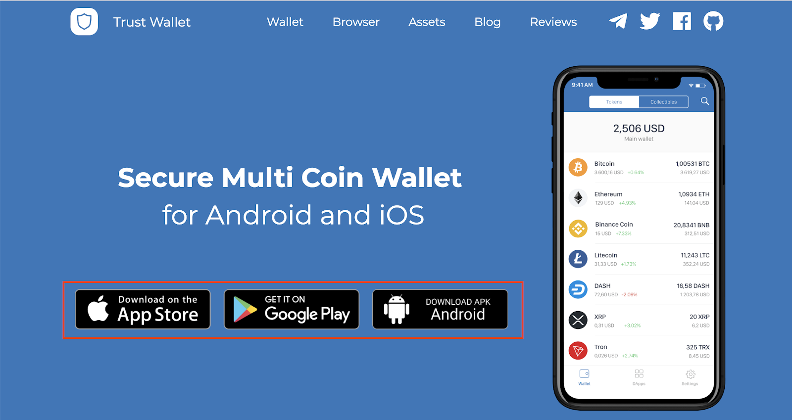

# 트러스트 월렛에서 지갑 생성하기

**Step 1.** 최신 트러스트웰렛 앱을 사용하기 위해서는 웹 사이트에 접속하여 다운로드 링크를 클릭하세요 [trustwallet.com](https://trustwallet.com/).

**Step 2.** 다운로드 및 설치가 끝난 후, 트러스트 월렛을 열고 "Create a new wallet"을 눌러주세요. 
그 다움 과정에서 12 단어의 복구 구문이 나오는데, 복구 구문을 통해 계정을 복구할 수 있습니다.

중요: 12 단어 구문을 분실하거나 잊어버릴 시 변경하거나 복구할 수 있는 방법이 없습니다. 
따라서 복구 구문을 잃게 된다면 계정 안에 자금도 잃게 됩니다. 
트러스트 웰렛은 기존 금융 계좌와 완전히 다릅니다. 
돈의 진정한 주인은 사용자이며, 트러스트 웰렛은 당신의 코인에 접근할 수 없습니다. 
우리는 복구 구문에 대한 접근 권한이 없기 때문에 지갑을 복원해 주는 것이 기술적으로 불가능합니다.
**(오직 12 단어의 복구 구문만이 지갑에 대한 접근을 복원하는데 사용할 수 있습니다.)**. 

**Step 3.** 지갑 생성을 완료 하기 전에, 12 단어 구문 순서를 맞게 적었는지 확인합니다.

**중요:** 복구 구문을 백업해 놓고 [안전한 장소에 보관](https://help.trustwallet.com/hc/en-us/articles/360016509753-Best-Practices-to-Store-Recovery-Phrase-and-Private-Keys)할 것을 강력하게 권고합니다!

생성 절차를 모두 완료했습니다! 
여러분의 지갑은 이제 [30개 이상의 블록체인](https://trustwallet.com/assets)에 존재하는 암호화폐를 다룰 수 있으며,
[비트코인](https://trustwallet.com/assets/bitcoin), [이더리움](http://trustwallet.com/assets/ethereum),
[BNB](https://trustwallet.com/assets/binance-coin), [리플](https://trustwallet.com/assets/xrp) 및 여러가지 자산들을 다룰 수 있습니다. 
곧 출시될 코인 스왑 기능으로 이러한 암호화폐를 교환하고 신용카드로 비트코인 및 이더리움 등을 구입하세요.

