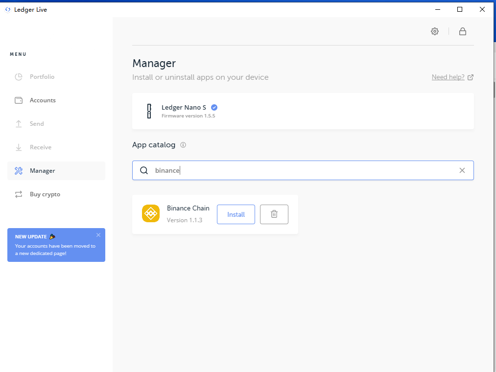
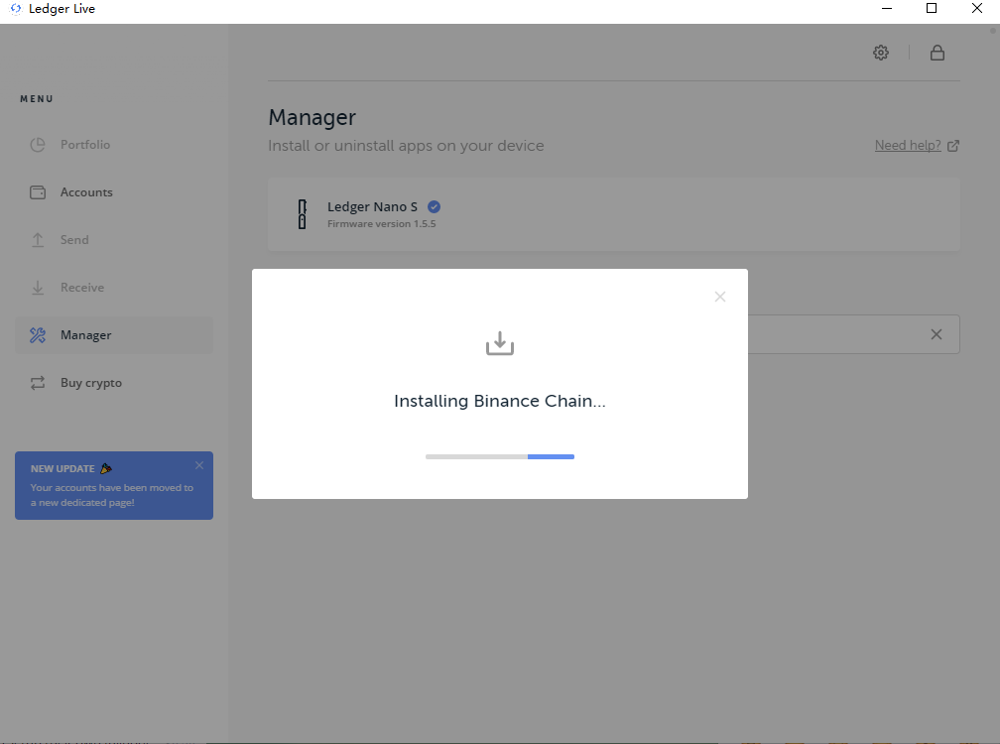

# Ledger Nano S Usage Guide

This guide will show you how to use your Ledger Nano S hardware wallet with Beacon Chain  and Binance DEX.

> Please Note: When using a Ledger to secure your Beacon Chain  wallet, your private keys are not exposed and never leave the device, guarding you against loss, malware and phishing attacks.
Therefore, using a hardware wallet device such as the Ledger Nano S is strongly recommended over using a less secure wallet storage method that relies on your computer’s local storage, such as Keystore File.

## Requirements

In order to use a Ledger device with Beacon Chain and Binance DEX, you will need:

- Supported web browser: Chrome (including Brave, Vivaldi, and other Chromium variants), Opera or Firefox
- Access to the Beacon Chain  web wallet (https://binance.org/unlock) using your web browser
- Initialized Ledger Nano S device with firmware version 1.5.5 or newer
- The Ledger Live application installed on your computer for app installation

## App Installation Instructions

1) Plug in and unlock your Ledger device, open Ledger Live on your computer, then open the "Manager" panel.

2) Within the "Manager" pane, type in "Binance" in the search field. 
Locate "Beacon Chain ", then click on "Install".

3) The Binance app will now install on your Ledger device.

4) When you see a popup message indicating "Successfully installed Beacon Chain ", the installation is complete.

5) Check that the "Beacon Chain " app is shown on your Ledger device dashboard as in the photo below. 
If it is, the installation has been successful.

## Setup/Login Instructions

6) Go to [www.binance.org](http://www.binance.org/)

Go to "Unlock wallet" [page](https://www.binance.org/en/unlock).

Choose "Ledger Device" and verify your address.

Choose one address to use for this session and click on "Confirm". 
You will then be redirected to the Trading Interface.

For your security, please read the information displayed in the following popup and confirm that the address shown on your Ledger device matches the one shown on-screen. 
Press the right button on your device to confirm that the address matches (You must do this to continue).

## How to send Beacon Chain Crypto Assets

Confirming a trade on a Ledger Wallet:

You can view the transaction info and confirm it on Ledger:

Once the transaction has successfully been signed and broadcasted, your Ledger device will display this screen.

