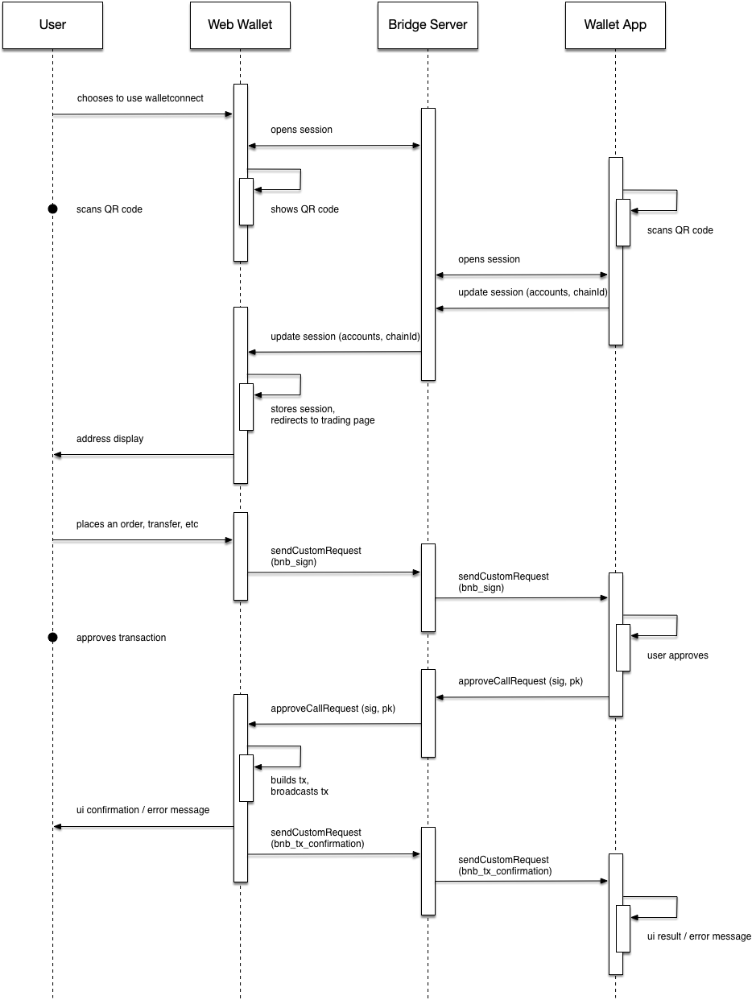

# Wallet Connect
<!-- -->
The Beacon Chain Web Wallet supports connecting with external wallet providers via the [WalletConnect protocol](https://docs.walletconnect.org/tech-spec).

WalletConnect allows the user to scan a QR code from the wallet app to unlock and use their wallet seamlessly in the web UI.

In order for this to work, some modifications to the standard WalletConnect protocol are used in the Beacon Chain   wallet's implementation.

See the list of wallets which support WalletConnect on Beacon Chain [here](walletconnect-support.md)

## Connecting via WalletConnect

Wallet providers should make use of the [WalletConnect Client SDK](https://docs.walletconnect.org/client-sdk) for their target programming language and OS. There are implementations [on GitHub](https://github.com/walletconnect) for iOS, Android, React Native, etc.

## Protocol Differences

Since we do not use Ethereum transactions, there are some differences:

* Typically `sendTransaction` is used with Ethereum transaction parameters in WalletConnect dApp integrations. But in Beacon Chain  's case, instead of invoking `sendTransaction` in the WalletConnect flow, the new [`sendCustomRequest`](https://docs.walletconnect.org/client-sdk#send-custom-request) call is used instead with a method called `bnb_sign` (see below).

* The external wallet provider is responsible for sending back the signature and public key of the transaction but should _not_ broadcast the transaction itself. We have instead defined a custom `result` format in the form of stringified JSON containing the signature and public key. The reason for this is that the wallet app probably does not have access to the complete serialized binary form of the transaction (as this requires Amino encoding).

* The web wallet will send back a second custom call (after `bnb_sign`) called `bnb_tx_confirmation`, which contains the boolean result of the transaction build/broadcast and any error message encountered by the web wallet during broadcasting. In a complete implementation, this confirmation callback should be responded to with a call to `approveRequest`.

## Sequence Diagram

This sequence diagram shows the flow of messages when the web wallet interacts with an external wallet provider via WalletConnect.



## Custom Requests

A custom call request adheres to this structure:

```json
{
  "id": 1,
  "jsonrpc": "2.0",
  "method": "method_name",
  "params": [{ ... }],
}
```

We have two custom call request formats, here are examples of them:

### Example: bnb_sign

```json
{
  "method": "bnb_sign",
  "params": [
    {
      "account_number": "34",
      "chain_id": "Binance-Chain-Ganges",
      "data": null,
      "memo": "test",
      "msgs": [
        {
          "inputs": [
            {
              "address": "tbnb1hgm0p7khfk85zpz5v0j8wnej3a90w709zzlffd",
              "coins": [
                {
                  "amount": 1000000000,
                  "denom": "BNB",
                },
              ],
            },
          ],
          "outputs": [
            {
              "address": "tbnb1ss57e8sa7xnwq030k2ctr775uac9gjzglqhvpy",
              "coins": [
                {
                  "amount": 1000000000,
                  "denom": "BNB",
                },
              ],
            },
          ],
        },
      ],
      "sequence": "31",
      "source": "1",
    }
  ]
}
```

#### Response (approveRequest)

A response like this should be sent back from the wallet app:

```json
{
  "id": 1553682007906047,
  "result": "{\"signature\":\"...\",\"publicKey\":\"...\"}"
}
```

In `result`, a JSON-encoded object must be included containing the following hex-string properties: `signature`, `publicKey`.

Note that:

* `id` and `jsonrpc` are usually pre-filled by the client SDK, so there should be no need to set this in the object yourself.

* `signature` should be 64 bytes in length (128 hex chars)

* `publicKey` should be 65 bytes in length (130 hex chars, non-compressed form, prefixed with `0x04`)

### Example: bnb_tx_confirmation

```json
{
  "method": "bnb_tx_confirmation",
  "params": [
    {
      "ok": true,
      "error": "Error message (optional)"
    }
  ]
}
```

Receipt of the `bnb_tx_confirmation` should be confirmed by the app with `approveRequest` as per the WalletConnect protocol flow.

For this response, `result` may be empty or contain an empty JSON-encoded object:

#### Response (approveRequest)

A response like this should be sent back from the wallet app:

```json
{
  "id": 1553682007906050,
  "result": ""
}
```

## Ending the Session

Remember to call `killSession()` when the user has finished using the integration from your app!

This will redirect the user back to the unlock screen in the web wallet.