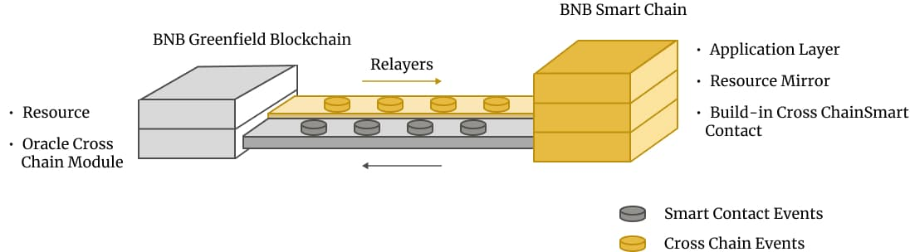

# Cross-Chain Programmability

The Greenfield ecosystem leverages cross-chain programmability to enhance data asset value through innovative permission management and smart code execution. This platform supports the creation, management, and operation of data-intensive, trustless computing environments across different blockchains.

!!! info 
    It does not mean developers have to build dapp based on BSC network. Excellent infrastructure, applications, 
    and tools can be built directly on the Greenfield network.

## Framework

The Greenfield ecosystem is structured into three primary layers, each serving a distinct purpose in facilitating cross-chain interactions and asset management.

- **Cross-Chain Communication Layer**: Securely transfers data between BSC and Greenfield, enabling interoperability.
- **Resource Mirror Layer**: Facilitates smart contract interactions by mirroring Greenfield's resources onto BSC.
- **Application Layer**: Utilizes smart contracts on BSC to develop decentralized applications leveraging Greenfield's infrastructure.

This layered architecture ensures robust cross-chain capabilities, enabling developers to create innovative applications while utilizing Greenfield's unique features.

## Key Features

- **Native Cross-Chain Bridge**: Ensures seamless interoperability with enhanced security through a multisig scheme among validators. More details are discussed in [Cross Chain Module design](https://github.com/bnb-chain/greenfield/blob/doc-refactor/docs/modules/cross-chain.md).
- **Resource Mirroring**: Allows on-chain management of Greenfield objects/buckets/groups via BSC, expanding operational possibilities.
- **EVM Contract Programming**: Enables most native Greenfield transactions on BSC, except for file uploads, which require off-chain interactions.
- **Multi Message**: Allows for the execution of multiple cross-chain operations within a single transaction. This is facilitated by the `MultiMessage` contract, which aggregates various operations into a cohesive unit. It is important to note that the MultiMessage contract is limited to supporting existing cross-chain operations such as bucket, object, group, permission, and token cross chain transfer.

## Get Started with building dapp

- [Learn more about the cross-chain mechanism](https://github.com/bnb-chain/greenfield/blob/doc-refactor/docs/modules/cross-chain.md)
- [Start building dapps with Greenfield](../for-developers/tutorials/overview.md)
