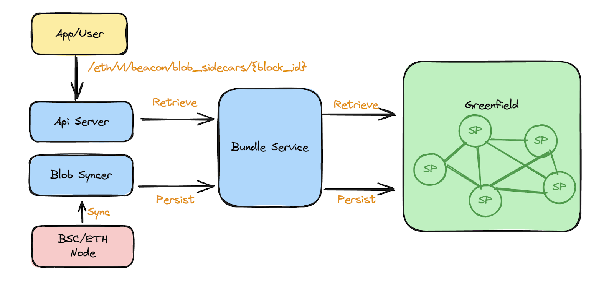

# Blob Hub

# What Is Data Archive Layer?

Modular blockchains divide the core functions of a classic blockchain into distinct specialized layers. Data
availability layer is the essential component that ensures that transaction data included in each produced block is
accessible to every node in the network.

This layer essentially maintains the integrity and trust of the blockchain, allowing everyone to independently verify
the validity of transactions. The data availability layer guarantees access to newly created data, but it does not
provide access to the entire historical data. For example, EIP4844 and Celestica will discard blob data older than 18
days.

The data archive layer is an extension of the data availability layer, ensuring that all historical block data remains
publicly accessible after being archived.

# What is BNB Greenfield

BNB Greenfield is a cutting-edge decentralized storage and blockchain storage network, designed to harness the power of
decentralized technology in the field of data ownership and the data economy. Greenfield guarantees data availability,
integrity, and accessibility through decentralized redundant storage and "Proof-of-Challenge", this makes it an ideal
solution for a data archive layer.

# BNB Greenfield as Data Archive Layer

The Greenfield community has recently launched "BlobHub," a data archive layer designed for all layer 2 blockchains and
Dapps which leverages EIP4844 blobs as data availability layer. All historical blobs can be persisted into Greenfield,
and users can easily access these blobs whenever they want to query them. BlobHub not only serves Ethereum but also
other blockchain that enable EIP4844.

While each blob can be saved as an object in Greenfield, doing so individually would not be cost-effective. Thanks to
the [bundle service](https://docs.nodereal.io/docs/greenfield-bundle-service?ref=bnbchain.ghost.io), which aggregates small files into one bundle for storage in Greenfield, this service can gather
blobs from a wide range of blocks, validate their correctness, and upload them to Greenfield efficiently.

Note: Greenfield will charge a fee for both storing and reading objects from the bucket owner. If there is not enough
balance in the bucket payment account, users will be unable to query data until the quota is refilled.

# Blob Hub on BNB Greenfield

## How Does Blob Hub Work

The Blob Hub primarily consists of two components: the blob-syncer and the api-server. To sync blobs to Greenfield, the
blob-syncer service continuously fetches blobs from Ethereum and other blockchains and persists them in Greenfield. The
api-server handles historical blob query requests from users. The bundle-service can aggregate blobs together, validate
their correctness, and upload them to Greenfield efficiently.


Blob Hub Solution

The syncing process ensures that no blob is missing and each blob synced to Greenfield is consistent. This is achieved
by running a post-verification process that scans all uploaded blobs again, conducts integrity checks against data
already stored in Greenfield, and detects any missing data. Duplicate uploads are prevented by key naming constraints in
the Bundle service and Greenfield.

## Support Network
| Network  | Endpoint    | Bucket      |
|----------|-------------|-------------|
| Ethereum | https://gnfd-blobhub.bnbchain.org | [ethereum-mainnet-blobs](https://greenfieldscan.com/bucket/0x00000000000000000000000000000000000000000000000000000000000019e7) |
| BSC | https://gnfd-blobhub-bsc.bnbchain.org | [bsc-mainnet-blobs](https://greenfieldscan.com/bucket/0x0000000000000000000000000000000000000000000000000000000000007681) |

## Who Needs to Access the Blob Hub?

### Layer 2 Node

Layer 2 nodes that need to sync from the genesis block require access to historical block data via the Blob Hub. By
leveraging Greenfield's robust infrastructure, they can rest assured that the integrity and availability of the stored
data remain intact.

### Analytical Platform

For on-chain data analytical builders, the blob hub service offers an alternative to centralized RPC service providers.
By relying on a decentralized source, these builders gain access to a wealth of historical blob data without being
tethered to centralized entities.

## Query Blobs from Blob Hub

Blob hub released its support to Ethereum and BSC now, it is going to support as many EVM chains as possible. The API is 100%
compliant with the Beacon Chain API spec. Developers can get the supported network and endpoint in the doc.

### Blob Hub Sidecars API Spec

#### Get Ethereum blob sidecars.

* GET /eth/v1/beacon/blob_sidecars/{block_id}?indices={indices}

| ParameterName | Type            | Description                                                                                                                                                                        |
|---------------|-----------------|------------------------------------------------------------------------------------------------------------------------------------------------------------------------------------|
| block_id      | string          | Block identifier. Can be one of: slot(beacon chain),  <hex encoded blockRoot with 0x prefix>. note: "head" (canonical head in node's view), "genesis", "finalized" are not support |
| indices       | array of string | Array of indices for blob sidecars to request for in the specified block. Returns all blob sidecars in the block if not specified, like "indices=0,1                               |


#### Get BSC blob sidecars.

* POST https://gnfd-blobhub-bsc.bnbchain.org/

request body:
```json
{
    "jsonrpc": "2.0",
    "method": "eth_getBlobSidecars",
    "params": [
      "0x260B4F8"
    ],
    "id": 1
}
```

response:
```json
{
"id": 1,
"jsonrpc": "2.0",
"result": [
    {
        "blobSidecar": {
            "blobs": [
                "0x230001fbfc0......",
                "0x230001fbfc0......",
                "0x230001fbfc0......"
            ],
            "commitments": [
                "0x8dc46b688da90f6c4e73f45edf45b469af02b08614929724c47561096144dccda42d750a54207056970e4fb594382d0d",
                "0x88ca84e6120edbc3501f38d5d33fcef72e4b9f93a87adcd0f01cbed75a502ba4904b44f0f4e90a32a60deaff16ca72fd",
                "0x8c5bac684f3ec774cea2e1069d10f5b572d06f1a0e22e935760ae6d781056a29ad39d97e09eb21c4e38433b7975ed809"
            ],
            "proofs": [
                "0x83580500abf93afb6e3d5b8c8f95ecefa8da6f6c4fa49b35dc8bf526c58c579cf9958f68d7da3dcb76e5bde536bf396b",
                "0xb70a87a4747158024d86a7b7a6bf946fd0c661717083498c9159e7d693ff1fece43157458318a412575ecc66aa17072b",
                "0x94c5a6e875936674265cd3d46d7a2af2f1600b85042f363d97c5eb8501fdc046268fddb3de85c9c7bd8c9b3b64ae416f"
            ]
            },
            "blockNumber": "0x260B4F8",
            "txIndex": "0x59"
            }
    ]
}
```

### Direct Access to Blobs

In scenarios where the Bundle Service is inaccessible, direct access to blob data stored in Greenfield may be necessary, as blobs are consolidated into a bundle object.User can retrieve the bundle object and extract specific blobs from it.

#### Naming pattern

The bundle objects uploaded to Greenfield adhere to the naming pattern `blobs_s{startSlot}_e{endSlot}`. For instance, if a bundle encompasses blobs within 30 slots, the bundle object could be named `blobs_s8864048_e8864077`, where 8864048 represents the start slot and 8864077 denotes the end slot. The individual blobs contained within this bundle follow the naming convention `blob_h{slot}_i{index}`, such as `blob_h8864074_i3`.

#### Retrieving Blobs via Bundle SDK
The [bundle SDK](https://github.com/bnb-chain/greenfield-bundle-sdk) offers commands to fetch the bundle object from Greenfield. Follow the steps below:


```bash
git submodule update --init --recursive
cd bundle-sdk && make build

./build/bundler download -bucket ethereum-mainnet-blobs -object blobs_s9374167_e9374196 -chain-id greenfield_1017-1 -rpc-url https://greenfield-chain.bnbchain.org:443  -output ./tmp
```

Once the bundle is downloaded and extracted, all original blob files can be found within the `tmp` directory.

### Try It Out

By adopting this innovative solution, stakeholders can ensure the integrity, accessibility, and longevity of blockchain data, thereby supporting a more resilient and transparent digital ecosystem. Don't miss the opportunity to revolutionize your data handling processes—join the Greenfield community today and set a new standard for blockchain data reliability and security.


## Setting Up Blob Hub your data archive needs
The codebase of [Blob Hub](https://github.com/bnb-chain/blob-hub) is open-source, allowing anyone to deploy their custom Blob Hub on Greenfield. The following steps outline how to set up Blob Hub on Greenfield.

### Requirement

Go version above 1.22

### Create a bucket on Greenfield

if you don't have a bucket yet, set up one for blob storage. There are a few ways to create one, below shows examples via [greenfield-go-sdk](https://github.com/bnb-chain/greenfield-go-sdk) and using provided script.

#### Use Dcellar
Visit https://dcellar.io/ and create a bucket with at least 100G read quota per month.

#### use provided script
You can use the script, before runinng it, modify the the scripts/.env file(the GRANTEE_BUNDLE_ACCOUNT does not need to modified at this moment):

```shell
bash scripts/set_up.sh --create_bucket
```

### Get a Bundler Account

Request a bundle account from the Bundle Service, you need to grant the bundle account permission in next step, so that bundle service
can create object behave of your account.

```shell
curl -X POST  https://gnfd-mainnet-bundle.nodereal.io/v1/bundlerAccount/0xf74d8897D8BeafDF4b766E19A62078DE84570656

{"address":"0x4605BFc98E0a5EA63D9D5a4a1Df549732a6963f3"}
```

### Grant fee and permission to the bundle address for creating bundled objects under the bucket


#### use go-sdk

```go
    bucketActions := []permTypes.ActionType{permTypes.ACTION_CREATE_OBJECT}
    statements := utils.NewStatement(bucketActions, permTypes.EFFECT_ALLOW, nil, sdktypes.NewStatementOptions{})
    bundleAgentPrincipal, err := utils.NewPrincipalWithAccount(sdk.MustAccAddressFromHex(bundleAddrToGrant))
    if err != nil {
        util.Logger.Fatalf("NewPrincipalWithAccount: %v", err)
        return
    }
    
    _, err = cli.PutBucketPolicy(ctx, BlobBucketName, BundleAgentPrincipal, []*permTypes.Statement{&statements}, sdktypes.PutPolicyOption{})
    if err != nil {
        util.Logger.Fatalf("put policy failed: %v", err)
        return
    }
```

grant allowance to the bundle account

below example shows allowance amount of 1 BNB, considered each object creation gas consumed is 0.000006 BNB, it is approximately for 1666667 objects.

```go
allowanceAmount := math.NewIntWithDecimal(1, 19)
_, err = cli.GrantBasicAllowance(ctx, bundleAcct.String(), allowanceAmount, nil, gnfdsdktypes.TxOption{})
if err != nil {
    util.Logger.Fatalf("grant fee allowance failed: %v", err)
}
```

You can find similar example [here](https://github.com/bnb-chain/greenfield-go-sdk/blob/master/examples/permission.go)

#### Use provided script
Or you can use the script, replace `GRANTEE_BUNDLE_ACCOUNT` with the addr got from Bundle Service in step 2, and modify the `ALLOWANCE` to your expect amount, so that transacion
gas will be paid your account:

```shell
bash scripts/set_up.sh --grant
```

After above steps are done, you can start running the Blob Syncer Service.

### Build the binaries

There are two main components in the Blob Hub, and each has its own binary:

* syncer: This component is specifically engineered to synchronize blobs and securely store them in Greenfield. It includes a post-verification process to ensure the integrity of blob storage.
* server: This component functions as the API server, catering to users' requests for querying blobs.

#### Build all

```shell
make build
```

#### Build blob syncer

```shell
make build_syncer
```

#### Build Blob Hub api server

```shell
make build_server
```

### Run the app

#### Run the Blob Syncer instance for Ethereum Mainnet blob sync

```shell
./build/syncer --config-path config/config-syncer.json
```

config example:

```json
{
    "chain": "ETH",
    "bucket_name": "your-bucket",
    "start_slot_or_block": 8783000,
    "create_bundle_slot_or_block_interval": 10,
    "beacon_rpc_addrs": [
      "https://eth2-beacon-mainnet.nodereal.io"
    ],
    "bundle_service_endpoints": [
      "https://gnfd-mainnet-bundle.nodereal.io"
    ],
    "rpc_addrs": [
      "https://eth-mainnet.nodereal.io"
    ],
    "temp_dir": "temp",
    "private_key": "0x....",
    "bundle_not_sealed_reupload_threshold": 3600,
    "db_config": {
        "dialect": "mysql",
        "username": "root",
        "password": "pass",
        "url": "/blob-hub?charset=utf8&parseTime=True&loc=Local",
        "max_idle_conns": 10,
        "max_open_conns": 100
    },
    "metrics_config": {
        "enable": true,
        "http_address": "",
        "sp_endpoint": "https://greenfield-sp.nodereal.io"
    },
    "log_config": {
        "level": "DEBUG",
        "filename": "",
        "max_file_size_in_mb": 0,
        "max_backups_of_log_files": 0,
        "max_age_to_retain_log_files_in_days": 0,
        "use_console_logger": true,
        "use_file_logger": false,
        "compress": false
    }
}
```

#### Run the Blob Syncer instance for BSC Mainnet blob sync

```shell

config example:
```json
{
    "chain": "BSC",
    "bucket_name": "your-bucket",
    "start_slot_or_block": 39769787,
    "create_bundle_slot_or_block_interval": 200,
    "bundle_service_endpoints": [
      "https://gnfd-mainnet-bundle.nodereal.io"
    ],
    "rpc_addrs": [
      "https://bsc-mainnet.nodereal.io/"
    ],
    "temp_dir": "temp",
    "private_key": "0x....",
    "bundle_not_sealed_reupload_threshold": 3600,
    "db_config": {
        "dialect": "mysql",
        "username": "root",
        "password": "pass",
        "url": "/blob-hub?charset=utf8&parseTime=True&loc=Local",
        "max_idle_conns": 10,
        "max_open_conns": 100
    },
    "metrics_config": {
        "enable": true,
        "http_address": "",
        "sp_endpoint": "https://greenfield-sp.nodereal.io"
    },
    "log_config": {
        "level": "DEBUG",
        "filename": "",
        "max_file_size_in_mb": 0,
        "max_backups_of_log_files": 0,
        "max_age_to_retain_log_files_in_days": 0,
        "use_console_logger": true,
        "use_file_logger": false,
        "compress": false
  }
}
```

#### Run the api server

```shell
./build/server --config-path config/config-server.json --port 8080
```


