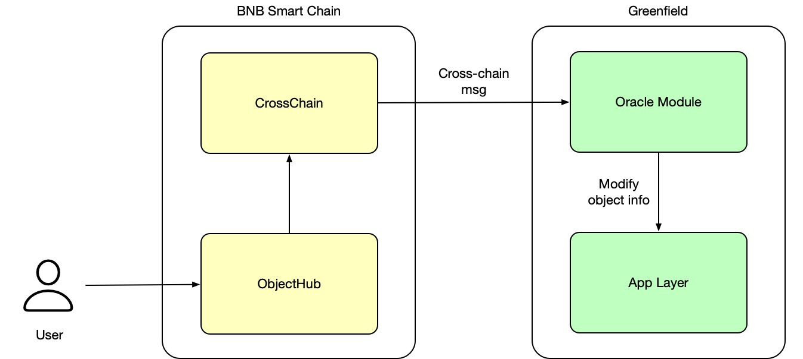

# Resource Mirroring

# Overview

Greenfield Blockchain offers resources like buckets, objects, and groups for mirroring on EVM-compatible chains (e.g., BSC, opBNB) 
as ERC-721 NFTs. 

Buckets serve as containers for objects, which are data files with metadata, while groups are sets of accounts with shared permissions. 
Additionally, group members' permissions can be mirrored as ERC-1155 tokens. Currently, these NFTs are non-transferable, 
with plans to introduce transferability soon.

Mirrored resources on EVM chains can be managed via smart contracts, impacting data's storage format and access permissions.
Changes on EVM chains reflect on Greenfield, enhancing data access and manipulation flexibility. 
This integration fosters a more efficient data management process.

## How to Mirror

Mirroring objects from BNB Greenfield to BSC is not done automatically with the creation of the resource. 
Users have to manually trigger the mirroring process for selected objects, either at the bucket or object level or group,
as it requires transaction gas. This allows users to have control over which objects are mirrored while being 
aware of the associated costs.

- [Resources Mirroring with CLI](../../for-developers/cross-chain-integration/mirror.md)
- [Resource Mirroring with SDK](https://github.com/bnb-chain/greenfield-go-sdk/blob/master/examples/crosschain.go)

The changes made to mirrored objects on BSC are propagated to BNB Greenfield once the corresponding transactions are 
finalized on both blockchains. BSC has a block finality of 3 seconds, while BNB Greenfield has a block finality of 2 seconds. 
As a result, the changes should be reflected within a maximum block finality of 3 seconds, which is the 
longer of the two block finality times.

Once an object is mirrored from BNB Greenfield to BSC, it can only be managed on BSC and cannot be reverted 
or "un-mirrored" back to Greenfield for management through Greenfield. However, it is worth noting that the ability to "un-mirror"
objects back to Greenfield may be introduced in future releases, providing the option to manage mirrored 
objects through Greenfield after being mirrored to BSC.

## What can be achieved through mirroring

Currently changing any metadata attributes of the object, which includes information about its properties, 
permissions, and other relevant attributes. For instance, to alter an object's permissions on BNB Greenfield, 
a user can execute an on-chain transaction on BSC. This transaction, specifying the permission changes, 
sends a message via relayers from BSC to Greenfield. Upon receiving the message, Greenfield updates the object's metadata as requested.

During the mirroring process from BNB Greenfield to BSC, the content of the file itself is not copied. 
This means that neither the data nor the file metadata, which is stored on the BNB Greenfield blockchain, 
is transferred to BSC. Consequently, there is no size limit imposed on the mirroring process since the actual 
file content is not duplicated. The ownership of the resource is changed too during the mirroring process.

