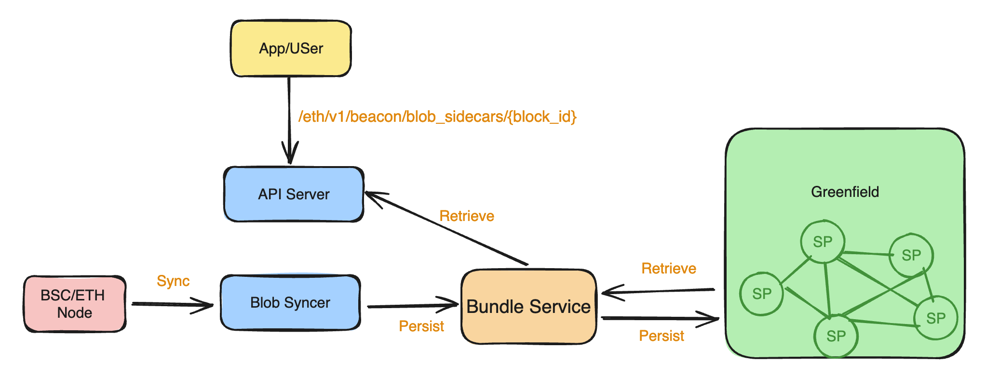

# Blob Hub: BNB Greenfield as Data Archive Layer for EVM L1 Chains

The Greenfield community has recently launched "BlobHub," a data archive layer designed for all layer 2 blockchains and
Dapps which leverages EIP4844 blobs as data availability layer. All historical blobs can be persisted into Greenfield,
and users can easily access these blobs whenever they want to query them. BlobHub not only serves Ethereum but also
other blockchains that enable EIP4844.

While each blob can be saved as an object in Greenfield, doing so individually would not be cost-effective. Thanks to
the [bundle service](https://docs.nodereal.io/docs/greenfield-bundle-service?ref=bnbchain.ghost.io), which aggregates small
files into one bundle for storage in Greenfield, this service can gather blobs from a wide range of blocks, validate their correctness,
and upload them to Greenfield efficiently.

Note: Greenfield will charge a fee for both storing and reading objects from the bucket owner. If there is not enough
balance in the bucket payment account, users will be unable to query data until the quota is refilled.

# How Does Blob Hub Work

The Blob Hub primarily consists of two components: the blob-syncer and the api-server. To sync blobs to Greenfield, the
blob-syncer service continuously fetches blobs from Ethereum and other blockchains and persists them in Greenfield. The
api-server handles historical blob query requests from users. The bundle-service can aggregate blobs together, validate
their correctness, and upload them to Greenfield efficiently.

The syncing process ensures that no blob is missing and each blob synced to Greenfield is consistent. This is achieved
by running a post-verification process that scans all uploaded blobs again, conducts integrity checks against data
already stored in Greenfield, and detects any missing data. Duplicate uploads are prevented by key naming constraints in
the Bundle service and Greenfield.

# Who Needs to Access the Blob Hub?

## Layer 2 Node

Layer 2 nodes that need to sync from the genesis block require access to historical block data via the Blob Hub. By
leveraging Greenfield's robust infrastructure, they can rest assured that the integrity and availability of the stored
data remain intact.

## Analytical Platform

For on-chain data analytical builders, the blob hub service offers an alternative to centralized RPC service providers.
By relying on a decentralized source, these builders gain access to a wealth of historical blob data without being
tethered to centralized entities.

# Query Blobs from Blob Hub

Blob hub released its support to Ethereum and BSC now, it is going to support as many EVM chains as possible. The API is 100%
compatible with the Beacon Chain and BSC API spec. Developers can get the supported [network and endpoints](../network-endpoint/endpoints.md#blob-hub) in the doc.

For more details about the API spec, please refer to [BlobHub API](https://github.com/bnb-chain/blob-hub/?tab=readme-ov-file#blob-hub-api)

# Try It Out

By adopting this innovative solution, stakeholders can ensure the integrity, accessibility, and longevity of blockchain data,
thereby supporting a more resilient and transparent digital ecosystem. Don't miss the opportunity to revolutionize your data
handling processes—join the Greenfield community today and set a new standard for blockchain data reliability and security.