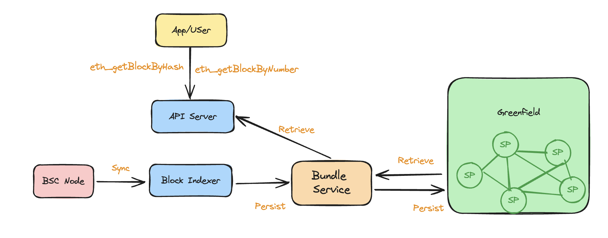

# Block Archiver

Block Archiver is another data archive solution that Greenfield community introduces. It is a specialized service designed to
facilitate the efficient storage and retrieval of historical block data on the Ethereum compatible chains(BSC for now). This solution caters to
various users who require comprehensive and reliable blockchain records for their operations.

Much like Blobhub, which uses the Bundle Service to archive blobs into a single bundle, Block-Archiver leverages
the bundle service to combine a range of blocks into a single bundle. This approach optimizes storage usage, ensures cost-effectiveness,
and maintains data integrity and accessibility.

Note: Greenfield charges a fee for both storing and accessing objects. If the bucket owner's payment account lacks sufficient balance,
users will be unable to query data until the quota is refilled.

# How Block Archiver Operates

The Block Archiver comprises two main components:

— Block Indexer: This service continuously indexes blocks from the Blockchain and stores them in Greenfield. It ensures no block is missed and that each stored block is accurate.
— API Server: This component handles user requests for historical block data, providing seamless access to the stored blocks.

Block Archiver Solution

The indexing process ensures data integrity by running a post-verification process. This process scans all uploaded blocks,
conducts validation checks against data already stored in Greenfield, and detects any missing data.

# Who Needs to Access the Block Archiver?

## Node Operators

Node operators requiring full sync from the genesis block need access to historical block data via the Block-Archiver. Leveraging Greenfield's robust infrastructure, they can trust the integrity and availability of the stored data.

## Data Analysts and Researchers

Block-Archiver offers a valuable resource for data analysts and researchers who need comprehensive access to historical block
data. By leveraging Block-Archiver, they can collect reliable data for analysis, research, and development purposes.

# Accessing Block Data with Block-Archiver

Block-Archiver supports BSC now and its API is fully compatible with Ethereum API specifications, ensuring ease of integration for
developers. Detailed information about supported networks and endpoints can be found in the documentation. For more details
about the API spec, please refer to [Block-Archiver API](https://github.com/bnb-chain/greenfield-bsc-archiver/?tab=readme-ov-file#block-archiver-api)

# Try It Out

Adopting this innovative solution ensures the integrity, accessibility, and longevity of blockchain data, supporting a more
resilient and transparent digital ecosystem. Join the Greenfield community today and set a new standard for blockchain data
reliability and security.