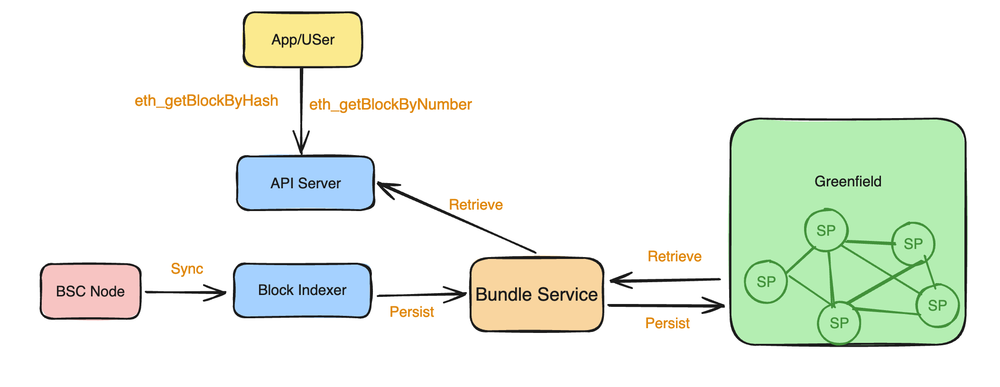

# BlockHub

BlockHub offers a lightweight, trustless, and decentralized method for accessing blockchain data. It provides a user experience
that is fully consistent with the original network's RPC and P2P access, eliminating the need for users to run full nodes or
rely on centralized data providers to fetch block data. Don't want to trust a third party provider to provide the block data?
Greenfield Blockhub is the answer. BlockHub is alive for BSC now.

Much like Blob Hub, which uses the Bundle Service to archive blobs into a single bundle, BlockHub leverages
the bundle service to combine a range of blocks into a single bundle. This approach optimizes storage usage, ensures cost-effectiveness,
and maintains data integrity and accessibility.

Note: Greenfield charges a fee for both storing and accessing objects. If the bucket owner's payment account lacks sufficient balance,
users will be unable to query data until the quota is refilled.

# How BlockHub Operates

The BlockHub comprises three main components:

- Block Indexer: This service continuously indexes blocks from the Blockchain and stores them in Greenfield. It ensures no block is missed and that each stored block is accurate.
- API Server: This component handles user requests for historical block data, providing seamless access to the stored blocks.
- Light Peers: It is a blockchain client that is backed by Greenfield storage but can serve in the P2P network. Refer to the [Light Peer](./light-peer.md) documentation for more details.

The indexing process ensures data integrity by running a post-verification process. This process scans all uploaded blocks,
conducts validation checks against data already stored in Greenfield, and detects any missing data.

# Who Needs to Access the BlockHub?

## Node Operators

Node operators requiring full sync from the genesis block need access to historical block data via the BlockHub.
Leveraging Greenfield's robust infrastructure, they can trust the integrity and availability of the stored data.

The Greenfield community has launched the `Greenfield Peer`, a data-seed solution for those who need to run BSC nodes in fullsync mode. For more details, check out this [page](./light-peer.md).

## Data Analysts and Researchers

BlockHub offers a valuable resource for data analysts and researchers who need comprehensive access to historical block
data. By leveraging BlockHub, they can collect reliable data for analysis, research, and development purposes.

# Accessing Block Data with BlockHub

BlockHub supports BSC now and its API is fully compatible with Ethereum API specifications, ensuring ease of integration for
developers. Detailed information about supported networks and endpoints can be found in [network and endpoints](../network-endpoint/endpoints.md). For more details
about the API spec, please refer to [BlockHub API](https://github.com/bnb-chain/greenfield-bsc-archiver/?tab=readme-ov-file#BlockHub-api)

# Try It Out

Adopting this innovative solution ensures the integrity, accessibility, and longevity of blockchain data, supporting a more
resilient and transparent digital ecosystem. Join the Greenfield community today and set a new standard for blockchain data
reliability and security.