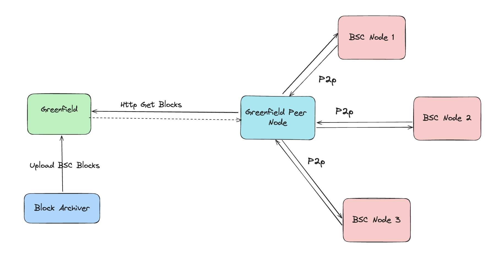

# Greenfield Peer

With the launch of the [block-archiver](./block-archiver.md), BSC historical block data is now accessible on Greenfield.
For those operating BSC nodes in fullsync mode, connecting to the Greenfield peer is a beneficial choice. The Greenfield peer
fetches block data from Greenfield and supplies it to BSC nodes via the P2P network.

## How Greenfield Peer Works

The diagram below illustrates the functionality of the Greenfield Peer. While the Greenfield peer does not participate in
other operations within the BSC network, it solely provides block data to BSC nodes. It does not persist any data on its own;
instead, when it receives requests (GetBodies and GetHeaders) from other BSC nodes, it fetches a bundle of blocks (# of blocks determined
by the Block Archiver Service) from Greenfield and caches them in memory. This ensures the Greenfield peer delivers block data
to BSC nodes efficiently.



## How to interact with Greenfield Peer

Utilizing the Greenfield Peer is straightforward. Configure your BSC node to connect to the Greenfield Peer by adjusting the
settings in your configuration file.

Navigate to the P2P section of your BSC node configuration file and specify the enode info of the Greenfield Peer.

```toml
# other configurations are omitted
...
[Node.P2P]
MaxPeers = 1
NoDiscovery = true
TrustedNodes = []
StaticNodes = ["${enode_info}"]
...
```

The `enode_info` for Testnet and Mainnet will be coming soon


