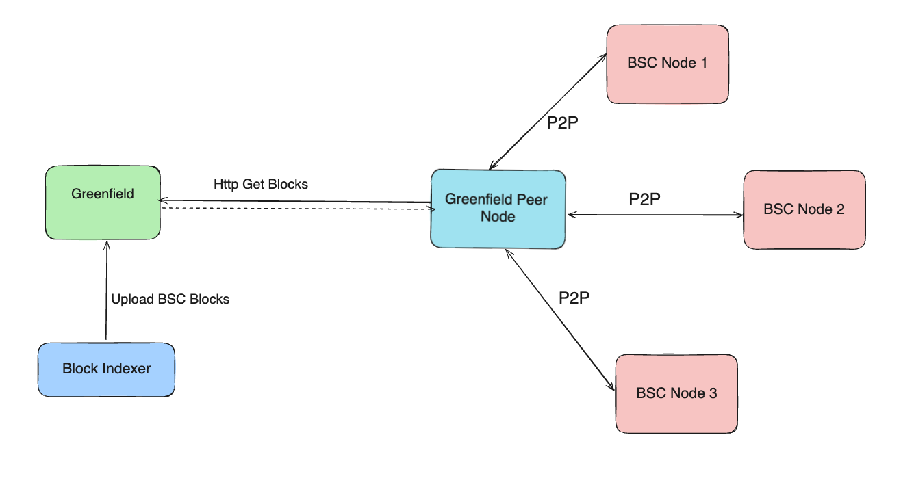

# Light Peer

With the launch of the [block-hub](./block-hub.md), BSC historical block data is now accessible on Greenfield.
For those operating BSC nodes in fullsync mode, connecting to the Light peer is a beneficial choice. The Light peer
fetches block data from Greenfield and supplies it to BSC nodes via the P2P network.

## How The Light Peer Works

The diagram below illustrates the functionality of the Light peer. While the Light peer does not participate in
other operations within the BSC network, it solely provides block data to BSC nodes. It does not persist any data on its own;
instead, when it receives requests (`GetBodies` and `GetHeaders`) from other BSC nodes, it fetches a bundle of blocks (# of blocks determined
by the Block Indexer) from Greenfield and caches them in memory. This ensures the Light peer delivers block data
to BSC nodes efficiently.



## How to interact with Light Peer

Utilizing the Light Peer is straightforward. Configure your BSC node to connect to the Light peer by adjusting the
settings in your configuration file.

Navigate to the P2P section of your BSC node configuration file and specify the enode info of the Light peer.

```toml
# other configurations are omitted
...
[Node.P2P]
MaxPeers = 1
NoDiscovery = true
TrustedNodes = []
StaticNodes=["enode://a2c586f41d2cc6dc7445e32922305e92b4de7daad718744d12bf105a79715606330535cffae6a0d60c61567ff772796d906fcb72b9cbb578f10de3221bb34015@13.115.90.65:30303?discport=0"]
...
```

