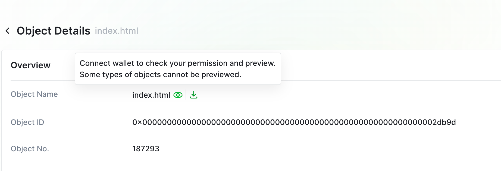

# Access Control Management with CLI
## Background

In our last tutorial, we have guided you through the process of setting up your environment, installing the necessary tools, and effectively backing up your files to BNB Greenfield, leveraging the benefits of decentralized storage while ensuring data security and ownership.

To dive furthur into advanced concepts of Greenfield, we will  cover how to handle objects access control with the CLI tool, manage your groups and polocoes.

## Verifying the Environment

Please refer to [this doc](../file-management-overview.md#installation) to make sure you have completed installation of `gnfd-cmd` and setting up your accounts.

## Query Bucket Info
To query the bucket, execute:

```shell
./gnfd-cmd bucket head gnfd://website-bucket
```

You should be able to see

```shell
latest bucket info:
owner:"0x525482AB3922230e4D73079890dC905dCc3D37cd"
bucket_name:"website-bucket"
visibility:VISIBILITY_TYPE_PRIVATE
id:"3101"
create_at:2023-10-31 01:17:15
payment_address:"0x525482AB3922230e4D73079890dC905dCc3D37cd"
global_virtual_group_family_id:40
```

## Access Control Management Workflow with Group

To manage how users can access your files, you have to follow this process:
1. Set `Principle Address` which has the administrator role
2. Customize groups members
3. Customize access policy, which may depends on different circustances
4. Bind/unbind policy with group

### Group Operations

The group commands is used to create group, update group members, delete group and query group info.

To create a group one need to call the following storage `create group` command with the desired group name.

```shell
// create group
gnfd-cmd group create gnfd://website-group
```

The operation will submit a transaction to BNB Greenfield blockchain to write the associated metadata. The result should look something similar to the following:
```shell
make_group: gnfd://website-group
transaction hash: A1FD3A0E2A337716C344392B840DCC8E804553AF42504FBD6F4C46B9C5B8FAF9
group id: 712
```

As you can see, the result returns a transaction hash, which one can inspect using the block scanner, e.g. [https://greenfieldscan.com](https://greenfieldscan.com/). Going to [https://testnet.greenfieldscan.com/tx/A1FD3A0E2A337716C344392B840DCC8E804553AF42504FBD6F4C46B9C5B8FAF9](https://testnet.greenfieldscan.com/tx/A1FD3A0E2A337716C344392B840DCC8E804553AF42504FBD6F4C46B9C5B8FAF9), will show all the details of the transaction.

Add a new member to the group
```shell
// update group member
gnfd-cmd group update --addMembers 0x843e77D639b6C382e91ef489881963209cB238E5 gnfd://website-group
```

To verify the new member is indeed part of the group
```shell
// head group member
gnfd-cmd group head-member  0x843e77D639b6C382e91ef489881963209cB238E5 website-group
```

The result should look something similar to the following:
```shell
the user 0x843e77D639b6C382e91ef489881963209cB238E5 is a member of the group: gnfd://website-group
```

### Policy Operations
The `gnfd-cmd policy` command supports the policy for put/delete resources policy(including objects, buckets, and groups) to the principal.

The principal is need to be set by `--grantee` which indicates a greenfield account or `--groupId` which indicates group id.

The object policy action can be "create", "delete", "copy", "get" , "execute", "list" or "all". The bucket policy actions can be "update", "delete", "create", "list", "update", "getObj", "createObj" and so on. The group policy actions can be "update", "delete" or all, update indicates the update-group-member action.

In this example, the principal grants the `delete bucket`, `update bucket` access to this group
```shell
// grant bucket operation permissions to a group
gnfd-cmd policy put --groupId 712 --actions delete,update,createObj,getObj grn:b::website-bucket
```

The result should look something similar to the following:
```shell
put policy of the bucket:website-bucket succ, txn hash: 63735FBF6BDFF95AEED9B8BC8D794474431C77E7EBF768BFAA9E3F7CFB25FF97
latest bucket policy info:
 id:"2316" principal:<type:PRINCIPAL_TYPE_GNFD_GROUP value:"172" > resource_type:RESOURCE_TYPE_BUCKET resource_id:"3101" statements:<effect:EFFECT_ALLOW actions:ACTION_DELETE_BUCKET actions:ACTION_UPDATE_BUCKET_INFO actions:ACTION_CREATE_OBJECT >
```
As you can see, the result returns a transaction hash, which one can inspect using the block scanner, e.g. [https://greenfieldscan.com](https://greenfieldscan.com/). Going to [https://testnet.greenfieldscan.com/tx/63735FBF6BDFF95AEED9B8BC8D794474431C77E7EBF768BFAA9E3F7CFB25FF97](https://testnet.greenfieldscan.com/tx/63735FBF6BDFF95AEED9B8BC8D794474431C77E7EBF768BFAA9E3F7CFB25FF97), will show all the details of the `put policy` transaction.

Upload a private file with principal account:

```shell
gnfd-cmd object put --contentType "text/xml" --visibility private ./website/index.html gnfd://website-bucket/index.html
```

In this example, the principal grants the `delete object`, `update object` access to this group
```shell
// grant object operation permissions to a group
gnfd-cmd policy put --groupId 712 --actions get,delete grn:o::website-bucket/index.html
```

The result should look something similar to the following:
```shell
put policy of the object:index.html succ, txn hash: BD2E3F74B2FBD18300B2C313E8F0393426C851EC3A9153F37DFD6CDC10F92FF8
latest object policy info:
 id:"2318" principal:<type:PRINCIPAL_TYPE_GNFD_GROUP value:"712" > resource_type:RESOURCE_TYPE_OBJECT resource_id:"187293" statements:<effect:EFFECT_ALLOW actions:ACTION_GET_OBJECT actions:ACTION_DELETE_OBJECT >
```




To verify the group policy is working, you can try view the private object with account `0x843e77D639b6C382e91ef489881963209cB238E5`.
1. Go to explorer and find the detail page of the private object.
2. Click on "Preview" button
3. Unlock your wallet and choose the right address. Then, you should be able to view the html file.

or you can download the file with `gnfd-cmd`
```shell
./gnfd-cmd object get  gnfd://website-bucket/index.html
```

### Update Access Control with Group

The command to update a group is very simple.

#### Remove a member from group:
```shell
// update group member
gnfd-cmd group update --removeMembers 0xca807A58caF20B6a4E3eDa3531788179E5bc816b gnfd://groupname

```
#### Add expiretime for membership

You can set the expire timestamp for the newly added member. The default value is no experiation.
```shell
// update group member
gnfd-cmd group update --removeMembers 0xca807A58caF20B6a4E3eDa3531788179E5bc816b gnfd://groupname --expireTime 1699699763

```

#### Remove Policy

Here is an example to delete a policy
* Delete a policy for an adress
```shell
gnfd-cmd policy rm --grantee 0x843e77D639b6C382e91ef489881963209cB238E5 --actions get grn:o::website-bucket/index.html
```

* Delete a policy for a group
```shell
gnfd-cmd policy rm --groupId 111 --actions get grn:o::website-bucket/index.html
```

## Conclusion
Overall, the access control management of Greenfield is very powerful and can be used in many scenarios.
It is highly recommended for users to engage in hands-on exploration by trying out different account group management operations and permissioning mechanisms. This will provide a deeper understanding of how BNB Greenfield functions and how to effectively manage and secure data within the decentralized storage system.
