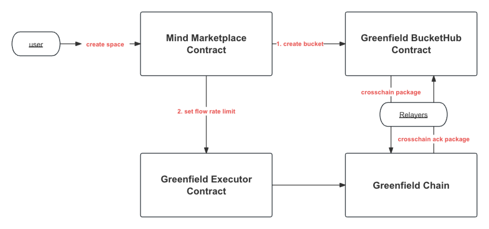
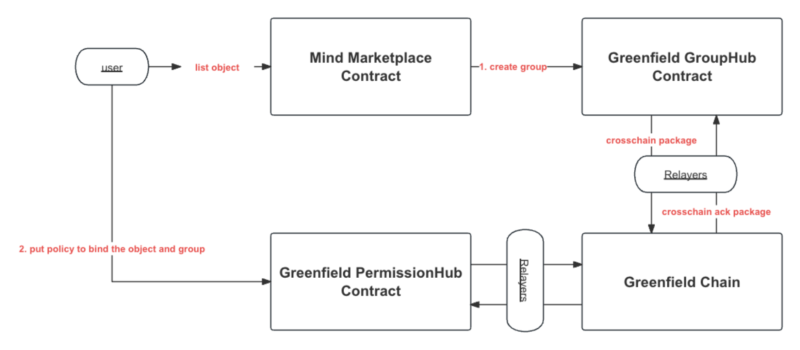
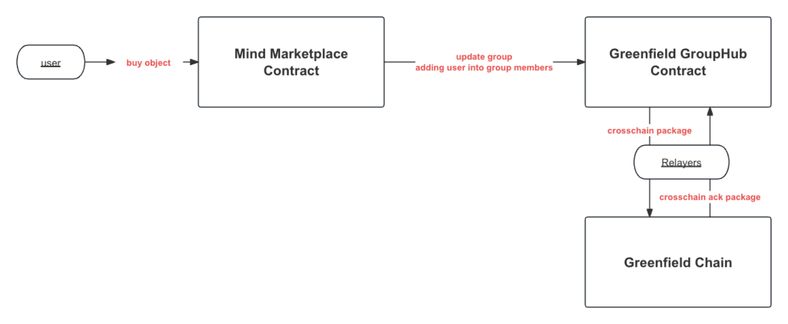

# MindPress Data Marketplace Introduction

<h3>1. Overview</h3>

[MindPress Data Marketplace](https://testnet-marketplace.mindpress.io) is a demo built on the BNB Smart Chain and BNB Greenfield storage chains. It uses the image trading scenario as an example to demonstrate the use of BNB Greenfield's latest release (V1.6&V1.7), such as cross-chain programmability, delegate upload, and sponsor-paid storage fees. With these features, developers can easily create a web3 decentralized trading platform based on the BNB Chain ecosystem with a great user experience and comprehensive functions such as storage, trading, and content permission management, thereby accelerating project development and marketing.

<h3>2. Features</h3>

As an image stock, sellers can upload and list photos for sale, while buyers can search for images they like, buy, and download the original files.

_Seller_

* **Upload objects (e.g. images) to BNB Greenfield:** Sellers can upload multiple images to BNB Greenfield at once under the BSC network.
* **List objects on the BNB Smart Chain:** Sellers can list their uploaded images for sale on the BSC network and begin selling download/view permissions to buyers to earn money.
* **Delist objects**: Sellers can delist their images from the marketplace.

_Buyer_

* **Search objects:** Buyers can search for objects by name and category ID to find what they want.
* **Buy objects:** Buyers can purchase objects and obtain download/view permission.
* **Download objects:** Buyers can download/view their purchased objects.

<h3>3. Benefits after Greenfield V1.6&1.7 updates</h3>

<table>
  <tr>
   <td><strong>#</strong>
   </td>
   <td><strong>Before</strong>
   </td>
   <td><strong>After</strong>
   </td>
   <td><strong>Code</strong>
   </td>
   <td><strong>Related Greenfield Features</strong>
   </td>
  </tr>
  <tr>
   <td><strong>Network Switch</strong>
   </td>
   <td>❌Users have to switch between BNB Greenfield and BNB Smart Chain to upload objects and make the trading operation.
   </td>
   <td>✅<strong>No network switch: </strong>Users can finish all the operations on BSC network.
   </td>
   <td><a href="https://github.com/bnb-chain/greenfield-cosmos-sdk/pull/417">https://github.com/bnb-chain/greenfield-cosmos-sdk/pull/417</a>
   </td>
   <td>
<ul>

<li><a href="https://github.com/bnb-chain/BEPs/pull/361">BEP-361: Streamline off-chain authentication on Greenfield</a>

<li><a href="https://github.com/bnb-chain/BEPs/pull/363">BEP-363: Improve Greenfield cross-chain programming capability</a>
</li>
</ul>
   </td>
  </tr>
  <tr>
   <td><strong>Payment Method</strong>
   </td>
   <td>❌Users have to pay the storage fee and download quota fee by themselves.
   </td>
   <td>✅<strong>Flexible payment method: </strong>Projects can choose to pay storage and download quota fees by themselves, allowing users to use this platform for free and lowering the user threshold, thereby expanding the number of users and facilitating promotion.
   </td>
   <td><a href="https://github.com/bnb-chain/greenfield/pull/582">https://github.com/bnb-chain/greenfield/pull/582</a>
   </td>
   <td>
<ul>

<li><a href="https://github.com/bnb-chain/BEPs/pull/362">BEP-362: Greenfield Storage Fee Paymaster</a>
</li>
</ul>
   </td>
  </tr>
  <tr>
   <td><strong>Upload Objects</strong>
   </td>
   <td>❌Users must upload objects to DCellar before returning to MindPress to list them because the upload process is quite complex to embed in MindPress.
   </td>
   <td>✅<strong>Easy to upload: </strong>Users can upload multiple large objects in MindPress at once without requiring a signature or incurring fees because the upload process is greatly simplified by the delegate upload feature.
   </td>
   <td><a href="https://github.com/bnb-chain/greenfield/pull/581">https://github.com/bnb-chain/greenfield/pull/581</a>
   </td>
   <td>
<ul>

<li><a href="https://github.com/bnb-chain/BEPs/pull/364">BEP-364: Primary Storage Provider acts as the upload agent for object creation and update on Greenfield</a>
</li>
</ul>
   </td>
  </tr>
  <tr>
   <td><strong>List Objects</strong>
   </td>
   <td>❌Users have to execute 2-3 transactions to complete the list workflow, which also requires switching networks back and forth.
   </td>
   <td>✅<strong>Easy to list: </strong>Users need only 2 transactions to complete the list operation to start selling.
   </td>
   <td><a href="https://github.com/bnb-chain/greenfield-contracts/pull/140">https://github.com/bnb-chain/greenfield-contracts/pull/140</a>
   </td>
   <td>
<ul>

<li><a href="https://github.com/bnb-chain/BEPs/pull/363">BEP-363: Improve Greenfield cross-chain programming capability</a>

<li><a href="https://github.com/bnb-chain/greenfield-cosmos-sdk/pull/417">Multiple add multi-message support for Greenfield cross-chain app</a>
</li>
</ul>
   </td>
  </tr>
</table>

<h3>4. Demo Video</h3>
<h4>4.1 Buyer workflow</h4>

|  |  |
| -- | -- |
| Search and filter |  |
| Buy Images |  |

<h4>4.2 Seller Workflow</h4>

|  |  |
| -- | -- |
| Upload Images |  |
| List Images |  |
| Delist Images |  |

<h3>5. Environment Support</h3>

* BNB Smart Chain Testnet: [https://mindpress.io](https://mindpress.io)   (VPN required in some areas)

<h3>6. Technical Design </h3>

<h4>6.1 Overview</h4>

The BNB Greenfield offers resources such as buckets, objects, and groups that can be mirrored on the BNB Smart Chain (BSC) as non-fungible tokens (NFTs) following the ERC-721 standard. Buckets store objects, the basic units with data and metadata. Groups consist of accounts with similar permissions. These resources, including group members' permissions as ERC-1155 tokens, can be mirrored on the BSC.

Smart contracts on BSC can directly control mirrored resources, affecting storage formats, access permissions, and other data aspects on Greenfield. This integration boosts flexibility and accessibility, streamlining data management on both platforms. For more on mirroring implementation, refer to [this document](https://docs.bnbchain.org/bnb-greenfield/core-concept/cross-chain/mirror/).

In the context of the MindPress Data Marketplace, users have the ability to store images on the Greenfield network and sell them on the BSC. Let's take the example of Alice selling a picture of a carrot on MindPress. To sell carrot images, Alice needs to follow these steps:

1. Create a bucket, and upload the carrot image to this bucket on BNB Greenfield.
2. Create a group and grant this group permission to view the carrot image.
3. List the group on the MindPress Data Marketplace smart contract to sell access permissions on the BSC network.

Since the carrot image is private, Bob will be denied access to it by default.

Bob needs to buy permission to join the group. After becoming a member, he can view/download the carrot image.

<h4>6.2 Architecture</h4>

<h5>6.2.1 Greenfield Cross Chain Design</h5>

The true strength of the Greenfield ecosystem resides in its cutting-edge platform engineered not just for data storage, but also for fostering value creation from data assets and its associated economy. To empower data on Greenfield more effectively, a robust cross-chain mechanism has been introduced, enabling versatile cross-chain programming capabilities.

The first layer is the Cross-Chain Communication Layer, which is responsible for handling and verifying the communication packages between BSC and BNB Greenfield.

The second layer is the Resource Mirror Layer, which handles the resource assets defined on BNB Greenfield and mirrors them onto BSC.

The top layer of the cross-chain system is the Application Layer. This layer consists of smart contracts that are developed by the community on BSC, enabling them to operate the mirrored resource entities on the Resource Mirror Layer.

<h5>6.2.2 MindPress Workflow</h5>

MindPress Data Marketplace is built on the cross-chain mechanism of BNB Greenfield and BSC, enabling users to flexibly manipulate data stored on Greenfield on the BSC side, facilitating data circulation and value creation. Below, we delve into the technical principles of the key processes involved in MindPress.

* Create Space

The MindPress contract will do the following operations:

1. help the user to create a bucket to store the uploaded images and the paymaster of the bucket is set to mindpress contract.
2. set the flow rate limit for the bucket to give the initial free charge.

* List Object

Users should go through the following 2 transactions to list an object:

1. Send a list request to the MindPress contract with the object ID, group name and price, MindPress will create a new group where all members of the group have access to the object.
2. Send a cross-chain put-policy transaction to bind the object and the created group.

* Buy Object

    To purchase an object, the user simply sends a purchase request and pays the appropriate fee in BNB. The mindpress contract will send a cross-chain package to add the user into the access group.

<h4>6.3 Technical Considerations</h4>

* **CrossChain Design:** Application data is stored on the BSC chain. Objects/buckets and their access rights are recorded on the Greenfield chain. Relayers automatically relay cross-chain packages and acknowledgments between BSC and Greenfield. MindPress contracts can update the application state through Greenfield contract callbacks.
* **Stateless Design:** The MindPress Data Marketplace is engineered to be stateless. The data query and object permission control involved in the application can only be interacted with through the BSC chain.

<h3>7. Getting Started </h3>

MindPress consists of three engineering projects:

* Frontend: [https://github.com/bnb-chain/mindpress-data-marketplace](https://github.com/bnb-chain/mindpress-data-marketplace)
* Backend: [https://github.com/bnb-chain/mindpress-data-marketplace-backend](https://github.com/bnb-chain/mindpress-data-marketplace-backend)
* Smart Contracts: [https://github.com/bnb-chain/mindpress-data-marketplace-smart-contract](https://github.com/bnb-chain/mindpress-data-marketplace-smart-contract)

<h3>8. Contributing</h3>

Thank you for considering using and contributing to MindPress! We welcome developers to utilize our open-source codebase and encourage collaboration to improve and extend its functionality. If you have any questions, feel free to reach out to us for assistance. Happy coding!

<h3>9. License</h3>

The library is licensed under the [GNU Lesser General Public License v3.0](https://www.gnu.org/licenses/lgpl-3.0.en.html), also included in our repository in the [LICENSE](https://github.com/bnb-chain/mindpress-data-marketplace/blob/main/LICENSE) file.

<h3>10. Disclaimer</h3>

The software and related documentation are under active development, all subject to potential future change without notification and not ready for production use. The code and security audit have not been fully completed and are not ready for any bug bounty. We advise you to be careful and experiment on the network at your own risk. Stay safe out there.
