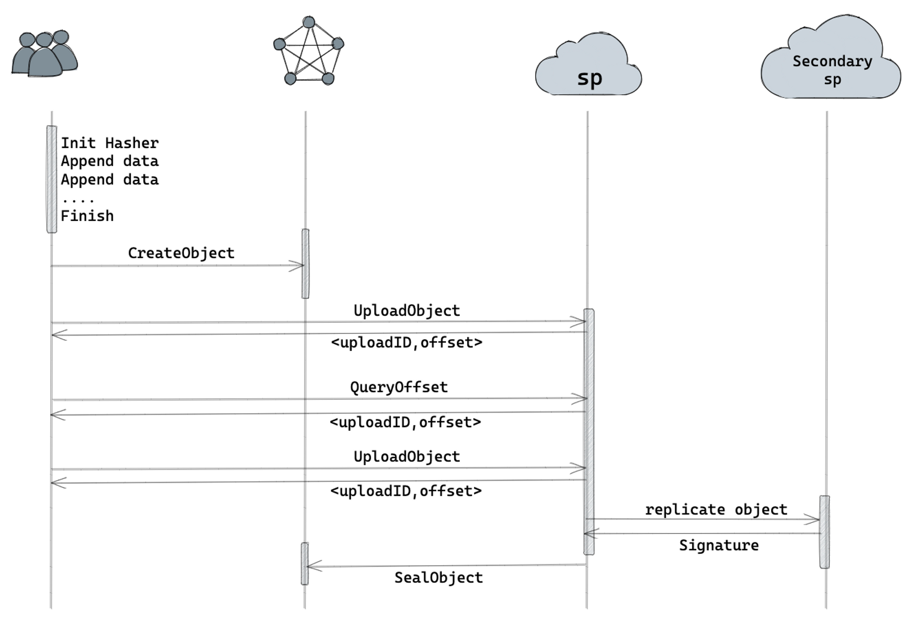

# Resumable Upload & Resumable Download

* Resumable Upload is a feature that allows files to be uploaded in multiple parts, enabling the upload process to be resumed from where it left off in case of interruptions or failures. This is particularly useful for large files or situations where network connectivity may be unreliable.
* Resumable Download is a common download method in greenfield, which allows users to pause or interrupt the download process and resume it later. When a user requests to download a large file, it is often divided into multiple fixed-size chunks, and the download process uses the HTTP Range request header to specify the starting and ending positions for the download. If the user pauses or interrupts the download, the next request can resume the download from the last position by sending a request with an appropriate Range field, without having to re-download the entire file.

## Resumable Upload

Resumable upload refers to the process of uploading a file in multiple parts, where each chunk is uploaded separately.This allows the upload to be resumed from where it left off in case of interruptions or failures, rather than starting the entire upload process from the beginning.

During resumable upload, if an error occurs during the `PutObject` operation, the subsequent upload attempts will first query the server-side for the progress of the previous upload. It will then resume the upload from the last offset.

### Upload Process Overview



1. Start the initial `PutObject` operation to upload the object.
2. If an error occurs during the upload, such as a network interruption or server error, the upload process is interrupted.
3. When resuming the upload, the next `PutObject` operation will initiate a query to the server to retrieve the progress of the previous upload.
4. The server responds with the last offset from which the upload needs to resume.
5. The `PutObject` operation resumes the upload from offset received from the server.
6. The upload process continues from the point of interruption until completion.

### PutObject Options

The `PutObject` operation in the Greenfield GO-SDK API allows you to upload an object to a bucket. It provides additional options for configuration through the `PutObjectOptions` struct. This document describes two new options introduced in the `PutObjectOptions` struct.

- PartSize (Default: 16 MB)
  The `PartSize` option determines the size of each part when uploading large objects. If the size of the object is smaller than the `PartSize`, it will be uploaded as a single part. However, if the object size is larger and the `DisableResumable` option is set to `false`, resumable upload will be enabled.

indicate the resumable upload 's part size, uploading a large file in multiple parts. The part size is an integer multiple of the segment size.

- DisableResumable (Default: false)
  The `DisableResumable` option determines whether resumable upload is enabled. When set to `false`, resumable upload is enabled, allowing for the upload to be resumed if interrupted or failed. This is especially useful for large objects. If set to `true`, resumable upload is disabled.

indicate whether need to enable resumeable upload. Resumable upload refers to the process of uploading  a file in multiple parts, where each part is uploaded separately.This allows the upload to be resumed from  where it left off in case of interruptions or failures, rather than starting the entire upload process from the beginning.

### Usage Example

```go
var buffer bytes.Buffer
err := s.Client.PutObject(
    ctx,
    bucketName,
    objectName,
    int64(buffer.Len()),
    bytes.NewReader(buffer.Bytes()),
    types.PutObjectOptions{
        PartSize:        1024 * 1024 * 16, // 16 MB
        DisableResumable: false,
    },
)
```

In the above example, we create a **`bytes.Buffer`** named **`buffer`** to hold the object data. We then use the **`PutObject`** operation to upload the object to the specified bucket and object name. The **`PutObjectOptions`** struct is passed with the desired options set. In this case, the **`PartSize`** is set to the default value of 16 MB, and the **`DisableResumable`** is set to false to enable resumable upload.

Note: Make sure to replace the placeholder values (**`s.Client`**, **`s.ClientContext`**, **`bucketName`**, and **`objectName`**) with the actual variables or values relevant to your code.

## Resumable Download

The `FGetObjectResumable` function in the S3 Client API allows you to perform resumable downloads for large files. This function downloads a file from the specified bucket and object name to a local file, with the ability to resume the download in case of errors or interruptions.

### Download Process Overview

1. Start the initial `FGetObjectResumable` function to download the file.
2. During the download process, the function retrieves segments of the file from the server-side and appends them to an `object_{operatoraddress}{getrange}.tmp` file.
3. If an error occurs during the download, such as a network interruption or server error, the download process is interrupted.
4. When resuming the download, the subsequent `FGetObjectResumable` function first checks if the `object_{operatoraddress}{getrange}.tmp` file exists.
5. If the `object_{operatoraddress}{getrange}.tmp` file exists, the function verifies the checksum to ensure the integrity of the partially downloaded file.
6. If the `object_{operatoraddress}{getrange}.tmp` file does not exist or the checksum is invalid, the function starts a fresh download of the object from the server.
7. The download process continues from the last offset, and appending the segments to the `object_{operatoraddress}{getrange}.tmp` file.
8. Once the download is complete, the `object_{operatoraddress}{getrange}.tmp` file can be renamed or processed as needed.

### Usage Example

```
err = s.Client.FGetObjectResumable(
    s.ClientContext,
    bucketName,
    objectName,
    newFile,
    types.GetObjectOptions{},
)
```

In the above example, the **`FGetObjectResumable`** function is used to perform a resumable download of a file from the specified bucket and object name. If an error occurs during the download, the subsequent function calls will check the existence and validity of the **`object_{operatoraddress}{getrange}.tmp`** file, and resume the download from the last offset.

### Source code
* [Go-SDK demo](https://github.com/bnb-chain/greenfield-go-sdk/blob/4940fb69df1258fcb232b92e1ed4894ead516583/e2e/e2e_storage_test.go#L452)
