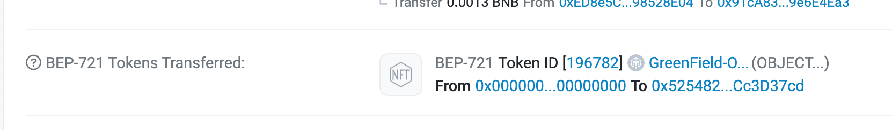

# Resources Mirroring with CLI

## Introduction

During the mirroring process from BNB Greenfield to BSC, the content of the file itself is not copied. This means that neither the data nor the file metadata, which is stored on the BNB Greenfield blockchain, is transferred to BSC. Consequently, there is no size limit imposed on the mirroring process since the actual file content is not duplicated.

## Mirror Objects

Objects can be mirrored on the BSC as ERC-721 NFTs

Example command to mirror to BSC testnet:
```shell
gnfd-cmd object mirror --bucketName yourBucketName --objectName yourObjectName --destChainId 97
```

Example output:
```
mirror object succ, txHash: 0774F400EBD42FAB009A6B3C303EF8625B57AB551E0F065C546B892167938122
```
You can go to [GreenfieldScan](https://testnet.greenfieldscan.com) to view the details of mirror operation.

Then, go to [BscScan](https://testnet.bscscan.com) and you can find out that there is a NFT transferred to you.




## Mirror Buckets

Mirror buckets are the same procedure and mirror objects.

Example command to mirror to BSC testnet:
```shell
gnfd-cmd object mirror --bucketName yourBucketName  --destChainId 97
```

Example output:
```
mirror bucket succ, txHash: 0xba1ca47a2271864b2010158b13535331301ba3289aab8e373503e91e3a41d0a7
```
You can go to [GreenfieldScan](https://testnet.greenfieldscan.com) to view the details of mirror operation.

Then, go to [BscScan](https://testnet.bscscan.com) and you can find out that there is a NFT transferred to you.


## Mirror Group

The members within a group, which represent permissions to specify resources, can be mirrored as ERC-1155 token.

Example command to mirror to BSC testnet:

```shell
// mirror a group as NFT to BSC, you might use group id or groupName to identidy the group
gnfd-cmd group mirror --id 1
// irror a group with group id
gnfd-cmd group mirror --groupName yourGroupName
```

Example output:

```shel
mirror_group:
transaction hash: 99A749ECC3CEB8B7CF4B8132A19D1A04EF7247F8549477B6AD28CA69BD11E66A
```
You can go to [GreenfieldScan](https://testnet.greenfieldscan.com) to view the details of mirror operation.

Then, go to [BscScan](https://testnet.bscscan.com) and you can find out that there is a NFT transferred to you.

