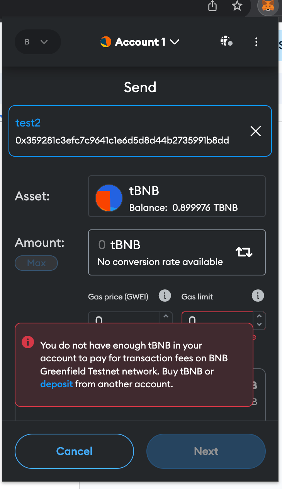
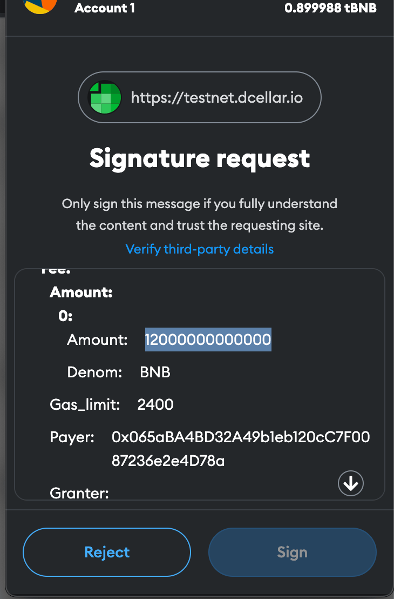

### Why can't I send BNB tokens on BNB Greenfield using my wallet?
Wallet does not support transfers on BNB Greenfield because BNB Greenfield uses a different transaction format than other EVM chains. You may encounter the following error when you transfer your token with your wallet. To send BNB tokens on BNB Greenfield, you need to use [dCellar Transfer function](token-transfer.md#bnb-transfers-in-greenfield).

{:style="width:50%"}

### How to understand the amount field in the signature message when using BNB Greenfield?
When users perform actions on the BNB Greenfield, such as creating buckets or uploading files, they need to sign a message that contains the amount of BNB they are spending. However, this amount is not in BNB units, but in WEI units, which are much smaller. One WEI is equal to 10^-18 BNB. Therefore, the amount field in the signature message may look very large, but it is actually a very small fraction of a BNB.

{:style="width:50%"}

### Does Greenfield have a token? How can I get it?

BNB remains the main utility token on Greenfield, no other token on Greenfield.
You can acquire BNB in multiple ways:

1. [Buy BNB](https://www.binance.com/en/how-to-buy/bnb) if you never own it.
2. Cross-chain transfer BNB from BSC network to Greenfield using [DCellar](https://dcellar.io/) if you already own any BNB. You can read the detailed steps [here](https://docs.nodereal.io/docs/dcellar-get-started). The cross-chain token transfer is really fast, you are supposed to receive your BNB within a minute.
3. Receive BNB from other Greenfield users with [internal transactions](token-transfer.md#bnb-transfers-in-greenfield)

### What is the utility of BNB on Greenfield?

BNB is used as a staking token, gas token, storage service fee token, and governance token. Refer to [token economics](../core-concept/billing-payment.md#gas-and-fees)
for more details.

### Does Greenfield support smart contract?

The Greenfield blockchain does not support smart contracts, but the native cross-chain between BSC and Greenfield brings programmability to the ecosystem. More tech details are explained [here](../core-concept/programmability.md),
you can start integrating smart contracts with Greenfield following the [tutorial](../for-developers/tutorials/access-control/cross-chain-access-control-by-cmd.md).

### What consensus algorithm does Greenfield run on?

[Tendermint is the consensus engine](https://blog.cosmos.network/tendermint-explained-bringing-bft-based-pos-to-the-public-blockchain-domain-f22e274a0fdb) that powers Greenfield BPoS.

### Is the file permanently stored in Greenfield?

No. Currently, Greenfield charges storage fees in a stream manner, so if a user's account balance is insufficient and in arrears, it is possible that their data may be lost and cannot be recovered.

Greenfield may support permanent storage in the future.

### Can I update the files after it is uploaded?

The update is not yet supported, but it can be accomplished through deletion and upload.

### Can I enjoy lower price for the data I previously stored if the storage price goes down?

Sure, but it requires any transaction that modifies the payment flow, such as uploading or deleting files, to trigger it.

### Will I also have to pay more for the data I have previously stored if the storage price goes up?

In theory, yes. However, Greenfield will strictly limit the frequency and magnitude of price adjustments by storage providers to minimize the impact on users.

### If the storage provider loses my data or refuses to provide service, what can I do?

This situation is usually unlikely to happen because Greenfield uses redundant error-correction coding to keep your data safe across multiple storage providers.

If such a scenario occurs, you can initiate a data availability challenge, and validators will verify the integrity, availability, and service quality of your data while penalizing the corresponding storage provider.

You can continue to receive rewards until the storage provider fully recovers your data or provides the service.

### How can I make my valuable data circulate?

You can mirror your data and access permissions to the BNB Smart Chain network, and trade your data through various DApps and data trading platforms.

### How long can the data uploaded to the testnet be saved?

Testnet is used for testing, so it won't keep user's data for a long time. It is expected to be dropped after 7 days.

### What to do if you are unable to upgrade Greenfield in time?

 Since this is a hardfork, your `gnfd` binary cannot continue running if it’s not upgraded in time. 
 Add the following filed in `app.toml`:
 ```
 # chain-id for op bnb destination chain 
 `dest-op-chain-id = 204`
 ```
 Stop the binary, then execute the rollback command:
 `gnfd rollback --hard`
 Finally, restart your binary.


### How much does it cost to store files in Greenfield?

If you're interested in knowing the real-time pricing for storage and querying on Greenfield, we invite you to the [Price Calculator](https://dcellar.io/pricing-calculator).


### How is my billing calculated?

In Greenfield, bsides transaction fee, users are required to pay two kinds of storage service fees: `storage fee` and `download quota fee`. These storage service fees are charged by Storage Providers (SPs) in a [stream payment](https://github.com/bnb-chain/greenfield/blob/master/docs/modules/billing-and-payment.md). Users need to lock some BNB when they start using the service.

```math
Storage Fee = sum(ChargedSize) * (PrimaryStorePrice + SecondaryStorePrice*SecondarySPNumber) * (1+Validator Tax Rate) * ReserveTime
```

```math
Download Quota Fee = ChargedReadQuota * ReadPrice * (1 + Validator Tax Rate) * ReserveTime
```

Currently,  `ReserveTime` is 180 days and `Validator Tax Rate` is 1%

### What is Charged Size?
The ChargeSize is calculated from the object's payload size, if the payload size is less than 128k then ChargeSize is 128k, otherwise ChargeSize is equal to payload size.

If Data Size < 128K, ChargedSize = 128K; else, ChargedSize = Data Size

If object is an empty folder, ChargedSize = 128K

You can query the value from [this API](https://greenfield-chain.bnbchain.org/openapi#/Query/StorageParams)

### What is Primary/Secondary Store Price?
Every SP can set their own suggested store price and read price via on-chain transactions. At the first block of each month, the median all SPs' store prices will be calculated as the Primary SP Store Price, the Secondary SP Store Price will be calculated as [SecondaryPriceRatio](https://greenfield-chain.bnbchain.org/openapi#/Query/SpParams) (e.g. 12%, which can be governed) multiply the Primary SP Store Price , and the median of all SPs' read prices will be calculated as the Primary SP Read Price. To learn more about it, please refer to [this](https://github.com/bnb-chain/greenfield/blob/master/docs/modules/billing-and-payment.md#storage-fee-price-and-adjustment)

### What is Validator Tax Rate?
For each data related operation on Greenfield, validators can get some rewards for protecting the security and integrity of data (i.e. challenge). Through charging validator tax, part of user's cost will go to validator tax pool, and then become validators' rewards.

You can query the value from [this API](https://greenfield-chain.bnbchain.org/openapi#/Query/PaymentParams)

### What is Read Price?
A storage provider can update its free read quote and monthly gree read quota, suggested primary store price and read price. All SPs' suggested primary store and read prices will be used to generate the global primary/secondary store price and read price.

### What is Reserve Time?
The storage fee will be charged on Greenfield in a steam payment style. The fees are paid on Greenfield in the style of "Stream" from users to receiver accounts at a constant rate. By reseveing some balance, users do not need to payment the fee in a very high frequency. Currently, the reserve time is 6 months and it can be governed.

You can query the value from [this API](https://greenfield-chain.bnbchain.org/openapi#/Query/PaymentParams)

### What's best practice to store small files in Greenfield?

* The more data bundled, the more $BNB saved

If a single transaction only store a small size file to the Greenfield Network, it is like separate packages being sent through the mail – even though they were all going to the same destination. It's recommended to take all of the files to reach the `Charged Size` and put them together to get sent as one transaction to the network.

* Be Mindful to Delete
  Currently, the reserve time to be charged on Greenfield is 6 months. It means a six-month storage fee will charged even for deleted items.

### What shall I do if my account is frozen?
The reason for a frozen account and the way to resolve it are explained in detail in the [Force Settlement, Freeze and Resume](https://docs.bnbchain.org/bnb-greenfield/core-concept/billing-payment/#force-settlement-freeze-and-resume) section.

To deposit funds into your frozen account and unfreeze it, you can follow these methods:

#### Using the Greenfield Command

   * Refer to the [Account Operations](https://docs.bnbchain.org/bnb-greenfield/getting-started/greenfield-command/#account-operations) section to set up the environment locally.
   * Once set up, execute the following two commands to deposit to your account:
     ```shell
     gnfd-cmd payment-account create
     gnfd-cmd payment-account deposit --toAddress [your_fronzen_account_address] --amount [amount_of_bnb_in_wei]
     ```
#### Using the Greenfield Go SDK

   * Refer to the [Go SDK Example](https://docs.bnbchain.org/bnb-greenfield/for-developers/apis-and-sdks/sdk-go) section to set up the environment locally.
   * Once set up, use [deposit](https://pkg.go.dev/github.com/bnb-chain/greenfield-go-sdk@v1.7.4/client#Client.Deposit) method to deposit to your account.
