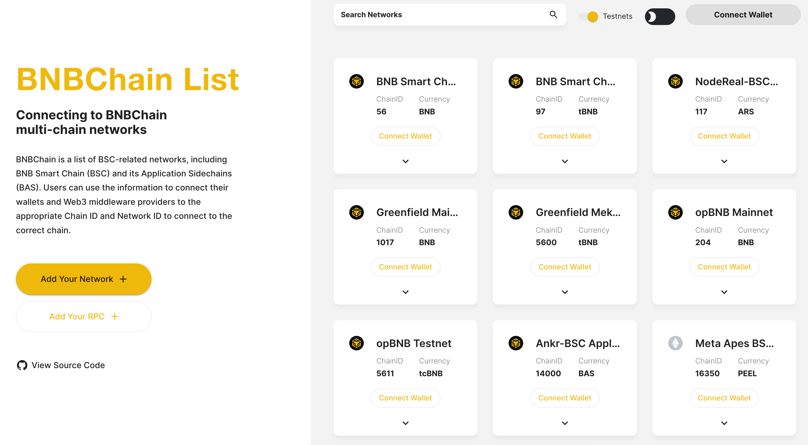

# Wallet Configuration

In this guide, you will learn how to use the extension wallets to interact with Greenfield. You can also add BNB Greenfield network according to the [RPC Endpoints](../for-developers/network-endpoint/endpoints.md) manually.

## Supported Wallets
* [Trust wallet](https://trustwallet.com/)
* [MetaMask](https://metamask.io/)
* [Ledger](https://www.ledger.com/)

We assume you have installed Trust Wallet or MetaMask and have an account, if not, please refer to the download link of [Trust Wallet](https://chrome.google.com/webstore/detail/trust-wallet/egjidjbpglichdcondbcbdnbeeppgdph) and [MetaMask](https://metamask.io/download/)
to install it.

## Add Greenfield Network
1. Visit [BNB Chain List](https://www.bnbchainlist.org/).

2. Click **Connect Wallet**.

3. Find **Greenfield Mainnet** or **Greenfield Testnet**, and click **Add To Wallet** to add new RPC in Trust Wallet or Metamask.

4. When extension wallet prompts a window, click **Approve**.

