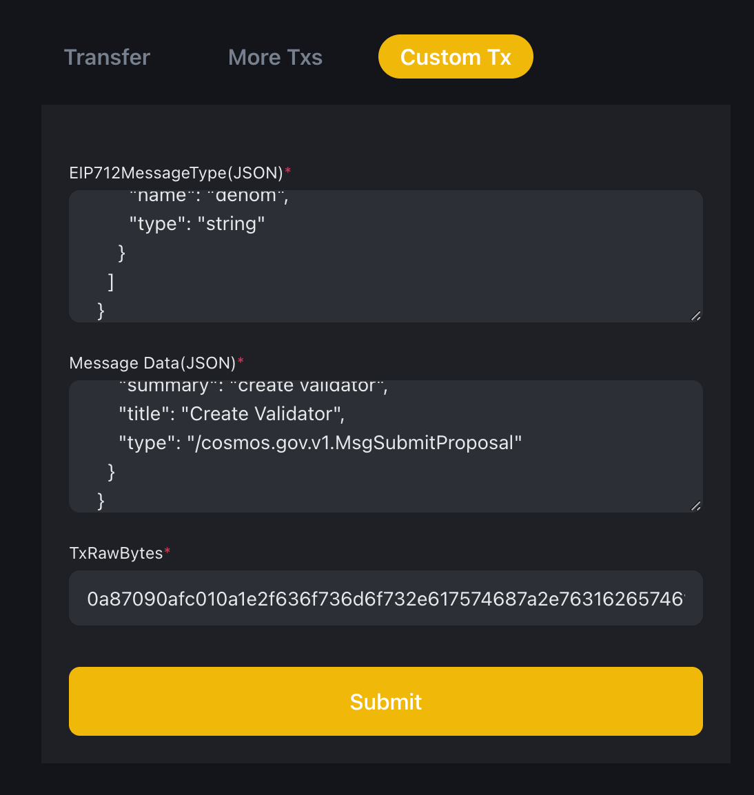

# Become Validator

## Minimum Requirements

- Number of BNB to be staked: `1000BNB`
- Hardware Requirements:  Desktop or laptop hardware running recent versions of Mac OS X, or Linux.
- CPU: 4 cores
- RAM: 12 GB
- HDD/SDD: 1 TB
- Bandwidth: 1 MB/s
- Slashing details: No slashing will occur for validator so far.

## Setting up Validator Node

### 1. Install Fullnode

Follow the instructions [here to set up a full node](run-node.md).

### 2. Prepare validator, delegator, validator BLS, relayer, and challenger accounts

!!! warning
    The current key generation and storage procedures are not very secure. It is highly recommended to implement a more  
    robust method, particularly when dealing with keys like the `delegator` and `operator` keys.
    
    For enhanced security and best practices, the usage of the `Cold Wallet` and `MPC Wallet` is strongly encouraged.
    These wallets are fully compatible with the `gnfd-tx-sender` tool, you can refer to [transaction data](../gnfd-cli.md#transaction-data) for more details.

!!! note
    The `keyring-backend` supports multiple storage backends, some of which may not be available on all operating systems.
    See more details [here](../../core-concept/accounts.md#key-management).

```bash
gnfd keys add validator --keyring-backend test
gnfd keys add delegator --keyring-backend test
gnfd keys add validator_bls --keyring-backend test --algo eth_bls
gnfd keys add validator_relayer --keyring-backend test
gnfd keys add validator_challenger --keyring-backend test
```

!!! tip
    Alternatively, if you choose a different $KEY_HOME location and you are not using the suggested default `~/.gnfd`, you may start the full node by using below script, where $KEY_HOME is your selected directory.

```bash
gnfd keys add validator --keyring-backend test --home ${KEY_HOME}
gnfd keys add delegator --keyring-backend test --home ${KEY_HOME}
gnfd keys add validator_bls --keyring-backend test --algo eth_bls --home ${KEY_HOME}
gnfd keys add validator_relayer --keyring-backend test --home ${KEY_HOME}
gnfd keys add validator_challenger --keyring-backend test --home ${KEY_HOME}
```

### 3.  Obtain validator, delegator, validator BLS, relayer, and challenger account addresses

!!! note
    Ensure you choose the correct --keyring-backend and that --home is set correctly if you saved the files in a custom folder in `step 2`.

```bash
VALIDATOR_ADDR=$(gnfd keys show validator -a --keyring-backend test)
DELEGATOR_ADDR=$(gnfd keys show delegator -a --keyring-backend test)
RELAYER_ADDR=$(gnfd keys show validator_relayer -a --keyring-backend test)
CHALLENGER_ADDR=$(gnfd keys show validator_challenger -a --keyring-backend test)
VALIDATOR_BLS=$(gnfd keys show validator_bls --keyring-backend test --output json | jq -r '.pubkey_hex')
VALIDATOR_BLS_PROOF=$(gnfd keys sign ${VALIDATOR_BLS} --keyring-backend test --from validator_bls)
VALIDATOR_NODE_PUB_KEY=$(cat ${CONFIG_PATH}/config/priv_validator_key.json | jq -r '.pub_key.value')
```

### 4. Submit a Create Validator Proposal
Replace the values in the following JSON and save it as create_validator_proposal.json:

- `${NODE_NAME}`: A custom human-readable name for this node.
- `${VALIDATOR_NODE_PUB_KEY}`: The consensus key generated in step 1 (stored in ${HOME}/.gnfd/config/priv_validator_key.json by default).
- `${VALIDATOR_ADDR}`: The operator address created in step 2.
- `${DELEGATOR_ADDR}`: The delegator address created in step 2.
- `${VALIDATOR_BLS}`: The BLS key created in step 2.
- `${VALIDATOR_BLS_PROOF}`: The BLS proof created in step2.
- `${RELAYER_ADDR}`: The relayer address created in step 2.
- `${CHALLENGER_ADDR}`: The challenger address created in step 2.

```json
{
 "messages": [
  {
   "@type": "/cosmos.staking.v1beta1.MsgCreateValidator",
   "description": {
    "moniker": "${NODE_NAME}",
    "identity": "",
    "website": "",
    "security_contact": "",
    "details": ""
   },
   "commission": {
    "rate": "0.070000000000000000",
    "max_rate": "1.000000000000000000",
    "max_change_rate": "0.010000000000000000"
   },
   "min_self_delegation": "1000000000000000000000",
   "delegator_address": "${DELEGATOR_ADDR}",
   "validator_address": "${VALIDATOR_ADDR}",
   "pubkey": {
    "@type": "/cosmos.crypto.ed25519.PubKey",
    "key": "${VALIDATOR_NODE_PUB_KEY}"
   },
   "value": {
    "denom": "BNB",
    "amount": "1000000000000000000000"
   },
   "from": "0x7b5Fe22B5446f7C62Ea27B8BD71CeF94e03f3dF2",
   "relayer_address": "${RELAYER_ADDR}",
   "challenger_address": "${CHALLENGER_ADDR}",
   "bls_key": "${VALIDATOR_BLS}", 
   "bls_proof": "${VALIDATOR_BLS_PROOF}"
  }
 ],
 "metadata": "",
 "title": "Create ${NODE_NAME} Validator",
 "summary": "create ${NODE_NAME} validator",
 "deposit": "1000000000000000000BNB"
}
```

#### 4.1 Run create validator command to submit the proposal by local keys. Ensure the delegator account has enough BNB tokens.

!!! info
    If you are utilizing the `Cold Wallet` or `MPC wallet`, please proceed to step [#4.2](#42-submit-the-proposal-by-gnfd-tx-sender-ensure-the-delegator-account-has-enough-bnb-tokens).

<Tabs>
<TabItem value="mainnet" label="Mainnet">

```bash
gnfd tx staking create-validator ./create_validator_proposal.json --keyring-backend test --chain-id "greenfield_1017-1" --from ${DELEGATOR_ADDR} --node "https://greenfield-chain.bnbchain.org:443" -b sync --gas "200000000" --fees "1000000000000000000BNB" --yes
```

</TabItem>
<TabItem value="testnet" label="Testnet">

```bash
gnfd tx staking create-validator ./create_validator_proposal.json --keyring-backend test --chain-id "greenfield_5600-1" --from ${DELEGATOR_ADDR} --node "https://gnfd-testnet-fullnode-tendermint-us.bnbchain.org:443" -b sync --gas "200000000" --fees "1000000000000000000BNB" --yes
```

</TabItem>
</Tabs>

#### 4.2 Submit the proposal by `gnfd-tx-sender`. Ensure the delegator account has enough BNB tokens.

Run command to generate the transaction details.
```bash
gnfd tx staking create-validator ./create_validator_proposal.json --from ${DELEGATOR_ADDR} --print-eip712-msg-type
```

Submit the transaction using [gnfd-tx-sender](https://gnfd-tx-sender.nodereal.io/).
Please refer to [this guide](../gnfd-cli.md#transaction-data) for instructions.



### 5. Wait for the voting until the Proposal is passed.

After submitting the proposal successfully, you must wait for the voting to be completed and the proposal to be approved.
It will last 7days on mainnet while 1 day on testnet. Once it has passed and is executed successfully, 
you can verify that the node has become a validator. 

!!! warning
    Please ensure that the validator node is running before it is selected. And the validator is responsible for
    [running relayer](run-relayer.md) and [runing challenger](run-challenger.md), please ensure all these services are
    running as expected.

### 6. Query all validators

=== "Mainnet"
    ```bash
    gnfd query staking validators --node "https://greenfield-chain.bnbchain.org:443"
    ```

=== "Testnet"
    ```bash
    gnfd query staking validators --node "https://gnfd-testnet-fullnode-tendermint-us.bnbchain.org:443"
    ```
