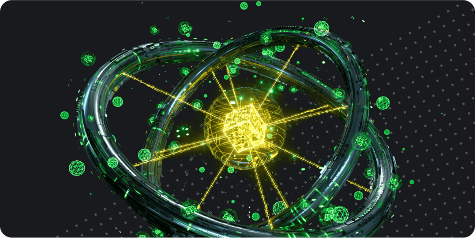

---
hide:
- toc

title: BNB Greenfield
---

    

        <h1>BNB Greenfield</h1></h1>
        
BNB Greenfield is a cutting-edge decentralized storage and blockchain storage solution, designed to harness the power of decentralized technology in the field of data ownership and the data economy. The platform focuses on providing decentralized data management and access and EVM programmability, to revolutionize the data economy by simplifying the process of storing and managing data, while connecting data ownership with the DeFi context of BNB Chain.

    

    

        
    

    <a href="./getting-started/dcellar">
        
Get Started

        
Dive into what is BNB Greenfield and start the journey with Greenfield.

    </a>
    <a href="./for-developers/tutorials/overview">
        
Build on Greenfield

        
Start building dapps to create value based on the data assets and its related economy.

    </a>
    <a href="./core-concept/cross-chain/programmability/">
        
EVM Programmability

        
The real power of the Greenfield lies in its programmability to support the creation of value based on the data assets and its related economy.

    </a>
    <a href="./for-validator/overview">
        
Greenfield Blockchain

        
Get familiar with the Greenfield Blockchain and explore its main modules.

    </a>
    <a href="./storage-provider/overview">
        
Storage Provider

        
Explore the Storage Provider.

    </a>
    <a href="./for-developers/apis-and-sdks">
        
APIs and SDKs

        
Utilize the APIs and SDKs to build the app

    </a>

