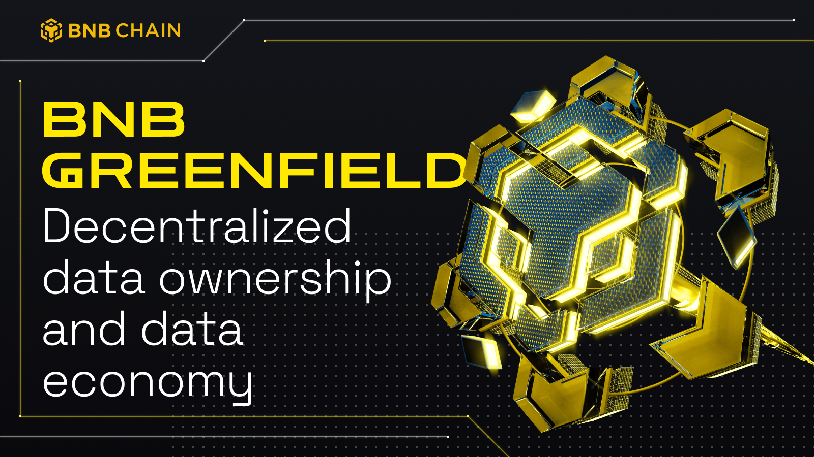

---
title: BNB Greenfield Introduction
description: BNB Greenfield is a decentralized storage and blockchain storage solution that simplifies data management and access while connecting data ownership with the DeFi context of BNB Chain.
keywords: [BNB Greenfield, decentralized storage, blockchain storage solution, decentralized storage providers]
sidebar_label: What is BNB Greenfield
---

# BNB Greenfield Overview

BNB Greenfield is a decentralized storage and blockchain storage solution platform that aims to revolutionize data ownership and the data economy.

## What is BNB Greenfield

BNB Greenfield is a cutting-edge decentralized storage and blockchain storage solution, designed to harness the power of decentralized technology in the field of data ownership and the data economy. The platform focuses on providing decentralized data management and access, to revolutionize the data economy by simplifying the process of storing and managing data, while connecting data ownership with the DeFi context of BNB Chain.

What sets Greenfield apart from existing centralized and decentralized storage systems are its three key components:

- It allows Ethereum-compatible addresses to create and manage both data and token assets.

- It natively links data permissions and management logic onto BSC as exchangeable assets and smart contract programs with all other assets.

- It provides developers with similar API primitives and performance as popular existing Web2 cloud storage.

The ultimate goal of Greenfield is to establish a foundation for new data economy and dApp models, which will undoubtedly aid in the development and evolution of the foundation for Web3.

## Why BNB Greenfield

The cryptocurrency industry has experienced significant growth and adoption, with the likes of tokens, stablecoins, and DeFi covering various economic scenarios. However, certain areas like credit, real-world asset (RWA) tokenizations, and data remain inadequately innovated. Consequently, BNB Greenfield has been created to focus on ***data***.

A crucial issue that the BNB Greenfield project aims to address is that the value of a data asset is not self-evident when held by one person. The value of data assets increases when shared and leveraged by multiple parties, which stems from the ability to write, read, grant rights for sharing data, and even execute data to generate another. These abilities have financial traits that are tradable, and such trades can produce even more value and benefit two parties rather than just one.

We foresee the need to create a new Web3 infrastructure for data, as two major features are still missing: a performant, convenient, and friendly decentralized storage infra, and the data-focused smart contract synergy.
Hence, we aim to create "BNB Greenfield," a new BNB side blockchain and relevant infrastructure that allows users and developers to:

1. "login" with anonymous cryptographic-based keys (IDs);

2. create, read, share, and even execute data, with a user experience that is on par with the state-of-the-art cloud storage services today, and at a low cost;

3. fully own their data assets and control who can use them and how;

4. easily put their data assets into a wide, smart-contract-based economic context to gain financial value with them.

In summary, BNB Greenfield seeks to offer users greater freedom in creating, owning, sharing, executing, and trading their data assets, while also providing transparency on how their data is owned and used.

## How BNB Greenfield Works

BNB Greenfield operates on two layers:

1. It is built on a new, storage-focused blockchain; and

2. It consists of a network of "storage providers".

The [BNB Greenfield Blockchain](./for-validator/overview.md) maintains the ledger for users and records the storage metadata as the common blockchain state data. Its native token for gas and governance is BNB, which is transferred from BNB Smart Chain. Additionally, BNB Greenfield blockchain has its own staking logic designed for governance.

The [Storage Providers (SP)](./storage-provider/overview.md) are storage service infrastructures provided by organizations or individuals that use Greenfield as the ledger and the single source of truth. Each SP is responsible for responding to user requests to upload and download data, while also serving as the gatekeeper for user rights and authentications.

Together, BNB Greenfield blockchain and the SPs comprise a decentralized object storage system that serves as the core of this new economy. Developers can construct decentralized applications (dApps) using the BNB Greenfield platform, which can act as client tools that facilitate user interactions with Greenfield; or applications that provide significant value to users' real lives using Greenfield as their infrastructure. These applications will use blockchain addresses as user identifiers and connect with features and smart contracts on the Greenfield blockchain, Greenfield SPs, and BNB Chain.

A native cross-chain bridge exists between BSC and BNB Greenfield blockchain. While it is cheaper to create and access data on Greenfield, the relevant data operation can be transferred to BSC and integrated with DeFi smart contract systems to generate new business models.

## Ecosystem
From Storage Providers and BNB staker to developers, there are a variety of individuals and entities that play a critical role in the growth and success of Greenfield. We'll dive into the unique contributions and responsibilities of each group, and explore how they work together to shape the future of Greenfield.

### Greenfield Actors

#### Validators

The Greenfield blockchain operates as a Proof-of-Stake (PoS) blockchain and has its own set of validators chosen through an election process based on PoS logic.

The Validators have a vital responsibility of ensuring the security of the Greenfield blockchain. They are actively involved in the governance and staking of the blockchain, and their role is similar to other PoS blockchain networks. Additionally, they form a peer-to-peer network that plays a crucial role in the overall functioning of the blockchain.

In addition to their governance responsibilities, validators also accept and process transactions, which enables users to operate on the objects stored on the Greenfield blockchain. They are responsible for maintaining the metadata of Greenfield and ensure that the blockchain state acts as a control panel for both Storage Providers (SPs) and users.
Both parties rely on the validators to accurately update and utilize this state in order to operate, store, and access their object storage.

#### Storage Providers (SPs)
Storage Providers (SPs) are a crucial part of the Greenfield blockchain. They offer storage service infrastructures to individuals and organizations. Using the Greenfield blockchain as the ledger and single source of truth, SPs maintain secure and reliable storage.

Each Service Provider (SP) is accountable for handling user requests to upload and download data. They act as gatekeepers for user rights and authentications, which makes them integral in ensuring the security and accessibility of user data at all times.

For further details on storage providers, kindly explore our dedicated [Storage Provider's page](https://github.com/bnb-chain/greenfield/blob/master/docs/modules/storage-provider.md).

### Greenfield Features

#### dApps
Greenfield dApps are applications that leverage the unique features of the Greenfield blockchain to solve various problems for their users. These dApps are designed to utilize Greenfield storage and related economic traits, providing a reliable and secure platform for creating and managing data.

Users can interact with the BNB Greenfield Core Infrastructure through the use of BNB Greenfield dApps, which are decentralized applications that enable seamless interaction with the Greenfield ecosystem. Furthermore, the Greenfield blockchain provides an intuitive smart contract library on the cross-chain facility, making it easy for dApp developers to integrate these features into their applications. This user-friendly approach allows developers to efficiently build and deploy dApps that can solve real-world problems.

#### Relayers
The Greenfield Relayer is a powerful bi-directional relaying service designed to facilitate seamless communication between Greenfield and BSC/opBNB. It can only be operated by Greenfield validators and functions as a standalone process.

This innovative system independently monitors and tracks cross-chain events that take place on both the Greenfield and BSC/opBNB networks, storing this data securely in a database. When an event is confirmed, the relayer generates a Boneh–Lynn–Shacham (BLS) signed message that is then shared through the P2P network on the Greenfield network, known as "the vote".

As more votes are collected, the Greenfield Relayer assembles the necessary cross-chain package transaction and submits it to either the BSC/opBNB or Greenfield network. This streamlined process ensures that communication between the two networks is efficient and error-free.

#### Challenge Verifier
Challenge Verifier is an off-chain service that verifies data availability, data integrity and service quality by monitoring storage provider’s activities. This mechanism works by penalizing and gradually eliminating storage providers with poor service quality, in order to ensure the good performance and reliability of the entire network.

To elaborate, Challenge Verifier constantly checks the storage providers in the network by tasking them with challenges to prove their reliability. The challenges may include storing specific pieces of data or responding to requests within a certain time limit. Providers that fail these challenges will be punished by slash their staked BNB.

By using Challenge Verifier, the network can ensure that only reliable and trustworthy storage providers are allowed to participate, protecting the network from any potential data loss, corruption, or low-quality service. Additionally, Challenge Verifier creates a competitive environment for storage providers, motivating them to continuously improve their services to avoid penalties and stay in the network.

Challenge Verifier can only be operated by Greenfield validators right now, and will open to public in the future.

### Explore and Participate in BNB Greenfield

- [Quick Start with BNB Greenfield](getting-started/wallet-configuration.md)
- [Overview about Greenfield Blockchain](for-validator/overview.md)
- [Overview about Storage Provider](storage-provider/overview.md)
- [Pricing Calculator](https://dcellar.io/pricing-calculator)
- [Become a Validator](https://github.com/bnb-chain/greenfield/blob/master/docs/blockchain-cli/validator-staking.md)
- [Become a Storage Provider](https://github.com/bnb-chain/greenfield/blob/master/docs/blockchain-cli/storage-provider.md)
- [Own Your Data](https://github.com/bnb-chain/greenfield/blob/master/docs/blockchain-cli/storage.md)
