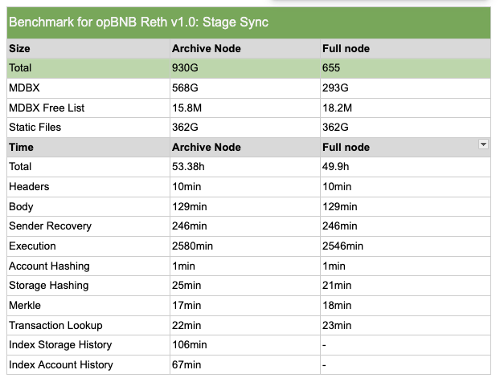
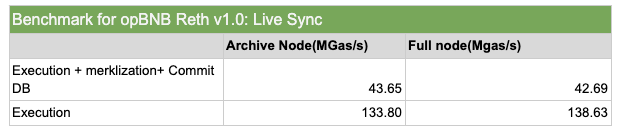

# Reth Node for opBNB

OpBNB Reth is a Rust client developed to provide support for the opBNB network. It aims to enhance client diversity and performance on the BNB Chain.

## Hardware Specifications

To run OpBNB Reth effectively, ensure your system meets the following hardware requirements:

* CPU with 16+ cores
* 128GB RAM
* High-performance NVMe SSD with at least 3TB of free space
* A broadband internet connection with upload/download speeds of 25 MB/s

## Running opBNB Reth Node

The opBNB Reth is an [execution client](https://ethereum.org/en/developers/docs/nodes-and-clients/#execution-clients) for
opBNB network. You need to run op-node along with op-reth to synchronize with the opBNB network.

**It's important to note that both op-node and op-reth must use the same JWT secret file for authentication.**
You can use the following command to generate JWT secret file and copy to the workdir for running op-node and op-reth.
```shell
openssl rand -hex 32 > jwt.txt
```

### Running OP Node
1. Download source code and build
```shell
git clone https://github.com/bnb-chain/opbnb
cd opbnb
make op-node
```

2. Start op-node
```shell
# for mainnet
export network=mainnet
export L1_RPC=https://bsc-dataseed.bnbchain.org
export P2P_BOOTNODES="enr:-J24QA9sgVxbZ0KoJ7-1gx_szfc7Oexzz7xL2iHS7VMHGj2QQaLc_IQZmFthywENgJWXbApj7tw7BiouKDOZD4noWEWGAYppffmvgmlkgnY0gmlwhDbjSM6Hb3BzdGFja4PMAQCJc2VjcDI1NmsxoQKetGQX7sXd4u8hZr6uayTZgHRDvGm36YaryqZkgnidS4N0Y3CCIyuDdWRwgiMs,enr:-J24QPSZMaGw3NhO6Ll25cawknKcOFLPjUnpy72HCkwqaHBKaaR9ylr-ejx20INZ69BLLj334aEqjNHKJeWhiAdVcn-GAYv28FmZgmlkgnY0gmlwhDTDWQOHb3BzdGFja4PMAQCJc2VjcDI1NmsxoQJ-_5GZKjs7jaB4TILdgC8EwnwyL3Qip89wmjnyjvDDwoN0Y3CCIyuDdWRwgiMs"

# for testnet
# it's better to replace the L1_RPC with your own BSC Testnet RPC Endpoint for stability
# export network=testnet
# export L1_RPC=https://bsc-testnet.bnbchain.org
# export P2P_BOOTNODES="enr:-J24QGQBeMsXOaCCaLWtNFSfb2Gv50DjGOKToH2HUTAIn9yXImowlRoMDNuPNhSBZNQGCCE8eAl5O3dsONuuQp5Qix2GAYjB7KHSgmlkgnY0gmlwhDREiqaHb3BzdGFja4PrKwCJc2VjcDI1NmsxoQL4I9wpEVDcUb8bLWu6V8iPoN5w8E8q-GrS5WUCygYUQ4N0Y3CCIyuDdWRwgiMr,enr:-J24QJKXHEkIhy0tmIk2EscMZ2aRrivNsZf_YhgIU51g4ZKHWY0BxW6VedRJ1jxmneW9v7JjldPOPpLkaNSo6cXGFxqGAYpK96oCgmlkgnY0gmlwhANzx96Hb3BzdGFja4PrKwCJc2VjcDI1NmsxoQMOCzUFffz04eyDrmkbaSCrMEvLvn5O4RZaZ5k1GV4wa4N0Y3CCIyuDdWRwgiMr"

./op-node/bin/op-node \
  --l1.trustrpc \
  --sequencer.l1-confs=15 \
  --verifier.l1-confs=15 \
  --l1.http-poll-interval 60s \
  --l1.epoch-poll-interval 180s \
  --l1.rpc-max-batch-size 20 \
  --rollup.config=./assets/${network}/rollup.json \
  --rpc.addr=0.0.0.0 \
  --rpc.port=8546 \
  --p2p.sync.req-resp \
  --p2p.listen.ip=0.0.0.0 \
  --p2p.listen.tcp=9003 \
  --p2p.listen.udp=9003 \
  --snapshotlog.file=./snapshot.log \
  --p2p.bootnodes=$P2P_BOOTNODES \
  --metrics.enabled \
  --metrics.addr=0.0.0.0 \
  --metrics.port=7300 \
  --pprof.enabled \
  --rpc.enable-admin \
  --l1=${L1_RPC} \
  --l2=http://localhost:8551 \
  --l2.jwt-secret=./jwt.txt \
  --syncmode=execution-layer
```

### Running opBNB Reth Archive Node
1. Download source code and build
```shell
git clone https://github.com/bnb-chain/reth.git
cd reth
make build-op
```

2. Start op-reth
```shell
# for mainnet
export network=mainnet
export L2_RPC=https://opbnb-mainnet-rpc.bnbchain.org

# for testnet
# export network=testnet
# export L2_RPC=https://opbnb-testnet-rpc.bnbchain.org

./target/release/op-reth node \
    --datadir=./datadir \
    --chain=opbnb-${network} \
    --rollup.sequencer-http=${L2_RPC} \
    --authrpc.addr="0.0.0.0" \
    --authrpc.port=8551 \
    --authrpc.jwtsecret=./jwt.txt \
    --http \
    --http.api="eth, net, txpool, web3, rpc" \
    --log.file.directory ./datadir/logs
```

3. Alternatively, you can run the op-reth node with docker
```shell
# for mainnet
export network=mainnet
export L2_RPC=https://opbnb-mainnet-rpc.bnbchain.org

# for testnet
# export network=testnet
# export L2_RPC=https://opbnb-testnet-rpc.bnbchain.org

# check this for version of the docker image, https://github.com/bnb-chain/reth/pkgs/container/op-reth
export version=latest

# the directory where reth data will be stored
export data_dir=/xxx/xxx

# the directory where the jwt.txt file is stored
export jwt_dir=/xxx/xxx

docker run -d -p 8545:8545 -p 30303:30303 -p 30303:30303/udp -v ${data_dir}:/data -v ${jwt_dir}:/jwt \
    --name op-reth ghcr.io/bnb-chain/op-reth:${version} node \
    --datadir=/data \
    --chain=opbnb-${network} \
    --rollup.sequencer-http=${L2_RPC} \
    --authrpc.addr="0.0.0.0" \
    --authrpc.port=8551 \
    --authrpc.jwtsecret=/jwt/jwt.txt \
    --http \
    --http.api="eth, net, txpool, web3, rpc" \
    --log.file.directory /data/logs
```

### Running opBNB Reth Full Node

To run a full node, simply add the `--full` flag when starting the op-reth node.

## Benchmark Results

We benchmark [Reth(v1.0.0)](https://github.com/bnb-chain/reth/releases/tag/v1.0.0), [op-nodes(v0.4.2)](https://github.com/bnb-chain/opbnb/releases/tag/v0.4.2) on AWS [i4g.4xlarge](https://instances.vantage.sh/aws/ec2/i4g.4xlarge)(16 core 128G)  instance with NVMe SSD for opBNB.
It may take approximately 53 hours to sync the latest block on opBNB mainnet for an archive node and 50 hours for a full node.

The op-reth supports Stage Sync which is rearchitected for better performance for the initial sync from genesis and Live Sync.
The following table displays the total time to stage sync and storage distribution after catch up on opBNB network:



The result shows an encouraging 690 MGas/s result on historical sync in the last 1M blocks (the historical sync numbers represent pure execution time during "backfills").

The live sync performance on the opBNB network is not very optimistic. We conducted an observation of the metrics for blocks [30467068, 30429919]. 



The main reason for the underperformance of Live sync is that mdbx is not a write-friendly database. The commit db at the end of block execution takes up several tens of milliseconds, a challenge that becomes more pronounced for fast-blocking layer 2 solutions like opBNB.