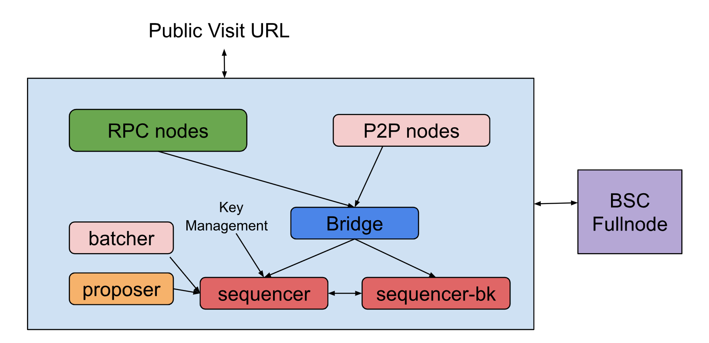
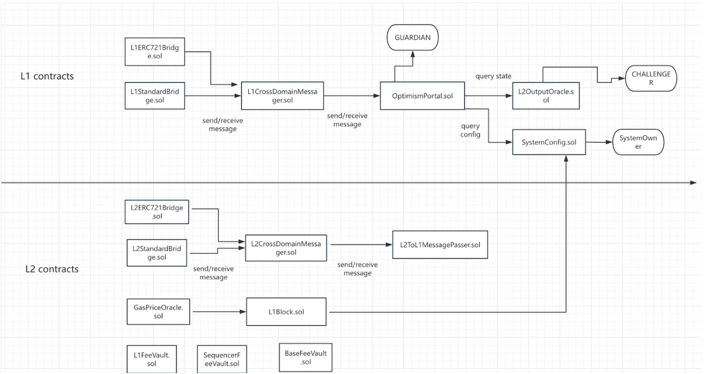

# Creating Your Own L2 Rollup Testnet

This tutorial is designed for developers who want to create l2 rollup testnet chain. You'll walk through the full deployment process and teach you all of the components that make up the l2 rollup, and you'll end up with your own l2 rollup testnet.

You can use this testnet to experiment and perform tests, or you can choose to modify the chain to adapt it to your own needs.

# Introduction

The opBNB stack is the Layer 2 scaling framework for the BNB Smart Chain powered by[ bedrock version](https://community.optimism.io/docs/developers/bedrock/) of Optimism OP Stack. It works by offloading transaction processing and resource usage from the BNB Smart Chain, while still posting data to the underlying mainnet. Users can build their own L2 network with the framework. And then they can interact with the network by depositing funds from BSC and using applications and contracts on the network. Sequencers then aggregate transactions, compute state transitions and submit them to the rollup contract on BSC. Provers generate cryptographic proofs that prove the validity of these state transitions, and Verifiers check the proofs to verify the L2 network’s state is correct. At its core, it allows users to deposit and withdraw funds, use smart contracts, and view network data with high throughput and low fees. 


# What You're Going to Deploy

## Deployment  Architecture



Sequencer  

Proposer 

Batcher 

Bridge node 

RPC node


When deploying a l2 rollup chain, you'll be setting up four different components. It's useful to understand what each of these components does before you start deploying your chain.

## Smart Contracts

The l2 rollup gives you the ability to deploy your own l2 rollup that use a Layer 1 blockchain to host and order transaction data. The l2 rollup uses several smart contracts on the L1 blockchain to manage aspects of the Rollup. You'll be using the L1 smart contracts found in the [contracts-bedrock package](https://github.com/bnb-chain/opbnb/tree/develop/packages/contracts-bedrock) within the [opbnb](https://github.com/bnb-chain/opbnb).

## Sequencer Node

The l2 rollup uses Sequencer node to gather proposed transactions from users and publish them to the L1 blockchain.

### Consensus Client 

The l2 rollup has a consensus client. The consensus client is responsible for determining the list and ordering of blocks and transactions that are part of your blockchain. In this tutorial you'll be using the [op-node](https://github.com/bnb-chain/opbnb/tree/develop/op-node) found within the [opbnb](https://github.com/bnb-chain/opbnb).

### Execution Client

The l2 rollup has an execution client. The execution client is responsible for executing transactions and storing/updating the state of the blockchain. In this tutorial you'll be using the [op-geth](https://github.com/bnb-chain/op-geth) found within the [op-geth](https://github.com/bnb-chain/op-geth) repository.

Each of the Sequencer, Bridge, and RPC nodes runs both an op-node and an op-geth process—the sequencer start op-node process with a miner flag and the others run with fullnode flag  . The key difference between an RPC node and a bridge node is that an RPC node exposes a public endpoint for external users to access, while a bridge node is not externally reachable. The bridge node functions like a cache for sequencer node : it forwards incoming transactions to the sequencer, helping prevent the sequencer’s transaction pool from being overloaded.

## Batcher

The Batcher is a service that publishes transactions from the Sequencer to the L1 blockchain. The Batcher runs continuously alongside the Sequencer and publishes transactions in batches (hence the name) on a regular basis. You'll be using the [op-batcher](https://github.com/bnb-chain/opbnb/tree/develop/op-batcher) of the Batcher component found within the [opbnb](https://github.com/bnb-chain/opbnb).

## Proposer

The Proposer is a service responsible for publishing transactions results (in the form of L2 state roots) to the L1 blockchain. This allows smart contracts on L1 to read the state of the L2, which is necessary for cross-chain communication and reconciliation between state changes. You'll be using the [op-proposer](https://github.com/bnb-chain/opbnb/tree/develop/op-proposer) of the Proposer component found within the [opbnb](https://github.com/bnb-chain/opbnb).


# Software Dependencies

| Dependency | Version | Version Check Command |
| :--------: | :-----: | :-------------------: |
|    git     |   ^2    |     git --version     |
|     go     |  ^1.21  |      go version       |
|    node    |   ^20   |    node --version     |
|    pnpm    |   ^8    |    pnpm --version     |
|  foundry   | ^0.2.0  |    forge --version    |
|    make    |   ^3    |    make --version     |
|     jq     |  ^1.6   |     jq --version      |
|   direnv   |   ^2    |   direnv --version    |
|    gcc     |   ^13   |     gcc --version     |
|  libc-dev  |  ^2.35  |     ldd --version     |


# Hardware requirements

**CPU**: 4 × 2 GHz (or faster) 64‑bit processor cores 

**Memory**: 16 GB DDR4 RAM 

**For `op-geth` (execution layer)**:

- High‑performance SSD with sustained IOPS ≥ 20,000, **or** an enterprise-grade NVMe SSD (to ensure low latency under heavy state‑healing workloads) [gist.github](https://gist.github.com/yorickdowne/f3a3e79a573bf35767cd002cc977b038?utm_source=chatgpt.com)[docs.optimism](https://docs.optimism.io/operators/node-operators/tutorials/mainnet?utm_source=chatgpt.com)
- ≥ 3 TB capacity 

**For `op-node` (consensus & aggregation)**:

- Standard SSD (SATA or consumer NVMe) is sufficient, ≥ 500 GB

## Notes on Specific Dependencies

`node`

We recommend using the latest LTS version of Node.js (currently v20). [nvm](https://github.com/nvm-sh/nvm) is a useful tool that can help you manage multiple versions of Node.js on your machine. You may experience unexpected errors on older versions of Node.js.

`foundry`

It's recommended to use the scripts in the [opbnb's](https://github.com/bnb-chain/opbnb) package.json for managing foundry to ensure you're always working with the correct version. This approach simplifies the installation, update, and version checking process. Make sure to clone the [opbnb](https://github.com/bnb-chain/opbnb) locally before proceeding.

`direnv`

Parts of this tutorial use [direnv](https://direnv.net/) as a way of loading environment variables from `.envrc` files into your shell. This means you won't have to manually export environment variables every time you want to use them. `direnv` only ever has access to files that you explicitly allow it to see.

After [installing direnv](https://direnv.net/docs/installation.html), you will need to make sure that `direnv` is [hooked into your shell](https://direnv.net/docs/hook.html). Make sure you've followed [the guide on the `direnv` website](https://direnv.net/docs/hook.html), then close your terminal and reopen it so that the changes take effect (or source your config file if you know how to do that).

# Get Access to a BSC testnet Node

You'll be deploying a BSC l2 rollup that uses a Layer 1 blockchain to host and order transaction data.

This guide uses the BSC testnet as an L1 chain. You can also use other EVM-compatible blockchains, but you may run into unexpected errors. If you want to use an alternative network, make sure to carefully review each command and replace any BSC testnet values with the values for your network.

Since you're deploying your l2 rollup on BSC testnet, you'll need to have access to a BSC testnet node.

# Build the Source Code

You're going to be creating your own l2 rollup directly from source code instead of using a container system like [Docker](https://www.docker.com/). Although this adds a few extra steps, it means you'll have an easier time modifying the behavior of the l2 rollup if you'd like to do so. If you want a summary of the various components you'll be using, take another look at the [What You're Going to Deploy](#what-youre-going-to-deploy) section above.

## Build the opbnb

### Clone the opbnb

```
cd ~
git clone https://github.com/bnb-chain/opbnb.git
```

### Enter the opbnb

```
cd opbnb
```

### Check out the correct branch

You can choose the appropriate version according to your needs. The develop branch has the latest features.

```
git checkout -b v0.5.3 v0.5.3-hotfix
```

### Install dependencies

```
pnpm install
```

### Build the various packages inside of the opbnb

```
make op-node op-batcher op-proposer
```

## Build `op-geth`

### Clone op-geth

```
cd ~
git clone https://github.com/bnb-chain/op-geth.git
```

### Check out the correct branch

You can choose the appropriate version according to your needs. The develop branch has the latest features.

```
git checkout -b v0.5.7 
```

### Enter op-geth

```
cd op-geth
```

### Build op-geth

```
make geth
```

# Fill Out Environment Variables

You'll need to fill out a few environment variables before you can start deploying your chain.

### Enter the opbnb

```
cd ~/opbnb
```

### Duplicate the sample environment variable file

```
cp .envrc.example .envrc
```

### Fill out the environment variable file

Open up the environment variable file and fill out the following variables:

| Variable Name |                         Description                          |
| :-----------: | :----------------------------------------------------------: |
|  L1_RPC_URL   |                     URL for your L1 node                     |
|  L1_RPC_KIND  | Kind of L1 RPC you're connecting to, used to inform optimal transactions receipts fetching(Optional). |
|  L1_CHAIN_ID  |        The Chain id of L1 chain ( bsc testnet is 97)         |
| L1_BLOCK_TIME |             The block interval value of L1 CHAIN             |
|  L2_CHAIN_ID  |                The Chain id of Layer 2 chain                 |
| L2_BLOCK_TIME |             The block interval value of L2 CHAIN             |

# Generate Addresses

You'll need four addresses and their private keys when setting up the chain:

* The Admin address has the ability to upgrade contracts.
* The Batcher address publishes Sequencer transaction data to L1.
* The Proposer address publishes L2 transaction results (state roots) to L1.
* The Sequencer address signs blocks on the p2p network.

## Enter the opbnb

```
cd ~/opbnb
```

## Generate new addresses

```
./packages/contracts-bedrock/scripts/getting-started/wallets.sh
```

## Check the output

Make sure that you see output that looks something like the following:

```
Copy the following into your .envrc file:

# Admin account
export GS_ADMIN_ADDRESS=0xC18e23D98F121c48a56E19302D1B7FB9b82A0F2E
export GS_ADMIN_PRIVATE_KEY=0x5d5e555305c69711eb31dd24dd1530b137489c54ddc83afd421f581c3fbf6c67

# Batcher account
export GS_BATCHER_ADDRESS=0x7527Cc2860B71E654a98235c8CF5D8Ca792040FE
export GS_BATCHER_PRIVATE_KEY=0xf6c2a7cf909a41fc227b03cf6474c66eaff5e05b36a89394f5a5129598fa8d13

# Proposer account
export GS_PROPOSER_ADDRESS=0xeE7579518904123AE4b3BaB729A4B9c9c08D5658
export GS_PROPOSER_PRIVATE_KEY=0x95176e9e67c1b97b4b7aaedf66e0b34b446f8683d545b44214240f6f1cfa6891

# Sequencer account
export GS_SEQUENCER_ADDRESS=0xeCF961D156a2ce02E98Ad26E79De62BcFd403cfd
export GS_SEQUENCER_PRIVATE_KEY=0xbb019ddc5f081b2be0c1c9406f89887ba90f4c8efbe5c4073ee067e56d3107ea
```

## Save the addresses

Copy the output from the previous step and paste it into your `.envrc` file as directed.

## Fund the addresses

You will need to send BNB to the Admin, Proposer, and Batcher addresses. The exact amount of BNB required depends on the L1 network being used. You do not need to send any BNB to the Sequencer address as it does not send transactions.

It's recommended to fund the addresses with the following amounts when using BSC testnet:

* Admin — 1 BNB

* Proposer — 0.5 BNB

* Batcher — 2 BNB

  


# Load Environment variables

Now that you've filled out the environment variable file, you need to load those variables into your terminal.

## Enter the opbnb

```
cd ~/opbnb
```

## Load the variables with direnv

You're about to use `direnv` to load environment variables from the `.envrc` file into your terminal. Make sure that you've [installed `direnv`](https://direnv.net/docs/installation.html) and that you've properly hooked `direnv` into your shell.
Next you'll need to allow `direnv` to read this file and load the variables into your terminal using the following command.

```
direnv allow
```

`direnv` will unload itself whenever your `.envrc` file changes. You must rerun the following command every time you change the `.envrc` file.

## Confirm that the variables were loaded

After running `direnv allow` you should see output that looks something like the following (the exact output will vary depending on the variables you've set, don't worry if it doesn't look exactly like this):

```
direnv: loading ~/optimism/.envrc                                                            
direnv: export +DEPLOYMENT_CONTEXT +ETHERSCAN_API_KEY +GS_ADMIN_ADDRESS +GS_ADMIN_PRIVATE_KEY +GS_BATCHER_ADDRESS +GS_BATCHER_PRIVATE_KEY +GS_PROPOSER_ADDRESS +GS_PROPOSER_PRIVATE_KEY +GS_SEQUENCER_ADDRESS +GS_SEQUENCER_PRIVATE_KEY +IMPL_SALT +L1_RPC_KIND +L1_RPC_URL +PRIVATE_KEY +TENDERLY_PROJECT +TENDERLY_USERNAME
```

If you don't see this output, you likely haven't properly configured `direnv`. Make sure you've configured `direnv` properly and run `direnv allow` again so that you see the desired output.

If you don't want to use `direnv`, you can also set variables manually.

# Configure your network

Once you've built both repositories, you'll need to head back to the opbnb to set up the configuration file for your chain. Currently, chain configuration lives inside of the [contracts-bedrock package](https://github.com/bnb-chain/opbnb/tree/develop/packages/contracts-bedrock) in the form of a JSON file.

## Enter the opbnb

```
cd ~/opbnb
```

## Move into the contracts-bedrock package

```
cd packages/contracts-bedrock
```

## Generate the configuration file

Run the following script to generate the `getting-started.json` configuration file inside of the `deploy-config` directory.

```
./scripts/getting-started/config.sh
```

The script-based approach shown above is the one officially recommended by OP, and the generated configuration is the official version. However, we strongly recommend using the template method instead. A template is provided at the end of this document. You can use the information from getting-started.json together with the template to generate an OPBNB-style configuration

In the template, in addition to replacing the Chain Info and all address fields generated earlier, you must also specify the following three parameters:

1)l1BlockTag

2)l2OutputOracleStartingTimestamp

3)l2GenesisBlockTimestamp

The example script below demonstrates how to populate the configuration using our template.


```python
def prepareConfig(keys,paths,env):
    log.info('prepare qanet config starting')
    if os.path.exists(paths.qanet_config_path):
        log.info('qanet config already exists,skip')
        deploy_config = read_json(paths.qanet_config_path)
        env['L2_CHAIN_ID']=deploy_config['l2ChainID']
        env['BATCH_INBOX_ADDRESS']=deploy_config['batchInboxAddress']
        return

    deploy_config = read_json(paths.devnet_config_template_path)
    l1_rpc = env['L1_RPC_URL']
    l1BlockTag = blockTagGet(l1_rpc)["result"]
    log.info(l1BlockTag)
    l1BlockTimestamp = blockTimestampGet(l1_rpc,l1BlockTag)["result"]["timestamp"]
    log.info(l1BlockTimestamp)
    l1ChainId = chainId(l1_rpc)["result"]
    log.info(l1ChainId)
    l2ChainId = decide_l2_chain_id(paths,env)
    log.info(f'decide l2 chain id is:{l2ChainId}')
    env['L2_CHAIN_ID']=l2ChainId
    env['BATCH_INBOX_ADDRESS']='0xff0000000000000000000000000000000000'+str(l2ChainId)

    deploy_config['l1GenesisBlockTimestamp'] = l1BlockTimestamp
    deploy_config['l1StartingBlockTag'] = l1BlockTag
    deploy_config['l1ChainID'] = int(l1ChainId,16)
    deploy_config['l2ChainID'] = l2ChainId
    deploy_config['l2BlockTime'] = 1
    deploy_config['maxSequencerDrift'] = 600
    deploy_config['sequencerWindowSize'] = 57600
    deploy_config['channelTimeout'] = 1200
    deploy_config['p2pSequencerAddress'] = keys['op_p2p_address']
    deploy_config['batchInboxAddress'] = env['BATCH_INBOX_ADDRESS']
    deploy_config['batchSenderAddress'] = keys['op_batcher_address']
    deploy_config['l2OutputOracleSubmissionInterval'] = 240
    deploy_config['l2OutputOracleStartingTimestamp'] = int(l1BlockTimestamp,16)
    deploy_config['l1UseClique'] = False
    deploy_config['l2OutputOracleProposer'] = keys['op_proposer_address']
    deploy_config['l2OutputOracleChallenger'] = keys['op_admin_address']
    deploy_config['l2GenesisBlockGasLimit'] = '0x5f5e100'
    deploy_config['baseFeeVaultRecipient'] = keys['op_admin_address']
    deploy_config['l1FeeVaultRecipient'] = keys['op_admin_address']
    deploy_config['sequencerFeeVaultRecipient'] = keys['op_admin_address']
    deploy_config['proxyAdminOwner'] = keys['op_admin_address']
    deploy_config['finalSystemOwner'] = keys['op_admin_address']
    deploy_config['finalizationPeriodSeconds'] = 3
    deploy_config['l2GenesisBlockBaseFeePerGas'] = '0x5F5E100'
    deploy_config['enableGovernance'] = False
    deploy_config['governanceTokenSymbol'] = 'OPBNB'
    deploy_config['governanceTokenName'] = 'OPBNB'
    deploy_config['governanceTokenOwner'] = keys['op_admin_address']
    deploy_config['eip1559Denominator'] = 8
    deploy_config['eip1559DenominatorCanyon'] = 8
    deploy_config['eip1559Elasticity'] = 2
    deploy_config['fermat'] = 0
    deploy_config['l2GenesisDeltaTimeOffset'] = "0x0"
    deploy_config['L2GenesisEcotoneTimeOffset'] = "0x0"
    deploy_config['l2GenesisFjordTimeOffset'] = "0x0"
    deploy_config['snowTimeOffset'] = "0x0"
    deploy_config['haberTimeOffset'] = "0x0"
    deploy_config['wrightTimeOffset'] = "0x0"
    write_json(paths.qanet_config_path,deploy_config)
    shutil.copy(paths.qanet_config_path, paths.qanet_config_output_path)
    log.info(f'prepared qanet config,path:{paths.qanet_config_path},content:{deploy_config}')
    
    
    
 def blockTagGet(url):
    	return jsonRpcGet1(url,'{"jsonrpc":"2.0","method":"eth_blockNumber","params":[],"id":74}')
    
    
def blockTimestampGet(url,block_tag):
    return jsonRpcGet(url,f'{{"jsonrpc":"2.0","method":"eth_getBlockByNumber","params":["{block_tag}", false],"id":74}}')

def write_json(path, data):
    with open(path, 'w+') as f:
        json.dump(data, f, indent='  ')
def read_json(path):
    with open(path, 'r') as f:
        return json.load(f)
```

You can also fetch the three values—l1BlockTag, l2OutputOracleStartingTimestamp, and l2GenesisBlockTimestamp—via curl (here shown against BSC Testnet):

```bash
// get tag info
curl -s -X POST https://data-seed-prebsc-2-s2.bnbchain.org:8545  -H "Content-Type: application/json"   -d '{"jsonrpc":"2.0","method":"eth_blockNumber","params":[],"id":74}'


curl -s -X POST https://data-seed-prebsc-1-s1.bnbchain.org:8545   -H "Content-Type: application/json"   -d '{"jsonrpc":"2.0","method":"eth_getBlockByNumber","params":["0x2e10b2c", false],"id":74}'

// In the returned result, the timestamp field is your l2GenesisBlockTimestamp. And converting that value to a Unix‐style (seconds) timestamp gives you the l2OutputOracleStartingTimestamp.

```


## Review and change the configuration file (Optional)

If you'd like, you can review the configuration file that was just generated by opening up `deploy-config/getting-started.json` in your favorite text editor. 
You can change configuration values to fit your specific needs. Please refer the [Chain Configuration](./Chain-Configuration.md).
It's recommended to keep this file as-is for now so you don't run into any unexpected errors.


# Deploy the Create2 Factory (Optional)

If you're deploying opBNB to a network other than BSC testnet, you may need to deploy a Create2 factory contract to the L1 chain. This factory contract is used to deploy opBNB smart contracts in a deterministic fashion.

## Check if the factory exists

The Create2 factory contract will be deployed at the address `0x4e59b44847b379578588920cA78FbF26c0B4956C`. You can check if this contract has already been deployed to your L1 network with a block explorer or by running the following command:

```
cast codesize 0x4e59b44847b379578588920cA78FbF26c0B4956C --rpc-url $L1_RPC_URL
```

If the command returns 0 then the contract has not been deployed yet. If the command returns 69 then the contract has been deployed and you can safely skip this section.

## Fund the factory deployer

You will need to send some BNB to the address that will be used to deploy the factory contract, `0x3fAB184622Dc19b6109349B94811493BF2a45362`. This address can only be used to deploy the factory contract and will not be used for anything else. Send at least 1 BNB to this address on your L1 chain.

## Deploy the factory

Using `cast`, deploy the factory contract to your L1 chain:

```
cast publish --rpc-url $L1_RPC_URL 0xf8a58085174876e800830186a08080b853604580600e600039806000f350fe7fffffffffffffffffffffffffffffffffffffffffffffffffffffffffffffffe03601600081602082378035828234f58015156039578182fd5b8082525050506014600cf31ba02222222222222222222222222222222222222222222222222222222222222222a02222222222222222222222222222222222222222222222222222222222222222 
```

## Wait for the transaction to be mined

Make sure that the transaction is included in a block on your L1 chain before continuing.


## Verify that the factory was deployed

Run the code size check again to make sure that the factory was properly deployed:

```
cast codesize 0x4e59b44847b379578588920cA78FbF26c0B4956C --rpc-url $L1_RPC_URL
```

# Deploy the L1 contracts

Once you've configured your network, it's time to deploy the L1 contracts necessary for the functionality of the chain.

## Deploy the L1 contracts

Add .env file  in the current directory where you run the script or export follow content to .envrc file to make sure the following info can be loaded. The most important variable is DEPLOY_CONFIG_PATH, which should point to the configuration file you generated above. For example:

~~~bash
cat .env
```
DEPLOYMENT_OUTFILE="./deployments/L1/.deploy"    // The contract address information entered after deployment.
DEPLOY_CONFIG_PATH="./deploy-config/devnet.json"  // config file
DEPLOYMENT_CONTEXT="devnetL1"
IMPL_SALT="ethers phoenixtestnetnewimpl"
~~~

```
forge script scripts/Deploy.s.sol:Deploy --private-key $GS_ADMIN_PRIVATE_KEY --broadcast --rpc-url $L1_RPC_URL --slow
```

If you see a nondescript error that includes `EvmError: Revert` and `Script failed` then you likely need to change the `IMPL_SALT` environment variable. This variable determines the addresses of various smart contracts that are deployed via [CREATE2](https://eips.ethereum.org/EIPS/eip-1014). If the same `IMPL_SALT` is used to deploy the same contracts twice, the second deployment will fail. You can generate a new `IMPL_SALT` by running `direnv` allow anywhere in the opbnb.

### L1 Contracts

| **Contracts**          | **Description**                                              | **comments** |
| ---------------------- | ------------------------------------------------------------ | ------------ |
| SystemConfig           | Responsible for saving the system configuration and providing the ability to change it online.These configurations will be used by L2 block derivation process including overhead, scalar, batcherHash, gasLimit, resourceConfig,etc. |              |
| L1StandardBridge       | Responsible for the transfer of ERC20 tokens between L1 and L2. |              |
| L1ERC721Bridge         | Responsible for the transfer of ERC721 tokens between L1 and L2. |              |
| L1CrossDomainMessenger | Responsible for delivering messages and being more user friendly. |              |
| OptimismPortal         | Responsible for passing messages between L1 and L2, which is equivalent to the portal of the optimistic network. Validate output root to execute L2 to L1 message call. |              |
| L2OutputOracle         | Responsible for storing the output root of each block of the L2 network. Other contracts or users can verify the validity of L2 data according to the output root. |              |



## Generate the L2 config files

Now that you've set up the L1 smart contracts you can automatically generate several configuration files that are used within the Consensus Client and the Execution Client.

You need to generate three important files:

1. `genesis.json` includes the genesis state of the chain for the Execution Client (sequencer).
2. `rollup.json` includes configuration information for the Consensus Client  (bridage node, rpcnode ,p2p node).
3. `jwt.txt` is a [JSON Web Token](https://jwt.io/introduction) that allows the Consensus Client and the Execution Client to communicate securely (the same mechanism is used in Ethereum clients).

## Navigate to the op-node package

```
cd ~/opbnb/op-node
```

## Create genesis files

Now you'll generate the `genesis.json` and `rollup.json` files within the op-node folder:

--deploy-config  和   --l1-deployments  flag info needs to be replaced by th  DEPLOY_CONFIG_PATH and DEPLOYMENT_OUTFILE   of .env or .envrc

```
go run cmd/main.go genesis l2 \
  --deploy-config ../packages/contracts-bedrock/deploy-config/getting-started.json \
  --l1-deployments ../packages/contracts-bedrock/deployments/getting-started/.deploy \
  --outfile.l2 genesis.json \
  --outfile.rollup rollup.json \
  --l1-rpc $L1_RPC_URL
```

Following is a example of rollup.json

```bash
{
  "genesis": {
    "l1": {
      "hash": "0xf48f87b325e9e8e73bf6964346588b5f56156128278e18d74aa7ee0ceba6a714",
      "number": 5792
    },
    "l2": {
      "hash": "0x0369f047f1e2d5975a4d088825b55d97bf1a0fc5c3df6e3aebd8f6e2f1e086f2",
      "number": 0
    },
    "l2_time": 1743059438,
    "system_config": {
      "batcherAddr": "0x29cb7f616ab5c10bc59a7ed59e95ae6a2f8f0949",
      "overhead": "0x0000000000000000000000000000000000000000000000000000000000000834",
      "scalar": "0x00000000000000000000000000000000000000000000000000000000000f4240",
      "gasLimit": 100000000
    }
  },
  "block_time": 1,
  "max_sequencer_drift": 600,
  "seq_window_size": 57600,
  "channel_timeout": 1200,
  "l1_chain_id": 714,
  "l2_chain_id": 3717,
  "regolith_time": 0,
  "canyon_time": 0,
  "delta_time": 0,
  "ecotone_time": 0,
  "fjord_time": 0,
  "volta_time": 1743094185,
  "fermat": 0,
  "snow_time": 0,
  "batch_inbox_address": "0xff00000000000000000000000000000000003717",
  "deposit_contract_address": "0x0da507e81c31bcfb7088524c31b9d99bd020a315",
  "l1_system_config_address": "0x89a9dcfc964e4b9b818be2552735ca17ce13e574",
  "protocol_versions_address": "0x0000000000000000000000000000000000000000",
  "da_challenge_contract_address": "0x0000000000000000000000000000000000000000"
}
```

The latest op code supports the `volta_time` configuration to support Volta fork which makes the block time as 500ms. If you need to set the Layer 2 block time to less than 1 second—i.e., support millisecond-level block intervals—there are two ways to achieve this:

1. Manually add `volta_time` to the configuration file and set it to `0`. This will enable 500ms block time immediately.
2. If you plan to perform a hard fork upgrade at a future time, set `volta_time` to a future timestamp. We will provide a separate document to explain the hard fork upgrade process.

## Create an authentication key

Next you'll create a [JSON Web Token](https://jwt.io/introduction) that will be used to authenticate the Consensus Client and the Execution Client. This token is used to ensure that only the Consensus Client and the Execution Client can communicate with each other. You can generate a JWT with the following command:

```
openssl rand -hex 32 > jwt.txt
```

## Copy genesis files into the op-geth directory

Finally, you'll need to copy the `genesis.json` file and `jwt.txt` file into `op-geth` so you can use it to initialize and run `op-geth`:

```
cp genesis.json ~/op-geth
cp jwt.txt ~/op-geth
```

# Initialize `op-geth`

You're almost ready to run your chain! Now you just need to run a few commands to initialize `op-geth`. You're going to be running a Sequencer node, so you'll need to import the `Sequencer` private key that you generated earlier. This private key is what your Sequencer will use to sign new blocks.

## Navigate to the op-geth directory

```
cd ~/op-geth
```

## Create a data directory folder

```
mkdir datadir
```

## Initialize op-geth

```
build/bin/geth init --datadir=datadir  --state.scheme path --db.engine genesis.json
```

# Start `op-geth`

Now you'll start `op-geth`, your Execution Client. Note that you won't start seeing any transactions until you start the Consensus Client in the next step.

## Open up a new terminal

You'll need a terminal window to run `op-geth` in.

## Navigate to the op-geth directory

```
cd ~/op-geth
```

## Run op-geth

You're using `--gcmode=archive` to run `op-geth` here because this node will act as your Sequencer. It's useful to run the Sequencer in archive mode because the `op-proposer` requires access to the full state. Feel free to run other (non-Sequencer) nodes in full mode if you'd like to save disk space.
It's important that you've already initialized the geth node at this point as per the previous section. Failure to do this will cause startup issues between `op-geth` and `op-node`.

```
 ./build/bin/geth \
  --datadir ./datadir \
  --http \
  --http.corsdomain="*" \
  --http.vhosts="*" \
  --http.addr=0.0.0.0 \
  --http.api=web3,debug,eth,txpool,net,engine \
  --ws \
  --ws.addr=0.0.0.0 \
  --ws.port=8546 \
  --ws.origins="*" \
  --ws.api=debug,eth,txpool,net,engine \
  --syncmode=full \
  --gcmode=archive \
  --nodiscover \
  --maxpeers=0 \
  --networkid=5611 （replace with your rollup chaind id ） \
  --authrpc.vhosts="*" \
  --authrpc.addr=0.0.0.0 \
  --authrpc.port=8551 \
  --txpool.globalslots=40000 \
  --txpool.globalqueue=10000 \
  --txpool.accountqueue=16 \
  --txpool.accountslots=16 \
  --txpool.pricelimit=1 \
  --txpool.nolocals=true \
  --txpool.reannouncetime=3m \
  --txpool.reannounceremotes=true \
  --cache=2000 \
  --authrpc.jwtsecret=./jwt.txt \
  --rollup.disabletxpoolgossip=true
```

# Start `op-node`

Once you've got `op-geth` running you'll need to run `op-node`. Like Ethereum, the opBNB has a Consensus Client (`op-node`) and an Execution Client (`op-geth`). The Consensus Client "drives" the Execution Client over the Engine API.   Each of the Sequencer, Bridge, P2P, and RPC nodes runs both an op-node and an op-geth process—the only distinction is the set of startup parameters supplied to the op-node.

## Open up a new terminal

You'll need a terminal window to run `op-node` in.

## Navigate to the op-node directory

```
cd ~/opbnb/op-node
```

## Run op-node as miner (sequencer)

```
./bin/op-node \
  --l2=http://localhost:8551 \
  --l2.jwt-secret=./jwt.txt \
  --sequencer.enabled \
  --sequencer.l1-confs=15 \
  --verifier.l1-confs=15 \
  --l1.http-poll-interval=3s \
  --l1.epoch-poll-interval=3s \
  --l1.rpc-max-batch-size=20 \
  --rollup.config=./rollup.json \
  --rpc.addr=0.0.0.0 \
  --rpc.port=8547 \
  --p2p.disable \
  --rpc.enable-admin \
  --p2p.sequencer.key=$GS_SEQUENCER_PRIVATE_KEY \
  --l1=$L1_RPC_URL \
  --l1.rpckind=$L1_RPC_KIND
```

Once you run this command, you should start seeing the `op-node` begin to sync L2 blocks from the L1 chain. Once the `op-node` has caught up to the tip of the L1 chain, it'll begin to send blocks to `op-geth` for execution. At that point, you'll start to see blocks being created inside of `op-geth`.
By default, your `op-node` will try to use a peer-to-peer to speed up the synchronization process. If you're using a chain ID that is also being used by others, like the default chain ID for this tutorial (42069), your `op-node` will receive blocks signed by other sequencers. These requests will fail and waste time and network resources. To avoid this, this tutorial starts with peer-to-peer synchronization disabled (`--p2p.disable`).

Once you have multiple nodes, you may want to enable peer-to-peer synchronization. You can add the following options to the `op-node` command to enable peer-to-peer synchronization with specific nodes:

```
--p2p.static=<nodes> \
--p2p.listen.ip=0.0.0.0 \
--p2p.listen.tcp=9003 \
--p2p.listen.udp=9003 \
```

You can alternatively also remove the `--p2p.static` option, but you may see failed requests from other chains using the same chain ID.

## Run as Bridage node or RPC node

```bash
./bin/op-node 
 	 --l2=http://localhost:8551 
   --l1.trustrpc
   --l2.jwt-secret=./jwt.txt 
   --sequencer.l1-confs=15
   --verifier.l1-confs=15
   --l1.http-poll-interval=3s
   --l1.epoch-poll-interval=3s
   --l1.rpc-max-batch-size=20
   --rollup.config=/server/rollup.json
   --rpc.addr=0.0.0.0 \
   --rpc.port=8547 \
   --p2p.disable \
   --rpc.enable-admin \
   --l1=$L1_RPC_URL \
   --l1.rpckind=$L1_RPC_KIND
    --l1.max-concurrency=20   --log.level=debug
   --syncmode=execution-layer
   --l1.max-concurrency=20

```

To run a Bridge node , you can refer to this command, you need to adjust the flags by your environment..


# Start `op-batcher`

The `op-batcher` takes transactions from the Sequencer and publishes those transactions to L1. Once these Sequencer transactions are included in a finalized L1 block, they're officially part of the canonical chain. The `op-batcher` is critical!

It's best to give the `Batcher` address at least 2 BNB to ensure that it can continue operating without running out of BNB for gas. Keep an eye on the balance of the `Batcher` address because it can expend BNB quickly if there are a lot of transactions to publish.

## Open up a new terminal

You'll need a terminal window to run `op-batcher` in.

## Navigate to the op-batcher directory

```
cd ~/opbnb/op-batcher
```

## Run op-batcher

```
./bin/op-batcher \
  --l2-eth-rpc=http://localhost:8545 \
  --rollup-rpc=http://localhost:8547 \
  --poll-interval=5s \
  --sub-safety-margin=30 \
  --num-confirmations=4 \
  --safe-abort-nonce-too-low-count=3 \
  --resubmission-timeout=30s \
  --rpc.addr=0.0.0.0 \
  --rpc.port=8548 \
  --rpc.enable-admin \
  --max-channel-duration=20 \
  --l1-eth-rpc=$L1_RPC_URL \
  --private-key=$GS_BATCHER_PRIVATE_KEY
```

The `--max-channel-duration=n` setting tells the `batcher` to write all the data to L1 every n L1 blocks. When it is low, transactions are written to L1 frequently and other nodes can synchronize from L1 quickly. When it is high, transactions are written to L1 less frequently and the `batcher` spends less BNB. If you want to reduce costs, either set this value to 0 to disable it or increase it to a higher value.

# Start `op-proposer`

## Open up a new terminal

You'll need a terminal window to run `op-proposer` in.

## Navigate to the op-proposer directory

```
cd ~/opbnb/op-proposer
```

## Run op-proposer

```
./bin/op-proposer \
  --poll-interval=1s \
  --rpc.port=8560 \
  --rollup-rpc=http://localhost:8547 \
  --l2oo-address=$(cat ../packages/contracts-bedrock/deployments/getting-started/.deploy | jq -r .L2OutputOracleProxy) \
  --private-key=$GS_PROPOSER_PRIVATE_KEY \
  --l1-eth-rpc=$L1_RPC_URL
```

# Connect Your Wallet to Your Chain

You now have a fully functioning l2 rollup chain with a Sequencer node running on http://localhost:8545. You can connect your wallet to this chain the same way you'd connect your wallet to any other EVM chain.

# Get BNB On Your Chain

Once you've connected your wallet, you'll probably notice that you don't have any BNB to pay for gas on your chain. The easiest way to deposit BNB into your chain is to send BNB directly to the `L1StandardBridge` contract.

## Navigate to the contracts-bedrock directory

```
cd ~/opbnb/packages/contracts-bedrock
```

## Get the address of the L1StandardBridgeProxy contract

```
cat deployments/getting-started/.deploy | jq -r .L1StandardBridgeProxy
```

## Send some BNB to the L1StandardBridgeProxy contract

Grab the L1 bridge proxy contract address and, using the wallet that you want to have BNB on your l2 rollup chain, send that address a small amount of BNB on L1. This will trigger a deposit that will mint BNB into your wallet on L2. It may take up to some minutes for that BNB to appear in your wallet on L2.

# See Your opBNB in Action

You can interact with your l2 the same way you'd interact with any other EVM chain. Send some transactions, deploy some contracts, and see what happens!


# Deploy config example

```bash
{
    "l1ChainID": 97,
    "l2ChainID": 4255,
    "l2BlockTime": 1,
    "maxSequencerDrift": 600,
    "sequencerWindowSize": 57600,
    "channelTimeout": 1200,
    "p2pSequencerAddress": "0x3224F068Fd97D2d4a91800D450EE19bfBCD6B6Ee",
    "batchInboxAddress": "0xff00000000000000000000000000000000000901",
    "batchSenderAddress": "0xB6e487a3cEcDe5e0E1793C98c2de1999a1319A2b",
    "cliqueSignerAddress": "0xf39Fd6e51aad88F6F4ce6aB8827279cffFb92266",
    "l1UseClique": false,
    "l1StartingBlockTag": "0x2fa3b94",
    "l2OutputOracleSubmissionInterval": 240,
    "l2OutputOracleStartingBlockNumber": 0,
    "l2OutputOracleStartingTimestamp": 1744595989,
    "l2OutputOracleProposer": "0x254811af494550Ee5e0945C23EC5E4E17c9dF1bC",
    "l2OutputOracleChallenger": "0x5E8fe030B465b448a78bA5Ef3c674Da25fDf67f5",
    "l2GenesisBlockGasLimit": "0x5f5e100",
    "l1BlockTime": 3,
    "baseFeeVaultMinimumWithdrawalAmount": "0x8ac7230489e80000",
    "l1FeeVaultMinimumWithdrawalAmount": "0x8ac7230489e80000",
    "sequencerFeeVaultMinimumWithdrawalAmount": "0x8ac7230489e80000",
    "baseFeeVaultWithdrawalNetwork": 0,
    "l1FeeVaultWithdrawalNetwork": 0,
    "sequencerFeeVaultWithdrawalNetwork": 0,
    "proxyAdminOwner": "0x5E8fe030B465b448a78bA5Ef3c674Da25fDf67f5",
    "baseFeeVaultRecipient": "0x5E8fe030B465b448a78bA5Ef3c674Da25fDf67f5",
    "l1FeeVaultRecipient": "0x5E8fe030B465b448a78bA5Ef3c674Da25fDf67f5",
    "sequencerFeeVaultRecipient": "0x5E8fe030B465b448a78bA5Ef3c674Da25fDf67f5",
    "finalSystemOwner": "0x5E8fe030B465b448a78bA5Ef3c674Da25fDf67f5",
    "superchainConfigGuardian": "0x5E8fe030B465b448a78bA5Ef3c674Da25fDf67f5",
    "finalizationPeriodSeconds": 3,
    "fundDevAccounts": true,
    "l2GenesisBlockBaseFeePerGas": "0x5F5E100",
    "gasPriceOracleOverhead": 2100,
    "gasPriceOracleScalar": 1000000,
    "gasPriceOracleBaseFeeScalar": 1368,
    "gasPriceOracleBlobBaseFeeScalar": 810949,
    "enableGovernance": false,
    "governanceTokenSymbol": "OPBNB",
    "governanceTokenName": "OPBNB",
    "governanceTokenOwner": "0x5E8fe030B465b448a78bA5Ef3c674Da25fDf67f5",
    "eip1559Denominator": 8,
    "eip1559DenominatorCanyon": 8,
        "eip1559Elasticity": 2,
    "l1GenesisBlockTimestamp": "0x67f88995",
    "l2GenesisRegolithTimeOffset": "0x0",
    "l2GenesisDeltaTimeOffset": "0x0",
    "l2GenesisCanyonTimeOffset": "0x0",
    "systemConfigStartBlock": 0,
    "requiredProtocolVersion": "0x0000000000000000000000000000000000000000000000000000000000000000",
    "recommendedProtocolVersion": "0x0000000000000000000000000000000000000000000000000000000000000000",
    "faultGameAbsolutePrestate": "0x03c7ae758795765c6664a5d39bf63841c71ff191e9189522bad8ebff5d4eca98",
    "faultGameMaxDepth": 50,
    "faultGameClockExtension": 0,
    "faultGameMaxClockDuration": 1200,
    "faultGameGenesisBlock": 0,
    "faultGameGenesisOutputRoot": "0xDEADBEEFDEADBEEFDEADBEEFDEADBEEFDEADBEEFDEADBEEFDEADBEEFDEADBEEF",
    "faultGameSplitDepth": 14,
    "faultGameWithdrawalDelay": 604800,
    "preimageOracleMinProposalSize": 10000,
    "preimageOracleChallengePeriod": 120,
    "proofMaturityDelaySeconds": 12,
    "disputeGameFinalityDelaySeconds": 6,
    "respectedGameType": 254,
    "useFaultProofs": false,
    "usePlasma": false,
    "daCommitmentType": "KeccakCommitment",
    "daChallengeWindow": 160,
    "daResolveWindow": 160,
    "daBondSize": 1000000,
    "daResolverRefundPercentage": 0,
    "fermat": 0,
    "L2GenesisEcotoneTimeOffset": "0x0",
    "l2GenesisFjordTimeOffset": "0x0",
    "snowTimeOffset": "0x0",
    "haberTimeOffset": "0x0",
    "wrightTimeOffset": "0x0"
}
                
```


# Configuration explain

## Chain Configuration

| **Item**                | **Type**    | **Description**                       | **中文补充描述**           | **Default Value** |
| ----------------------- | ----------- | ------------------------------------- | -------------------------- | ----------------- |
| Chain ID                | number      | Chain id                              | 链id                       |                   |
| Gas limit               | number      | The maximum gas usage of the block    | 区块最大gas使用量          | 100M              |
| Public RPC              | url         | Rpc domain name                       | 公开的Rpc 域名             |                   |
| Internal RPC            | URL         | URL                                   | 内部使用的RPC域名          |                   |
| l2BlockTime             | number      | L2 block time                         | l2 区块时间                | 0.5 second        |
| Withdraw time           | Time period | Withdraw challenge period             | Withdraw的挑战期           | 7 days            |
| Batcher Commit interval | Time period | Batcher interval for submitting data  | Batcher 提交数据的最大间隔 | 1 mins            |
| ProposerCommit interval | Time period | Proposer interval for submitting data | Proposer 提交数据的间隔    | 1 hour            |

## Gas fee Configuration

| **Item**    | **Type** | **Description**                                              | **中文补充描述**                                             | **Default Value** |
| ----------- | -------- | ------------------------------------------------------------ | ------------------------------------------------------------ | ----------------- |
| l1FeeScalar | number   | Gas fee to be Submitted to layer 1, can be configured by Layer 2 operators, which will decide whether layer 2 is profitable | 提交给 Layer 1 的 Gas 费用，可由 Layer 2 运营商配置，这将决定 Layer 2 是否盈利 | 1000000           |

## Governance Configuration

| **Item**                 | **Type**               | **Description**                                              | **中文补充描述**                                             | **Default Value**    |
| ------------------------ | ---------------------- | ------------------------------------------------------------ | ------------------------------------------------------------ | -------------------- |
| Support Governance Token | bool                   | Whether need to support Governance Token                     | 是否需要支持Governance Token                                 | false                |
| Governance Token Symbol  | String                 | Symbol for the token deployed by default to each OP Stack chain. | 默认部署到每个 OP BNB 链的代币符号。                         |                      |
| Governance Token Name    | Governance Token Owner | L2 Address                                                   | Address that will own the token contract deployed by default to every OP Stack based chain.Multisig address supported | 管理Governance Token |

## Custom Gas Token Configuration

| **Item**         | **Type**   | **Description**                                              | **中文补充描述**                            | **Default Value** |
| ---------------- | ---------- | ------------------------------------------------------------ | ------------------------------------------- | ----------------- |
| Token Name       | String     | Token name                                                   | Token 名称                                  |                   |
| Symbol           | String     | The symbol for the token is deployed by default.             | Token 符号                                  |                   |
| Decimal          | Number     | decimal                                                      | 小数位                                      | 18                |
| Total Supply     | Number     | Total supply                                                 | 总供应量                                    | 100,000,000       |
| Token Owner      | L2 Address | L2 Address that holds all the minted token Multisig address supported | 用于持有发行出来的token可以准备一个多签地址 |                   |
| Token icon image |            |                                                              |                                             |                   |

## Address Configuration

1） System Admin L1 Address 需要生成多签地址

2) Proposer Challenger L1 Address  可以复用 System Admin L1 Address 

| Item                  | Type       | Description                                                  | 中文补充描述                                                 | Value        |
| --------------------- | ---------- | ------------------------------------------------------------ | ------------------------------------------------------------ | ------------ |
| System Admin          | L1 Address | Address that will own all ownable contracts on L1 once the deployment is finished, including the ProxyAdmin contract. aka finalSystemOwner. | 管理l1的合约                                                 | 使用多签地址 |
| L2 Proxy Admin        | L2 Address | Address that will own the ProxyAdmin contract on L2. The L2 ProxyAdmin contract owns all of the Proxy contracts for every predeployed contract in the range 0x42...0000 to 0x42..2048. This makes predeployed contracts easily upgradeable. aka proxyAdminOwner. | 管理l2的合约可以使用多签地址                                 | 使用多签地址 |
| Base Fee Recipient    | L1 Address | L1 address that the base fees from all transactions on the L2 can be withdrawn to. aka baseFeeVaultRecipient. | Base fee的收款账户                                           |              |
| Tip Fee Recipient     | L1 Address | L1 address that the tip fees from all transactions on the L2 can be withdrawn to. aka sequencerFeeVaultRecipient. | 矿工费收款账户                                               |              |
| L1 Data Fee Recipient | L1 Address | L1 address that the L1 data fees from all transactions on the L2 can be withdrawn to. aka l1FeeVaultRecipient. | 数据由l2提交到l1的收费，这笔收费接受的账户                   |              |
| Proposer Challenger   | L1 Address | Address that is allowed to challenge output proposals submitted to the L2OutputOracle. aka l2OutputOracleChallenger. | 可以删除withdraw index可以使用多签，例如NR占有2/5席位，可以直接操作 |              |
| portalGuardian        | L1 Address | Address that has the ability to pause and unpause withdrawals | 可以停止withdraw *(和**Challenger共用一个地址**)*            |              |

# 