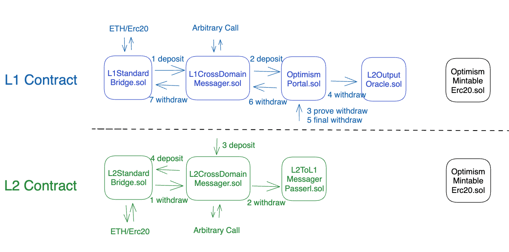

# opBNB Protocol addresses

The opBNB protocol contracts are smart contracts that enable the execution of transactions on the opBNB network. The main contracts are:

- batchInbox: This contract receives batches of transactions from the Sequencer on L1.
- batchSender: This contract is the authorised sender of batches to the batchInbox. It can be changed by the SystemConfig contract, which governs the parameters of the opBNB network.
- outputProposer: This contract proposes outputs for the opBNB nodes to execute. It receives inputs from the batchInbox and other sources, and generates outputs that are consistent with the opBNB protocol rules.

**Testnet:**

| **Name**        | **Address**                                                  |
| --------------- | ------------------------------------------------------------ |
| Batch Sender    | [0x1Fd6A75CC72f39147756A663f3eF1fc95eF89495](https://testnet.bscscan.com/address/0x1fd6a75cc72f39147756a663f3ef1fc95ef89495) |
| Batch Inbox     | [0xfF00000000000000000000000000000000005611](https://testnet.bscscan.com/address/0xff00000000000000000000000000000000005611) |
| Output Proposer | [0x4aE49f1f57358c13A5732cb12e656Cf8C8D986DF](https://testnet.bscscan.com/address/0x4ae49f1f57358c13a5732cb12e656cf8c8d986df) |

**Mainnet:**

| **Name**        | **Address**                                                  |
| --------------- | ------------------------------------------------------------ |
| Batch Sender    | [0xef8783382eF80Ec23B66c43575A6103dECA909c3](https://bscscan.com/address/0xef8783382eF80Ec23B66c43575A6103dECA909c3) |
| Batch Inbox     | [0xff00000000000000000000000000000000000204](https://bscscan.com/address/0xff00000000000000000000000000000000000204) |
| Output Proposer | [0xc235c904AD9EfcABfF4628E3279994A4c0A9d591](https://bscscan.com/address/0xc235c904AD9EfcABfF4628E3279994A4c0A9d591) |

###  

## L1 Contract Addresses

**Testnet**

| **Name**                          | **Description**                                              | **Address**                                                  |
| --------------------------------- | ------------------------------------------------------------ | ------------------------------------------------------------ |
| L1CrossDomainMessenger            | responsible for facilitating cross-domain communication on Layer 1 (L1) | [0x5b0c605c707979e8bDc2Ad9271A0388b3fD4Af3E](https://testnet.bscscan.com/address/0x5b0c605c707979e8bDc2Ad9271A0388b3fD4Af3E) |
| L1ERC721Bridge                    | This contract is likely an ERC-721 bridge that enables the transfer of non-fungible tokens (NFTs) between L1 and L2 | [0xad39e2cfa7d8d8B6c2d56244Bfb88990EC31Bb79](https://testnet.bscscan.com/address/0xad39e2cfa7d8d8B6c2d56244Bfb88990EC31Bb79) |
| L1ERC721BridgeProxy               | A proxy contract that may provide additional functionalities for the L1ERC721Bridge contract. | [0x17e1454015bFb3377c75bE7b6d47B236fd2ddbE7](https://testnet.bscscan.com/address/0x17e1454015bFb3377c75bE7b6d47B236fd2ddbE7) |
| L1StandardBridge                  | A standard bridge contract that enables the transfer of fungible tokens between L1 and L2. | [0xddB9EB847971DaA82e5dbe2745C429A3B2715B46](https://testnet.bscscan.com/address/0xddB9EB847971DaA82e5dbe2745C429A3B2715B46) |
| L2OutputOracle                    | This contract is an oracle on Layer 2 that provides output data to be used in smart contracts and applications | [0xD92aEF4473093C67A7696e475858152D3b2acB7c](https://testnet.bscscan.com/address/0xD92aEF4473093C67A7696e475858152D3b2acB7c) |
| L2OutputOracleProxy               | A proxy contract related to the L2OutputOracle, providing an interface or additional functionality. | [0xFf2394Bb843012562f4349C6632a0EcB92fC8810](https://testnet.bscscan.com/address/0xFf2394Bb843012562f4349C6632a0EcB92fC8810) |
| Lib_AddressManager                | This contract is a library used to manage addresses for various contracts in the system. | [0x4d07b9B1ffC70Fc824587573cfb6ef1Cc404AaD7](https://testnet.bscscan.com/address/0x4d07b9B1ffC70Fc824587573cfb6ef1Cc404AaD7) |
| OptimismMintableERC20Factory      | This is a factory contract for creating mintable ERC-20 tokens on the Layer 2 network. | [0x1AD11eA5426bA3A11c0bA8c4B89fd1BCa732025E](https://testnet.bscscan.com/address/0x1AD11eA5426bA3A11c0bA8c4B89fd1BCa732025E) |
| OptimismMintableERC20FactoryProxy | A proxy contract related to the OptimismMintableERC20Factory, providing an interface or additional functionality. | [0x182cE4305791744202BB4F802C155B94cb66163B](https://testnet.bscscan.com/address/0x182cE4305791744202BB4F802C155B94cb66163B) |
| OptimismPortal                    | This contract serves as a portal or gateway for interacting with the Optimism Layer 2 network. | [0x2d5D7bEe8ebEf17DE14dd6ADAE8271507994a6E0](https://testnet.bscscan.com/address/0x2d5D7bEe8ebEf17DE14dd6ADAE8271507994a6E0) |
| OptimismPortalProxy               | A proxy contract related to the OptimismPortal, providing an interface or additional functionality. | [0x4386C8ABf2009aC0c263462Da568DD9d46e52a31](https://testnet.bscscan.com/address/0x4386C8ABf2009aC0c263462Da568DD9d46e52a31) |
| PortalSender                      | This contract is involved in sending data or messages to a portal or gateway on the L1. | [0x02B668393Bc41415Dbb973C9dC144fDD42B8fA2D](https://testnet.bscscan.com/address/0x02B668393Bc41415Dbb973C9dC144fDD42B8fA2D) |
| ProxyAdmin                        | This contract is responsible for managing proxy contracts, allowing for upgrades and access control. | [0xE4925bD8Ac30b2d4e2bD7b8Ba495a5c92d4c5156](https://testnet.bscscan.com/address/0xE4925bD8Ac30b2d4e2bD7b8Ba495a5c92d4c5156) |
| Proxy__OVM_L1CrossDomainMessenger | This contract is a proxy for the L1CrossDomainMessenger contract on the Layer 2, enabling interaction with the Layer 2 contract from Layer 1. | [0xD506952e78eeCd5d4424B1990a0c99B1568E7c2C](https://testnet.bscscan.com/address/0xD506952e78eeCd5d4424B1990a0c99B1568E7c2C) |
| Proxy__OVM_L1StandardBridge       | This is a proxy for the L1StandardBridge contract on the Layer 2 network, allowing interaction with the Layer 2 bridge from Layer 1. | [0x677311Fd2cCc511Bbc0f581E8d9a07B033D5E840](https://testnet.bscscan.com/address/0x677311Fd2cCc511Bbc0f581E8d9a07B033D5E840) |
| SystemConfig                      | This contract is responsible for managing system configurations, settings, or parameters in the protocol. | [0x8Fc086Ec0ac912D5101Fec3E9ac6D910eBD5b611](https://testnet.bscscan.com/address/0x8Fc086Ec0ac912D5101Fec3E9ac6D910eBD5b611) |
| SystemConfigProxy                 | A proxy contract related to the SystemConfig contract, providing an interface or additional functionality. | [0x406aC857817708eAf4ca3A82317eF4ae3D1EA23B](https://testnet.bscscan.com/address/0x406aC857817708eAf4ca3A82317eF4ae3D1EA23B) |
| SystemDictator                    | This contract has a role in managing or governing certain aspects of the system or protocol. | [0x281cc8F04AE5bb873bADc3D89059423E4c664834](https://testnet.bscscan.com/address/0x281cc8F04AE5bb873bADc3D89059423E4c664834) |
| SystemDictatorProxy               | A proxy contract related to the SystemDictator contract, providing an interface or additional functionality. | [0xB9Edfded1254ca07085920Af22BeCE0ce905F2AB](https://testnet.bscscan.com/address/0xB9Edfded1254ca07085920Af22BeCE0ce905F2AB) |

###  

**Mainnet** 

| **Name**                          | **Description**                                              | **Address**                                                  |
| --------------------------------- | ------------------------------------------------------------ | ------------------------------------------------------------ |
| L1CrossDomainMessenger            | responsible for facilitating cross-domain communication on Layer 1 (L1) | [0x09525eB7eEd671582dDc6f02f8D9082cbd55A606](https://bscscan.com/address/0x09525eB7eEd671582dDc6f02f8D9082cbd55A606) |
| L1ERC721Bridge                    | This contract is likely an ERC-721 bridge that enables the transfer of non-fungible tokens (NFTs) between L1 and L2 | [0xCB4CD5B74A2f2D75076Fb097Da70cEF5FEaC0428](https://bscscan.com/address/0xCB4CD5B74A2f2D75076Fb097Da70cEF5FEaC0428) |
| L1ERC721BridgeProxy               | A proxy contract that may provide additional functionalities for the L1ERC721Bridge contract. | [0xC7c796D3B712ad223Bc29Bf85E6cdD3045D998C4](https://bscscan.com/address/0xC7c796D3B712ad223Bc29Bf85E6cdD3045D998C4) |
| L1StandardBridge                  | A standard bridge contract that enables the transfer of fungible tokens between L1 and L2. | [0x6df37de57D50eC5a0600510eB8F563F538BDc403](https://bscscan.com/address/0x6df37de57D50eC5a0600510eB8F563F538BDc403) |
| L2OutputOracle                    | This contract is an oracle on Layer 2 that provides output data to be used in smart contracts and applications | [0x0d61A015BAeF63f6740afF8294dAc278A494f6fA](https://bscscan.com/address/0x0d61A015BAeF63f6740afF8294dAc278A494f6fA) |
| L2OutputOracleProxy               | A proxy contract related to the L2OutputOracle, providing an interface or additional functionality. | [0x153CAB79f4767E2ff862C94aa49573294B13D169](https://bscscan.com/address/0x153CAB79f4767E2ff862C94aa49573294B13D169) |
| Lib_AddressManager                | This contract is a library used to manage addresses for various contracts in the system. | [0x29cfb9A803589Ff5C37f955ead83b45311F15b12](https://bscscan.com/address/0x29cfb9A803589Ff5C37f955ead83b45311F15b12) |
| OptimismMintableERC20Factory      | This is a factory contract for creating mintable ERC-20 tokens on the Layer 2 network. | [0x6560F2822c9dFb9801F5E9A7c7CE1564c8c2b461](https://bscscan.com/address/0x6560F2822c9dFb9801F5E9A7c7CE1564c8c2b461) |
| OptimismMintableERC20FactoryProxy | A proxy contract related to the OptimismMintableERC20Factory, providing an interface or additional functionality. | [0xAa53ddCDC64A53F65A5f570cc13eB13529d780f1](https://bscscan.com/address/0xAa53ddCDC64A53F65A5f570cc13eB13529d780f1) |
| OptimismPortal                    | This contract serves as a portal or gateway for interacting with the Optimism Layer 2 network. | [0x7e2419F79c9546B9A0E292Fd36aC5005ffed5495](https://bscscan.com/address/0x7e2419F79c9546B9A0E292Fd36aC5005ffed5495) |
| OptimismPortalProxy               | A proxy contract related to the OptimismPortal, providing an interface or additional functionality. | [0x1876EA7702C0ad0C6A2ae6036DE7733edfBca519](https://bscscan.com/address/0x1876EA7702C0ad0C6A2ae6036DE7733edfBca519) |
| PortalSender                      | This contract is involved in sending data or messages to a portal or gateway on the L1. | [0xEDa034A4B7806e1283e99F8522eFd08d855B9b72](https://bscscan.com/address/0xEDa034A4B7806e1283e99F8522eFd08d855B9b72) |
| ProxyAdmin                        | This contract is responsible for managing proxy contracts, allowing for upgrades and access control. | [0x27a591Ec09AAfEEb39d7533AEf7C64E0305D1576](https://bscscan.com/address/0x27a591Ec09AAfEEb39d7533AEf7C64E0305D1576) |
| Proxy__OVM_L1CrossDomainMessenger | This contract is a proxy for the L1CrossDomainMessenger contract on the Layer 2, enabling interaction with the Layer 2 contract from Layer 1. | [0xd95D508f13f7029CCF0fb61984d5dfD11b879c4f](https://bscscan.com/address/0xd95D508f13f7029CCF0fb61984d5dfD11b879c4f) |
| Proxy__OVM_L1StandardBridge       | This is a proxy for the L1StandardBridge contract on the Layer 2 network, allowing interaction with the Layer 2 bridge from Layer 1. | [0xF05F0e4362859c3331Cb9395CBC201E3Fa6757Ea](https://bscscan.com/address/0xF05F0e4362859c3331Cb9395CBC201E3Fa6757Ea) |
| SystemConfig                      | This contract is responsible for managing system configurations, settings, or parameters in the protocol. | [0x0be96fcB5eCCA87c775344fB76A3A1C6146cA5Fd](https://bscscan.com/address/0x0be96fcB5eCCA87c775344fB76A3A1C6146cA5Fd) |
| SystemConfigProxy                 | A proxy contract related to the SystemConfig contract, providing an interface or additional functionality. | [0x7AC836148C14c74086D57F7828F2D065672Db3B8](https://bscscan.com/address/0x7AC836148C14c74086D57F7828F2D065672Db3B8) |
| SystemDictator                    | This contract has a role in managing or governing certain aspects of the system or protocol. | [0x0744F61646DdE7Bc2d2c18B13D08a8fba597666b](https://bscscan.com/address/0x0744F61646DdE7Bc2d2c18B13D08a8fba597666b) |
| SystemDictatorProxy               | A proxy contract related to the SystemDictator contract, providing an interface or additional functionality. | [0xEb23CCD85eF040BdAf3CBf962C816cD9Cb691F35](https://bscscan.com/address/0xEb23CCD85eF040BdAf3CBf962C816cD9Cb691F35) |

###  

## L2 Contract Addresses

| **Name**                      | **Description**                                              | **Address**                                                  |
| ----------------------------- | ------------------------------------------------------------ | ------------------------------------------------------------ |
| WBNB                          | This contract represents Wrapped BNB, a token that is pegged to BNB on the opBNB network. | [0x4200000000000000000000000000000000000006](https://opbnbscan.com/address/0x4200000000000000000000000000000000000006) |
| L2CrossDomainMessenger        | This contract is responsible for facilitating cross-domain communication on Layer 2 of the opBNB network. | [0x4200000000000000000000000000000000000007](https://opbnbscan.com/address/0x4200000000000000000000000000000000000007) |
| L2StandardBridge              | This contract is a standard bridge on Layer 2, enabling the transfer of fungible tokens between different chains or networks. | [0x4200000000000000000000000000000000000010](https://opbnbscan.com/address/0x4200000000000000000000000000000000000010) |
| SequencerFeeVault             | This contract serves as a vault for collecting fees from sequencers, who are responsible for submitting transactions on opBNB. | [0x4200000000000000000000000000000000000011](https://opbnbscan.com/address/0x4200000000000000000000000000000000000011) |
| OptimismMintableERC20Factory  | This is a factory contract for creating mintable ERC-20 tokens on the Layer 2 network. | [0x4200000000000000000000000000000000000012](https://opbnbscan.com/address/0x4200000000000000000000000000000000000012) |
| GasPriceOracle                | This contract may provide gas price data to be used in transactions and fee calculations on the opBNB network. | [0x420000000000000000000000000000000000000F](https://opbnbscan.com/address/0x420000000000000000000000000000000000000F) |
| L1Block                       | This contract represents a block on Layer 1 in the context of interacting with opBNB. | [0x4200000000000000000000000000000000000015](https://opbnbscan.com/address/0x4200000000000000000000000000000000000015) |
| L2ToL1MessagePasser           | This contract is responsible for passing messages from Layer 2 to Layer 1 on the opBNB network. | [0x4200000000000000000000000000000000000016](https://opbnbscan.com/address/0x4200000000000000000000000000000000000016) |
| L2ERC721Bridge                | This contract is a bridge for transferring ERC-721 non-fungible tokens on Layer 2. | [0x4200000000000000000000000000000000000014](https://opbnbscan.com/address/0x4200000000000000000000000000000000000014) |
| OptimismMintableERC721Factory | This is a factory contract for creating mintable ERC-721 tokens on the Layer 2 network. | [0x4200000000000000000000000000000000000017](https://opbnbscan.com/address/0x4200000000000000000000000000000000000017) |
| ProxyAdmin                    | This contract is responsible for managing proxy contracts on the opBNB network, allowing for upgrades and access control. | [0x4200000000000000000000000000000000000018](https://opbnbscan.com/address/0x4200000000000000000000000000000000000018) |
| BaseFeeVault                  | This contract acts as a vault for collecting base fees on the opBNB network. | [0x4200000000000000000000000000000000000019](https://opbnbscan.com/address/0x4200000000000000000000000000000000000019) |
| L1FeeVault                    | This contract serves as a vault for collecting fees on Layer 1 in the context of interacting with opBNB. | [0x420000000000000000000000000000000000001a](https://opbnbscan.com/address/0x420000000000000000000000000000000000001a) |

## reference

