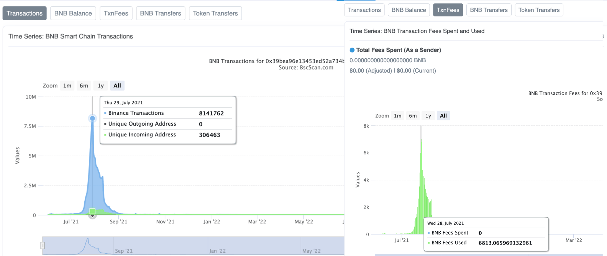

# Why BSC Requires opBNB

Layer 1 networks are the base networks that provide the infrastructure for data transmission and validation, such as BSC and Ethereum. These networks face the challenge of network congestion during peak periods, which usually happens when any popular application runs a promotion campaign or experiences a spike in traffic. Network congestion can lead to high transaction fees, slow transactions, and poor user experience.

To overcome these challenges, layer 1 networks need to improve their scalability, which is the ability to handle more transactions per second without compromising security. For example, BSC had a web3 game on BNB Smart Chain (BSC) in 2021 which generated over [8 million transactions per day](https://bscscan.com/address/0x39bea96e13453ed52a734b6aceed4c41f57b2271?ref=binance.ghost.io#analytics).

1. BSC's throughput capacity would presumably be vastly exceeded, resulting in slowed transaction speeds, delayed transaction finality, and a poor user experience both for game players and users of other dApps.

2. Daily gas fees could potentially rise to over [6,800 BNB](https://bscscan.com/address/0x39bea96e13453ed52a734b6aceed4c41f57b2271?ref=binance.ghost.io#analytics) ($3M USD) at that level of usage, posing a substantial barrier to usability and sustainability of this game.

The immense transaction loads from a dApp on such a large scale seem infeasible for BSC to handle efficiently in its current form. Significant optimizations and scaling solutions would likely be required for BSC to support such a dApp without network-wide performance degradation and unreasonably high costs.