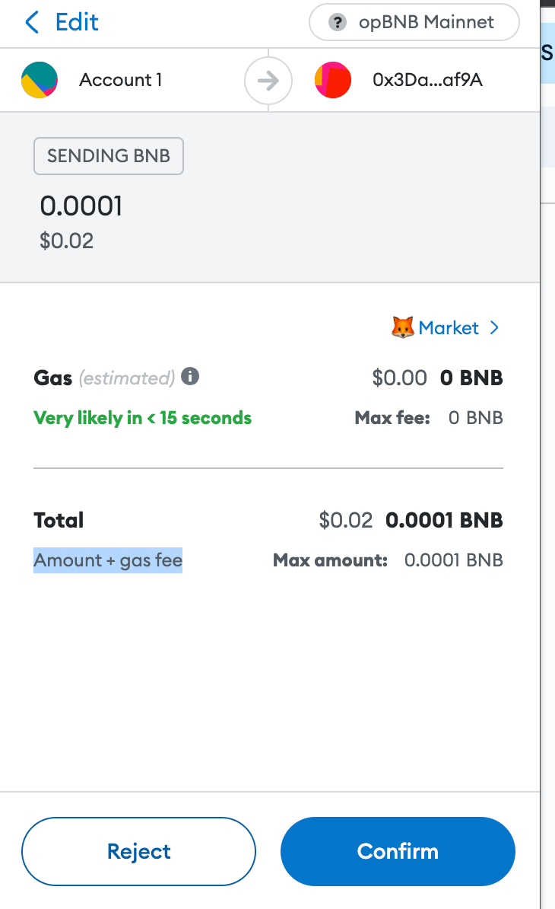
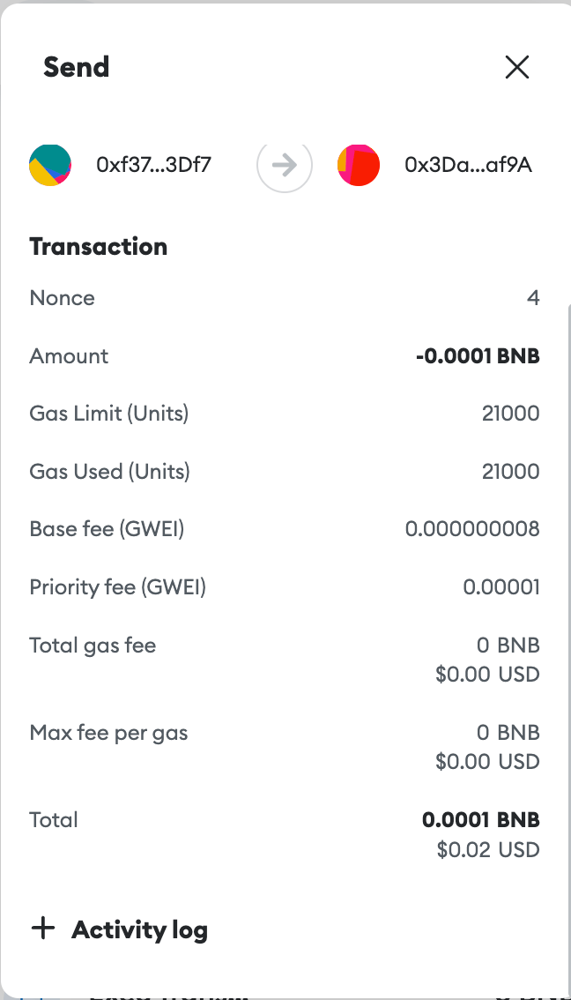
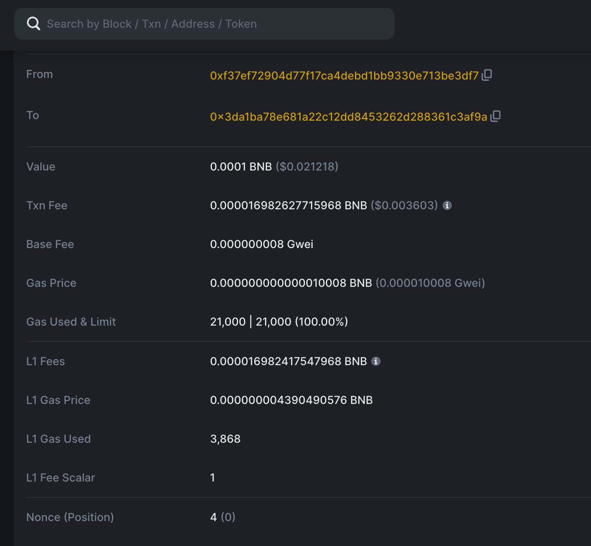

### What is the cost of transfer transaction on opBNB and why opBNB hold capacity to enable the mass adoption of daily small amount transactions?

opBNB can make small daily transactions possible because the transaction fees are very low, around **$0.005** per transaction. This is much lower than traditional payment methods like credit cards which charge around **1-3%** per transaction. The low fees on opBNB make it economical for small purchases and daily transactions.

### What is the link to the canonical bridge for gas/stables?

- **For Testnet:** <https://opbnb-testnet-bridge.bnbchain.org>
- **For Mainnet:** <https://opbnb-bridge.bnbchain.org>

### Where can we get the token pricing for the BNB token on opBNB?

You can get the token pricing for BNB on opBNB from
[Coinmarketcap](https://coinmarketcap.com/currencies/bnb/)

### What is the block gas limit on opBNB?

The block gas limit on opBNB is **100M/block**, and the block time of opBNB is **1 second**.

### How are transaction fees calculated on opBNB?

You can details about the transaction fee calculation from [opBNB official
docs](../core-concepts/gas-and-fees.md)

### Are there any overheads to include in the gas calculation?

Yes, there is a _fixed overhead_ for L1 data fee is **2100**, and _dynamic_overhead(L1 Fee Scala)_ is **1**.

### How are data storage fees for rollups calculated?

The data storage fees for rollups are calculated using the following formula.

```math
l1_data_fee = l1_gas_price * (tx_data_gas + fixed_overhead) * dynamic_overhead

fixed_overhead = 2100

dynamic_overhead = 1

tx_data_gas = count_zero_bytes(tx_data) * 4 + count_non_zero_bytes(tx_data) * 16
```

### What gas fees are associated with withdrawing opBNB assets from the main chain back to the layer 2 network?

Gas fees associated with withdrawing assets from the main chain back to the layer 2 network depend on the BNB chain's gas price at the time of withdrawal. These fees cover the cost of anchoring data on-chain and updating the network state.

### where can I find out more information about L2 gas fees?
Prominent Layer 2 mainnet gas fees resource. 

* [opBNB](https://opbnbscan.com/tx/0xa9f32fc3ef0b3338032bffc95f1c93e4d4bf6bdf6f0225b47e3b543b5421fdc0)
* [Optimism](https://l2fees.info/) 
* [Arbitrum](https://l2fees.info/)
* [Base](https://basescan.org/tx/0xd360162fb3474308acdf707f730cbff993168ef46610f5453b3a10d7d76deaa2)
* [Starknet](https://l2fees.info/) 
* [Linea](https://l2fees.info/)
* [Polygon zkEVM](https://l2fees.info/) 
* [zkSync](https://l2fees.info/) 

To also check BNB Chain’s Layer 1, BSC visit [here](https://bscscan.com/tx/0x1515e830b352a76bab8468d39c4924e1d220578ab0bf69eb09914e877c0713e5).

### Why is my opbnb transaction rejected or pending?
There are several possible reasons why your transaction of opBNB may be rejected or pending. Here are some of the most common ones:

* You have insufficient funds in your wallet to cover the transaction fee or the amount of opBNB you want to send.
* You have set a gas price or gas limit that is too low for the network congestion level, resulting in a slow or failed transaction.
* You have made a mistake in the contract interaction, such as calling a function that does not exist or sending an unsupported token type.
* You have encountered a technical issue with your wallet provider, the opBNB network, or the smart contract you are interacting with.

To troubleshoot your transaction, you can do the following:

* Check your wallet balance and make sure you have enough funds to cover the transaction fee and the amount of opBNB you want to send.
* Check the network status and adjust your gas price and gas limit accordingly. Sometimes the wallet like Trust Wallet or Metamask recommends the "max base fee" or "max priority fee" to "0". This is not accepted by the opBNB Mainnet and will result in a failed transaction. Please check your transaction details carefully before signing/confirming. If you see a "0" in the "max base fee" or "max priority fee" fields, do not proceed with the transaction. Instead, cancel it and try again until you see a normal fee recommendation. 
* Check the recipient address and make sure it is correct and valid. You can use a tool like https://opbnbscan.com/ to verify the address and see if it has any transactions history or contract code.
* Contact your wallet provider, the opBNB network, or the smart contract developer for technical support if you suspect there is an issue on their end.


### Why the estimated transaction fee is zero in my wallet?

It is because wallets are not well adapted to L2 networks. Wallets are designed for L1 networks, where the total transaction cost is calculated differently from L2 networks.

For example, suppose you want to send some opBNB tokens on the opBNB network. When you use your wallet to approve the transaction, you will see that the estimated gas fee is 0BNB. This may seem like a great deal, but it is not the whole story.

{: style="width:400px"}


The gas fee you see in your wallet is based on the L2 part of the transaction, which is very low because it uses a batch processing technique to aggregate many transactions into one. The L2 part of the transaction consists of two components: the base fee and the priority fee. The base fee is a fixed amount that depends on the network congestion, and the priority fee is a variable amount that you can set to increase or decrease the speed of your transaction. For example, in our case, the base fee is 0.000000008 gwei and the priority fee is 0.00001 gwei, so the total L2 gas price is 0.000010008 gwei. The gas used is 21000, which is the standard amount for a transfer transaction. Therefore, the total L2 gas fee is 0.000010008 * 21000 = 0.210168 gwei, which is too small to be displayed in your wallet.

{: style="width:400px"}


However, this is not the only cost you have to pay for your transaction. There is also a layer 1 (L1) part of the transaction, which is the data cost. This is because every L2 transaction has to be recorded on the blockchain as data, and data storage on the blockchain is not free. The L1 part of the transaction depends on the size of the data and the L1 gas price at the time of submission. For example, in our case, the size of the data is 68 bytes and the L1 gas price is 249 gwei, so the total L1 gas fee is 68 * 249 = 16.932 gwei.

Therefore, the actual cost of your transaction is the sum of the L2 and L1 parts, which is 0.210168 + 16.932 = 17.142168 gwei, or about 0.00001698 BNB, or about 0.003 USD at current prices. This is still very cheap compared to other blockchains, but it is not zero as your wallet shows.

To verify this, you can check your transaction details on the opBNB explorer, where you will see both the L2 and L1 costs clearly displayed.

{: style="width:400px"}


We hope this helps you understand how opBNB works and why your wallet only shows the L2 cost.

### Why is one of transaction's gas fees so much higher than the rest?

A known issue that can cause irregularly high gas prices in opBNB transactions could be due to a high L1 gas price which is calculated by averaging block transaction gas prices using the formula:<br/>
```(Txn Fee = Gas Price * Gas + L1 Gas Price * L1 Gas Used * L1 Fee Scalar)```<br/>
This means that if there is an L1 block with an unusual high gas price, it will cause the gas price to be higher for a specific L2 block. This will be fixed going forward by introducing a static L1 gas price.
