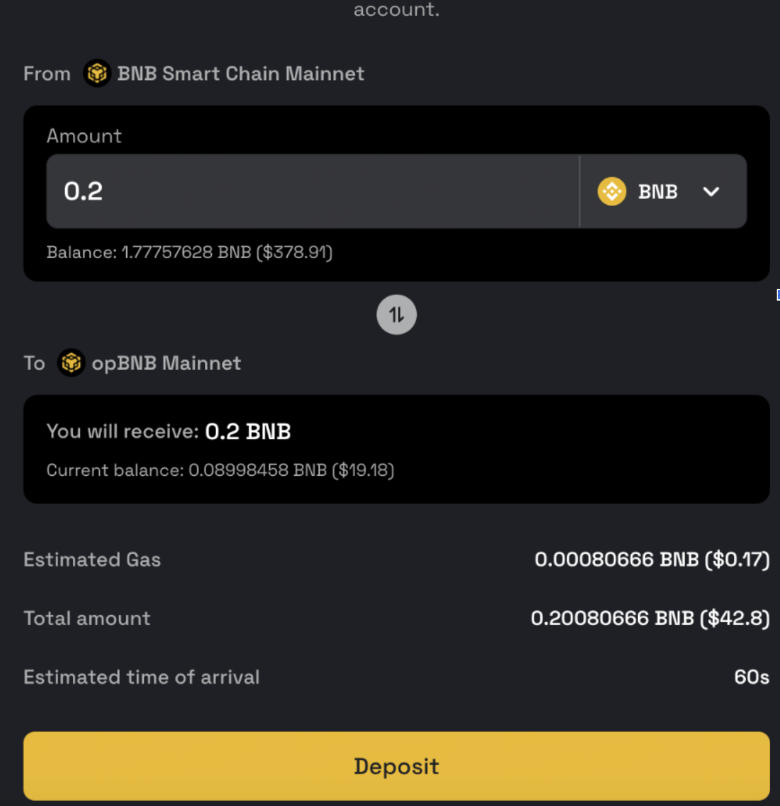
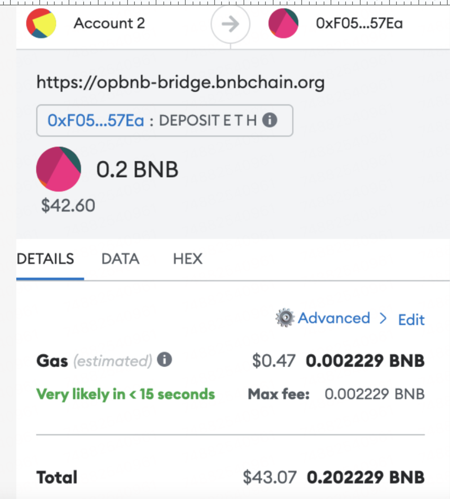
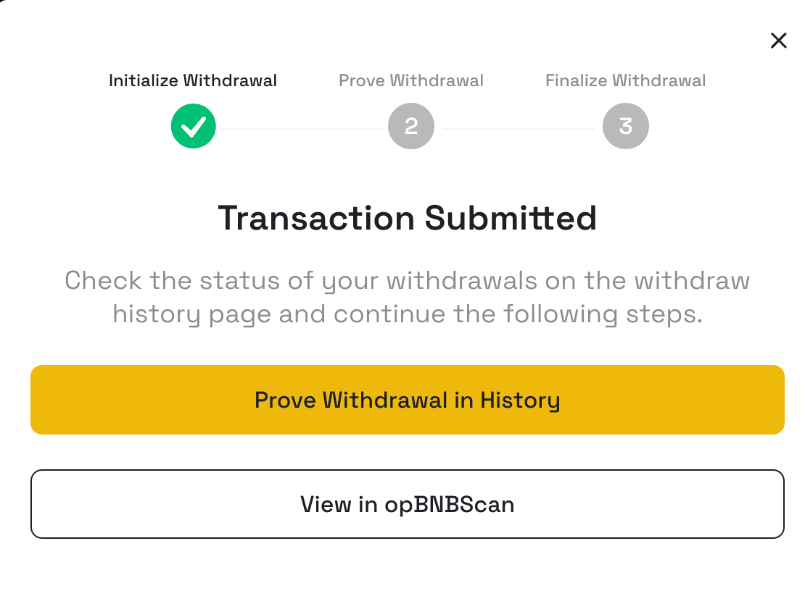

### What is the status of the integration between opBNB and Optimism's Superchain?

opBNB is a project that aims to bring the benefits of L2 scaling and user-friendly UX to the BNB ecosystem. It will enable fast and cheap transactions on BNB L2, as well as smooth interoperability with Greenfield, a decentralized platform for building and running applications. 
Superchain is an innovative solution that leverages OP Stack to provide L2/L3 scaling and security for Ethereum. It allows users to access various L2 protocols with a single wallet and enjoy low fees and high throughput. opBNB is interested in collaborating with Superchain and integrating OP Stack into BNBChain. 

### What is the reason for the discrepancy in the estimated cost of withdraw/deposit transactions between the opBNB bridge page and my wallet?

When you use the bridge to deposit or withdraw assets from opBNB, the bridge will estimate the gas cost for your transaction. This is done by simulating the execution of the transaction on the blockchain, without actually sending it or changing the state of the network. The simulation returns a number that indicates how much gas units the transaction would use if it was executed in the current network state.

To get this number, the bridge uses a function called estimateGas, which implements a binary search algorithm between a lower and an upper bound of gas units. The lower bound is usually 21,000, which is the minimum gas required for a simple ether transfer. The upper bound is either specified by the user or derived from the block gas limit of the pending block. The function tries to execute the transaction with different gas values within this range until it finds the smallest gas value that does not cause an out-of-gas exception. This is the estimated gas usage of the transaction.

For example:
In this example, the bridge estimate of gas is around 0.0008 BNB, which is around $0.17. 

{: style="width:400px"}

However, the wallet that you use to interact with the bridge may use a different method to calculate the estimated transaction cost. It may use the gas limit, which is the maximum amount of gas that you are willing to spend on the transaction. This is usually higher than the estimate given by the bridge.

For example:
The wallet estimate of the transaction is around 0.002 BNB, which is around $0.47.

{: style="width:400px"}

Once the transaction is executed on the chain, you can see the actual cost of the transaction in the opBNB explorer, which usually is similar to the estimate given by the bridge.

### Why your tokens on BSC are not received after 7 days of withdrawal request?

You might have forgotten to sign the proof in the transaction history. This is a necessary step to initiate the 7 days challenge window. Without signing the proof, the bridge will not proceed with the challenge window and your withdrawal will be postponed.

{: style="width:400px"}

### Why do I need to sign the proof to start the 7 days challenge window?

When you withdraw tokens from opBNB to BSC, you need to provide a proof withdrawal to verify that your transaction on L2 is valid and consistent with the world state of L2. This is because L1 does not have access to the full world state of L2, only the data availability (DA) data and periodic snapshots of the world state from L2. The DA data is a compressed representation of the transactions on L2, which can be used to reconstruct the world state of L2 if needed. However, this process is expensive and time-consuming, so it is not done for every withdrawal. Instead, you need to submit a proof withdrawal, which is a cryptographic proof that your transaction on L2 matches the world state of L2 at a certain point in time. This way, you can ensure that your withdrawal is secure and accurate, and that no one can cheat or double-spend on L2.

