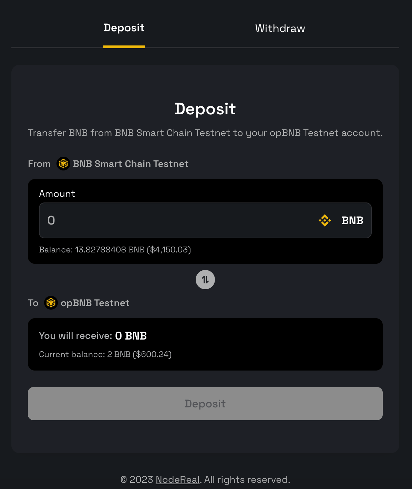
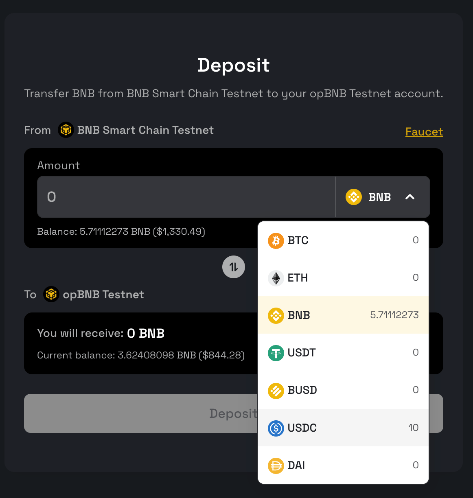

# Deposit BNB(tBNB) to opBNB

Before building or deploying any applications on the opBNB network, you must first deposit BNB(tBNB) as your gas token from BNB Smart Chain to opBNB. You can do this using the [opBNB bridge dApp(Testnet)](https://opbnb-testnet-bridge.bnbchain.org/) or [opBNB bridge dApp(Mainnet)](https://opbnb-bridge.bnbchain.org). 

Follow these steps to deposit tokens from BNB Smart Chain to opBNB: 

1. Make sure you have BNB(tBNB) tokens in your wallet on the BNB Smart Chain.
2. In your wallet, switch your network to BNB Smart Chain. This is the Layer 1 network where your tokens currently are.
3. Enter the amount of BNB(tBNB) you want to deposit to the opBNB network.
4. Click "Deposit" to begin the transfer.
5. Your wallet will prompt you to confirm the transaction. Click "Confirm" to sign it and pay the required gas fee.
6. Once the transaction is processed, switch your network in your wallet to opBNB. The BNB amount you have deposited will appear in your wallet.
7. You can now build, deploy, and interact with dApps on the opBNB network using the BNB(tBNB) you deposited. To withdraw tokens from opBNB back to BNB Smart Chain, simply go to the bridge, enter the amount to withdraw, and confirm the transaction. The bridge will transfer your tokens from the opBNB network back to the BNB Smart Chain testnet.

## opBNB Bridge Supported Tokens

The opBNB bridge supports you to transfer your assets from BSC to opBNB. The bridge supports most of the popular tokens, including BEP-20 tokens and wrapped bitcoin. If you want to test your applications that require these tokens, you can use the opBNB bridge to deposit and withdraw them in a simple and convenient way.

*The bridge page also provides a faucet link that allows you to claim these tokens from the faucet directly. To begin, simply click on the faucet link on the bridge page.*

