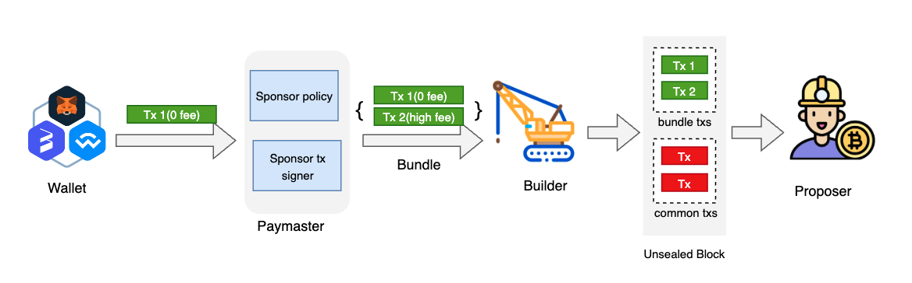

# EOA Based Paymaster
This document introduces a paymaster solution specifically designed for Externally Owned Account (EOA) wallets, 
differing from the paymaster defined in EIP-4337. With minimal modifications, wallets can integrate this solution to 
support gas fee sponsorship, significantly enhancing user experience.

## What is EOA based Paymaster

The paymaster in [EIP-4337](https://github.com/ethereum/ercs/blob/master/ERCS/erc-4337.md) (Account Abstraction via 
Entry Point Contract Specification) is a crucial component designed to enhance the flexibility and user experience of 
Ethereum transactions. It allows a third party to pay for a user's transaction fees, removing the need for users to 
hold ETH to pay for gas.

While EIP-4337 introduced the revolutionary concept of paymasters for smart contract wallets, a significant portion of 
the Ethereum ecosystem still relies on EOAs. Recognizing this, this present a groundbreaking paymaster solution 
specifically designed for EOA wallets. This innovation brings the benefits of transaction sponsorship and enhanced 
user experience to the broader BNB Chain user base, without requiring a shift to smart contract wallets. The EOA 
paymaster solution aims to democratize access to sponsored transactions, making blockchain interactions more 
user-friendly and cost-effective for millions of existing EOA wallet users.

## How does it Work

Under [BEP322](https://github.com/bnb-chain/BEPs/blob/master/BEPs/BEP322.md)'s Proposer-Builder Separation (PBS) 
architecture, a significant shift occurs in transaction processing:

1. Validator Role: Validators no longer verify individual transaction gas prices within a block.
2. Transaction Bundling: Private transactions are grouped into bundles and submitted to builders.
3. Prioritization: Builders prioritize based on the aggregate gas price of each bundle.
4. Intra-Bundle Flexibility: Within a single bundle, gas prices can vary, allowing for zero-fee and higher-fee transactions to coexist.

This flexibility enables innovative features such as sponsored gas fees and gasless transactions.

### Definitions

**Bundle**: An ordered array of transactions that execute atomically, ensuring all transactions in the bundle are 
processed together or not at all.

**Builder**: A new stakeholder in the MEV supply chain responsible for constructing blocks. Builders package transaction bundles, 
individual transactions from the public txpool, and private transaction order flow into proposed blocks.

**Proposer**: A validator who selects the most profitable block from multiple builders' proposals for inclusion in the blockchain.

**Paymaster**: An infrastructure component that enables transaction sponsorship, allowing self or third parties to cover gas fees.

**Sponsor Policy**: A set of rules defined by the gas sponsor to determine which transactions qualify for sponsorship. 
This may include criteria such as whitelisted transaction senders or specific transaction types.

### Overall Workflow

The gas sponsorship process involves several key components and steps:

1. User Initiation:
    - A user prepares a transaction using any compatible wallet.
    - The wallet sets the gas price to zero for potentially sponsored transactions.

2. Paymaster Submission:
    - The wallet submits the zero-gas-price transaction to the Paymaster.

3. Sponsor Policy Verification:
    - The Paymaster checks the transaction against existing sponsor policies.
    - Policies may include criteria such as sender/recipient addresses, token types, or transaction limits.

4. Sponsorship Processing:
    - If the transaction is eligible for sponsorship:
      a. The Paymaster creates a sponsor transaction with a higher gas price.
      b. The original user transaction and the sponsor transaction are combined into a bundle.
    - If not eligible, the transaction is rejected or returned to the user for normal processing.

5. Bundle Creation and Submission:
    - This bundle is submitted to multiple MEV builders.

6. Builder Selection and Block Proposal:
    - MEV builders incorporate the bundle into their block proposals.

7. Blockchain Inclusion:
    - Proposers (validators) select the most profitable block from the builders' proposals.
    - The selected block, containing both the user's original transaction and the sponsor's transaction, is added to the blockchain.
    - This ensures atomic execution of both transactions.

8. Post-Transaction Processing:
    - The Paymaster Manager updates the sponsor's account, deducting the appropriate amount for the sponsored gas.

This solution leverages the BEP322 Proposer-Builder Separation architecture to enable seamless gas sponsorship without 
requiring significant changes to existing wallet infrastructures. It provides a flexible system that can accommodate 
various sponsorship models while maintaining the security and integrity of the blockchain network.