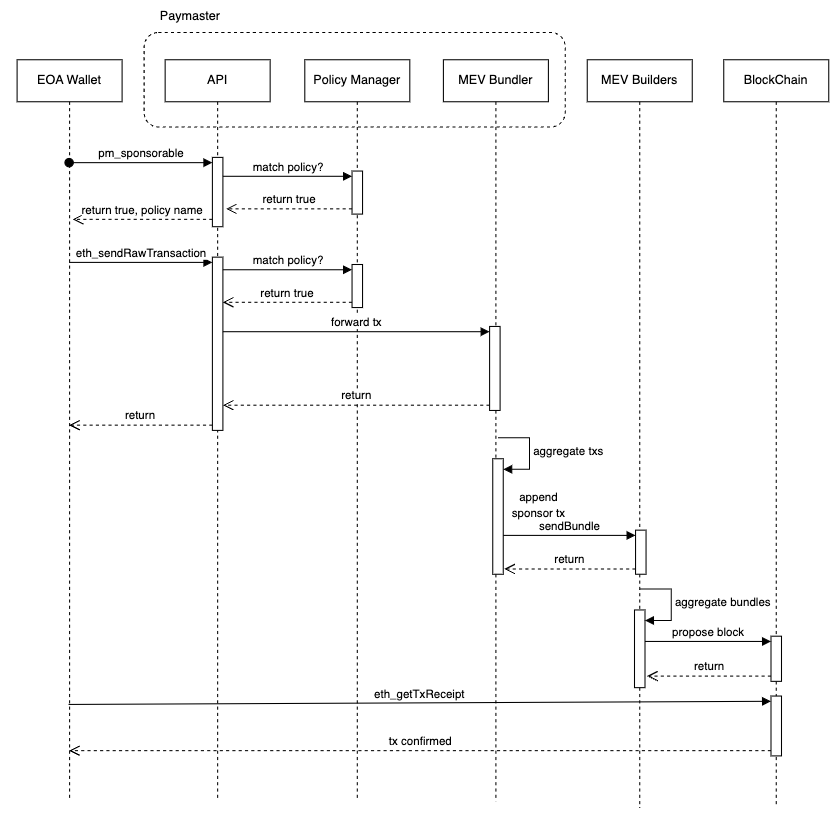

# Wallet Integration

This guide outlines the steps for wallet developers to integrate paymaster services, enabling gas fee sponsorship for their users. By following these standards, wallets can offer seamless, gasless transactions across multiple paymaster providers.

## Interaction Workflow

Integration involves modifying the transaction creation and sending process to interact with paymaster services. For detailed information about the paymaster API interface, please refer to this [document](./paymaster-api.md).

The main steps are:

1. **Transaction Preparation**:
    *   When a user initiates a transaction, first call `gm_sponsorable` to check if it's eligible for sponsorship.
    *   If sponsorable, set the transaction's gas price to zero.
2. **User Notification**:
    *   Inform the user that the transaction will be gas-free and sponsored by the "policy name" returned by the API.
3. **Transaction Signing**:
    *   Have the user sign the zero-gas-price transaction.
4. **Submission to Paymaster**:
    *   Send the signed transaction to the paymaster using `eth_sendRawTransaction`.
5. **Response Handling**:
    *   Process the paymaster's response:
        *   If successful, inform the user that the transaction is submitted.
        *   If failed, consider falling back to normal transaction processing or inform the user of the failure.
6. **Transaction Monitoring**:
    *   Monitor the transaction status as usual.

## Best Practice

1. Always check sponsorability before modifying gas price.
2. Provide clear user feedback about sponsorship status.
3. Implement proper error handling for cases where sponsorship fails.
4. Consider fallback mechanisms for non-sponsored transactions.