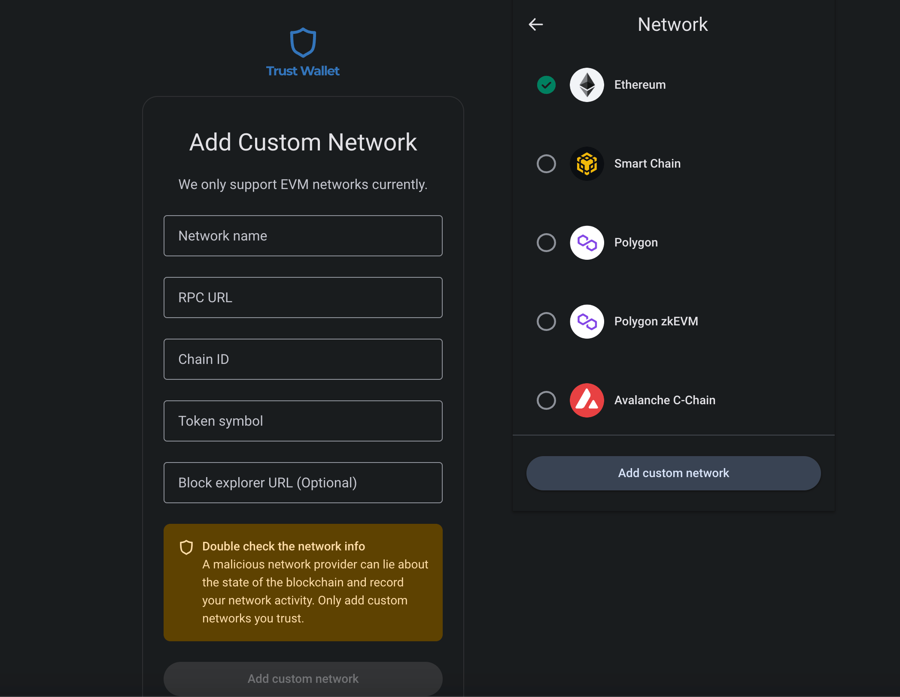
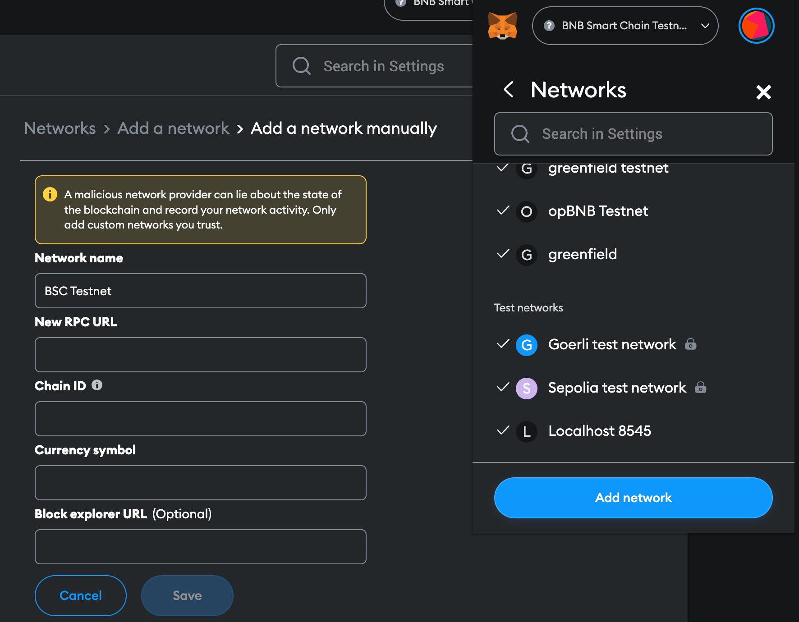

# Wallet configuration

You can use any Ethereum wallet with BSC. For instance, I will show you how to set up Metamask and Trustwallet for BSC.

   *Testnet*

   - Network Name: BSC Testnet
   - RPC URL: [https://data-seed-prebsc-1-s1.bnbchain.org:8545](https://data-seed-prebsc-1-s3.bnbchain.org:8545/)
   - ChainID: 97
   - Symbol: tBNB
   - Explorer: [https://testnet.bscscan.com/](https://testnet.bscscan.com/)

   *Mainnet*

   - Network Name: BSC Mainnet
   - RPC URL: [https://bsc-dataseed.bnbchain.org](https://bsc-dataseed.bnbchain.org)
   - ChainID: 56
   - Symbol: BNB
   - Explorer: [https://bscscan.com/](https://bscscan.com/)
  

## References - How to configure Trustwallet or Metamask

[Trustwallet](https://chrome.google.com/webstore/detail/trust-wallet/egjidjbpglichdcondbcbdnbeeppgdph)

After you install the Trustwallet in your browser, you can go to settings->network.

Select add custom network and enter the network information I mentioned above.

_[Metamask](https://chrome.google.com/webstore/detail/metamask/nkbihfbeogaeaoehlefnkodbefgpgknn)_

After you install the metamask in your browser, you can go to settings -> networks -> add network page.

Select add manual network and enter the network information.

*Depending on your location and preference, you can choose from a variety of RPC endpoints for BSC. For more information about the endpoints and their features, please refer to the network information document that we have prepared for you. To ensure the best performance and user experience, you can test the latency of each endpoint before you configure it with your wallet.*
